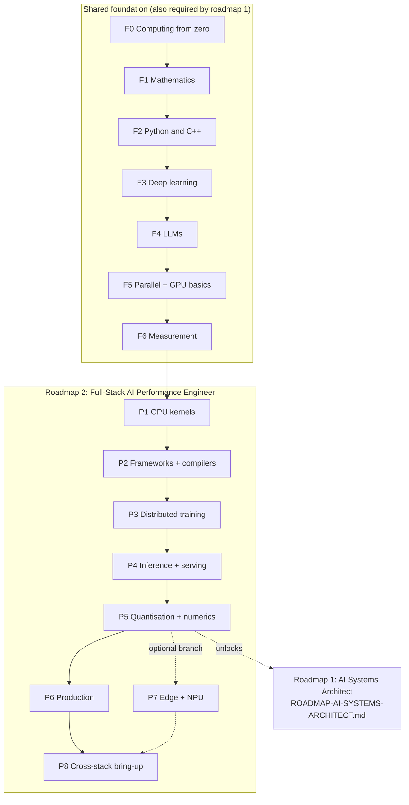

# Roadmap #2 — Full-Stack AI Performance Engineer

**From binary and floating point to an optimised, validated LLM serving stack on AMD GPUs. Every topic
is listed in order, with what to build at each stage and the test that proves the stage is done.**

This is one of two role roadmaps. It trains the role that **changes the software to fit the
hardware**. Its sibling, [`ROADMAP-AI-SYSTEMS-ARCHITECT.md`](ROADMAP-AI-SYSTEMS-ARCHITECT.md), trains
the role that **changes the hardware to fit the model**. That roadmap uses F0–F6 and P1–P5 from this
document as its prerequisites, so learn this one first.

- [`../AI-ML-DL-COMPLETE-ROADMAP.md`](../AI-ML-DL-COMPLETE-ROADMAP.md) is the programme. Its §10.17
  (the model-to-hardware track, Stages 1–6) is the backbone that this roadmap deepens.
- [`AMD-GPU-PATH.md`](AMD-GPU-PATH.md) is the GPU deep dive: compilation, dispatch, the execution model,
  MFMA, Triton and profiling.
- [`AMD-AI-STACK.md`](AMD-AI-STACK.md) is the component map: ROCm, libraries, AITER, vLLM/SGLang,
  Quark and Ryzen AI.
- [`QUALCOMM-AI-STACK.md`](QUALCOMM-AI-STACK.md) covers the edge and NPU branch (P7).

> **How to read this.** Stages are **gated, not scheduled**. A stage is finished when its
> **Done when** test passes, not when its reading list is read. Every topic carries one of the
> programme's depth tags from [`../AI-ML-DL-COMPLETE-ROADMAP.md`](../AI-ML-DL-COMPLETE-ROADMAP.md)
> §0.2:
>
> - **[BUILD]**: implemented from first principles and reproducible on a blank page.
> - **[KNOW]**: you understand the mechanism well enough to teach it to a peer in five minutes.
> - **[AWARE]**: you recognise the term and what it is for, so it will not be a blind spot.
>
> You can skip a stage only by passing its exit test cold. There are no durations; the test is the
> gate.

---

## Contents

| § | Section | What you learn |
|---|---|---|
| 1 | The role: what "done" looks like | The job this trains for, from real postings |
| 2 | The whole path in one picture | Stage map, gates and where each stage deepens in this repo |
| 3 | How every stage is structured | Why / Learn / Build / Done when / Traps / References |
| 4 | **F0: Computing from zero** | Bits, IEEE-754, gates, the CPU, the OS |
| 5 | **F1: Mathematics** | Linear algebra, calculus, probability, numerics, FLOP and byte counting |
| 6 | **F2: Python and C++** | Both languages of the stack, debugging, concurrency |
| 7 | **F3: Deep learning** | From autograd to a transformer you wrote yourself |
| 8 | **F4: Large language models** | Parameter, FLOP, memory and KV-cache accounting |
| 9 | **F5: Parallel computing and GPU fundamentals** | SIMT, memory hierarchy, occupancy, roofline |
| 10 | **F6: Measurement discipline** | Benchmarks that survive review |
| 11 | **P1: GPU kernels** | The GEMM ladder, fused kernels, FlashAttention, Triton |
| 12 | **P2: Frameworks and compilers** | PyTorch internals, `torch.compile`, MLIR, Triton's pipeline |
| 13 | **P3: Distributed training** | DP, FSDP, TP, PP, CP and EP; collectives; MFU |
| 14 | **P4: Inference and serving** | Prefill vs decode, paging, batching, speculative decoding, SLOs |
| 15 | **P5: Quantisation and numerics** | Formats, scaling, accuracy parity |
| 16 | **P6: Production** | Containers, orchestration, observability, regression gates |
| 17 | P7: Edge and NPU (optional branch) | Partitioning, fallbacks, power |
| 18 | **P8: Cross-stack bring-up (capstone)** | Reference model to optimised AMD serving, end to end |
| 19 | Progress tracker | One checklist for the whole path |
| 20 | Verification status | What is sourced and what is not |
| — | Primary sources | Links fetched for this document |

*F and P are stage IDs, and roadmap #1 uses the same IDs. The § numbers only give the reading order.*

---

## 1. The role: what "done" looks like

A **Full-Stack AI Performance Engineer** takes a model and a machine and closes the gap between what
the hardware can do and what the workload actually achieves. The work spans every layer, from Python
down to the ISA and out to the cluster, and the engineer proves the result with numbers that another
engineer can reproduce.

### Postings this roadmap targets

Fetched on 2026-09-23. The base ranges are shown as posted and will drift. They are here to show
where the role sits, not as a promise.

| Posting | Base range (as posted) | What it asks for |
|---|---|---|
| OpenAI: Workload Porting & Performance Engineer | $347K–$445K | Title and range recorded here; read the posting for the full list |
| OpenAI: Systems Generalist, GPT Infrastructure | $293K–$445K | 8+ years; LLVM/MLIR, Triton, CUDA/ROCm; vLLM/SGLang |
| OpenAI: Inference Performance Optimization | $266K–$500K | Title and range only; no URL recorded |
| OpenAI: Training Performance | $295K–$500K | Title and range only; no URL recorded |
| Anthropic: Performance Engineer, GPU | Not recorded | Seen by title only |

### The four capabilities this roadmap builds

| Capability | Stages | The proof |
|---|---|---|
| Write and tune kernels | F5, P1 | A GEMM ladder where a profiler counter explains every step |
| Understand what generates and launches them | P2 | A custom op that compiles with zero graph breaks |
| Scale across devices for training and serving | P3, P4 | Step time and SLO throughput predicted before they are measured |
| Prove it | F6, P5, P6, P8 | Reproducible benchmarks, accuracy parity and CI regression gates |

This role differs from an ML engineer because it owns the **gap**. "The model runs" is not the goal.
The goal is to say "the model runs at X% of what this hardware allows, this counter shows why, and
this is what closes the rest."

---

## 2. The whole path in one picture

| Stage | Depth | You build | Gate (Done when) | Deepens in this repo |
|---|---|---|---|---|
| F0 | [BUILD] | Float classifier; a CPU from NAND gates | Trace `c = a + b` to the ALU | — |
| F1 | [BUILD] | Stable softmax; hand-derived backprop | FLOPs, bytes and intensity of a GEMM, unaided | Roadmap Weeks 1–2; textbook Week 1 |
| F2 | [BUILD] | Sanitizer-clean C++ library with Python bindings | TSan race found and fixed | — |
| F3 | [BUILD] | A GPT from scratch | Every tensor shape from memory | Roadmap Weeks 3–7 |
| F4 | [BUILD] | LLM calculator | Parameter count exact against a real checkpoint | Roadmap Week 8 |
| F5 | [BUILD] | HIP reduction ladder and tiled matmul | Bound predicted, then confirmed by counters | Roadmap §10.3; AMD-GPU-PATH §4–§6, §9 |
| F6 | [BUILD] | Benchmark harness | Planted regression caught | Roadmap §10.4; AMD-GPU-PATH §9, §13 |
| P1 | [BUILD] | GEMM ladder; Triton FlashAttention | A counter explains every rung | Roadmap §10.6, §10.17 Stage 3; AMD-GPU-PATH §7–§8, §11–§12 |
| P2 | [BUILD] | Custom op plus an Inductor fix | `opcheck` passes with zero graph breaks | Roadmap §10.17 Stages 1–2; AMD-GPU-PATH §2–§4, §8 |
| P3 | [BUILD] | FSDP, TP and PP training runs | Step time predicted | Roadmap §10.17 Stage 4; AMD-GPU-PATH §10 |
| P4 | [BUILD] | vLLM-on-ROCm sweep | SLO throughput predicted | Roadmap §10.5; AMD-AI-STACK §10, §12 |
| P5 | [BUILD] | One model quantised three ways | An accuracy number beside every speed number | AMD-AI-STACK §5, §14 |
| P6 | [KNOW]→[BUILD] | Kubernetes server with a CI gate | Regression blocked; alert fires | Roadmap Week 9 |
| P7 | [KNOW] (optional) | NPU + iGPU run | Every fallback explained | Roadmap §10.17 Stage 6; AMD-AI-STACK §13–§13B; QUALCOMM-AI-STACK §5–§6B |
| P8 | [BUILD] | Capstone bring-up | A stranger reproduces it | Roadmap §10.17 Stage 5; AMD-GPU-PATH §13 |

---

## 3. How every stage is structured

- **Why.** One line on what the stage makes possible.
- **Learn.** Topics in order, each tagged **[BUILD]**, **[KNOW]** or **[AWARE]**.
- **Build.** The artefacts, with acceptance criteria. Every **[BUILD]** topic ends as working code.
- **Done when.** The exit test. It is pass/fail and can be re-run. If it is not met, the stage is not
  done.
- **Traps.** Mistakes that make a result wrong while it still looks right.
- **References.** Primary sources first, then pointers into this repository.

In the Learn lists, the short names *roadmap*, *AMD-GPU-PATH*, *AMD-AI-STACK* and *QUALCOMM-AI-STACK*
refer to the documents linked in the introduction.

---

## 4. F0: Computing from zero

**Why.** Every later performance argument comes down to bits moving between storage and arithmetic
units. If this layer is fuzzy, every later explanation is folklore.

**Learn**
- **[BUILD] Integers.** Binary and hex, unsigned and two's complement, overflow and wraparound,
  shifts and masks, and endianness.
- **[BUILD] IEEE-754 floating point.**
  - The encoding: sign, biased exponent and a mantissa with an implicit leading one.
  - Special values: normal vs subnormal numbers, ±0, ±∞ and NaN.
  - Precision: round-to-nearest-even, machine epsilon and the ULP (unit in the last place). This is
    why `0.1 + 0.2 != 0.3`.
  - Floating-point addition is **not associative**. This is the root reason that parallel reductions
    are not bit-reproducible.
- **[KNOW] Digital logic.** Gates and truth tables; combinational blocks (mux, adder, ALU) vs
  sequential ones (latch, flip-flop, register); the clock.
- **[KNOW] Computer organisation.** Registers, memory, the fetch–decode–execute cycle, instruction
  encoding, reading assembly, calling conventions, and stack vs heap.
- **[BUILD] C and its memory model.** Pointers and arrays, structs, alignment and padding, and
  undefined behaviour.
- **[KNOW] Operating systems.**
  - Processes vs threads.
  - Virtual memory: page tables, the TLB and page faults.
  - System calls, context switches and scheduling.
  - `mmap` and file I/O.
- **[BUILD] Tooling.** The Linux shell, git, a build tool and a debugger. Use `gcc -S` and `objdump -d`
  to read what the compiler emitted.

**Build**
1. Nand2Tetris Part I: build up from NAND gates to a working CPU and its assembler.
2. `floatbits` in C. It prints the sign, exponent and mantissa of any `float` or `double`, classifies
   the value (normal, subnormal, zero, infinity or NaN) and prints its neighbours using `nextafter`.
   Test it with `0.1`, `1e-40f`, `FLT_MAX` and `NAN`.
3. Sum ten million random `float`s four ways: forwards, backwards, pairwise and with Kahan summation.
   Report each result against a `double` reference.

**Done when**
- You can trace `c = a + b`, for both integers and floats, from the C source to the emitted assembly,
  then to the ALU or FPU operation and its loads and stores.
- Using your own numbers from Build 3, you can explain why summing the same values in a different
  order gives a different answer, and what that means when you compare GPU outputs.

**Traps**
- Exact float equality is not a correctness test. Tolerances depend on the format and the algorithm
  (F1, P5).
- `volatile` does not synchronise threads (F2).

**References**
- Petzold, *Code: The Hidden Language of Computer Hardware and Software* (2nd ed.).
- Nisan & Schocken, *The Elements of Computing Systems*, and its course site:
  <https://www.nand2tetris.org/>.
- Bryant & O'Hallaron, *Computer Systems: A Programmer's Perspective* (3rd ed.), chapters 1–3, 5, 6
  and 9. CMU 15-213 is built on it.
- Goldberg, "What Every Computer Scientist Should Know About Floating-Point Arithmetic", *ACM Computing
  Surveys*, 1991.
- Arpaci-Dusseau & Arpaci-Dusseau, *Operating Systems: Three Easy Pieces* (free online):
  <https://pages.cs.wisc.edu/~remzi/OSTEP/>.

---

## 5. F1: Mathematics

**Why.** Performance engineering is counting: FLOPs, bytes and messages. Numerics is the other half
of correctness.

**Learn**
- **[BUILD] Linear algebra.**
  - Matmul three ways: as dot products, as outer products and as linear combinations of columns.
  - Shapes and broadcasting, transpose, rank and orthogonality.
  - Eigendecomposition; SVD and low-rank approximation.
  - Norms: L1, L2, Frobenius and spectral.
  - Why you almost never form an explicit inverse.
- **[BUILD] Calculus.** Partial derivatives, the chain rule, gradients, Jacobians, and the
  **vector–Jacobian product**, which is what reverse-mode autodiff actually computes. **[KNOW]** The
  Hessian, and Taylor expansion for error analysis.
- **[BUILD] Probability and statistics.**
  - Random variables, expectation and variance.
  - Bernoulli, categorical and Gaussian distributions.
  - Maximum likelihood and Bayes' rule.
  - For measurement: median vs mean, percentiles, variance and confidence intervals. **[KNOW]** The
    bootstrap.
- **[BUILD] Optimisation.** Gradient descent, SGD, momentum, Adam/AdamW, and learning-rate warm-up and
  decay. **[KNOW]** Convexity.
- **[KNOW] Information theory.** Entropy, cross-entropy, KL divergence and perplexity.
- **[BUILD] Numerical analysis.**
  - Conditioning vs stability.
  - Catastrophic cancellation, overflow and underflow.
  - Numerically stable softmax (subtract the max) and log-sum-exp.
  - Kahan summation.
  - Why accumulation precision matters more than storage precision.
- **[BUILD] Cost arithmetic.** An M×K by K×N matmul costs 2·M·N·K FLOPs. With b bytes per element it
  must move at least b·(MK + KN + MN) bytes. **Arithmetic intensity** is FLOPs divided by bytes.

**Build**
1. Matmul in NumPy three ways: triple loop, dot products and outer products. Check that they agree
   within tolerance, and time each one.
2. Naive vs stable softmax and log-sum-exp. Find the input magnitude at which the naive version
   overflows in FP32 and in FP16.
3. A 2-layer MLP, forward and backward, with gradients you derived by hand. Check them against
   finite differences in FP64.
4. A FLOP-and-byte counter for matmul, softmax and LayerNorm. Tabulate arithmetic intensity across
   sizes.

**Done when**
- You derive backprop for a 2-layer MLP on paper, and your finite-difference check agrees.
- For a BF16 GEMM of a given shape, you can state the FLOPs, the minimum bytes and the arithmetic
  intensity without notes.

**Traps**
- Gradient checks in FP32 with a tiny step size fail because round-off swamps the difference. Use FP64.
- FLOPs (a count) and FLOP/s (a rate) are different things. *How to Scale Your Model* writes the rate
  explicitly as FLOPs/s for this reason.

**References**
- **In this repo:** [`../textbook/WEEK-01-MATHEMATICS-FOUNDATIONS.md`](../textbook/WEEK-01-MATHEMATICS-FOUNDATIONS.md);
  roadmap Weeks 1–2.
- Deisenroth, Faisal & Ong, *Mathematics for Machine Learning*.
- 3Blue1Brown, *Essence of Linear Algebra* and *Essence of Calculus* (video series).
- MIT 18.06 (linear algebra) and 18.065 (matrix methods for data and machine learning).
- Blitzstein & Hwang, *Introduction to Probability*.
- Trefethen & Bau, *Numerical Linear Algebra*; Higham, *Accuracy and Stability of Numerical
  Algorithms*.
- Prince, *Understanding Deep Learning*. Its notebooks cover backpropagation, initialisation and
  Adam: <https://udlbook.github.io/udlbook/>.

---

## 6. F2: Python and C++

**Why.** Kernels and runtimes are written in C++, while harnesses, experiments and frameworks are
written in Python. You need both at production quality, and you must be able to cross between them.

**Learn**
- **[BUILD] Python.** The data model (names bind to objects; mutability), iterators and generators,
  decorators, context managers, type hints, packaging and virtual environments. **[KNOW]** The GIL
  and what releases it; profiling with `cProfile` and `py-spy`.
- **[BUILD] NumPy's memory model.** dtype, shape, **strides**, views vs copies, broadcasting and
  contiguity. PyTorch tensors use the same model (P2).
- **[BUILD] Modern C++.** Value semantics, RAII, references vs pointers, move semantics, smart
  pointers, templates, `constexpr`, lambdas, and the STL with the cost of each container.
- **[BUILD] Undefined behaviour.** Know each class and why "it works on my machine" means nothing:
  - out-of-bounds access
  - signed overflow
  - data races
  - strict aliasing
  - uninitialised reads
- **[BUILD] Build systems.** CMake targets and `PUBLIC`/`PRIVATE` propagation, optimisation and debug
  flags, and static vs shared libraries.
- **[BUILD] Debugging.** gdb or lldb, core dumps, AddressSanitizer, UndefinedBehaviorSanitizer and
  ThreadSanitizer.
- **[BUILD] Testing.** pytest, GoogleTest and golden-file tests. **[KNOW]** Property-based testing.
- **[BUILD] Concurrency.**
  - Threads, mutexes and condition variables.
  - Atomics and memory ordering: relaxed, acquire, release and sequentially consistent.
  - False sharing.
  - **[KNOW]** Lock-free queues.
- **[KNOW] SIMD.** Auto-vectorisation, reading the compiler's vectorisation reports, and intrinsics.
- **[BUILD] Crossing the boundary.** pybind11 bindings, the buffer protocol, and releasing the GIL in
  native code.

**Build**
1. A small C++ matrix library with strided views and matmul. It needs:
   - a GoogleTest suite;
   - CI jobs under ASan+UBSan and under TSan;
   - pybind11 bindings with zero-copy NumPy interop, tested from pytest against NumPy.
2. A deliberately racy counter. Show TSan reporting it, fix it once with an atomic and once with a
   mutex, and measure both under contention.

**Done when**
- The library is clean under all three sanitizers, and the bindings match NumPy within tolerance.
- You can explain acquire/release with a message-passing example, and show how the relaxed version
  can fail.

**Traps**
- Benchmarking a debug build.
- A Python benchmark that measures interpreter overhead instead of the work.
- Returning a view whose owning buffer has been freed.

**References**
- Stroustrup, *A Tour of C++* (3rd ed.); Meyers, *Effective Modern C++*; Williams, *C++ Concurrency in
  Action* (2nd ed.); Ramalho, *Fluent Python* (2nd ed.).
- Bakhvalov, *Performance Ninja*. Its labs cover vectorisation, dependency chains and false sharing:
  <https://github.com/dendibakh/perf-ninja>.

---

## 7. F3: Deep learning

**Why.** You cannot optimise what you cannot build. Every kernel in P1 is part of a model that you
should be able to write from scratch.

**Learn**
- **[KNOW] ML foundations.** Train/validation/test splits, bias–variance, over- and under-fitting,
  regularisation (weight decay and dropout), and data leakage.
- **[BUILD] Autograd.** The computational graph, reverse mode, topological ordering and gradient
  accumulation. Why reverse mode suits a single loss with many parameters.
- **[BUILD] Layers.** Linear layers; ReLU, GELU and SiLU; softmax fused with cross-entropy;
  embeddings. **[KNOW]** Convolution; recurrent networks and LSTMs.
- **[BUILD] Normalisation.** BatchNorm vs LayerNorm vs RMSNorm, and why transformers use the last two.
- **[KNOW] Initialisation.** Xavier and Kaiming initialisation, and signal propagation.
- **[BUILD] The transformer block.**
  - BPE tokenisation.
  - Positional information: sinusoidal, learned and RoPE.
  - Scaled dot-product attention, the causal mask and multi-head attention. **[KNOW]** MQA and GQA.
  - The MLP (GELU, SwiGLU) and the residual stream.
  - Pre-norm vs post-norm, and weight tying.
- **[BUILD] The training loop.** Batching, the loss, the optimiser step, the learning-rate schedule,
  gradient clipping, checkpointing and evaluation. **[KNOW]** Mixed precision; you build it properly in
  P5.

**Build**
1. A scalar autograd engine in the style of micrograd. Train a small MLP with it.
2. Tensor-level backprop through an MLP with a normalisation layer, written by hand without
   `loss.backward()`.
3. A GPT from scratch, with a tokenizer you wrote. Train it on a small corpus and sample from it.
4. A finite-difference gradient check of your attention block in FP64.

**Done when**
- Given batch size, sequence length, d_model, number of heads, number of KV heads, d_ff and vocabulary
  size, you can write every tensor shape through a decoder block from memory, including K and V
  under GQA.
- Your GPT's validation loss falls well below a unigram baseline, and the gradient check passes.

**Traps**
- Silent broadcasting can train but learn the wrong thing, so assert shapes.
- With a missing causal mask the training loss looks superb, but generation is garbage.
- Losses are not comparable across different tokenizers.

**References**
- **In this repo:** roadmap Weeks 3–7.
- Karpathy, *Neural Networks: Zero to Hero*. It covers micrograd, makemore (including the manual
  backprop lecture), "Let's build GPT" and "Let's build the GPT Tokenizer":
  <https://karpathy.ai/zero-to-hero.html>.
- Prince, *Understanding Deep Learning* (MIT Press, 2023), and its notebooks:
  <https://udlbook.github.io/udlbook/>.
- Goodfellow, Bengio & Courville, *Deep Learning*.
- Zhang, Lipton, Li & Smola, *Dive into Deep Learning*: <https://d2l.ai/>.
- Stanford CS231n and CS224n.
- Vaswani et al., "Attention Is All You Need" (NeurIPS 2017), and *The Annotated Transformer*:
  <https://nlp.seas.harvard.edu/annotated-transformer/>.

---

## 8. F4: Large language models

**Why.** This is the workload. Its arithmetic (parameters, FLOPs, activations and KV-cache bytes) is
the input to every performance model you will build.

**Learn**
- **[KNOW] Architecture variants.**
  - Dense decoder-only models.
  - Mixture-of-experts: router, top-k selection, capacity factor and load-balancing loss.
  - **[AWARE]** Multi-head latent attention (DeepSeek).
  - Long-context techniques: **[KNOW]** RoPE scaling; **[AWARE]** sliding-window attention.
- **[KNOW] Scaling laws.** Kaplan et al. (2020), and Chinchilla (Hoffmann et al., 2022) with its
  D ≈ 20P rule. That rule is compute-optimal only for *training* cost. Production models are usually
  trained on far more tokens to lower inference cost.
- **[BUILD] Training compute.** Training takes about C ≈ 6PD FLOPs for P parameters and D tokens
  (forward ≈ 2PD, backward ≈ 4PD).
- **[BUILD] Training memory.** Mixed-precision AdamW needs about 16 bytes per parameter before
  activations:
  - 2 bytes for BF16 weights;
  - 2 bytes for gradients;
  - 12 bytes for the FP32 master copy plus the two optimiser moments.

  Activations come on top. They depend on sequence length, batch size and the recomputation policy.
- **[BUILD] The KV cache.** Bytes per token = 2 (K and V) × layers × KV heads × head dimension × bytes
  per element. It grows with every token of every live sequence.
- **[BUILD] Inference arithmetic.** Decode costs about 2P FLOPs per token. At small batch sizes it
  must read every weight on every step, so it is bandwidth-bound.

  Ignoring KV-cache reads, decode becomes compute-bound only when the batch size exceeds
  (bytes per weight ÷ 2) × (peak FLOP/s ÷ memory bandwidth). For 16-bit weights on an A100, kipply
  calculates this threshold as 208. KV-cache reads raise the real threshold at long context.
- **[KNOW] Tokenisation.** BPE, and how vocabulary size changes the cost of the embedding and
  unembedding matrices.
- **[KNOW] Sampling.** Greedy, temperature, top-k, top-p and beam search.
- **[AWARE]→[KNOW] Post-training.** SFT, RLHF and DPO. RL post-training puts inference throughput
  inside the training loop.

**Build**
- `llm_calc.py`. Its input is a Llama-style config (layers, d_model, heads, KV heads, d_ff,
  vocabulary, tied embeddings) and a dtype. It computes:
  - parameters by component;
  - training FLOPs for D tokens;
  - training memory per GPU (parallel layouts are added in P3);
  - KV bytes per token and per sequence;
  - a lower bound on decode latency for a given peak FLOP/s and memory bandwidth.
- Validate it two ways. The parameter count must equal the sum of tensor sizes in a real checkpoint
  **exactly**. The KV bytes must match what your serving engine allocates, up to its block rounding.

**Done when**
- You can estimate training compute and serving memory for a config you have not seen, without help.
- The calculator's parameter count matches a real checkpoint to the integer.

**Traps**
- Forgetting the embedding and unembedding matrices, or whether they are tied.
- Using query heads instead of KV heads to size the KV cache of a GQA model.
- Quoting tokens/s without the batch size, sequence lengths and precision.

**References**
- **In this repo:** roadmap Week 8.
- Stanford CS336, *Language Modeling from Scratch*: <https://stanford-cs336.github.io/>.
- Austin et al., *How to Scale Your Model*, chapter 4, "All the Transformer Math You Need to Know":
  <https://jax-ml.github.io/scaling-book/>.
- Anthony, Biderman & Schoelkopf, "Transformer Math 101" (EleutherAI, 2023):
  <https://blog.eleuther.ai/transformer-math/>.
- kipply, "Transformer Inference Arithmetic" (2022): <https://kipp.ly/transformer-inference-arithmetic/>.
- Kaplan et al., "Scaling Laws for Neural Language Models" (2020): <https://arxiv.org/abs/2001.08361>.
- Hoffmann et al., "Training Compute-Optimal Large Language Models" (2022):
  <https://arxiv.org/abs/2203.15556>.
- Fedus, Zoph & Shazeer, "Switch Transformers"; DeepSeek-AI, *DeepSeek-V3 Technical Report*.
- Huyen, *AI Engineering*, for the application-side view.

---

## 9. F5: Parallel computing and GPU fundamentals

**Why.** The execution model and the memory hierarchy decide what is fast. Almost every optimisation
in P1 is one of a handful of moves against the model you learn here.

**Learn**
- **[BUILD] Scaling laws of parallelism.** Amdahl's and Gustafson's laws; strong vs weak scaling.
  **[KNOW]** Work and span.
- **[KNOW] CPU parallelism.** SIMD lanes, multicore, caches and coherence (deepened in roadmap #1,
  A2), and NUMA.
- **[BUILD] The GPU execution model.**
  - The hierarchy: grid → workgroup (a block in CUDA) → wavefront (a warp in CUDA) → lane.
  - SIMT execution.
  - Wavefront width depends on the architecture. On CDNA, MFMA instructions operate on all 64 lanes
    of a wavefront; RDNA typically runs wave32 (AMD-GPU-PATH §5, §7).
- **[BUILD] The memory hierarchy.**
  - The levels: registers (VGPRs and SGPRs on AMD), LDS (shared memory in CUDA), L1, L2 and HBM.
  - Latency and bandwidth per level. Read them from documentation and measure them; never memorise
    them.
  - On multi-die parts, each XCD has its own L2 (AMD-GPU-PATH §6).
- **[BUILD] Access patterns.** Coalescing, LDS bank conflicts and padding, vectorised loads, and
  alignment.
- **[BUILD] Divergence.** What happens when lanes in one wavefront take different branches, and what
  it costs.
- **[BUILD] Occupancy and latency hiding.**
  - What limits occupancy: VGPRs, SGPRs, LDS and workgroup size.
  - Little's law: bytes in flight = latency × bandwidth.
  - Why maximum occupancy is not the goal (P1, Volkov).
- **[BUILD] Synchronisation.**
  - Workgroup barriers and atomics.
  - Why there is no global barrier inside an ordinary kernel launch.
  - Streams, queues and events.
  - Host–device transfers and pinned memory.
- **[BUILD] The roofline.** Attainable FLOP/s = min(peak FLOP/s, arithmetic intensity × bandwidth).
  Learn the ridge point and the three regimes: compute-bound, memory-bound and overhead-bound.

**Build** (HIP on an AMD GPU; the CUDA equivalents are acceptable)
1. Vector add: measure achieved GB/s against peak HBM bandwidth.
2. A reduction ladder, with GB/s at each step:
   1. global atomics;
   2. an LDS tree;
   3. a wavefront-level reduction;
   4. several elements per thread.
3. A tiled matmul in LDS. Measure GFLOP/s at several tile sizes, and place each on the roofline by
   its arithmetic intensity.
4. A measured roofline for your GPU, from a bandwidth microbenchmark and an FMA-throughput
   microbenchmark. Compare it with the roofline that `rocprof-compute` produces (AMD-GPU-PATH §9).

**Done when**
- For every kernel in this stage, you predict compute-bound or memory-bound **before** profiling, and
  the counters confirm the prediction.
- Your measured roofline is within a margin of the vendor's peak that you state in advance, or you
  can explain the gap.

**Traps**
- Timing without synchronising the device measures the launch, not the kernel.
- Including the first launch in the timing adds code-object load, allocation and cold caches.
- Treating occupancy as the objective. The objective is throughput.

**References**
- **In this repo:** roadmap §10.3 (GPU execution model); [`AMD-GPU-PATH.md`](AMD-GPU-PATH.md) §4–§6,
  §9, and §12 Stages 0–2; [`AMD-AI-STACK.md`](AMD-AI-STACK.md) §5, §5B, §7 and §8.
- Hwu, Kirk & El Hajj, *Programming Massively Parallel Processors* (4th ed.).
- CMU 15-418/618 or Stanford CS149 (parallel computing).
- Aalto CS-E4580, *Programming Parallel Computers*: <https://ppc.cs.aalto.fi/>.
- The HIP documentation (linked in the Primary sources of [`AMD-GPU-PATH.md`](AMD-GPU-PATH.md)) and
  NVIDIA's *CUDA C++ Programming Guide*.
- Williams, Waterman & Patterson, "Roofline: An Insightful Visual Performance Model for Multicore
  Architectures", *CACM*, 2009.
- Horace He, "Making Deep Learning Go Brrrr From First Principles":
  <https://horace.io/brrr_intro.html>.
- GPU MODE lectures 1–9: <https://github.com/gpu-mode/lectures>.

---

## 10. F6: Measurement discipline

**Why.** A number that nobody can reproduce is not a result. This stage lets every later claim
survive review.

**Learn**
- **[BUILD] Benchmark design.**
  - Warm up first, then run enough repetitions to estimate the spread.
  - Report the median and p95/p99 with the spread, not a single mean.
  - Fix inputs and seeds, and record every configuration variable.
- **[KNOW] Noise.**
  - Everywhere: clock boost, power and thermal limits, cold vs warm caches, co-tenants, NUMA placement
    and CPU frequency governors.
  - On GPUs, also: first-launch compilation, allocator caching and clock state.
- **[BUILD] Timing correctly.** Device events vs host timers, where synchronisation must go, and
  kernel time vs end-to-end time.
- **[BUILD] Profiling.** Sampling vs instrumentation, then the tools:
  - **CPU:** `perf`, flame graphs, and counters for caches, the TLB, branch prediction and false
    sharing.
  - **GPU:** `rocprofv3` for kernel traces and counters; ROCm Compute Profiler (formerly Omniperf)
    for per-kernel analysis and the roofline; ROCm Systems Profiler (formerly Omnitrace) for system
    traces (AMD-AI-STACK §15).
  - **Frameworks and traces:** the PyTorch profiler, with Perfetto to read its traces.
- **[KNOW] Comparing runs.** Compare distributions, not single numbers, and know the smallest change
  your noise lets you detect. **[AWARE]** Change-point detection for performance history.
- **[BUILD] The performance report.** Write it in this order:
  1. the question;
  2. the setup: hardware, driver, ROCm, framework and library versions, and flags;
  3. the method;
  4. results with uncertainty;
  5. the bottleneck analysis;
  6. what was not tested.

**Build**
- A `bench/` harness that:
  - runs a warm-up plus N timed repetitions, synchronising correctly;
  - records the raw samples **and** the environment to JSON (GPU, driver and ROCm versions, framework
    version, git SHA and relevant environment variables);
  - includes a comparator that flags a regression only when the change exceeds the measured noise
    band.
- Plant a small regression, such as an extra pass over memory. Show that the harness flags it, and
  that it does not flag an unchanged re-run.

**Done when**
- Repeat runs on an idle machine fall inside your stated noise band.
- The planted regression is flagged and the unchanged build is not.
- Someone else can reproduce your headline number from the JSON record alone.

**Traps**
- Averages can hide a bimodal distribution, so plot it.
- Comparing two builds measured on different days, machines or driver versions.
- Using timings from a profiled run as benchmark results. Profiling perturbs the run.

**References**
- **In this repo:** roadmap §10.4 (profiling and measurement); [`AMD-GPU-PATH.md`](AMD-GPU-PATH.md) §9
  and §13; [`AMD-AI-STACK.md`](AMD-AI-STACK.md) §15.
- Gregg, *Systems Performance* (2nd ed.).
- Bakhvalov, *Performance Analysis and Tuning on Modern CPUs*, and the *Performance Ninja* labs:
  <https://github.com/dendibakh/perf-ninja>.
- Drepper, "What Every Programmer Should Know About Memory" (2007).
- Slotin, *Algorithms for Modern Hardware*: <https://en.algorithmica.org/hpc/>.
- MIT 6.172, *Performance Engineering of Software Systems*.

---

## 11. P1: GPU kernels

**Why.** This is the core craft. Every framework operator ends up as a kernel, and this stage teaches
you to write one, read one and fix one.

**Learn**
- **[BUILD] The GEMM ladder.** Climb it one rung at a time and measure every rung:
  1. naive;
  2. coalesced global loads;
  3. LDS tiling;
  4. 1-D, then 2-D, register blocking;
  5. vectorised loads;
  6. wavefront-level tiling;
  7. double-buffering (software pipelining);
  8. matrix cores;
  9. autotuning.
- **[BUILD] Matrix cores.** MFMA on CDNA (AMD-GPU-PATH §7), WMMA on RDNA (AMD-AI-STACK §5B), and
  **[KNOW]** Tensor Cores on NVIDIA. Learn the operand and accumulator register layouts, and use the
  AMD Matrix Instruction Calculator.
- **[BUILD] Reading the ISA.** Keep the intermediate files with `-save-temps` (AMD-GPU-PATH §3). In
  the inner loop, find:
  - global and LDS loads;
  - `s_waitcnt` waits;
  - MFMA issue;
  - the VGPR count;
  - spills to scratch.
- **[KNOW] Occupancy vs ILP.** More work per thread at lower occupancy often wins (Volkov).
- **[BUILD] Memory-bound kernels.** Fused elementwise ops, reductions, **online softmax**, LayerNorm
  and RMSNorm, fused residual-add plus norm, and rotary embeddings.
- **[BUILD] Attention.** FlashAttention's tiling, its online softmax and its recomputation in the
  backward pass. **[KNOW]** FlashAttention-2's work partitioning; FlashAttention-3's asynchrony and
  low precision; decode and paged attention (P4).
- **[KNOW] GEMM variants.** Split-K, stream-K, persistent kernels, grouped GEMM (for MoE), and
  epilogue fusion (bias, activation and quantisation).
- **[BUILD] Triton.**
  - Programs and blocks.
  - Masked `tl.load` and `tl.store`, and `tl.dot`.
  - Autotuning configs, `num_warps` and `num_stages`. AMD-GPU-PATH §8 explains why it does not quote a
    `num_stages` value.
- **[KNOW] Libraries.** hipBLASLt and rocBLAS, Composable Kernel, rocWMMA and AITER
  (AMD-AI-STACK §9–§10); CUTLASS and CuTe on NVIDIA.

**Build**
1. A HIP GEMM ladder with one commit per rung. For each rung, record:
   - GFLOP/s and % of peak;
   - the **counter** that explains the change, such as LDS bank conflicts, VGPRs, occupancy or cache
     hit rates.

   The final rung uses MFMA. Compare it against hipBLASLt at the same shapes, including skinny
   decode-style shapes.
2. Triton kernels for fused softmax, fused RMSNorm (+ residual) and a FlashAttention forward pass.
   Validate each against PyTorch with a tolerance stated per dtype, and benchmark each across
   sequence lengths.
3. The AMDGCN of your best HIP GEMM, with the inner loop annotated line by line.

**Done when**
- Every rung has a measured delta and a counter that explains it.
- Your best GEMM reaches a fraction of hipBLASLt that you state, at shapes that you state, and you
  can say what closing the rest of the gap would take.
- Your FlashAttention forward matches the reference within tolerance and scales with sequence length
  as its I/O analysis predicts.

**Traps**
- Benchmarking only square, power-of-two shapes. In decode GEMMs, M equals the batch size.
- Declaring victory against your naive kernel instead of the vendor library.
- A faster kernel that gives wrong results on tail sizes because a mask is missing.

**References**
- **In this repo:** roadmap §10.6 (kernel authoring in Python) and §10.17 Stage 3;
  [`AMD-GPU-PATH.md`](AMD-GPU-PATH.md) §7, §8, §11, and §12 Stages 3–4;
  [`AMD-AI-STACK.md`](AMD-AI-STACK.md) §9–§10.
- Boehm, "How to Optimize a CUDA Matmul Kernel for cuBLAS-like Performance: a Worklog":
  <https://siboehm.com/articles/22/CUDA-MMM>.
- Dao et al., "FlashAttention" (NeurIPS 2022); Dao, "FlashAttention-2" (ICLR 2024); Shah et al.,
  "FlashAttention-3" (NeurIPS 2024).
- Milakov & Gimelshein, "Online normalizer calculation for softmax" (2018):
  <https://arxiv.org/abs/1805.02867>.
- The Triton tutorials: vector add, fused softmax, matmul, dropout, layer norm, fused attention,
  persistent matmul and block-scaled matmul.
  <https://triton-lang.org/main/getting-started/tutorials/index.html>.
- AMD's CDNA 3 ISA reference guide, and the AMD Matrix Instruction Calculator (linked in the Primary
  sources of [`AMD-GPU-PATH.md`](AMD-GPU-PATH.md)).
- NVIDIA's CUTLASS documentation (efficient GEMM).
- Volkov, *Understanding Latency Hiding on GPUs* (PhD thesis, UC Berkeley, 2016).
- GPU MODE lectures 12 (Flash Attention), 14 (Triton), 25 (Composable Kernel), 29 (Triton internals)
  and 37 (SASS and GPU microarchitecture).

---

## 12. P2: Frameworks and compilers

**Why.** Most kernels that ship were generated or selected by a framework or a compiler. You must be
able to see what it did and change it.

**Learn**
- **[BUILD] PyTorch internals.**
  - A tensor is a storage plus sizes, strides and an offset, and views share storage.
  - Each call dispatches on device and layout, then on dtype, with autograd in front (Yang, 2019).
  - ATen native functions, operator schemas and `derivatives.yaml`.
  - `TensorIterator` for elementwise kernels.
  - **[KNOW]** The caching allocator; streams and events.
- **[BUILD] Custom operators.** Registration with `torch.library`, fake (meta) kernels for tracing,
  autograd formulas, C++/HIP extensions, and `torch.library.opcheck`.
- **[BUILD] `torch.compile`.**
  - TorchDynamo: bytecode capture, guards, graph breaks and recompilation.
  - AOTAutograd: the joint forward–backward graph.
  - Inductor: fusion and Triton code generation.
  - Reading the output with `TORCH_COMPILE_DEBUG` (AMD-GPU-PATH §8).
  - **[KNOW]** CUDA/HIP graphs to remove launch overhead.
- **[KNOW] JAX and XLA.** Tracing, jaxprs and sharding annotations.
- **[KNOW] Compiler foundations.**
  - SSA and dataflow analysis.
  - Loop transformations: tiling, fusion, unrolling and vectorisation.
  - Instruction scheduling and register allocation.
  - LLVM IR and the AMDGPU backend (AMD-GPU-PATH §3).
- **[KNOW] MLIR.** Dialects, progressive lowering and pattern rewriting. Triton has its own pipeline:
  TTIR → TTGIR → LLVM IR → AMDGCN → `hsaco` (AMD-GPU-PATH §8).
- **[AWARE]→[KNOW] Scheduling languages.** Halide's separation of algorithm and schedule; TVM;
  search-based autotuning.

**Build**
1. A fused RMSNorm as a Triton kernel, registered through `torch.library` with a fake kernel and
   autograd. It passes `torch.library.opcheck` and compiles under `torch.compile` with no graph break.
2. `torch.compile` a small transformer and read the Triton code that Inductor generated. Find a missed
   fusion or a graph break, fix it, and measure the result.
3. MLIR's Toy tutorial through chapter 6 (lowering to LLVM).
4. Dump Triton's IR stages for your P1 softmax, and find where the layout decisions appear in TTGIR.

**Done when**
- Your custom op passes `opcheck`, compiles with zero graph breaks and matches eager mode within
  tolerance.
- From the dumped IR, you can explain one decision the compiler made and one decision you changed.

**Traps**
- The first `torch.compile` call includes compilation. Do not time it as runtime.
- Dynamic shapes can cause silent storms of recompilation.
- A custom op without a fake kernel breaks tracing.

**References**
- **In this repo:** roadmap §10.17 Stages 1–2; [`AMD-GPU-PATH.md`](AMD-GPU-PATH.md) §2–§4 and §8;
  [`AMD-AI-STACK.md`](AMD-AI-STACK.md) §11.
- Yang, "PyTorch internals" (2019): <https://blog.ezyang.com/2019/05/pytorch-internals/>. His 2020
  post on the PyTorch dispatcher is a useful follow-up.
- Ansel et al., "PyTorch 2: Faster Machine Learning Through Dynamic Python Bytecode Transformation
  and Graph Compilation" (ASPLOS 2024).
- CMU 10-414/714, *Deep Learning Systems*, in which you build the Needle framework:
  <https://dlsyscourse.org/>.
- Lattner et al., "MLIR: Scaling Compiler Infrastructure for Domain Specific Computation"
  (CGO 2021), and the MLIR Toy tutorial: <https://mlir.llvm.org/docs/Tutorials/Toy/>.
- Tillet, Kung & Cox, "Triton: An Intermediate Language and Compiler for Tiled Neural Network
  Computations" (MAPL 2019).
- Chen et al., "TVM" (OSDI 2018); Ragan-Kelley et al., "Halide" (PLDI 2013).
- Cooper & Torczon, *Engineering a Compiler*.

---

## 13. P3: Distributed training

**Why.** Frontier models do not fit on one device. The performance problem becomes compute plus
memory plus communication across thousands of devices.

**Learn**
- **[BUILD] Collectives.**
  - The operations: broadcast, reduce, all-reduce, reduce-scatter, all-gather and all-to-all.
  - Ring vs tree algorithms.
  - The α–β model: T(n) ≈ α + n/B.
  - A bandwidth-optimal ring all-reduce is a reduce-scatter followed by an all-gather, and each rank
    sends 2(p−1)/p of the data.
  - The libraries: RCCL on AMD and NCCL on NVIDIA.
- **[BUILD] Data parallelism.** DDP gradient bucketing and compute/communication overlap; global
  batch size and gradient accumulation.
- **[BUILD] Sharded data parallelism.** ZeRO stages 1–3 and FSDP, trading memory per GPU against
  communication volume.
- **[BUILD] Tensor parallelism.** Megatron's column- and row-parallel splits of attention and the
  MLP, and the collectives they add per layer. **[KNOW]** Sequence parallelism.
- **[KNOW]→[BUILD] Pipeline parallelism.** GPipe, 1F1B and interleaved schedules. With p stages and
  m micro-batches, the pipeline bubble costs about (p−1)/m of the ideal compute time.
- **[KNOW] Context and expert parallelism.** Ring attention for long sequences; all-to-all dispatch
  and combine for MoE, and load imbalance.
- **[BUILD] Memory techniques.** Full and selective activation recomputation; BF16 compute with FP32
  master weights. **[AWARE]** Offload.
- **[BUILD] Metrics.**
  - Model FLOPs utilisation (MFU) vs hardware FLOPs utilisation (HFU).
  - Tokens/s per GPU.
  - A step-time breakdown into compute, exposed communication, bubbles and the input pipeline.
- **[KNOW] Reliability at scale.** Checkpoint strategy, failure rates, stragglers and restarts.

**Build**
1. Your own ring all-reduce built on `torch.distributed` point-to-point operations. Validate it
   against the library collective, and fit its bandwidth-vs-message-size curve to α and B.
2. Train a GPT of 100M–1B parameters on 2–8 GPUs, moving through DDP, then FSDP, then tensor
   parallelism (plus pipeline parallelism if you have 4 or more GPUs). For each, record memory per
   GPU, tokens/s, MFU and a trace that shows the overlap.
3. Before each run, predict the step time from your F4 calculator plus the α–β model.

**Done when**
- Measured step time matches your prediction within an error that you stated in advance.
- You can attribute the residual to exposed communication, bubbles or kernel efficiency.

**Traps**
- Computing MFU with the wrong FLOP count: leaving out attention FLOPs at long context, or counting
  recomputation (that makes it HFU).
- Comparing throughput at different global batch sizes.
- Communication that appears to overlap on the trace but is actually serialised on the same stream
  or engine.

**References**
- **In this repo:** roadmap §10.17 Stage 4; [`AMD-GPU-PATH.md`](AMD-GPU-PATH.md) §10.
- *How to Scale Your Model*, chapters 3 (sharded matrices), 5 (parallelising training) and 6
  (training LLaMA 3).
- Hugging Face, *The Ultra-Scale Playbook*: <https://huggingface.co/spaces/nanotron/ultrascale-playbook>.
- Shoeybi et al., "Megatron-LM" (2019); Narayanan et al., "Efficient Large-Scale Language Model
  Training on GPU Clusters Using Megatron-LM" (SC21).
- Rajbhandari et al., "ZeRO" (SC20): <https://arxiv.org/abs/1910.02054>.
- Huang et al., "GPipe" (NeurIPS 2019); Narayanan et al., "PipeDream" (SOSP 2019).
- Korthikanti et al., "Reducing Activation Recomputation in Large Transformer Models" (2022):
  <https://arxiv.org/abs/2205.05198>.
- Patarasuk & Yuan, "Bandwidth optimal all-reduce algorithms for clusters of workstations" (*JPDC*,
  2009).
- Llama Team, "The Llama 3 Herd of Models" (2024), especially the infrastructure sections.
- "Transformer Math 101", for memory under ZeRO and 3-D parallelism.
- GPU MODE lectures 13 (Ring Attention) and 17 (NCCL).

---

## 14. P4: Inference and serving

**Why.** Serving is where a model meets its users. The objective changes from raw throughput to
throughput under a latency SLO, at a given cost per token.

**Learn**
- **[BUILD] The two phases.** Prefill has a large M and is compute-bound. Decode has M equal to the
  batch size and is bandwidth-bound at small batch sizes. Use the crossover batch size from F4.
- **[BUILD] KV-cache management.**
  - Fragmentation, and PagedAttention's block tables.
  - Prefix caching, and SGLang's RadixAttention.
  - **[KNOW]** KV-cache quantisation. **[AWARE]** KV offload.
- **[BUILD] Scheduling.** Static vs continuous (iteration-level) batching, and chunked prefill.
  **[KNOW]** Preemption and swapping.
- **[KNOW] Parallelism for serving.** Tensor parallelism for latency, data and pipeline parallelism
  for throughput, and expert parallelism for MoE.
- **[KNOW] Disaggregated serving.** Separate prefill and decode pools, and the cost of moving the KV
  cache between them.
- **[KNOW]→[BUILD] Speculative decoding.**
  - A cheap draft proposes tokens, and the target model verifies them.
  - With acceptance rate α and draft length γ, the expected number of tokens per target step is
    (1 − α^(γ+1)) / (1 − α).
  - Variants: a draft model, n-gram drafts and EAGLE-style drafts.
- **[KNOW] Launch overhead.** CUDA/HIP graphs for the decode loop.
- **[BUILD] Metrics.**
  - Latency: time to first token (TTFT), inter-token latency (ITL) and end-to-end latency, each at
    p50 and p99.
  - Throughput, and goodput under an SLO.
  - Cost per million tokens.
- **[KNOW] Engines.** vLLM and SGLang (on AMD with AITER; AMD-AI-STACK §10, §12); llama.cpp for local
  use. **[AWARE]** TensorRT-LLM.

**Build**
1. Serve an open model with vLLM on ROCm (AMD-AI-STACK §12). Sweep the request rate, then plot TTFT
   and ITL at p50 and p99 against throughput. Find the highest throughput that meets an SLO you set.
2. Place decode on your F5 roofline: compare bytes per token against achieved bandwidth, and explain
   the gap.
3. Enable speculative decoding. Measure the acceptance rate and the speed-up, and compare them with
   the formula above.
4. Toggle one attention-backend or AITER option (AMD-AI-STACK §10, §12), and attribute the change
   with a profile.

**Done when**
- Your predicted maximum throughput at the SLO matches the measured value within a stated error. The
  prediction comes from F4 arithmetic plus measured kernel efficiency.

**Traps**
- Fixed-length synthetic prompts can make batching or prefix caching look better (or worse) than
  real traffic.
- Reporting throughput without the latency it cost.
- Comparing tokens/s across different tokenizers or output lengths.

**References**
- **In this repo:** roadmap §10.5 (optimisation and inference); [`AMD-AI-STACK.md`](AMD-AI-STACK.md)
  §10, §12 and §16; [`QUALCOMM-AI-STACK.md`](QUALCOMM-AI-STACK.md) §9 (on-device speculative decoding).
- *How to Scale Your Model*, chapters 7 (inference) and 8 (serving LLaMA 3).
- Kwon et al., "Efficient Memory Management for Large Language Model Serving with PagedAttention"
  (SOSP 2023): <https://arxiv.org/abs/2309.06180>.
- The vLLM documentation: <https://docs.vllm.ai/en/latest/>.
- Yu et al., "Orca" (OSDI 2022); Zheng et al., "SGLang" (NeurIPS 2024).
- Leviathan, Kalman & Matias, "Fast Inference from Transformers via Speculative Decoding"
  (ICML 2023).
- Zhong et al., "DistServe" (OSDI 2024); Patel et al., "Splitwise" (ISCA 2024).
- kipply, "Transformer Inference Arithmetic".
- GPU MODE lectures 22 (speculative decoding in vLLM), 35 (SGLang) and 40 (FlashInfer).

---

## 15. P5: Quantisation and numerics

**Why.** Lower precision is the largest single lever on compute, memory and bandwidth at once. It is
also the easiest way to ship a wrong answer quickly.

**Learn**
- **[BUILD] Formats.**
  - FP32, and **[KNOW]** TF32.
  - FP16 vs BF16: precision vs range.
  - FP8 E4M3 vs E5M2.
  - INT8 and INT4.
  - Block-scaled MX formats (MXFP8, MXFP6, MXFP4 and MXINT8), in which a block of elements shares one
    scale. On CDNA 4, AMD implements these in hardware with an E8M0 scale over 32-element blocks
    (AMD-AI-STACK §5). The OCP MX v1.0 specification defines the formats.
- **[BUILD] FP8 is not one format.** MI300 uses the FNUZ variants and MI350 uses the OCP variants, so
  FP8 code and checkpoints are not automatically portable between them (AMD-AI-STACK §5, §19).
- **[KNOW] Low-precision training.** Loss scaling for FP16; FP32 master weights; FP8 training with
  per-tensor scaling vs fine-grained (tile or block) scaling, as in DeepSeek-V3.
- **[BUILD] Accumulation.** Accumulator width vs K, why low-precision GEMMs accumulate in higher
  precision, and how error grows with K.
- **[BUILD] Post-training quantisation.**
  - Weight-only INT8 or INT4 with group-wise scales.
  - GPTQ: second-order error compensation.
  - AWQ: activation-aware scaling.
  - SmoothQuant: moving activation outliers into the weights.
  - LLM.int8(): outlier decomposition.
  - Scale granularity (per-tensor, per-channel or per-group), symmetric vs asymmetric, and
    calibration data.
- **[KNOW] Tooling on AMD.** AMD Quark (AMD-AI-STACK §14), and vLLM's support for quantised models.
- **[BUILD] Validation.** Check parity at three levels, against tolerance budgets set per format
  **before** you look at the results:
  1. per op: maximum absolute and relative error, and ULPs;
  2. per layer: activation statistics;
  3. end task: perplexity plus at least one downstream evaluation.

**Build**
- One model quantised three ways, for example FP8, INT4 weight-only with AWQ or GPTQ, and MXFP4
  where the hardware supports it. Put the results in one table:
  - perplexity and one task score;
  - weight memory and KV memory;
  - throughput and latency at your P4 SLO.
- An FP8 GEMM emulator in PyTorch. It quantises, multiplies in higher precision and compares the
  result with an FP32 reference. Plot the error against K and against scaling granularity.

**Done when**
- Every speed number in your table has an accuracy number beside it, measured the same way on the
  same data.

**Traps**
- Evaluating on the calibration set.
- Reporting only perplexity. Some quantisation damage shows up only on tasks.
- Mixing OCP and FNUZ FP8 kernels or checkpoints across GPU generations.

**References**
- **In this repo:** [`AMD-AI-STACK.md`](AMD-AI-STACK.md) §5, §14 and §19;
  [`QUALCOMM-AI-STACK.md`](QUALCOMM-AI-STACK.md) §9 (LLM quantisation types).
- Micikevicius et al., "Mixed Precision Training" (ICLR 2018), and "FP8 Formats for Deep Learning"
  (2022).
- Frantar et al., "GPTQ" (ICLR 2023); Lin et al., "AWQ" (MLSys 2024); Xiao et al., "SmoothQuant"
  (ICML 2023); Dettmers et al., "LLM.int8()" (NeurIPS 2022).
- OCP Microscaling Formats (MX) Specification v1.0:
  <https://www.opencompute.org/documents/ocp-microscaling-formats-mx-v1-0-spec-final-pdf>.
- Rouhani et al., "Microscaling Data Formats for Deep Learning": <https://arxiv.org/abs/2310.10537>.
- DeepSeek-AI, *DeepSeek-V3 Technical Report* (FP8 training).
- GPU MODE lectures 7, 30 and 84 ("Numerics and AI").

---

## 16. P6: Production

**Why.** A fast kernel that silently regresses next month is not a result. This stage turns one-off
wins into systems that are protected and observable.

**Learn**
- **[BUILD] Packaging.** Containers with pinned base images and pinned driver, ROCm, framework and
  library versions; reproducible builds. **[AWARE]** SBOMs and supply-chain controls.
- **[KNOW] Orchestration.** Kubernetes with a GPU device plugin (resource requests and node
  selection); Slurm for training. **[AWARE]** Ray.
- **[KNOW] Serving operations.** Autoscaling on queue depth and latency, load balancing and canary
  rollouts. **[AWARE]** Prefix-aware routing.
- **[BUILD] Observability.**
  - Metrics with Prometheus, dashboards with Grafana and traces with OpenTelemetry.
  - GPU telemetry: utilisation, memory, power, temperature and errors.
  - Logs keyed by request ID.
- **[KNOW] Reliability.** SLIs, SLOs and error budgets; incident response; blameless postmortems.
- **[BUILD] Performance CI.** Run the F6 harness in CI, gate each change on latency and throughput,
  and keep a history dashboard.
- **[BUILD] Cost.** Convert $/GPU-hour to $/million tokens using measured throughput and utilisation.

**Build**
- Deploy your P4 server on Kubernetes (or equivalent). It needs:
  - autoscaling;
  - a dashboard for TTFT, ITL, throughput and GPU metrics;
  - a CI job that blocks any change that moves p99 ITL outside the noise band.
- Inject faults, such as killing a replica or saturating the queue. Show the alert firing and the SLO
  burn.

**Done when**
- CI blocks a planted regression.
- An injected failure raises an alert.
- The cost-per-token figure is derived from measured numbers.

**Traps**
- Unpinned `latest` images change the benchmark underneath you.
- Dashboards that show averages. Users feel the tail.
- Alerting on causes, such as GPU utilisation, instead of symptoms, such as latency and errors.

**References**
- **In this repo:** roadmap Week 9.
- Beyer et al., *Site Reliability Engineering*; Kleppmann, *Designing Data-Intensive Applications*;
  Huyen, *Designing Machine Learning Systems*.

---

## 17. P7: Edge and NPU (optional branch)

**Why.** This is the same model-to-hardware problem under limits on power, memory and operator
coverage. It is optional for the datacenter track, and required if you target client or mobile
silicon.

**Learn**
- **[KNOW] Formats and runtimes.**
  - ONNX, and ONNX Runtime execution providers.
  - The Vitis AI execution provider on Ryzen AI (AMD-AI-STACK §13).
  - Qualcomm's backends (QUALCOMM-AI-STACK §3B).
  - **[AWARE]** ExecuTorch and LiteRT.
- **[BUILD] Partitioning.** Which operators land on the NPU, GPU or CPU, and the transfer cost that
  fallbacks add (QUALCOMM-AI-STACK §5, §6B; AMD-AI-STACK §13B).
- **[BUILD] NPU quantisation.** INT8 QDQ graphs, per-channel weights and calibration
  (AMD-AI-STACK §14).
- **[KNOW] NPU architectures.** AMD XDNA (AMD-AI-STACK §6) and Qualcomm Hexagon
  (QUALCOMM-AI-STACK §6).
- **[KNOW] Constraints.** Thermal throttling, shared memory bandwidth on SoCs, and the compilation and
  caching behind the first inference.
- **[KNOW] On-device LLMs.** OGA and Lemonade on Ryzen AI (AMD-AI-STACK §13); Genie on Qualcomm
  (QUALCOMM-AI-STACK §9); llama.cpp.

**Build**
- Run a vision model and a small LLM on a Ryzen AI laptop using the NPU and iGPU:
  1. List every operator that falls back to the CPU, and why.
  2. Remove at least one fallback by rewriting, re-quantising or re-exporting.
  3. Measure latency and power before and after.

**Done when**
- Every CPU fallback is listed with its reason, at least one has been removed, and the before/after
  latency is measured.

**Traps**
- Timing the first run, which includes compilation.
- Comparing NPU INT8 accuracy against a GPU FP16 baseline without saying so.

**References**
- **In this repo:** roadmap §10.17 Stage 6; [`AMD-AI-STACK.md`](AMD-AI-STACK.md) §6, §13, §13B, §14
  and §17; [`QUALCOMM-AI-STACK.md`](QUALCOMM-AI-STACK.md) §3B–§6B and §9.
- MIT 6.5940, *TinyML and Efficient Deep Learning Computing*: <https://hanlab.mit.edu/course>.

---

## 18. P8: Cross-stack bring-up (capstone)

**Why.** This is the job. You take a model from its reference implementation to an optimised,
validated and reproducible deployment on target hardware, and you prove every step.

**Learn**
- **[BUILD] Porting.** CUDA → HIP with `hipify-perl` or `hipify-clang`, and what they cannot fix
  (AMD-AI-STACK §8); library and framework equivalents; triage of unsupported operators.
- **[BUILD] Parity testing.**
  - Golden outputs and per-layer diffing.
  - Tolerances chosen per dtype before you look at the results, and ULP metrics.
  - Determinism controls.
  - Bisecting a divergence to the first layer and operator that differ.
- **[BUILD] Cross-layer root cause.**
  - Follow a problem down through Python → framework → compiler → kernel → ISA → hardware counters.
  - Bisect driver and ROCm versions.
  - Use the debugging environment variables in AMD-GPU-PATH §13.
- **[KNOW] Upstreaming.** Landing a fix in an open-source kernel library, framework or compiler, with
  tests, benchmarks and review.
- **[KNOW] Benchmark rules.** MLPerf Training and Inference, and why the rules exist (fair comparison
  and reproducibility).
- **[BUILD] Readiness reporting.** A parity report, a performance report in the F6 format, known
  issues, and residual risk.

**Build (capstone)**
Pick an open LLM and deliver:
1. a parity report against the PyTorch reference, per layer and on end tasks;
2. an optimised AMD serving configuration, with the dominant kernels placed on the roofline;
3. at least one kernel or compiler fix that you wrote, submitted upstream with benchmarks;
4. a throughput and cost-per-token report, backed by an SLO;
5. a one-command reproduction script.

**Done when**
- A stranger reproduces your headline numbers from your repository alone.
- Every claim in your report traces back to a measurement.

**Traps**
- Tuning the benchmark instead of the workload.
- A parity "pass" at a tolerance you chose after seeing the error.

**References**
- **In this repo:** roadmap §10.17 Stage 5 and the §10.17 completion criteria;
  [`AMD-GPU-PATH.md`](AMD-GPU-PATH.md) §13; [`AMD-AI-STACK.md`](AMD-AI-STACK.md) §8, §16 and §19.
- Mattson et al., "MLPerf Training Benchmark" (MLSys 2020); Reddi et al., "MLPerf Inference
  Benchmark" (ISCA 2020).
- The MLCommons benchmark suites: <https://mlcommons.org/benchmarks/>.
- The target postings in §1, read line by line as a checklist.

---

## 19. Progress tracker

- [ ] **F0**: `c = a + b` traced to the ALU; `floatbits` done; summation-order experiment done
- [ ] **F1**: hand-derived backprop checked in FP64; GEMM FLOPs, bytes and intensity stated unaided
- [ ] **F2**: sanitizer-clean C++ library with bindings; TSan race found and fixed
- [ ] **F3**: GPT built from scratch; all shapes stated from memory; gradient check passes
- [ ] **F4**: `llm_calc.py` matches a real checkpoint exactly
- [ ] **F5**: bound predicted before profiling and confirmed by counters; measured roofline done
- [ ] **F6**: harness catches a planted regression and ignores an unchanged build
- [ ] **P1**: GEMM ladder explained by counters; Triton FlashAttention validated
- [ ] **P2**: custom op passes `opcheck` with zero graph breaks; one Inductor fix measured
- [ ] **P3**: step time predicted within the stated error; own ring all-reduce built
- [ ] **P4**: SLO throughput predicted; speculative-decoding speed-up checked against the formula
- [ ] **P5**: an accuracy number beside every speed number
- [ ] **P6**: CI blocks a regression; an injected failure raises an alert
- [ ] **P7** (optional): every fallback explained and one removed
- [ ] **P8**: a stranger reproduces the capstone

Once P5 is ticked, roadmap #1 is open:
[`ROADMAP-AI-SYSTEMS-ARCHITECT.md`](ROADMAP-AI-SYSTEMS-ARCHITECT.md).

---

## 20. Verification status

This section follows the same approach as the other reference documents.

### Fetched and read for this document (2026-09-23)

- **Postings.** The posting titles and base ranges in §1, as displayed on the fetch date. The two
  OpenAI postings with URLs are linked below.
- **Course, book, tool and paper pages.** The content descriptions of every page listed under
  Primary sources. For example:
  - the chapter list of *How to Scale Your Model*;
  - the C ≈ 6PD FLOP count and the AdamW memory accounting in "Transformer Math 101" (2 + 2 + 12
    bytes per parameter);
  - the KV-cache formula and the A100 FLOP:byte ratio of 208 in kipply's post;
  - the Triton tutorial list and the MLIR Toy chapter list;
  - the storage, strides and dispatch model in Yang's "PyTorch internals";
  - vLLM's feature list: PagedAttention, continuous batching, chunked prefill, prefix caching,
    CUDA/HIP graphs, speculative decoding (n-gram, EAGLE and others), disaggregated prefill and
    decode, and AMD GPU support;
  - the MLPerf suite list.

### From this repository

- Every "§N" cross-reference was checked against the headings of the target file on the same date.
- Some statements are attributed to a document in this repo: wavefront widths, per-XCD L2, OCP vs
  FNUZ FP8, the CDNA 4 MX block scaling, the profiler renames and the HIPIFY tools. Each keeps the
  verification status given in that document's own final section.

### From memory: standard, but not re-fetched here

- Book titles, authors and editions.
- Paper titles, venues and years where no link is given.
- Course numbers and names that have no link: CMU 15-213 and 15-418/618; Stanford CS149, CS231n and
  CS224n; MIT 18.06, 18.065 and 6.172; 3Blue1Brown.
- The CS:APP chapter numbers, and the scope of Nand2Tetris Part I.
- Three formulas:
  - the pipeline-bubble expression (p−1)/m (Narayanan et al., SC21);
  - the speculative-decoding formula for expected tokens (Leviathan et al., 2023);
  - the 2(p−1)/p traffic factor for ring all-reduce.

These are standard results. Check the cited paper before you quote them in your own work.

### Not verified: treat as leads, not facts

- The responsibilities text for the OpenAI Inference Performance Optimization and Training
  Performance postings.
- All details of the Anthropic posting. It was seen by title only, and no URLs were recorded for
  these three postings.
- Anything about compensation beyond the posted base ranges.

---

## Primary sources

**Role postings (fetched 2026-09-23)**
- OpenAI, Workload Porting & Performance Engineer —
  <https://jobs.ashbyhq.com/openai/ec0a4e03-bbcc-4c64-813f-b53dabb8f53a>
- OpenAI, Systems Generalist, GPT Infrastructure —
  <https://jobs.ashbyhq.com/openai/78c2a68b-cc77-4c62-8891-96afb603650a>

**Courses and books with free online material**
- Nand2Tetris — <https://www.nand2tetris.org/>
- *Operating Systems: Three Easy Pieces* — <https://pages.cs.wisc.edu/~remzi/OSTEP/>
- *Neural Networks: Zero to Hero* — <https://karpathy.ai/zero-to-hero.html>
- *Understanding Deep Learning* — <https://udlbook.github.io/udlbook/>
- *Dive into Deep Learning* — <https://d2l.ai/>
- *The Annotated Transformer* — <https://nlp.seas.harvard.edu/annotated-transformer/>
- Stanford CS336 — <https://stanford-cs336.github.io/>
- *How to Scale Your Model* — <https://jax-ml.github.io/scaling-book/>
- *The Ultra-Scale Playbook* — <https://huggingface.co/spaces/nanotron/ultrascale-playbook>
- *Programming Parallel Computers* (Aalto) — <https://ppc.cs.aalto.fi/>
- *Algorithms for Modern Hardware* — <https://en.algorithmica.org/hpc/>
- *Performance Ninja* — <https://github.com/dendibakh/perf-ninja>
- CMU *Deep Learning Systems* — <https://dlsyscourse.org/>
- MIT 6.5940 (Han Lab) — <https://hanlab.mit.edu/course>
- GPU MODE lectures — <https://github.com/gpu-mode/lectures>

**Articles**
- "Transformer Math 101" — <https://blog.eleuther.ai/transformer-math/>
- "Transformer Inference Arithmetic" — <https://kipp.ly/transformer-inference-arithmetic/>
- "Making Deep Learning Go Brrrr From First Principles" — <https://horace.io/brrr_intro.html>
- "How to Optimize a CUDA Matmul Kernel for cuBLAS-like Performance" —
  <https://siboehm.com/articles/22/CUDA-MMM>
- "PyTorch internals" — <https://blog.ezyang.com/2019/05/pytorch-internals/>

**Documentation**
- Triton tutorials — <https://triton-lang.org/main/getting-started/tutorials/index.html>
- MLIR Toy tutorial — <https://mlir.llvm.org/docs/Tutorials/Toy/>
- vLLM documentation — <https://docs.vllm.ai/en/latest/>
- MLCommons benchmarks — <https://mlcommons.org/benchmarks/>

**Specifications and papers**
- OCP Microscaling Formats (MX) v1.0 —
  <https://www.opencompute.org/documents/ocp-microscaling-formats-mx-v1-0-spec-final-pdf>
- Rouhani et al., "Microscaling Data Formats for Deep Learning" — <https://arxiv.org/abs/2310.10537>
- Kaplan et al., "Scaling Laws for Neural Language Models" — <https://arxiv.org/abs/2001.08361>
- Hoffmann et al., "Training Compute-Optimal Large Language Models" — <https://arxiv.org/abs/2203.15556>
- Rajbhandari et al., "ZeRO" — <https://arxiv.org/abs/1910.02054>
- Korthikanti et al., "Reducing Activation Recomputation in Large Transformer Models" —
  <https://arxiv.org/abs/2205.05198>
- Kwon et al., "Efficient Memory Management for Large Language Model Serving with PagedAttention" —
  <https://arxiv.org/abs/2309.06180>
- Milakov & Gimelshein, "Online normalizer calculation for softmax" — <https://arxiv.org/abs/1805.02867>
