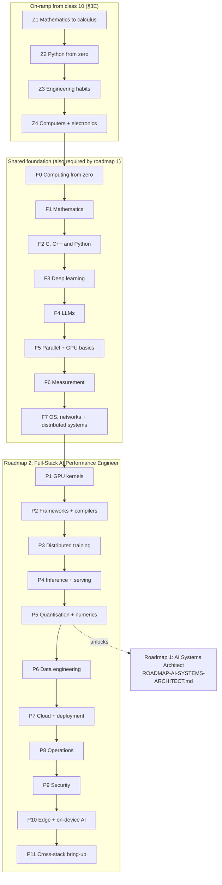
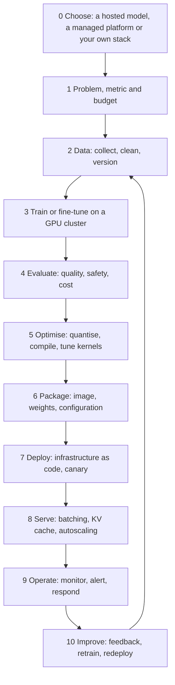
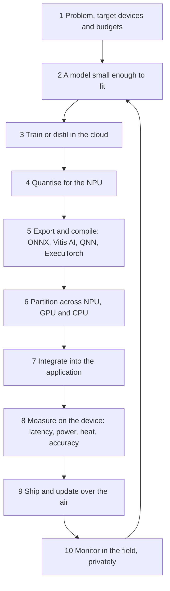

# Roadmap #2 — Full-Stack AI Performance Engineer

**From binary and floating point to an optimised, validated LLM serving stack on AMD GPUs that is
fed by reproducible data, deployed from code, operated and secured. Every topic is listed in order,
with what to build at each stage and the test that proves the stage is done.**

This is one of two role roadmaps. It trains the role that **changes the software to fit the
hardware**. Its sibling, [`ROADMAP-AI-SYSTEMS-ARCHITECT.md`](ROADMAP-AI-SYSTEMS-ARCHITECT.md), trains
the role that **changes the hardware to fit the model**. That roadmap uses F0–F7 and P1–P5 from this
document as its prerequisites, so learn this one first.

A fast kernel is only part of the job. P6–P9 cover what production depends on around the model: the
data that feeds it, the cloud platform that ships it, the operations that keep it healthy and the
security that keeps it trustworthy.

§3D is the complete syllabus behind the stages: 31 subjects, from C, operating systems and
distributed systems to GPU kernels, model serving (FastAPI and BentoML up to vLLM), cloud, MLOps and
security. Each one is laid out from basic to expert, with its tools, projects and books.

Starting from zero, just out of class 10? Begin with §3E. §3F walks the two end-to-end flows, AI
in the cloud and AI at the edge, and §3G is the career ladder from AI systems engineer to systems
architect.

Every domain is learned on both sides. From P1 to P10, each stage has a cloud side and an edge
side, each with its own build and gate, and §3H maps them domain by domain: kernels for an Instinct
GPU and for an NPU, serving for a thousand users and for one, releases for a cluster and for a
fleet of devices.

Want it as a calendar? [`PLAN-22-MONTHS.md`](PLAN-22-MONTHS.md) schedules every stage of this
roadmap over its first 450 days at a full-time pace, naming every Learn topic on its day, with
each month's tech stack, gates and track hour; roadmap #1 follows in days 451–660.

- [`../AI-ML-DL-COMPLETE-ROADMAP.md`](../AI-ML-DL-COMPLETE-ROADMAP.md) is the programme. Its §10.17
  (the model-to-hardware track, Stages 1–6) is the backbone that this roadmap deepens.
- [`AMD-GPU-PATH.md`](AMD-GPU-PATH.md) is the GPU deep dive: compilation, dispatch, the execution model,
  MFMA, Triton and profiling.
- [`AMD-AI-STACK.md`](AMD-AI-STACK.md) is the component map: ROCm, libraries, AITER, vLLM/SGLang,
  Quark and Ryzen AI.
- [`QUALCOMM-AI-STACK.md`](QUALCOMM-AI-STACK.md) covers the edge and NPU stage (P10).

> **How to read this.** Stages are **gated, not scheduled**. A stage is finished when its
> **Done when** test passes, not when its reading list is read. Every topic carries one of the
> programme's depth tags from [`../AI-ML-DL-COMPLETE-ROADMAP.md`](../AI-ML-DL-COMPLETE-ROADMAP.md)
> §0.2:
>
> - **[BUILD]**: implemented from first principles and reproducible on a blank page.
> - **[KNOW]**: you understand the mechanism well enough to teach it to a peer in five minutes.
> - **[AWARE]**: you recognise the term and what it is for, so it will not be a blind spot.
>
> You can skip a stage only by passing its exit test cold. There are no durations; the test is the
> gate.

---

## Contents

| § | Section | What you learn |
| --- | --- | --- |
| 1 | The role: what "done" looks like | The job this trains for, from real postings |
| 2 | The whole path in one picture | Stage map, gates and where each stage deepens in this repo |
| 3 | How every stage is structured | Why / Learn / Study path / Build / Check yourself / Done when / Traps / References |
| 3B | **Start here: placement, method and your lab** | Where to begin, how to study, and the machines and software each stage needs |
| 3C | **The whole story: one project, end to end** | How every stage's work builds one repository, from F0 to the capstone |
| 3D | **The complete syllabus: every subject, basic to expert** | 31 subjects from C, operating systems and distributed systems to GPUs, model serving, cloud, MLOps and security |
| 3E | **From class 10: the on-ramp to F0** | Z1–Z4: school mathematics to calculus, first programs, engineering habits, electronics; your path through school, college and work |
| 3F | **AI in the cloud and AI at the edge: the two end-to-end flows** | Every step from the problem to the hundredth update, in both flows, with its skills, tools and stage |
| 3G | **The career ladder: from AI systems engineer to systems architect** | Levels by scope, skills by level, and the skills that no exit test can check |
| 3H | **Both sides of every domain: cloud and edge** | For each domain, the cloud work and the edge work, what stays the same, and where each side is built and gated |
| 4 | **F0: Computing from zero** | Bits, IEEE-754, gates, the CPU, the OS |
| 5 | **F1: Mathematics** | Linear algebra, calculus, probability, numerics, FLOP and byte counting |
| 6 | **F2: C, C++ and Python** | The three languages of the stack, systems programming, data structures, debugging, concurrency |
| 7 | **F3: Deep learning** | From autograd to a transformer you wrote yourself |
| 8 | **F4: Large language models** | Parameter, FLOP, memory and KV-cache accounting |
| 9 | **F5: Parallel computing and GPU fundamentals** | SIMT, memory hierarchy, occupancy, roofline |
| 10 | **F6: Measurement discipline** | Benchmarks that survive review |
| 11 | **F7: Operating systems, networks and distributed systems** | Kernel internals and xv6, sockets to Raft, queueing, retries, the storage stack |
| 12 | **P1: GPU kernels** | The GEMM ladder, fused kernels, FlashAttention, Triton |
| 13 | **P2: Frameworks and compilers** | PyTorch internals, `torch.compile`, MLIR, Triton's pipeline |
| 14 | **P3: Distributed training** | DP, FSDP, TP, PP, CP and EP; collectives; MFU |
| 15 | **P4: Inference and serving** | Model servers (FastAPI, BentoML, Ray Serve, Triton), prefill vs decode, paging, batching, speculative decoding, SLOs |
| 16 | **P5: Quantisation and numerics** | Formats, scaling, accuracy parity |
| 17 | **P6: Data engineering for AI** | SQL, columnar and table formats, corpus pipelines, loaders, checkpoints |
| 18 | **P7: Cloud infrastructure and deployment** | IaC, containers, Kubernetes and Slurm for GPUs, rollouts, autoscaling, cost |
| 19 | **P8: Operating AI in production** | Lineage, LLM evaluation, CI gates, observability, SRE |
| 20 | **P9: Security, privacy and governance** | Supply chain, model files, prompt injection, isolation |
| 21 | **P10: Edge and on-device AI** | Partitioning, fallbacks, power, app integration, signed model updates, cloud cascades |
| 22 | **P11: Cross-stack bring-up (capstone)** | Reference model to an optimised, operated AMD deployment, end to end |
| 23 | Progress tracker | One checklist for the whole path |
| 24 | Verification status | What is sourced and what is not |
| — | Primary sources | Links fetched for this document |

*F and P are stage IDs, and roadmap #1 uses the same IDs. The § numbers only give the reading order.*

---

## 1. The role: what "done" looks like

A **Full-Stack AI Performance Engineer** takes a model and a machine and closes the gap between what
the hardware can do and what the workload actually achieves. The work spans every layer, from Python
down to the ISA and out to the cluster, and the engineer proves the result with numbers that another
engineer can reproduce.

### Postings this roadmap targets

Fetched on 2026-09-23. The base ranges are shown as posted and will drift. They are here to show
where the role sits, not as a promise.

| Posting | Base range (as posted) | What it asks for |
| --- | --- | --- |
| OpenAI: Workload Porting & Performance Engineer | $347K–$445K | Title and range recorded here; read the posting for the full list |
| OpenAI: Systems Generalist, GPT Infrastructure | $293K–$445K | 8+ years; LLVM/MLIR, Triton, CUDA/ROCm; vLLM/SGLang |
| OpenAI: Inference Performance Optimization | $266K–$500K | Title and range only; no URL recorded |
| OpenAI: Training Performance | $295K–$500K | Title and range only; no URL recorded |
| Anthropic: Performance Engineer, GPU | Not recorded | Seen by title only |

### The six capabilities this roadmap builds

| Capability | Stages | The proof |
| --- | --- | --- |
| Write and tune kernels | F5, P1 | A GEMM ladder where a profiler counter explains every step |
| Understand what generates and launches them | P2 | A custom op that compiles with zero graph breaks |
| Scale across devices for training and serving | P3, P4 | Step time and SLO throughput predicted before they are measured |
| Feed it and ship it | F7, P6, P7, P10 | A resumable data pipeline, a GPU deployment rebuilt from code, and an on-device build that updates safely |
| Run it safely | P8, P9 | CI gates that block regressions, alerts that fire, and images that must be signed |
| Prove it | F6, P5, P8, P11 | Reproducible benchmarks, accuracy parity and regression gates |

Every capability is proven twice: once in the cloud and once on a device (§3H).

This role differs from an ML engineer because it owns the **gap**. "The model runs" is not the goal.
The goal is to say "the model runs at X% of what this hardware allows, this counter shows why, and
this is what closes the rest." The role also owns what surrounds the kernel: the data that feeds it,
the platform that serves it and the gates that protect it. A gap closed on a benchmark and reopened
by the next release, a starved input pipeline or a failed node was never closed.

---

## 2. The whole path in one picture



| Stage | Depth | You build | Gate (Done when) | Deepens in this repo |
| --- | --- | --- | --- | --- |
| Z1 | [BUILD] | Worked problems, checked in Python | Chain rule, matrix product, mean and variance, a minimum found two ways | Textbook Week 1 |
| Z2 | [BUILD] | Ten small programs; a plot of a function and its derivative | An unseen small problem solved alone | Textbook Week 1 |
| Z3 | [BUILD] | A public GitHub repository and a learning log | A pull request opened from the terminal | — |
| Z4 | [KNOW] | Circuits on a breadboard or in a simulator; a one-bit adder | Ohm's law, number bases and XOR, cold | — |
| F0 | [BUILD] | Float classifier; a CPU from NAND gates | Trace `c = a + b` to the ALU | — |
| F1 | [BUILD] | Stable softmax; hand-derived backprop | FLOPs, bytes and intensity of a GEMM, unaided | Roadmap Weeks 1–2; textbook Week 1 |
| F2 | [BUILD] | C shell and allocator; sanitizer-clean C++ library with Python bindings | Allocator survives its stress trace; TSan race found and fixed | — |
| F3 | [BUILD] | A GPT from scratch | Every tensor shape from memory | Roadmap Weeks 3–7 |
| F4 | [BUILD] | LLM calculator | Parameter count exact against a real checkpoint | Roadmap Week 8 |
| F5 | [BUILD] | HIP reduction ladder and tiled matmul | Bound predicted, then confirmed by counters | Roadmap §10.3; AMD-GPU-PATH §4–§6, §9 |
| F6 | [BUILD] | Benchmark harness | Planted regression caught | Roadmap §10.4; AMD-GPU-PATH §9, §13 |
| F7 | [KNOW]→[BUILD] | xv6 kernel labs; streaming server; Raft labs; fio study | xv6 labs graded; Little's law predicts the knee; Raft passes | Roadmap §10.2 |
| P1 | [BUILD] | GEMM ladder; Triton FlashAttention | A counter explains every rung | Roadmap §10.6, §10.17 Stage 3; AMD-GPU-PATH §7–§8, §11–§12 |
| P2 | [BUILD] | Custom op plus an Inductor fix | `opcheck` passes with zero graph breaks | Roadmap §10.17 Stages 1–2; AMD-GPU-PATH §2–§4, §8 |
| P3 | [BUILD] | FSDP, TP and PP training runs | Step time predicted | Roadmap §10.17 Stage 4; AMD-GPU-PATH §10 |
| P4 | [BUILD] | vLLM-on-ROCm sweep; one model behind three model servers | SLO throughput predicted | Roadmap §10.5; AMD-AI-STACK §10, §12 |
| P5 | [BUILD] | One model quantised three ways | An accuracy number beside every speed number | AMD-AI-STACK §5, §14 |
| P6 | [BUILD] | Reproducible corpus pipeline; resumable loader | Every drop counted; a killed run resumes identically | Roadmap Week 2 Part F, Week 9 Part B |
| P7 | [KNOW]→[BUILD] | IaC plus a Kubernetes GPU deployment with a canary | Rebuilt from code; the canary rolls back | Roadmap Week 9 Part A; AMD-AI-STACK §12 |
| P8 | [BUILD] | Registry, evaluation report, CI gates, dashboards | Planted regressions blocked; alerts fire | Roadmap Week 9 Parts A and D, §10.2 |
| P9 | [KNOW]→[BUILD] | Threat model, signed images, red-team exercise | Unsigned image refused; attack rate drops | Roadmap Week 9 Part C, Week 8 Track C |
| P10 | [KNOW]→[BUILD] | NPU + iGPU run; an application with signed model updates and a cloud cascade | Every fallback explained; a tampered update refused | Roadmap §10.17 Stage 6; AMD-AI-STACK §13–§13B; QUALCOMM-AI-STACK §5–§6B |
| P11 | [BUILD] | Capstone bring-up | A stranger reproduces it and rebuilds the deployment | Roadmap §10.17 Stage 5; AMD-GPU-PATH §13 |

From P1 to P10, every stage also has a second side with its own build and gate: an **Edge side**
block, or a **Cloud side** block in P10 (§3H). The table shows each stage's main side, and §23
tracks both.

---

## 3. How every stage is structured

- **Why.** One line on what the stage makes possible.
- **Learn.** Topics in order, each tagged **[BUILD]**, **[KNOW]** or **[AWARE]**.
- **Study path.** The order in which to work through the material, in three passes: foundation,
  core and advanced. Each pass names the resources to use, most of them listed under References.
- **Build.** The artefacts, with acceptance criteria. Every **[BUILD]** topic ends as working code.
- **Check yourself.** Questions to answer from memory, in writing, before you attempt the exit
  test. Each answer is in the Learn list or the references, and the numeric ones follow from
  formulas given there. If you cannot answer one, go back to its topic.
- **Done when.** The exit test. It is pass/fail and can be re-run. If it is not met, the stage is not
  done.
- **Traps.** Mistakes that make a result wrong while it still looks right.
- **Edge side** (P1–P9) or **Cloud side** (P10). The same domain on the other side of §3F: what
  changes, what to learn, one build, its own **Done when** and its traps. A stage is finished only
  when both of its sides pass (§3H).
- **References.** Primary sources first, then pointers into this repository.

In the Learn lists and study paths, the short names *roadmap*, *AMD-GPU-PATH*, *AMD-AI-STACK* and
*QUALCOMM-AI-STACK* refer to the documents linked in the introduction.

---

## 3B. Start here: placement, method and your lab

### Where to start

- **If you have just finished class 10, or have never programmed**, start with the on-ramp in §3E
  (Z1–Z4). The programme's Week 1 textbook
  ([`../textbook/WEEK-01-MATHEMATICS-FOUNDATIONS.md`](../textbook/WEEK-01-MATHEMATICS-FOUNDATIONS.md))
  then teaches Python and NumPy alongside the mathematics. Then start at F0.
- **Otherwise**, attempt the exit tests (**Done when**) in order from F0, each one cold. The first
  test you fail is where you start studying. Tick every test you pass in §23 as you go.
- **To see the whole field at once**, read §3D. It lists every subject the role touches, from basic
  to expert, and names the stage whose exit test proves each one.
- **If you want a calendar**, follow [`PLAN-22-MONTHS.md`](PLAN-22-MONTHS.md): this roadmap in
  450 days, each naming its concepts, its task and the evidence it leaves, then roadmap #1 in 210
  more. The gates still decide when a stage is done.

### How to study a stage

1. Read the stage's **Why** and **Done when** first, so you know what you are aiming at.
2. Work through the **Study path** in order. Take notes in your own words, and redo every
   derivation and every worked number by hand.
3. Build as you learn. Each **[BUILD]** topic becomes code in your project repository (§3C) before
   you move to the next topic, not at the end of the stage.
4. Answer the **Check yourself** questions from memory, in writing. Any you cannot answer send you
   back to that topic.
5. Run the **Done when** test. Record the result, the commit, the machine and the software versions
   in your lab notebook. Only a pass moves you on.
6. Write a one-page stage report in the F6 format: the question, the setup, the method, results
   with uncertainty, the analysis and what you did not test. The reports become your portfolio.

Keep the formulas alive. Make a card for each formula in F1, F4, P3 and P4: the FLOPs and bytes of
a GEMM, C ≈ 6PD, bytes per parameter, KV bytes per token, the α–β model, the pipeline bubble and
the speculative-decoding yield. Review the cards until you can derive each one cold.

### When you are stuck

- Shrink the problem to the smallest input that still fails, and write it down.
- Read the source of what you are calling: the framework, the compiler pass or the kernel library.
- Read the generated code. AMD-GPU-PATH §12 calls reading the assembly "the single
  highest-leverage habit".
- Use the tools of the stage you are in: sanitizers (F2), profilers (F6), and `rocgdb` and
  `AMD_SERIALIZE_KERNEL` for GPU code (AMD-GPU-PATH §13).
- Ask for help with the reproduction attached: the command, the versions and the full output.

### Your lab, stage by stage

| Stages | Hardware | Software and accounts |
| --- | --- | --- |
| Z1–Z4 | Any computer, even a basic laptop or a school computer lab | Python, VS Code and git; for Z4, a breadboard kit or a free circuit simulator |
| F0–F2 | Any 64-bit computer | Linux (native, a VM or WSL2), gcc or clang, gdb, Valgrind, CMake, git, Python |
| F3–F4 | A CPU is enough, except F4's check against a serving engine, which can wait for your F5 GPU | PyTorch (the CPU build is fine) |
| F5–F6, P1–P2, P4–P5 | One AMD GPU supported by ROCm, owned or rented | ROCm, PyTorch for ROCm, Triton and the ROCm profilers |
| F7, P6 | Any Linux machine with an NVMe drive | QEMU and a RISC-V cross-compiler for the xv6 labs, Go for the 6.5840 labs, fio, Docker and DuckDB |
| P3 | 2–8 GPUs in one node, and two nodes for multi-node work | PyTorch distributed and RCCL, usually on rented GPUs |
| P7–P9 | A cloud account with GPU quota, plus a local Kubernetes cluster for the parts without GPUs | Terraform or OpenTofu, kubectl, Helm and the AMD GPU Operator |
| Edge sides of P1–P9 | The P10 device from P1 onwards, or hosted devices (§3H) | ONNX Runtime, and the vendor's NPU toolchain and LLM runtime (AMD-AI-STACK §13; QUALCOMM-AI-STACK §8, §9) |
| P10 | A Ryzen AI laptop, or a Qualcomm device; your P7 deployment for the cloud cascade | The vendor's NPU toolchain (AMD-AI-STACK §13; QUALCOMM-AI-STACK §3B) |
| P11 | Rented GPUs, as for P3 and P7 | Everything above |

Before your first rented GPU hour, set a budget alert and learn how to stop the instance (P7).

### Setting up the AMD GPU stack

These steps follow AMD's ROCm 10.0.0 documentation, read on 2026-09-24. Versions change with every
release, so check the current pages, listed under Primary sources, before you install.

1. **Check support.** Find your GPU and operating system in the ROCm compatibility matrix. At ROCm
   10.0.0 it covers Instinct GPUs (the MI300X is `gfx942`; the MI350X and MI355X are `gfx950`),
   Radeon RX 7000 and RX 9000 series cards, and Ryzen AI Max APUs (`gfx1151`). The install guide
   notes that a GPU that is not listed may be community-enabled through TheRock nightly builds.
2. **Install ROCm.** The install guide offers five methods: the distribution's package manager,
   `amdgpu-install` (Radeon and Ryzen only), pip wheels in a Python virtual environment, a tarball
   and a runfile installer. If you are unsure, it recommends the package manager on Linux.
3. **Grant GPU access.** Add your user to the `render` and `video` groups with
   `sudo usermod -a -G render,video $LOGNAME`, then reboot, as the guide advises. If you use
   containers, do this on the host. Without it, tools fail with messages such as "no agents found"
   (AMD-GPU-PATH §13).
4. **Verify.** `rocminfo` must list your GPU as an agent with its `gfx` target, and
   `amd-smi version` prints the ROCm and driver versions.
5. **Install PyTorch for ROCm**, from the `rocm/pytorch` Docker image or from pip wheels on AMD's
   package index. Then check that `torch.cuda.is_available()` prints `True`: PyTorch on ROCm keeps
   the `torch.cuda` names.
6. **Record the versions.** ROCm, driver, PyTorch and Python versions go into every F6 benchmark
   record.

The Docker route, as given on AMD's PyTorch install page:

```bash
docker pull rocm/pytorch:rocm10.0_ubuntu24.04_py3.12_pytorch_release_2.13.0

docker run -it --rm \
  --device /dev/kfd --device /dev/dri \
  --network=host --ipc=host --group-add=video \
  --cap-add=SYS_PTRACE --security-opt seccomp=unconfined \
  rocm/pytorch:rocm10.0_ubuntu24.04_py3.12_pytorch_release_2.13.0 \
  bash

# inside the container
python -c "import torch; print(torch.cuda.is_available())"
```

The `--network=host`, `SYS_PTRACE` and `seccomp=unconfined` flags in AMD's example remove isolation.
They are acceptable on a personal lab machine and wrong in production (P7, P9).

No GPU yet? AMD-GPU-PATH §12 notes that compilation and IR inspection need no GPU, so F5's reading
and P2's IR work can start on any Linux machine.

---

## 3C. The whole story: one project, end to end

Everything you build goes into **one repository**. Each stage adds a directory, and later stages
reuse earlier ones. By P11 the repository is a working system that is measured, deployed to the
cloud and to a device, operated and secured, and its history shows how you got there.

Two models carry the story. **Your own GPT** from F3 is small enough to understand completely, so
every kernel, compiler change and parallel layout is tried on it first (P1–P3). **An open-weight
LLM** is the realistic workload from P4 onwards: you serve it, quantise it, deploy it, operate it
and secure it, and in P10 you fit a smaller version onto a device. In P11 you bring up one that you
have not used before.

### The repository

```text
llm-from-zero/
├── README.md       # headline numbers, and how to reproduce each one
├── notebook/       # one dated entry per run: command, commit, versions, result
├── bench/          # F6 harness, used by every later stage and by P8's CI gate
├── z-onramp/       # Z1 worked problems, Z2 programs, Z3 learning log, Z4 circuits
├── f0-computing/   # floatbits, summation-order study, Nand2Tetris
├── f1-maths/       # stable softmax, hand-derived backprop, FLOP and byte counter
├── f2-native/      # C shell, allocator and hash table; C++ matrix library, bindings, sanitizer CI
├── f3-gpt/         # autograd engine, tokenizer, your GPT
├── f4-calc/        # llm_calc.py: the predictions that P3, P4, P6 and P7 must match
├── f5-hip/         # reduction ladder, tiled matmul, measured roofline
├── f7-systems/     # xv6 labs, streaming server, retry client, fio study, 6.5840 labs
├── p1-kernels/     # GEMM ladder; Triton softmax, RMSNorm and FlashAttention
├── p2-compile/     # custom op, Inductor fix, IR dumps
├── p3-train/       # ring all-reduce; DDP, FSDP and TP runs of your GPT
├── p4-serve/       # vLLM sweep, speculative decoding, three-server comparison
├── p5-quant/       # one model quantised three ways, FP8 emulator
├── p6-data/        # DataTrove pipeline, contamination test, loader benchmark
├── p7-deploy/      # IaC, image, Kubernetes manifests, canary, cost report
├── p8-ops/         # registry, evaluation report, CI gates, dashboards, postmortem
├── p9-security/    # threat model, SBOM and signatures, pickle demo, red-team report
├── p10-edge/       # NPU and iGPU run, fallback report, app, signed updates, cloud cascade
└── p11-capstone/   # the end-to-end bring-up and its one-command reproduction
```

Each stage directory from `p1-kernels/` to `p9-security/` also holds an `edge/` subdirectory for
that stage's edge side, and `p10-edge/` holds a `cloud/` one (§3H).

### How the stages feed each other

| Stage | Adds | Reused by |
| --- | --- | --- |
| Z1–Z4 | Worked mathematics, first programs and a GitHub profile | F0–F2, and every habit after them |
| F0–F2 | Numerics experiments; a C shell and allocator; a C++ library with Python bindings | Debugging and native code in every later stage; the xv6 labs in F7 |
| F3 | Your GPT and tokenizer | P1 (its kernels), P2 (compiled), P3 (trained at scale) |
| F4 | `llm_calc.py` | P3 and P4 (predictions to test), P6 (checkpoint sizes), P7 (cost) |
| F5 | HIP kernels and a measured roofline | P1 (the first rungs); roadmap #1 A3 |
| F6 | `bench/` | Every later stage; P8 turns it into a CI gate |
| F7 | xv6 labs, a streaming server, a retry client and a fio study | P4 (the API layer), P6 (storage), P7 (rollouts and timeouts) |
| P1–P2 | Kernels and a custom op that plug into your GPT | P3, P4 and P11 |
| P3 | Distributed runs with predicted step times | P6 (checkpoints), P7 (gang scheduling); roadmap #1 A6 |
| P4–P5 | A measured serving configuration and a quantised model | P7 (deployed), P8 (gated), P11 |
| P6 | A reproducible corpus and a resumable loader | A second P3 run on data you built; P8 (lineage) |
| P7 | A deployment rebuilt from code | P8 (operated), P9 (secured), P10 (the cloud side of its cascade), P11 |
| P8–P9 | CI gates, alerts, a threat model and signed images | P10 (signed model updates), P11 |
| Edge sides of P1–P9 | Device kernels, fixed-shape builds, a distilled student, a device runtime study, NPU formats, device telemetry, a build farm and update service, device release gates, and a verifying library | P10 (assembled into its application), P11 |
| P10 | An on-device application with signed updates and a cloud cascade, and the cloud capacity behind it | P11 (its edge half) |
| P11 | The capstone | Your portfolio, and the evidence that roadmap #1 starts from |

### What you have at the end

- A repository from which a stranger can reproduce your headline numbers (F6, P11).
- One report per stage in the F6 format, with an accuracy number beside every speed number.
- At least one kernel or compiler fix submitted upstream, with benchmarks (P11).
- A deployment that anyone can tear down and rebuild from code, protected by CI gates, alerts and a
  signed supply chain.
- An on-device build of the same model that accepts only signed updates and hands hard requests to
  the cloud (P10, P11).
- Every domain worked twice, once for the cloud and once for a device, with both gates passed
  (§3H).

The programme's portfolio guidance is in
[`../AI-ML-DL-COMPLETE-ROADMAP.md`](../AI-ML-DL-COMPLETE-ROADMAP.md) §10.7 (Part F). Roadmap #1
continues the same story: its A-stages are validated against the measurements in this repository.

---

## 3D. The complete syllabus: every subject, basic to expert

The stages are the gated path; this section is the map they walk through. It covers every subject
the role touches, in five parts. Each subject gives:

- **Gated in:** the stage whose exit test proves it, or the programme week that teaches it;
- four levels, **Basic → Intermediate → Advanced → Expert**, which are the order to learn in;
- the **Tools** to install and use, the **Projects** to build and the books and courses to
  **Study from**.

The gating stage sets how deep you must go (**[BUILD]**, **[KNOW]** or **[AWARE]**). Expert
material beyond that is for when you specialise. Tools change quickly, so before you build on one,
check its documentation, its release activity and whether it supports your hardware.

| Part | Subjects | Gated in |
| --- | --- | --- |
| I. Computing foundations | Mathematics; C; C++; Python; data structures and algorithms; computer architecture; operating systems and Linux; compilers and runtimes; software engineering | F0, F1, F2, F5, F7, P2 |
| II. Systems | Networking; distributed systems; databases and storage engines | F7, P3, P6 |
| III. Machine learning | Classical ML; deep learning; LLMs; generative models beyond LLMs; LLM applications and agents | Programme Weeks 3–8; F3, F4, P3, P8, P9 |
| IV. Performance | GPU programming; frameworks and compilers; distributed training; inference and model serving; quantisation; performance engineering; edge AI | F5, F6, P1–P5, P10 |
| V. Production | Data engineering; cloud; DevOps and platform engineering; MLOps and LLMOps; observability and SRE; security; responsible AI | P6–P9 |

### Part I: Computing foundations

#### Mathematics for AI

**Gated in:** F1, with the accounting in F4.

- **Basic.** Algebra and functions; vectors and matrices; matrix multiplication as dot products and
  as combinations of columns; derivatives; probability, mean and variance.
- **Intermediate.** Linear maps, rank, bases and orthogonality; eigenvalues and the SVD; partial
  derivatives, gradients and the chain rule; common distributions; Bayes' rule and maximum
  likelihood; gradient descent.
- **Advanced.** Jacobians and vector–Jacobian products; matrix calculus for backprop; convexity and
  duality; entropy, cross-entropy and KL divergence; conditioning and numerical stability;
  floating-point error analysis.
- **Expert.** Randomised linear algebra; the theory of adaptive and second-order optimisers; the
  mathematics of scaling laws; the numerical analysis of low-precision training (P5).
- **Tools.** NumPy, SciPy and SymPy.
- **Projects.** Everything in F1's Build list; an autodiff engine from scratch (F3).
- **Study from.** *Mathematics for Machine Learning*; Strang, *Introduction to Linear Algebra*, with
  MIT 18.06; Blitzstein & Hwang; Boyd & Vandenberghe, *Convex Optimization*; Trefethen & Bau.

#### C programming

**Gated in:** F2, after the introduction in F0. The Linux kernel and its GPU drivers, CPython and
NumPy's core are written in C, and C++ inherits its memory model.

- **Basic.** Types and their sizes, integer promotions, operators, control flow and functions;
  arrays, strings as `char` arrays, and pointers; `struct` and `enum`; header files; compiling with
  gcc or clang and reading every warning (`-Wall -Wextra`).
- **Intermediate.** The process memory layout (text, data, BSS, heap and stack); `malloc`, `free`
  and `realloc`; function pointers; `const`, `static` and linkage; multi-file programs, object files
  and the linker; static and shared libraries; `make`; file I/O and `errno`; bit manipulation,
  `union`, alignment, padding and endianness.
- **Advanced.** Undefined behaviour (signed overflow, out-of-bounds access, strict aliasing,
  uninitialised reads); `volatile` and `restrict`; POSIX processes, pipes, signals and threads; the
  C11 memory model and `<stdatomic.h>`; variadic functions; the calling convention and the ABI.
- **Expert.** Your own allocator; lock-free data structures in C11 atomics; SIMD intrinsics;
  reading compiler output; debugging a core dump from an optimised build.
- **Tools.** gcc, clang, gdb, Valgrind, the sanitizers, `make`, `objdump`, `readelf`, `nm`, `strace`
  and Compiler Explorer.
- **Projects.** F2's shell, allocator and hash table; F0's `floatbits`; the xv6 labs (F7).
- **Study from.** Kernighan & Ritchie, *The C Programming Language* (2nd ed.); Gustedt, *Modern C*;
  CS:APP chapters 7–9; Kerrisk, *The Linux Programming Interface*.

#### C++

**Gated in:** F2, and used under pressure in P1 and P2.

- **Basic.** Classes, references, `std::vector` and `std::string`, `std::unique_ptr`, range-for,
  `auto`, and header vs source files.
- **Intermediate.** RAII; the rule of zero, three and five; move semantics; templates and lambdas;
  the STL containers and algorithms, with their costs; `constexpr`; CMake targets.
- **Advanced.** Template metaprogramming and concepts; the memory model and `std::atomic`; threads
  and condition variables; exception safety; the ABI and name mangling; pybind11.
- **Expert.** Lock-free structures; custom allocators; the compile-time template kernels that
  CUTLASS and Composable Kernel are built from (P1); coroutines.
- **Tools.** CMake, clang-tidy, clang-format, the sanitizers, GoogleTest, Compiler Explorer and
  `perf`.
- **Projects.** F2's strided matrix library with Python bindings; the P1 kernels.
- **Study from.** Stroustrup, *A Tour of C++*; Meyers, *Effective Modern C++*; Williams, *C++
  Concurrency in Action*.

#### Python

**Gated in:** F2.

- **Basic.** Syntax, built-in types, functions, modules, comprehensions, exceptions, files and
  virtual environments.
- **Intermediate.** The data model (names bind to objects), iterators and generators, decorators,
  context managers, classes and dataclasses, type hints, packaging and pytest.
- **Advanced.** The GIL and what releases it; threads vs `multiprocessing` vs `asyncio`; C
  extensions and pybind11; the buffer protocol; profiling with `cProfile` and `py-spy`.
- **Expert.** CPython internals (bytecode, reference counting and the garbage collector);
  **[AWARE]** the free-threaded build (PEP 703); designing a library with a stable public API.
- **Tools.** uv or pip, venv, pytest, ruff, mypy, py-spy and IPython.
- **Projects.** F6's `bench/` harness, and every experiment script in the repository.
- **Study from.** Ramalho, *Fluent Python* (2nd ed.); Gorelick & Ozsvald, *High Performance
  Python*; the data model chapter of the Python language reference.

#### Data structures and algorithms

**Gated in:** F2, and used in every Build after it.

- **Basic.** Big-O; arrays and dynamic arrays; linked lists, stacks and queues; linear and binary
  search; simple sorts.
- **Intermediate.** Hash tables; binary search trees and heaps; merge sort and quicksort, with their
  worst cases; recursion; graphs, BFS and DFS.
- **Advanced.** Balanced trees and B-trees; tries; union–find; shortest paths and spanning trees;
  dynamic programming; amortised analysis.
- **Expert.** Cache-aware and cache-oblivious algorithms; concurrent and lock-free structures;
  probabilistic structures (Bloom filters, HyperLogLog, count-min sketches); approximate nearest
  neighbour search (P6).
- **Tools.** The language you are learning, plus the F6 harness, because Big-O hides the constants
  and the caches.
- **Projects.** F2's hash table in C; a key/value store with a B-tree or LSM-tree index (see the
  databases subject below).
- **Study from.** Cormen, Leiserson, Rivest & Stein, *Introduction to Algorithms* (4th ed.); Skiena,
  *The Algorithm Design Manual*; Sedgewick & Wayne, *Algorithms*.

#### Computer architecture, as software sees it

**Gated in:** F0 and F5. Roadmap #1 goes much deeper (A2–A5).

- **Basic.** Binary, logic gates, the ALU, registers, memory and the fetch–decode–execute cycle.
- **Intermediate.** Instruction sets and assembly; pipelining and hazards; caches, lines and
  associativity; virtual memory and the TLB; the latency of each level of the memory hierarchy.
- **Advanced.** Out-of-order execution and branch prediction; SIMD; multicore coherence and memory
  ordering; NUMA; PCIe; the GPU execution model and the roofline.
- **Expert.** Tuning at the microarchitecture level with hardware counters; reading vendor ISA
  manuals; the design of AMD's CDNA and RDNA GPUs (AMD-GPU-PATH, AMD-AI-STACK §5 and §5B).
- **Tools.** `perf`, `lscpu`, `lstopo`, `rocminfo`, Compiler Explorer and the ROCm profilers.
- **Projects.** Nand2Tetris (F0); the F5 roofline; the P1 GEMM ladder.
- **Study from.** CS:APP; Patterson & Hennessy, *Computer Organization and Design*; Nand2Tetris.

#### Operating systems and Linux

**Gated in:** F0 for the concepts, and F7 for the internals.

- **Basic.** Using Linux: the shell, files and permissions, processes, package managers, `ssh`,
  environment variables and pipes.
- **Intermediate.** Processes vs threads; system calls; scheduling; virtual memory, paging and page
  faults; files, inodes and the page cache; signals; mutexes, semaphores, condition variables and
  deadlock.
- **Advanced.** Copy-on-write `fork`, `mmap` and huge pages; futexes; interrupts, device drivers,
  DMA and the IOMMU; journaling and crash consistency; `epoll` and `io_uring`; namespaces and
  cgroups, which is what a container is; virtualisation, KVM and SR-IOV.
- **Expert.** Kernel development and debugging; the Linux scheduler and memory manager; eBPF
  tracing; the `amdgpu` kernel driver and its KFD interface (AMD-GPU-PATH §4); tuning for low
  latency.
- **Tools.** bash, tmux, `top` or `htop`, `vmstat`, `iostat`, `strace`, `ltrace`, `lsof`, `perf`,
  `bpftrace`, `numactl`, `taskset`, and QEMU for kernel work.
- **Projects.** The xv6 labs (F7); a shell and an allocator (F2); a container built by hand from
  namespaces and cgroups.
- **Study from.** *OSTEP*; MIT 6.1810 and the xv6 book; Kerrisk, *The Linux Programming Interface*;
  Gregg, *Systems Performance* and *BPF Performance Tools*; Love, *Linux Kernel Development*.

#### Compilers, linkers and runtimes

**Gated in:** F2 (linking) and P2 (compilers).

- **Basic.** What a compiler, assembler, linker and loader each do; interpreters vs compilers;
  optimisation levels.
- **Intermediate.** Lexing, parsing and ASTs; intermediate representations and SSA form; the classic
  optimisations (inlining, constant propagation, dead-code elimination, loop-invariant code motion);
  static and dynamic linking, and relocation.
- **Advanced.** LLVM IR and its pass pipeline; instruction selection and register allocation;
  vectorisation; JIT compilation; graph capture from Python bytecode (`torch.compile`'s Dynamo, P2);
  MLIR dialects.
- **Expert.** Writing an LLVM pass or an MLIR dialect; polyhedral loop transformation; autotuning
  and cost models; the AMDGPU back end and its code objects (AMD-GPU-PATH §3).
- **Tools.** clang, `opt` and `llc`; Compiler Explorer; `TORCH_LOGS`; `mlir-opt`; the Triton
  compiler's IR dumps.
- **Projects.** An interpreter from *Crafting Interpreters*; LLVM's Kaleidoscope tutorial; the MLIR
  Toy tutorial; the P2 custom op and Inductor fix.
- **Study from.** Nystrom, *Crafting Interpreters*; Cooper & Torczon, *Engineering a Compiler*; Aho,
  Lam, Sethi & Ullman, *Compilers: Principles, Techniques, and Tools*.

#### Software engineering

**Gated in:** F2 and F6, and enforced from P8 onwards by CI gates.

- **Basic.** Git (commits, branches, merges and rebases); reading other people's code; writing a
  README; unit tests.
- **Intermediate.** Code review and pull requests; test design (unit, integration and golden-file);
  continuous integration; semantic versioning; debugging by bisection with `git bisect`.
- **Advanced.** API design and backwards compatibility; design documents; property-based and fuzz
  testing; reproducible builds; performance regression testing (F6).
- **Expert.** Leading design reviews; contributing upstream to large open-source projects (P11);
  owning a subsystem's reliability; writing for decision-makers (roadmap #1 A10).
- **Tools.** git, GitHub or GitLab, pre-commit hooks and a CI runner.
- **Projects.** The §3C repository itself, with CI from F2 onwards.
- **Study from.** Winters, Manshreck & Wright, *Software Engineering at Google*; Ousterhout, *A
  Philosophy of Software Design*; Chacon & Straub, *Pro Git*.

### Part II: Systems

#### Networking

**Gated in:** F7.

- **Basic.** IP addresses and ports; DNS; TCP vs UDP; HTTP requests and responses; `curl`.
- **Intermediate.** The socket API; the TCP handshake, flow control and congestion control; TLS;
  HTTP/1.1 vs HTTP/2; REST and gRPC; load balancers; NAT and firewalls.
- **Advanced.** Head-of-line blocking and QUIC; server-sent events and WebSockets for streaming;
  kernel bypass and zero-copy; RDMA, InfiniBand and RoCE for GPU clusters (P3; roadmap #1 A7).
- **Expert.** Congestion control for AI collectives; datacenter topologies; tuning with `tcpdump`
  and eBPF; programmable networks.
- **Tools.** `curl`, `dig`, `ss`, `tcpdump`, Wireshark, `iperf3`, `mtr`, `grpcurl` and Envoy.
- **Projects.** F7's streaming server and retry client; a chat server in C built on `epoll`.
- **Study from.** Kurose & Ross; Beej's guide; Stevens, *UNIX Network Programming*.

#### Distributed systems

**Gated in:** F7, and at GPU scale in P3.

- **Basic.** Why systems are distributed (scale, fault tolerance and latency); clients, servers and
  RPC; partial failure; timeouts and retries.
- **Intermediate.** Replication and partitioning (sharding); leader election; consistency models
  from linearisable to eventual; logical clocks; idempotency; MapReduce; consistent hashing.
- **Advanced.** Consensus with Raft and Paxos; distributed transactions (two-phase commit and
  sagas); CAP and PACELC; quorums; gossip and failure detection; CRDTs; stream processing; the
  collective operations of distributed training (P3).
- **Expert.** Formal specification with TLA+; fault-injection testing in the style of Jepsen;
  Byzantine fault tolerance; geo-distributed databases (Spanner and TrueTime); elastic,
  fault-tolerant training on thousands of GPUs (P3, P8).
- **Tools.** Go (for the 6.5840 labs), etcd, ZooKeeper, Kafka, Redis, TLA+ and Jepsen.
- **Projects.** The 6.5840 labs, up to the sharded key/value service (F7); your ring all-reduce
  (P3).
- **Study from.** Kleppmann, *Designing Data-Intensive Applications*; MIT 6.5840 and the papers it
  assigns (MapReduce, GFS, Raft, ZooKeeper and Spanner among them); van Steen & Tanenbaum,
  *Distributed Systems*; Petrov, *Database Internals*.

#### Databases and storage engines

**Gated in:** F7 (the storage stack) and P6 (SQL and data systems).

- **Basic.** Tables, keys and SQL (`SELECT`, `JOIN`, `GROUP BY`); transactions as "all or
  nothing".
- **Intermediate.** Indexes and query plans; normalisation; ACID and isolation levels; window
  functions and CTEs; OLTP vs OLAP.
- **Advanced.** B-trees vs LSM-trees; write-ahead logging and recovery; MVCC; query optimisation;
  columnar storage and vectorised execution; replication and sharding.
- **Expert.** Building a storage engine; distributed SQL; vector databases and approximate
  nearest-neighbour indexes at scale (P6); lakehouse table formats (Iceberg and Delta).
- **Tools.** PostgreSQL, SQLite, DuckDB and Redis; for vectors, pgvector, Faiss, Milvus or Qdrant.
- **Projects.** A key/value store with a write-ahead log and a B-tree or LSM-tree index; DuckDB over
  your pipeline metadata (P6).
- **Study from.** CMU 15-445/645, *Database Systems*; Petrov, *Database Internals*; Kleppmann,
  *DDIA*; *Readings in Database Systems* (the "Red Book").

### Part III: Machine learning

#### Classical machine learning

**Gated in:** the programme's Weeks 3–4, which F3 assumes. No stage in this roadmap gates it.

- **Basic.** Supervised vs unsupervised learning; train, validation and test splits; linear and
  logistic regression; k-nearest neighbours; accuracy, precision, recall and ROC curves.
- **Intermediate.** Regularisation; the bias–variance trade-off; cross-validation; decision trees,
  random forests and gradient boosting; SVMs and kernels; k-means and PCA; feature engineering.
- **Advanced.** Probabilistic models and the EM algorithm; Gaussian processes; calibration;
  imbalanced data; the basics of causal inference; time-series forecasting.
- **Expert.** Learning theory; Bayesian methods at scale; ranking and recommendation systems;
  online learning and bandits.
- **Tools.** scikit-learn, XGBoost, LightGBM, pandas, Polars and statsmodels.
- **Projects.** The programme's Week 3–4 artefacts; one tabular problem on which gradient boosting
  beats your neural network, with the reason.
- **Study from.** James, Witten, Hastie & Tibshirani, *An Introduction to Statistical Learning*;
  Hastie, Tibshirani & Friedman, *The Elements of Statistical Learning*; Bishop, *Pattern
  Recognition and Machine Learning*; Murphy, *Probabilistic Machine Learning*; Stanford CS229.

#### Deep learning

**Gated in:** F3.

- **Basic.** Neurons, layers and activations; loss functions; backpropagation; SGD; overfitting and
  regularisation.
- **Intermediate.** CNNs; RNNs and LSTMs; embeddings; batch and layer normalisation; dropout;
  initialisation; Adam; learning-rate schedules; transfer learning.
- **Advanced.** Attention and the transformer; residual connections and pre-norm; mixed precision;
  scaling laws; mixture-of-experts; efficient attention variants.
- **Expert.** Training stability at scale; optimiser design; interpretability; architectures beyond
  the transformer, such as state-space models.
- **Tools.** PyTorch, JAX, Hugging Face Transformers and `timm`, with MLflow or Weights & Biases for
  tracking.
- **Projects.** Karpathy's micrograd and makemore, then your own GPT (F3).
- **Study from.** Karpathy, *Neural Networks: Zero to Hero*; Prince, *Understanding Deep Learning*;
  *Dive into Deep Learning*; Goodfellow, Bengio & Courville, *Deep Learning*; Stanford CS231n.

#### Large language models

**Gated in:** F4 (accounting), P3 (training and post-training) and P8 (evaluation).

- **Basic.** Tokens and tokenisers; next-token prediction; prompting; temperature and sampling.
- **Intermediate.** The decoder-only transformer in detail; pre-training data; perplexity; the KV
  cache; fine-tuning and instruction tuning; parameter, FLOP and memory accounting.
- **Advanced.** Scaling laws and compute-optimal training; RLHF and DPO; LoRA and QLoRA; long
  context and RoPE scaling; mixture-of-experts; evaluation and contamination.
- **Expert.** Pre-training at scale; reasoning models trained with reinforcement learning;
  distillation; data mixtures and synthetic data; serving at frontier scale (P4, P7).
- **Tools.** Hugging Face Transformers, PEFT, TRL and Datasets; `lm-evaluation-harness`; vLLM and
  SGLang.
- **Projects.** `llm_calc.py` (F4); a LoRA fine-tune (P3, optional); an evaluation report (P8).
- **Study from.** Stanford CS336; *How to Scale Your Model*; Raschka, *Build a Large Language Model
  (From Scratch)*; Jurafsky & Martin, *Speech and Language Processing*.

#### Generative models beyond LLMs

**Gated in:** the programme's Week 8. This roadmap meets them as serving and kernel workloads.

- **Basic.** What a generative model does; autoencoders; sampling.
- **Intermediate.** VAEs; GANs; diffusion models and denoising; conditioning on text.
- **Advanced.** Latent diffusion; classifier-free guidance; flow matching; vision–language models;
  speech models.
- **Expert.** Video generation; multimodal pre-training; the serving cost of diffusion (many steps
  per request) compared with LLMs (many tokens per request).
- **Tools.** PyTorch and Hugging Face Diffusers.
- **Projects.** A small diffusion model trained on a toy dataset; one diffusion pipeline profiled on
  your GPU (F6).
- **Study from.** Prince, *Understanding Deep Learning* (the generative chapters); the Diffusers
  documentation.

#### LLM applications and agents

**Gated in:** P8 (the patterns and their serving cost) and P9 (their security).

- **Basic.** Calling a model API; prompt design; structured output as JSON.
- **Intermediate.** Retrieval-augmented generation (chunking, embeddings, vector search and
  re-ranking); tool and function calling; conversation state.
- **Advanced.** Agents that plan and call tools; evaluating RAG and agents; guardrails; caching;
  cost and latency budgets; the Model Context Protocol for connecting tools.
- **Expert.** Multi-agent systems; agent reliability and safety; production tracing of LLM
  applications; prompt-injection defence in depth (P9).
- **Tools.** OpenAI-compatible APIs (vLLM serves one); LangChain, LlamaIndex or DSPy; a vector store
  (P6); Langfuse or Arize Phoenix for tracing.
- **Projects.** The P8 RAG service with a latency budget, and the P9 red-team exercise against it.
- **Study from.** Huyen, *AI Engineering*; Lewis et al. on RAG (P8).

### Part IV: Performance

#### GPU and accelerator programming

**Gated in:** F5 and P1.

- **Basic.** Why GPUs are fast (throughput over latency); threads, blocks and grids; host and device
  memory; a vector-add kernel in HIP.
- **Intermediate.** Wavefronts (warps); coalescing; the LDS (shared memory); occupancy; reductions
  and scans; streams and events; the roofline.
- **Advanced.** Tiled GEMM; matrix cores (MFMA, WMMA and Tensor Cores); register blocking; bank
  conflicts; software pipelining; Triton; fused kernels; FlashAttention.
- **Expert.** Kernels written at the ISA level; CUTLASS and CuTe, and Composable Kernel; multi-GPU
  kernels that communicate from inside the kernel; autotuning; new number formats (P5).
- **Tools.** HIP and ROCm, CUDA **[KNOW]**, Triton, `rocprofv3`, ROCm Compute Profiler, `rocgdb`,
  Compiler Explorer and the AMD Matrix Instruction Calculator.
- **Projects.** The F5 reduction ladder and roofline; the P1 GEMM ladder and FlashAttention.
- **Study from.** Hwu, Kirk & El Hajj, *Programming Massively Parallel Processors*; the GPU MODE
  lectures; AMD-GPU-PATH; siboehm's matmul article; the Triton tutorials.

#### ML frameworks and compilers

**Gated in:** P2.

- **Basic.** Tensors, autograd and modules in PyTorch; eager execution.
- **Intermediate.** The dispatcher and operator registration; strides and views; custom operators;
  `torch.compile` as a user; ONNX export.
- **Advanced.** Dynamo's graph capture and graph breaks; Inductor's code generation; JAX, XLA and
  `jit`; MLIR; the Triton compiler's pipeline.
- **Expert.** Writing compiler passes; bringing a framework up on a new accelerator (a PyTorch back
  end); kernel and compiler co-design (roadmap #1 A10).
- **Tools.** PyTorch, JAX, ONNX and ONNX Runtime, `TORCH_LOGS`, and **[AWARE]** Apache TVM and
  IREE.
- **Projects.** The P2 custom op and Inductor fix; a toy autograd engine (F3).
- **Study from.** Yang, "PyTorch internals"; CMU *Deep Learning Systems*; the MLIR Toy tutorial.

#### Distributed training

**Gated in:** P3.

- **Basic.** Why one GPU is not enough; data parallelism; the gradient all-reduce.
- **Intermediate.** DDP; collectives and their costs; FSDP and ZeRO; gradient accumulation; mixed
  precision; checkpointing.
- **Advanced.** Tensor, pipeline, context and expert parallelism; 3-D parallel layouts; activation
  recomputation; MFU; overlapping communication with compute; post-training systems such as RLHF.
- **Expert.** Training on thousands of GPUs: fault tolerance, stragglers and elastic restarts (P8);
  collectives tuned to a topology; a parallelism plan for a new model.
- **Tools.** PyTorch distributed, RCCL and NCCL, DeepSpeed, Megatron-LM, torchtitan and
  `rccl-tests`.
- **Projects.** P3's ring all-reduce, and its DDP, FSDP and tensor-parallel runs.
- **Study from.** *The Ultra-Scale Playbook*; *How to Scale Your Model*; the Megatron-LM and ZeRO
  papers.

#### Inference and model serving

**Gated in:** P4, and in production P7.

- **Basic.** A model behind an HTTP endpoint with FastAPI; latency vs throughput; batching.
- **Intermediate.** Model servers for any model: BentoML, Ray Serve, NVIDIA Triton Inference
  Server, TorchServe and TensorFlow Serving; dynamic batching; model formats (ONNX, TorchScript and
  safetensors); health checks.
- **Advanced.** LLM engines (vLLM, SGLang and llama.cpp); prefill vs decode; PagedAttention and
  continuous batching; prefix caching; speculative decoding; TTFT, ITL and goodput; quantised
  serving (P5).
- **Expert.** Disaggregated prefill and decode; KV-cache offload and cache-aware routing (llm-d,
  NVIDIA Dynamo and the vLLM production stack); multi-LoRA serving; serving platforms on Kubernetes
  (KServe and Seldon Core); cost per million tokens at an SLO.
- **Tools.** FastAPI, BentoML, Ray Serve, Triton Inference Server, vLLM, SGLang, llama.cpp, Ollama,
  ONNX Runtime, and a load generator you trust (F7).
- **Projects.** The P4 sweep, the speculative-decoding study and the three-server comparison; the
  P7 deployment.
- **Study from.** kipply's inference arithmetic; the PagedAttention paper; the vLLM, BentoML, Ray
  Serve and Triton Inference Server documentation.

#### Quantisation and compression

**Gated in:** P5.

- **Basic.** What quantisation is; FP32, FP16, BF16 and INT8; why smaller numbers are faster.
- **Intermediate.** Scales and zero points; per-tensor vs per-channel; post-training quantisation
  with calibration; weight-only quantisation.
- **Advanced.** GPTQ and AWQ; SmoothQuant; FP8 (OCP vs FNUZ); KV-cache quantisation; accuracy
  parity testing; pruning and distillation.
- **Expert.** Block-scaled microscaling formats (MXFP8, MXFP6 and MXFP4); quantisation-aware
  training; the numerics of low-precision training; which formats get hardware (roadmap #1 A5).
- **Tools.** AMD Quark, vLLM's quantisation support, bitsandbytes, and `lm-evaluation-harness` for
  parity.
- **Projects.** P5's one model quantised three ways, and its FP8 emulator.
- **Study from.** The OCP MX specification; the GPTQ, AWQ and SmoothQuant papers; MIT 6.5940.

#### Performance engineering

**Gated in:** F6, and applied in every later stage.

- **Basic.** Timing code correctly; warm-up; median vs mean; why profiling beats guessing.
- **Intermediate.** Sampling profilers and flame graphs; hardware counters; noise and variance;
  microbenchmarks vs end-to-end benchmarks.
- **Advanced.** Roofline analysis; top-down microarchitecture analysis; regression detection in CI;
  comparing distributions rather than means.
- **Expert.** Models that predict before you measure (P3, P4; roadmap #1 A6); fleet-wide profiling;
  benchmark design that survives review (the MLPerf rules).
- **Tools.** `perf`, flame graphs, `py-spy`, the PyTorch profiler and Perfetto, `rocprofv3`, the
  ROCm Compute and Systems Profilers, and `hyperfine`.
- **Projects.** F6's `bench/` harness and its planted-regression test.
- **Study from.** Gregg, *Systems Performance*; Bakhvalov, *Performance Analysis and Tuning on
  Modern CPUs*; *Algorithms for Modern Hardware*; MIT 6.172.

#### Edge and on-device AI

**Gated in:** P10 and the edge sides of P1–P9 (§3H), and walked end to end in §3F.

- **Basic.** Why run on the device (latency, privacy and cost); model size limits.
- **Intermediate.** ONNX and ONNX Runtime execution providers; INT8 quantisation for NPUs; graph
  partitioning between the NPU, GPU and CPU.
- **Advanced.** NPU architectures (AMD XDNA and Qualcomm Hexagon); operator fallbacks; shared memory
  bandwidth on SoCs; on-device LLMs; signed over-the-air model updates; cascades to the cloud.
- **Expert.** Compiler back ends for NPUs; power- and thermal-aware scheduling.
- **Tools.** ONNX Runtime with the Vitis AI execution provider (Ryzen AI), Qualcomm AI Engine
  Direct (QNN), ExecuTorch, LiteRT and llama.cpp; **[AWARE]** Core ML and OpenVINO.
- **Projects.** The edge sides of P1–P9; then P10's NPU and iGPU run and fallback report, its
  application with signed model updates and a cloud cascade, and the cloud capacity behind it.
- **Study from.** AMD-AI-STACK §13–§14; QUALCOMM-AI-STACK; MIT 6.5940.

### Part V: Production

#### Data engineering

**Gated in:** P6.

- **Basic.** CSV, JSON and Parquet; pandas; SQL queries; what a pipeline is.
- **Intermediate.** ETL vs ELT; data modelling; batch processing with Spark; orchestration with
  Airflow or Dagster; data-quality checks; Parquet internals.
- **Advanced.** Streaming with Kafka and Flink; table formats (Iceberg, Delta and Hudi); lineage and
  data contracts; feature stores; building LLM training corpora (deduplication, filtering and
  decontamination).
- **Expert.** Corpus pipelines at petabyte scale; exactly-once streaming; data platforms for a whole
  organisation; data for post-training (synthetic and preference data).
- **Tools.** pandas, Polars, DuckDB, Spark, Ray Data, Kafka, Airflow, Dagster, dbt, Great
  Expectations, DVC, DataTrove, Iceberg and Delta Lake.
- **Projects.** P6's corpus pipeline, contamination test and resumable loader.
- **Study from.** Reis & Housley, *Fundamentals of Data Engineering*; Kleppmann, *DDIA*; Akidau,
  Chernyak & Lax, *Streaming Systems*; the FineWeb paper.

#### Cloud computing

**Gated in:** P7.

- **Basic.** Regions and zones; virtual machines; object storage; networks and security groups; IAM
  users and roles; billing.
- **Intermediate.** Managed Kubernetes (EKS, AKS and GKE); GPU instances and quotas; block vs file
  vs object storage; network design; spot and reserved capacity.
- **Advanced.** Multi-account landing zones; workload identity; private networking; high-speed
  back-end networks for GPUs; managed ML platforms (Amazon SageMaker, Azure Machine Learning and
  Google Vertex AI).
- **Expert.** Multi-region design and disaster recovery; FinOps at scale; capacity planning for GPU
  fleets (roadmap #1 A9).
- **Tools.** The AWS, Azure and Google Cloud command-line tools; Terraform or OpenTofu.
- **Projects.** P7's environment built from code, and its cost report.
- **Study from.** Each provider's architecture centre and well-architected framework. An
  associate-level certification (for example AWS Solutions Architect or Azure AI Engineer) is a
  useful structured syllabus, not the goal.

#### DevOps and platform engineering

**Gated in:** P7.

- **Basic.** Linux administration; shell scripting; git workflows; Docker images and containers.
- **Intermediate.** Dockerfiles and multi-stage builds; Docker Compose; CI/CD pipelines (GitHub
  Actions or GitLab CI); Kubernetes pods, deployments and services; Helm.
- **Advanced.** Infrastructure as code (Terraform, OpenTofu or Pulumi); GitOps (Argo CD or Flux);
  Kubernetes operators and custom resources; GPU scheduling (device plugins, the AMD GPU Operator
  and Kueue); secrets management.
- **Expert.** An internal developer platform; multi-cluster fleets; policy as code (Kyverno or OPA
  Gatekeeper); Kubernetes at thousands of GPU nodes.
- **Tools.** Docker or Podman; kind or k3d for local clusters; kubectl, Helm and Kustomize;
  Terraform; Argo CD; GitHub Actions.
- **Projects.** P7's deployment, with its canary and autoscaling.
- **Study from.** Burns, Beda, Hightower & Evenson, *Kubernetes: Up and Running*; the Kubernetes
  documentation; Kim, Humble, Debois & Willis, *The DevOps Handbook*.

#### MLOps and LLMOps

**Gated in:** P8.

- **Basic.** Experiment tracking; saving and versioning models; reproducible environments.
- **Intermediate.** Model registries; ML pipelines; CI/CD for models; data and model drift; batch vs
  online inference.
- **Advanced.** Feature stores; continuous training; offline and online evaluation; A/B tests; LLM
  evaluation (harnesses, judges and contamination); versioning prompts and models; tracing LLM
  applications.
- **Expert.** An ML platform for many teams; evaluation infrastructure for frontier models; the
  policy that decides when a model may ship.
- **Tools.** MLflow, Weights & Biases, DVC, Kubeflow Pipelines, Metaflow or ZenML, Feast,
  Evidently, `lm-evaluation-harness` and Langfuse.
- **Projects.** P8's registry, evaluation report and CI gates.
- **Study from.** Huyen, *Designing Machine Learning Systems*; *Made With ML*; *Full Stack Deep
  Learning*; Sculley et al., "Hidden Technical Debt in Machine Learning Systems".

#### Observability and SRE

**Gated in:** P8.

- **Basic.** Logs, metrics and traces; dashboards; alerts.
- **Intermediate.** Prometheus and PromQL; Grafana; structured logging; OpenTelemetry; SLIs and
  SLOs.
- **Advanced.** Error budgets and burn-rate alerts; incident response and postmortems; capacity
  planning; GPU telemetry (`amd-smi` and the Device Metrics Exporter); fault injection.
- **Expert.** Reliability of training jobs on thousands of GPUs; tail-latency engineering; SRE
  practice across an organisation.
- **Tools.** Prometheus, Grafana, Loki, Jaeger, OpenTelemetry, `amd-smi` and the AMD Device Metrics
  Exporter.
- **Projects.** P8's dashboards, fault injection and postmortem.
- **Study from.** Google's *Site Reliability Engineering* and *The Site Reliability Workbook*, both
  free online; Gregg, *Systems Performance*.

#### Security for AI systems

**Gated in:** P9.

- **Basic.** Passwords, keys and secrets; least privilege; patching; HTTPS.
- **Intermediate.** Threat modelling; authentication and authorisation (OAuth 2.0 and OpenID
  Connect); container security; dependency and secret scanning.
- **Advanced.** Supply-chain security (SBOMs, signing and SLSA provenance); unsafe model formats
  (pickle); prompt injection and jailbreaks; data poisoning; model extraction and membership
  inference; isolation between tenants.
- **Expert.** Red-teaming AI systems; confidential computing and attestation (roadmap #1 A9); the
  security architecture of an AI platform.
- **Tools.** Trivy, Syft, Grype, cosign, gitleaks and ModelScan; garak and PyRIT for red-teaming
  LLMs.
- **Projects.** P9's threat model, signed supply chain, pickle demonstration and red-team report.
- **Study from.** The OWASP Top 10 for LLM applications; MITRE ATLAS; Anderson, *Security
  Engineering* (3rd ed.); Adkins et al., *Building Secure and Reliable Systems*.

#### Responsible AI and governance

**Gated in:** P9, with the programme's Week 9 Part C.

- **Basic.** Bias in data; fairness; privacy; why documentation matters.
- **Intermediate.** Fairness metrics; model cards and datasheets; handling PII; explainability with
  SHAP and LIME.
- **Advanced.** Differential privacy; red-teaming for harms; safety evaluation; regulation (the EU
  AI Act) and risk frameworks (the NIST AI RMF).
- **Expert.** Governance programmes for an organisation; safety cases for frontier models.
- **Tools.** Fairlearn and SHAP; the model card and datasheet templates.
- **Projects.** A model card and a datasheet for the model you bring up in P11.
- **Study from.** Mitchell et al., "Model Cards for Model Reporting"; Gebru et al., "Datasheets for
  Datasets"; the resources listed in the programme's Week 9 Part C.

---

## 3E. From class 10: the on-ramp to F0

This section is for someone who has just finished class 10, knows school mathematics to that level
and has never programmed. It brings you to the starting line of F0 in four gated steps, Z1–Z4,
which fit alongside classes 11 and 12. Take the science stream with mathematics if you can, and
computer science too if your school offers it: the mathematics of classes 11 and 12 is the
calculus, matrices, vectors and probability that F1 builds on. In India it is also the mathematics
of engineering entrance exams such as JEE, so the same study serves both.

Work on Z1 and Z2 in parallel, and fit Z3 and Z4 around them. Each step ends in a **Done when**
test, exactly like the stages, and you track it in §23.

### Your path through school, college and work

| Phase | What to do | Stages |
| --- | --- | --- |
| Classes 11–12 | Science with mathematics at school, with the on-ramp alongside; start F0 once Z1–Z4 pass | Z1–Z4, F0 |
| Degree, early years | A degree in computer science, electronics, electrical engineering, mathematics or statistics. Every project goes into the §3C repository, and you start contributing to open source | F0–F4 |
| Degree, later years | Systems, compilers, architecture and GPU courses; a research project or a substantial open-source contribution; internships in ML systems | F5–F7, P1–P4 |
| First role: AI systems or ML engineer | Ship, measure and operate real systems, and finish the stages on the job | P5–P11 |
| Senior and staff engineer | Lead designs across teams; publish or upstream; mentor | P11 and §3G |
| Systems architect | Hardware/software co-design. The co-design posting in roadmap #1 §1 prefers a PhD in architecture or compilers | Roadmap #1 |

A degree is the usual route, not the only one. Every route needs the same evidence: the exit tests
passed, and a repository that proves it.

### Z1: Mathematics, from class 10 to calculus

**Why.** F1 starts from calculus, vectors, matrices and probability, and every later stage counts
with them. Learn them for understanding, not only for exams: every formula should mean something
you could draw.

**Learn:**

- **[BUILD] Algebra and functions.** Linear and quadratic equations; inequalities; functions and
  their graphs; exponents and logarithms. Logarithms matter early, because scaling laws are straight
  lines on log–log plots.
- **[BUILD] Trigonometry and coordinate geometry.** Sine and cosine on the unit circle; radians;
  lines, slopes and distances. The rotary position embeddings used in transformers are rotations.
- **[BUILD] Sequences, series and counting.** Arithmetic and geometric series; sigma notation;
  permutations and combinations; the binomial theorem.
- **[BUILD] Calculus.** Limits; derivatives and what they measure; the chain rule; maxima and
  minima; integrals as areas and sums. Gradient descent is "take a small step downhill along the
  derivative".
- **[BUILD] Vectors and matrices.** Vectors as arrows and as lists of numbers; the dot product;
  matrices and matrix multiplication; determinants; solving linear systems.
- **[BUILD] Probability and statistics.** The probability of events; conditional probability; mean,
  median, variance and standard deviation; the normal distribution; reading a histogram.

**Build:**

- A folder of worked problems for each topic, solved by hand. Once Z2 has started, check a sample of
  your answers with short Python scripts, for example a derivative against a finite difference.

**Done when:**

- You can differentiate a composite function such as e^(−x²) with the chain rule.
- You can multiply two 2×2 matrices, and say what the product does to a vector.
- From a small table of data, you can compute the mean, the variance and a conditional probability.
- You can find the minimum of a quadratic both algebraically and by setting its derivative to zero.

**Study from:**

- Your board's mathematics textbooks for classes 11 and 12. In India, the NCERT books are free.
- Khan Academy's algebra, trigonometry, precalculus, calculus, and statistics and probability
  courses, until each unit's mastery checks pass.
- 3Blue1Brown, *Essence of Calculus* and *Essence of Linear Algebra*.

### Z2: Programming from zero, in Python

**Why.** Every later stage is code. Python is the language of AI experiments and the gentlest first
language, and C follows in F0 and F2.

**Learn:**

- **[BUILD] Getting started.** Install Python and an editor such as VS Code; run a script; use the
  interactive shell.
- **[BUILD] The language.** Variables and types; input and output; `if`, `for` and `while`;
  functions; lists, dictionaries, sets and tuples; strings; reading and writing files; errors and
  exceptions.
- **[BUILD] Problem solving.** Break a problem into steps; write the steps in plain words before the
  code; test with small examples; debug by printing and with a debugger.
- **[BUILD] First libraries.** Installing packages with `pip`; NumPy to compute and Matplotlib to
  plot.
- **[KNOW] How programs run.** Source code and the interpreter; what memory holds; why some code is
  slow.

**Build:**

1. Ten small programs: a calculator, a number-guessing game, a quiz read from a file, a word
   counter, a to-do list saved to disk, a marks calculator with statistics, a unit converter, a
   password checker, tic-tac-toe and a text adventure.
2. A plot of a function and its derivative with NumPy and Matplotlib, which joins Z1 to Z2.
3. Fifty beginner problems on a practice site, solved without looking at the answers.

**Done when:**

- Given a small problem you have not seen, such as "read a CSV file of marks and print each
  student's average and the class topper", you write, test and debug a working program on your own.

**Study from:**

- Harvard's CS50x, *Introduction to Computer Science* (free online). It moves from Scratch to C to
  Python, which suits this roadmap.
- Sweigart, *Automate the Boring Stuff with Python*, and Downey, *Think Python*, both free online.
- The official Python tutorial, and Kaggle Learn's free Python and pandas courses.

### Z3: Working like an engineer

**Why.** Engineers spend their days in a terminal, in documentation and in version control, and
they never stop learning. These habits compound through every later stage.

**Learn:**

- **[BUILD] The computer as a tool.** Touch typing; files, folders and paths; installing software.
- **[BUILD] The terminal and Linux.** Moving around (`cd`, `ls`, `pwd`); working with files (`cp`,
  `mv`, `rm`); reading them (`cat`, `less`); searching (`grep`, `find`); pipes. Run Linux on a spare
  machine, in a virtual machine, or with WSL2 on Windows.
- **[BUILD] Git and GitHub.** Commits, branches and pull requests, and a public profile that shows
  your Z2 programs.
- **[BUILD] Technical English.** Reading documentation and error messages; searching well; asking a
  good question (what you tried, the exact error and a minimal example).
- **[KNOW] How to learn.** Active recall and spaced repetition with flashcards; deliberate practice
  on what you cannot yet do; explaining an idea in simple words to find the gaps; a learning log.
- **[KNOW] Safe computing.** Strong passwords and two-factor authentication; never running code you
  do not trust; respecting software licences.

**Build:**

- Your Z2 programs in a public GitHub repository, each with a README; a learning log with one entry
  per study session; a flashcard deck of Z1's formulas.

**Done when:**

- On a fresh Linux environment, you clone a repository, fix a bug on a branch and open a pull
  request, using only the terminal and the documentation.

**Study from:**

- MIT's *The Missing Semester of Your CS Education* (free online).
- Chacon & Straub, *Pro Git* (free online).
- Oakley & Sejnowski, *Learning How to Learn* (a free online course).

### Z4: How computers and electronics work

**Why.** Roadmap #2 tunes code on hardware, and roadmap #1 designs the hardware. Both start from
electricity, logic and the parts of a computer.

**Learn:**

- **[KNOW] Electricity.** Charge, current, voltage and resistance; Ohm's law (V = IR); power
  (P = VI); series and parallel circuits.
- **[KNOW] Semiconductors.** Diodes, and transistors used as switches; why smaller transistors let a
  chip hold more of them.
- **[BUILD] Binary and logic.** Bits and bytes; binary and hexadecimal; AND, OR, NOT and XOR; truth
  tables.
- **[KNOW] The parts of a computer.** CPU, memory, storage and GPU; the operating system; networks
  and the internet; what "the cloud" is physically: datacenters full of servers.
- **[AWARE] AI hardware.** GPUs in datacenters, and the NPUs in phones and laptops.

**Build:**

1. Simple circuits on a breadboard, or in a free circuit simulator: an LED with a resistor, a
   switch, and the gates of one logic chip.
2. Logic gates and a one-bit adder in a logic simulator such as Logisim-evolution. F0 builds a
   whole CPU this way.

**Done when:**

- You can compute the current through a resistor with Ohm's law, convert numbers between decimal,
  binary and hexadecimal, and write the truth table of XOR.
- You can explain in a paragraph what the CPU, memory, storage and GPU each do while an AI model
  answers a question.

**Study from:**

- Your board's physics textbooks: electricity in class 10, and current electricity and
  semiconductor electronics in class 12.
- Petzold, *Code*, which leads straight into F0.
- *Crash Course Computer Science* (a free video series), and week 0 of CS50x.

---

## 3F. AI in the cloud and AI at the edge: the two end-to-end flows

A model reaches its users in one of two ways, or through a mix of both. **In the cloud**, it runs
on GPUs in a datacenter and users reach it over the network. **At the edge**, it runs on the user's
own device (a laptop, a phone, a car or a camera) within that device's limits on power, memory and
heat. This section walks through both flows, from the first question to the hundredth update, and
names the skills, the tools and the stage that teaches each step. P11's capstone runs both.

### The cloud flow



| Step | What happens | Skills and tools | Stages |
| --- | --- | --- | --- |
| 0. Choose | Call a hosted model (for example through Amazon Bedrock, Google Vertex AI or Microsoft Foundry), use a managed ML platform (SageMaker, Azure Machine Learning or Vertex AI), or run your own stack on rented GPUs. Decide on cost, control, data residency and latency | Cost per token; build vs buy | P7 |
| 1. Problem and metric | What the model must do, how success is measured, and the budgets for latency, quality and cost | ML system design; SLOs | Programme Week 9 Part D; P8 |
| 2. Data | Collect, clean, deduplicate, label and version the data, and store it as Parquet in a table format | SQL, Spark or DuckDB, DataTrove, Iceberg, DVC | P6 |
| 3. Train | Pre-train or fine-tune on a GPU cluster, checkpoint, and survive failures | PyTorch, FSDP and tensor parallelism, RCCL, Slurm or Kueue, DCP | F3, P3, P7 |
| 4. Evaluate | Scores with confidence intervals, contamination checks and safety red-teaming | lm-evaluation-harness, HELM, LLM judges | P8, P9 |
| 5. Optimise | Quantise, compile and tune kernels until the latency and cost budgets are met | Quark, `torch.compile`, Triton, `rocprofv3` | P1, P2, P5 |
| 6. Package | A pinned, signed container, with the weights stored as safetensors outside it | Docker, an SBOM, cosign | P7, P9 |
| 7. Deploy | Infrastructure created from code, and a rollout behind a canary | Terraform, Kubernetes, the AMD GPU Operator, Argo CD | P7 |
| 8. Serve | Batching, KV-cache management, token streaming and autoscaling on queue depth | vLLM, SGLang, BentoML or Triton, KEDA | P4, P7 |
| 9. Operate | Dashboards, SLO alerts, incident response and cost reports | Prometheus, Grafana, OpenTelemetry, `amd-smi` | P8 |
| 10. Improve | Feedback and failures flow back into the data; retrain and redeploy through the same gates | CI/CD gates, a model registry, A/B tests | P6, P8 |

### The edge flow



| Step | What happens | Skills and tools | Stages |
| --- | --- | --- | --- |
| 1. Problem and budgets | Pick the target devices, and set budgets for latency, memory, power, battery and download size | Datasheets; profiling | P10 |
| 2. Model choice | An architecture that fits: a small model, a distilled one or a mobile-friendly design | Model families for devices; distillation | F3, P5, P10 |
| 3. Train or distil | Training happens in the cloud (cloud steps 2–4); a large teacher can be distilled into a small student | PyTorch; knowledge distillation | P3, P5 |
| 4. Quantise | INT8 or INT4 with calibration, checked for accuracy against the float model | Quark; ONNX Runtime quantisation; QDQ graphs | P5, P10 |
| 5. Export and compile | Export to ONNX or ExecuTorch, compile for the NPU, and cache the compiled model | ONNX Runtime with the Vitis AI execution provider; Qualcomm AI Engine Direct; ExecuTorch; LiteRT | P10 |
| 6. Partition | Every operator on the NPU or GPU where possible, and each CPU fallback found and explained | Partition reports | P10 |
| 7. Integrate | The model inside an application, with pre- and post-processing, threading and a fallback path | A C++ or Python application; **[AWARE]** Android and iOS | F2, P10 |
| 8. Measure | Cold and warm latency, sustained throughput, power, temperature and accuracy, on the real device | Power telemetry or a meter; vendor profilers | F6, P10 |
| 9. Ship and update | The model shipped inside the application or as a separately versioned, signed file, rolled out in stages with a way back | Hashes, signatures, staged rollout | P9, P10 |
| 10. Monitor | Crash reports and aggregated, privacy-preserving metrics, and the decision to retrain | Telemetry; **[AWARE]** federated analytics | P8, P10 |

### Cloud and edge compared

| Concern | Cloud | Edge |
| --- | --- | --- |
| Hardware | Racks of GPUs with HBM, scaled out over fast networks | One system-on-chip, shared with everything else on the device |
| The binding limit | Cost per token at the SLO | Power, heat, memory and operator coverage |
| Latency | A network round trip plus queueing | No network, but a smaller chip |
| Privacy | The data leaves the device | The data can stay on the device |
| Connectivity | Required | Can work offline |
| Updates | Redeployed quickly behind a canary | Staged rollouts to many devices, slowly, with a way back |
| Monitoring | Full telemetry | Limited, privacy-preserving telemetry |
| Who pays for compute | The operator, per GPU-hour | The user, once, in the device |
| Skills that dominate | Distributed systems, Kubernetes and serving | Quantisation, compilers, NPU partitioning and app integration |

### Mixing the two

- **Cascades.** A small model answers on the device and passes hard requests to a large model in
  the cloud. The routing rule and its measured quality are the design (P10).
- **Cloud training, edge inference.** Step 3 of the edge flow already trains in the cloud.
- **[AWARE] Split inference.** The early layers run on the device, and the rest in the cloud.
- **[AWARE] Federated learning.** Devices train on their own data and send back only model updates
  (McMahan et al.).

---

## 3G. The career ladder: from AI systems engineer to systems architect

Titles differ between companies, so read the levels by scope, not by name. Each level is trusted
with more, and is judged on evidence rather than years. The stages build the technical skills; the
rest of this section covers what no exit test can check on its own. The ladder is this document's
synthesis of how engineering levels are commonly described, not a quotation from any company.

| Level | Scope you are trusted with | Evidence that you are there | Stages |
| --- | --- | --- | --- |
| Student or intern | A well-defined task, with a mentor | Working code with tests, and a clear write-up | Z1–F4 |
| AI systems engineer, entry | One component: a kernel, a pipeline step or a service endpoint | Changes shipped with benchmarks and tests; on call for your component | F5–P4 |
| AI systems engineer, mid-level | A feature that spans components, in the cloud or on a device | End-to-end ownership: design, build, measure, deploy and operate | P5–P10 |
| Senior engineer | A system or service, and the people working on it | Designs that others build on; incidents led; engineers mentored | P11 |
| Staff engineer | Problems that span teams | Technical direction for a group; cross-team designs; influence upstream | P11; roadmap #1 A6–A7 |
| Principal engineer | An organisation's hardest technical problems | Multi-year technical strategy; decisions that others follow | Roadmap #1 |
| Systems architect | What the next accelerator, node and cluster should be | A hardware decision, funded and backed by a validated model | Roadmap #1 A10 |
| Fellow or distinguished engineer | A direction for the industry | Work that changes how the field builds systems | — |

### Skills by level

| Skill | Entry | Senior | Staff and principal | Architect |
| --- | --- | --- | --- | --- |
| Coding | Clean, tested C, C++ and Python | Code others extend safely; reviews that catch design flaws | Sets the coding and review bar for a group | Prototypes that prove an idea on real hardware |
| Debugging | Bugs in your own code | Bugs across layers, from Python to the kernel | Failures nobody else can explain | Hardware and software interactions |
| Performance | Measures correctly (F6) | Predicts, then confirms (F4, P3, P4) | Sets performance targets and strategy | Models hardware that does not exist yet (A6) |
| System design | A component | A service end to end, in the cloud or at the edge (§3F) | Platforms that serve many teams | Chips, nodes and clusters with their software (A7–A10) |
| Machine learning | Trains and evaluates models | Chooses models and methods within a budget | Predicts which model trends matter | Turns model trends into hardware requirements (A10) |
| Hardware | Knows the execution model (F5) | Tunes to the microarchitecture (P1) | Influences vendor roadmaps | Decides the microarchitecture (A1–A5) |
| Operations | On call for a component | Leads incidents and writes postmortems (P8) | Owns the reliability strategy | Designs RAS and fleet features (A9) |
| Communication | Clear status notes and write-ups | Design documents, and work across teams | Strategy papers that persuade leadership | Proposals that get hardware funded (A10) |
| Leadership | Learns fast and asks good questions | Mentors, and leads a project | Grows other senior engineers, and aligns teams | Leads across companies and vendors |

### The skills that no exit test can check

- **Estimation.** Size the work and the risk before you start, and state your uncertainty.
- **Writing.** Design documents, stage reports and postmortems, and later papers and proposals.
- **Reading research.** Make reading papers a weekly habit, and reproduce a result now and then; the
  P-stages make you practise this.
- **Presenting.** Explain the same result to an engineer, a manager and an executive.
- **Collaboration.** Review code kindly and precisely, disagree with data, and credit others.
- **Product and business sense.** What users need, what it is worth, and what it costs to run (P7;
  roadmap #1 A7).
- **Ethics.** Who can be harmed by what you build, and what you will refuse to build (P9).
- **Teaching.** Mentoring, documentation and talks. Teaching is the fastest way to find the gaps in
  your own understanding.
- **Career craft.** A public portfolio (§3C), open-source work, talks, and interview practice.
  Interviews usually test coding (the data structures in F2), ML system design (programme Week 9
  Part D), deep dives into your own projects, and behaviour. The programme's §10.14 maps the career
  tracks.

---

## 3H. Both sides of every domain: cloud and edge

§3F follows one model through the cloud flow and the edge flow. This section cuts the other way,
domain by domain, so that you can work on either side of each one: a kernel for an Instinct GPU
and one for an NPU, a serving stack for a thousand users and one for a single user, a release for
a cluster and one for a fleet of devices.

The rule is simple. Z1–Z4 and F0–F7 are shared by both sides. From P1 to P9, each stage teaches
the cloud side in its main body and the edge side in an **Edge side** block, with its own build
and **Done when**. P10 is the other way round, with a **Cloud side** block. A stage is finished
only when both of its sides pass, so by P11 you have worked every domain twice.

### Every domain, both sides

| Domain | Cloud side | Edge side | The same on both sides | Stages |
| --- | --- | --- | --- | --- |
| Kernels | HIP and Triton on Instinct matrix cores (MFMA), tuned against hipBLASLt | The integrated GPU (RDNA's WMMA, or Adreno through OpenCL) and the NPU's dataflow model (XDNA's tiles; Hexagon's HVX, HMX and VTCM) | Tiling, data reuse, the roofline, and a measurement behind every claim | P1 |
| Compilers | `torch.compile`: just in time, guarded, recompiled when shapes change | Ahead of time, at fixed shapes; partitioners; binaries built for one SoC; graph rewrites to fit the backend | Graph capture, lowering, fusion and operator coverage | P2 |
| Training | Many GPUs: DDP, FSDP, TP and PP over RCCL | Training *for* the device (distillation and quantisation-aware training), adapters, and federated learning over unreliable clients | Loss, optimiser state, memory accounting and the α–β model | P3 |
| Serving | Many users: continuous batching, a paged KV cache, SLOs and goodput | One user: batch size one, prefill and decode on different engines, sustained clocks and energy per token | Prefill vs decode, KV-cache arithmetic and speculative decoding | P4 |
| Numerics | FP8, MX formats and 4-bit weights, chosen for throughput at an accuracy bar | INT8 QDQ, and 4- to 8-bit weights with 16-bit activations, often dictated by what the engine accepts | Calibration, tolerances set in advance, and never evaluating on the calibration set | P5 |
| Data | Corpora, table formats, loaders and checkpoints | Data born on the device: matched calibration sets, private telemetry and consented feedback | Lineage, versioning, deduplication and counting exactly once | P6 |
| Deployment | IaC, containers, Kubernetes, canaries and autoscaling | A build farm per target, artefacts with manifests, and an update service with staged rollouts | Reproducible builds, staged rollouts and rollback from code | P7 |
| Operations | Dashboards, SLO alerts and incident response | Telemetry by device class, release gates per class, and a kill switch | One registry, one evaluation harness, and gates that block regressions | P8 |
| Security | Supply chain, signed images, prompt injection and tenant isolation | An attacker who holds the device; signing keys outside CI; local prompt injection | Threat models, least privilege, and untrusted input treated as data | P9 |
| Integration | The cloud end of the cascade, sized from device behaviour | The application, its fallbacks, signed updates and the cascade | Quality, latency and cost measured end to end | P10, P11 |
| Cost | $/GPU-hour turned into $/million tokens, paid by the operator | Paid once by the user, in the device and its battery; the operator pays for builds, downloads and cascaded requests | Measure first, then decide | P7, P10 |
| Hardware | CDNA GPUs, HBM, scale-up and scale-out fabrics, racks | SoCs whose CPU, GPU and NPU share LPDDR within a power budget of watts | Data movement sets the energy, and a validated model beats a datasheet | roadmap #1 §3E |

### The same vendors, on both sides

- **AMD.** Instinct GPUs run ROCm, and Ryzen AI laptops run a separate client stack on the XDNA NPU
  (AMD-AI-STACK §4, §13). AMD Quark spans both: INT8 for the Vitis AI execution provider on the
  client, and MXFP4 or FP8 for vLLM on Instinct (AMD-AI-STACK §14). ROCm 10.0.0 also supports the
  iGPU of Ryzen AI Max APUs (§3B), so portable HIP code runs on both sides, although the
  matrix-core paths differ (MFMA against WMMA).
- **Qualcomm.** Snapdragon devices reach the Hexagon NPU through QNN. Qualcomm's datacenter parts
  reuse its Hexagon NPU and Oryon CPU technology with their own toolchain, the Cloud AI SDK, whose
  compiler fixes prompt length, generation length, KV-cache size and batch size ahead of time. That
  is edge discipline applied in a datacenter (QUALCOMM-AI-STACK §10).
- **Across vendors.** PyTorch trains the models for both sides, and ONNX Runtime runs them on both:
  through the Vitis AI and QNN execution providers on devices (P10), and as a runtime behind
  datacenter model servers (P4).

### Working across the boundary

The most valuable work sits where the two sides meet, and each of these meeting points is built in
a stage:

- **A cloud teacher for a device student.** Distil in the cloud, to a budget set by the device (P3
  edge side).
- **One quantiser, two targets.** The same tool and the same parity rules for the cloud format and
  the device format (P5 edge side).
- **Telemetry that crosses safely.** Aggregated device events land in cloud tables, and raw input
  never leaves the device (P6 edge side).
- **A cloud build farm for device artefacts.** One compiled artefact per target, rebuilt from code
  (P7 edge side).
- **One registry and one harness.** The device model is scored on the cloud model's golden set, on
  the device (P8 edge side).
- **One signing key, held outside CI**, and trusted by every device (P9 edge side).
- **A cascade sized from both ends.** The device's threshold sets the cloud's capacity (P10 cloud
  side).

### Your lab for the edge side

- **A device with an NPU.** A Ryzen AI 300-series laptop, or a Snapdragon device. AMD's OGA flow
  supports Strix and Krackan Point but not Phoenix or Hawk Point, and its hybrid mode is
  Windows-first; on Linux the NPU appears as `/dev/accel/accel0`, and you assemble more of the
  stack yourself (AMD-AI-STACK §13B).
- **No device yet?** Qualcomm AI Hub runs models on hosted real devices (QUALCOMM-AI-STACK §8), and
  the CPU and integrated GPU of any laptop are enough for most of the P3 and P6–P9 edge sides.
- **Power.** Read the platform's power telemetry or use a meter, on mains and on battery (P10).
- **Order.** The edge sides of P6–P9 build the services, gates and keys that P10's application
  relies on. Build them against a simulated device, a script that loads the model through the
  device runtime, reports events and fetches updates the way the application will. Then connect
  the real application in P10.

---

## 4. F0: Computing from zero

**Why.** Every later performance argument comes down to bits moving between storage and arithmetic
units. If this layer is fuzzy, every later explanation is folklore.

**Learn:**

- **[BUILD] Integers.** Binary and hex, unsigned and two's complement, overflow and wraparound,
  shifts and masks, and endianness.
- **[BUILD] IEEE-754 floating point.**
  - The encoding: sign, biased exponent and a mantissa with an implicit leading one.
  - Special values: normal vs subnormal numbers, ±0, ±∞ and NaN.
  - Precision: round-to-nearest-even, machine epsilon and the ULP (unit in the last place). This is
    why `0.1 + 0.2 != 0.3`.
  - Floating-point addition is **not associative**. This is the root reason that parallel reductions
    are not bit-reproducible.
- **[KNOW] Digital logic.** Gates and truth tables; combinational blocks (mux, adder, ALU) vs
  sequential ones (latch, flip-flop, register); the clock.
- **[KNOW] Computer organisation.** Registers, memory, the fetch–decode–execute cycle, instruction
  encoding, reading assembly, calling conventions, and stack vs heap.
- **[BUILD] C and its memory model.** Pointers and arrays, structs, alignment and padding, and
  undefined behaviour. F2 takes C the rest of the way.
- **[KNOW] Operating systems.**
  - Processes vs threads.
  - Virtual memory: page tables, the TLB and page faults.
  - System calls, context switches and scheduling.
  - `mmap` and file I/O.
- **[BUILD] Tooling.** The Linux shell, git, a build tool and a debugger. Use `gcc -S` and `objdump -d`
  to read what the compiler emitted.

**Study path:**

1. **Foundation.** Petzold's *Code*, for the whole picture from switches to a working computer.
   Then Nand2Tetris Part I: build the gates, the ALU, memory and the CPU, then the assembler.
2. **Core.** *Computer Systems: A Programmer's Perspective*: chapter 2 for integers and floating
   point, then chapter 3 for machine code, with `gcc -S` and `objdump -d` open beside it. Then
   Goldberg's floating-point paper, and the virtualisation part of *OSTEP* (processes, scheduling,
   virtual memory).
3. **Advanced.** CS:APP chapters 5, 6 and 9 (program optimisation, the memory hierarchy and
   virtual memory), and the concurrency and persistence parts of *OSTEP*. F2 and F7 build on
   them.

**Build:**

1. Nand2Tetris Part I: build up from NAND gates to a working CPU and its assembler.
2. `floatbits` in C. It prints the sign, exponent and mantissa of any `float` or `double`, classifies
   the value (normal, subnormal, zero, infinity or NaN) and prints its neighbours using `nextafter`.
   Test it with `0.1`, `1e-40f`, `FLT_MAX` and `NAN`.
3. Sum ten million random `float`s four ways: forwards, backwards, pairwise and with Kahan summation.
   Report each result against a `double` reference.

**Check yourself:**

1. What are the decimal values of the 8-bit two's-complement patterns `0x80` and `0xFF`?
2. What is the ULP of 1.0 in FP32, and why does `0.1 + 0.2 != 0.3`?
3. What is a subnormal number, and what would go wrong if the format had none?
4. Give three FP32 values for which (a + b) + c differs from a + (b + c).
5. What happens, step by step, on a TLB miss that turns into a page fault?
6. Why does a system call cost far more than a function call?

**Done when:**

- You can trace `c = a + b`, for both integers and floats, from the C source to the emitted assembly,
  then to the ALU or FPU operation and its loads and stores.
- Using your own numbers from Build 3, you can explain why summing the same values in a different
  order gives a different answer, and what that means when you compare GPU outputs.

**Traps:**

- Exact float equality is not a correctness test. Tolerances depend on the format and the algorithm
  (F1, P5).
- `volatile` does not synchronise threads (F2).

**References:**

- Petzold, *Code: The Hidden Language of Computer Hardware and Software* (2nd ed.).
- Nisan & Schocken, *The Elements of Computing Systems*, and its course site:
  <https://www.nand2tetris.org/>.
- Bryant & O'Hallaron, *Computer Systems: A Programmer's Perspective* (3rd ed.), chapters 1–3, 5, 6
  and 9. CMU 15-213 is built on it.
- Goldberg, "What Every Computer Scientist Should Know About Floating-Point Arithmetic", *ACM Computing
  Surveys*, 1991.
- Arpaci-Dusseau & Arpaci-Dusseau, *Operating Systems: Three Easy Pieces* (free online):
  <https://pages.cs.wisc.edu/~remzi/OSTEP/>.

---

## 5. F1: Mathematics

**Why.** Performance engineering is counting: FLOPs, bytes and messages. Numerics is the other half
of correctness.

**Learn:**

- **[BUILD] Linear algebra.**
  - Matmul three ways: as dot products, as outer products and as linear combinations of columns.
  - Shapes and broadcasting, transpose, rank and orthogonality.
  - Eigendecomposition; SVD and low-rank approximation.
  - Norms: L1, L2, Frobenius and spectral.
  - Why you almost never form an explicit inverse.
- **[BUILD] Calculus.** Partial derivatives, the chain rule, gradients, Jacobians, and the
  **vector–Jacobian product**, which is what reverse-mode autodiff actually computes. **[KNOW]** The
  Hessian, and Taylor expansion for error analysis.
- **[BUILD] Probability and statistics.**
  - Random variables, expectation and variance.
  - Bernoulli, categorical and Gaussian distributions.
  - Maximum likelihood and Bayes' rule.
  - For measurement: median vs mean, percentiles, variance and confidence intervals. **[KNOW]** The
    bootstrap.
- **[BUILD] Optimisation.** Gradient descent, SGD, momentum, Adam/AdamW, and learning-rate warm-up and
  decay. **[KNOW]** Convexity.
- **[KNOW] Information theory.** Entropy, cross-entropy, KL divergence and perplexity.
- **[BUILD] Numerical analysis.**
  - Conditioning vs stability.
  - Catastrophic cancellation, overflow and underflow.
  - Numerically stable softmax (subtract the max) and log-sum-exp.
  - Kahan summation.
  - Why accumulation precision matters more than storage precision.
- **[BUILD] Cost arithmetic.** An M×K by K×N matmul costs 2·M·N·K FLOPs. With b bytes per element it
  must move at least b·(MK + KN + MN) bytes. **Arithmetic intensity** is FLOPs divided by bytes.

**Study path:**

1. **Foundation.** The Week 1 textbook in this repository, then 3Blue1Brown's *Essence of Linear
   Algebra* and *Essence of Calculus* for the geometric picture behind each operation.
2. **Core.** *Mathematics for Machine Learning* (its linear algebra, vector calculus and
   probability chapters); MIT 18.06 for rigour; Blitzstein & Hwang for probability; the
   *Understanding Deep Learning* notebooks on backpropagation and Adam.
3. **Advanced.** Trefethen & Bau on conditioning and stability, Higham on floating-point error
   analysis, and MIT 18.065 on matrix methods for machine learning.

**Build:**

1. Matmul in NumPy three ways: triple loop, dot products and outer products. Check that they agree
   within tolerance, and time each one.
2. Naive vs stable softmax and log-sum-exp. Find the input magnitude at which the naive version
   overflows in FP32 and in FP16.
3. A 2-layer MLP, forward and backward, with gradients you derived by hand. Check them against
   finite differences in FP64.
4. A FLOP-and-byte counter for matmul, softmax and LayerNorm. Tabulate arithmetic intensity across
   sizes.

**Check yourself:**

1. Write a matmul as a sum of outer products. Why does that view matter when you block it?
2. For y = Wx and an upstream gradient g, what are the gradients with respect to W and to x?
3. Why does softmax subtract the maximum, and does that change the mathematical result?
4. For an FP16 GEMM with M = N = K = 4096, what are the FLOPs, the minimum bytes moved and the
   arithmetic intensity?
5. What is the difference between a badly conditioned problem and an unstable algorithm?
6. Why is a gradient check run in FP64?

**Done when:**

- You derive backprop for a 2-layer MLP on paper, and your finite-difference check agrees.
- For a BF16 GEMM of a given shape, you can state the FLOPs, the minimum bytes and the arithmetic
  intensity without notes.

**Traps:**

- Gradient checks in FP32 with a tiny step size fail because round-off swamps the difference. Use FP64.
- FLOPs (a count) and FLOP/s (a rate) are different things. *How to Scale Your Model* writes the rate
  explicitly as FLOPs/s for this reason.

**References:**

- **In this repo:** [`../textbook/WEEK-01-MATHEMATICS-FOUNDATIONS.md`](../textbook/WEEK-01-MATHEMATICS-FOUNDATIONS.md);
  roadmap Weeks 1–2.
- Deisenroth, Faisal & Ong, *Mathematics for Machine Learning*.
- 3Blue1Brown, *Essence of Linear Algebra* and *Essence of Calculus* (video series).
- MIT 18.06 (linear algebra) and 18.065 (matrix methods for data and machine learning).
- Blitzstein & Hwang, *Introduction to Probability*.
- Trefethen & Bau, *Numerical Linear Algebra*; Higham, *Accuracy and Stability of Numerical
  Algorithms*.
- Prince, *Understanding Deep Learning*. Its notebooks cover backpropagation, initialisation and
  Adam: <https://udlbook.github.io/udlbook/>.

---

## 6. F2: C, C++ and Python

**Why.** The Linux kernel, GPU drivers, CPython and NumPy's core are written in C; kernels and
runtimes are written in C++; harnesses, experiments and frameworks are written in Python. You need
all three at production quality, the data structures underneath them, and the ability to cross
between them.

**Learn:**

- **[BUILD] C, the language.** Types, sizes and integer promotions; pointers, pointer arithmetic and
  arrays; strings; `struct`, `union` and `enum`; function pointers; `const`, `static` and linkage;
  the preprocessor and header files.
- **[BUILD] C and memory.** The process layout (text, data, BSS, heap and stack); `malloc`, `free`
  and `realloc`, and what an allocator does underneath with `brk` and `mmap`; leaks, double frees
  and use-after-free; Valgrind.
- **[BUILD] Linking.** Object files and symbols; static vs shared libraries; the dynamic loader and
  `LD_PRELOAD`; `nm`, `objdump` and `readelf` to see what the linker saw.
- **[BUILD] POSIX system programming.** `fork`, `exec` and `wait`; file descriptors, pipes and
  `dup2`; signals and async-signal safety; `errno`; POSIX threads. **[KNOW]** The C11 memory model
  and `<stdatomic.h>`, and the System V AMD64 calling convention.
- **[BUILD] Data structures and algorithms.** Big-O and what it hides (constants and caches);
  dynamic arrays, linked lists, hash tables, heaps, trees and graphs; sorting, binary search, BFS,
  DFS, shortest paths and dynamic programming. Write the core ones in C, where the memory cost is
  visible.
- **[BUILD] Python.** The data model (names bind to objects; mutability), iterators and generators,
  decorators, context managers, type hints, packaging and virtual environments. **[KNOW]** The GIL
  and what releases it; profiling with `cProfile` and `py-spy`.
- **[BUILD] NumPy's memory model.** dtype, shape, **strides**, views vs copies, broadcasting and
  contiguity. PyTorch tensors use the same model (P2).
- **[BUILD] Modern C++.** Value semantics, RAII, references vs pointers, move semantics, smart
  pointers, templates, `constexpr`, lambdas, and the STL with the cost of each container.
- **[BUILD] Undefined behaviour.** Know each class and why "it works on my machine" means nothing:
  - out-of-bounds access
  - signed overflow
  - data races
  - strict aliasing
  - uninitialised reads
- **[BUILD] Build systems.** CMake targets and `PUBLIC`/`PRIVATE` propagation, optimisation and debug
  flags, and static vs shared libraries.
- **[BUILD] Debugging.** gdb or lldb, core dumps, AddressSanitizer, UndefinedBehaviorSanitizer and
  ThreadSanitizer.
- **[BUILD] Testing.** pytest, GoogleTest and golden-file tests. **[KNOW]** Property-based testing.
- **[BUILD] Concurrency.**
  - Threads, mutexes and condition variables.
  - Atomics and memory ordering: relaxed, acquire, release and sequentially consistent.
  - False sharing.
  - **[KNOW]** Lock-free queues.
  - **[KNOW]** `asyncio`: the event loop, and why one blocking call inside it stalls every request
    that the loop is serving (F7, P4).
- **[KNOW] SIMD.** Auto-vectorisation, reading the compiler's vectorisation reports, and intrinsics.
- **[BUILD] Crossing the boundary.** pybind11 bindings, the buffer protocol, and releasing the GIL in
  native code.

**Study path:**

1. **Foundation.** Kernighan & Ritchie, doing the exercises; *Fluent Python* on the data model,
   iterators, generators and context managers; Stroustrup's *A Tour of C++* for modern C++ as a
   whole.
2. **Core.** CS:APP chapters 7 (linking), 8 (processes and signals) and 9 (virtual memory and
   dynamic allocation), whose shell and malloc labs are the models for Builds 1 and 2; *Effective
   Modern C++* on move semantics, smart pointers and lambdas. Then CMake targets, gdb, Valgrind and
   the three sanitizers, each used on a bug you planted yourself. Then pybind11 bindings. Work
   through an algorithms text alongside, implementing each structure as you meet it.
3. **Advanced.** Gustedt's *Modern C* and Kerrisk's *The Linux Programming Interface*; *C++
   Concurrency in Action* on atomics and memory ordering; the *Performance Ninja* labs on
   vectorisation, dependency chains and false sharing.

**Build:**

1. A Unix shell in C. It runs programs with `fork` and `exec`, supports pipelines, `<` and `>`
   redirection and background jobs, and survives Ctrl-C without dying itself.
2. A `malloc`, `free` and `realloc` replacement in C, with free lists and coalescing. Check the
   heap's consistency after every call under a random stress trace, compare its throughput and
   memory utilisation with the system allocator, then run a real program on it through
   `LD_PRELOAD`.
3. A hash table in C, with open addressing and resizing, tested against a reference and benchmarked
   against `std::unordered_map`.
4. A small C++ matrix library with strided views and matmul. It needs:
   - a GoogleTest suite;
   - CI jobs under ASan+UBSan and under TSan;
   - pybind11 bindings with zero-copy NumPy interop, tested from pytest against NumPy.
5. A deliberately racy counter. Show TSan reporting it, fix it once with an atomic and once with a
   mutex, and measure both under contention.

**Check yourself:**

1. Why can threaded NumPy code scale across cores while a pure-Python loop does not?
2. A float64 array has shape (4, 6) and strides (48, 8). What are the shape and strides of its
   transpose, and is the transpose C-contiguous?
3. Name the five classes of undefined behaviour in the Learn list, with an example of each.
4. What does `std::move` actually do?
5. Write the message-passing example for acquire/release, and the outcome that the relaxed version
   allows.
6. Why can two threads incrementing adjacent counters be slower than one thread?
7. After `fork`, what do the parent and the child share, and why does a shell call `dup2` before
   `exec`?
8. What is the difference between a static and a shared library, at link time and at run time?
9. Why can a signal handler safely call `write` but not `printf`?
10. What is the expected cost of a hash-table lookup, and what makes it degrade?

**Done when:**

- Your shell runs a three-stage pipeline with redirection, and Ctrl-C stops the pipeline but not the
  shell.
- Your allocator passes its stress trace with the consistency checks on, and a real program runs on
  it.
- The library is clean under all three sanitizers, and the bindings match NumPy within tolerance.
- You can explain acquire/release with a message-passing example, and show how the relaxed version
  can fail.

**Traps:**

- Returning a pointer to a local variable, or using memory after `free`. Both often "work" until
  the optimiser or the next allocation changes the layout.
- Calling a function that is not async-signal-safe, such as `printf` or `malloc`, from a signal
  handler.
- Benchmarking a debug build.
- A Python benchmark that measures interpreter overhead instead of the work.
- Returning a view whose owning buffer has been freed.

**References:**

- Kernighan & Ritchie, *The C Programming Language* (2nd ed.); Gustedt, *Modern C*; Kerrisk, *The
  Linux Programming Interface*.
- Bryant & O'Hallaron, *CS:APP* (3rd ed.), chapters 7–9, and the CMU 15-213 shell and malloc labs.
- Cormen, Leiserson, Rivest & Stein, *Introduction to Algorithms* (4th ed.); Skiena, *The Algorithm
  Design Manual*.
- Stroustrup, *A Tour of C++* (3rd ed.); Meyers, *Effective Modern C++*; Williams, *C++ Concurrency in
  Action* (2nd ed.); Ramalho, *Fluent Python* (2nd ed.).
- Bakhvalov, *Performance Ninja*. Its labs cover vectorisation, dependency chains and false sharing:
  <https://github.com/dendibakh/perf-ninja>.

---

## 7. F3: Deep learning

**Why.** You cannot optimise what you cannot build. Every kernel in P1 is part of a model that you
should be able to write from scratch.

**Learn:**

- **[KNOW] ML foundations.** Train/validation/test splits, bias–variance, over- and under-fitting,
  regularisation (weight decay and dropout), and data leakage.
- **[BUILD] Autograd.** The computational graph, reverse mode, topological ordering and gradient
  accumulation. Why reverse mode suits a single loss with many parameters.
- **[BUILD] Layers.** Linear layers; ReLU, GELU and SiLU; softmax fused with cross-entropy;
  embeddings. **[KNOW]** Convolution; recurrent networks and LSTMs.
- **[BUILD] Normalisation.** BatchNorm vs LayerNorm vs RMSNorm, and why transformers use the last two.
- **[KNOW] Initialisation.** Xavier and Kaiming initialisation, and signal propagation.
- **[BUILD] The transformer block.**
  - BPE tokenisation.
  - Positional information: sinusoidal, learned and RoPE.
  - Scaled dot-product attention, the causal mask and multi-head attention. **[KNOW]** MQA and GQA.
  - The MLP (GELU, SwiGLU) and the residual stream.
  - Pre-norm vs post-norm, and weight tying.
- **[BUILD] The training loop.** Batching, the loss, the optimiser step, the learning-rate schedule,
  gradient clipping, checkpointing and evaluation. **[KNOW]** Mixed precision; you build it properly in
  P5.
- **[KNOW] Beyond language models.** Convolutional networks and vision transformers; diffusion
  models, which run a denoising network many times for every sample; recommendation models, which
  are dominated by embedding-table lookups (roadmap #1 A8); and encoder–decoder speech models. Each
  has a different bottleneck from an LLM, and the methods of P1–P5 apply to all of them.

**Study path:**

1. **Foundation.** *Neural Networks: Zero to Hero* in order: micrograd, then the makemore lectures,
   including the manual backpropagation lecture. Use *Dive into Deep Learning* as a second
   explanation of any topic that does not click.
2. **Core.** "Let's build GPT" and "Let's build the GPT Tokenizer"; *The Annotated Transformer*
   read beside "Attention Is All You Need"; *Understanding Deep Learning* on initialisation,
   normalisation and optimisation.
3. **Advanced.** Stanford CS231n (convolutional networks) and CS224n (NLP) for the wider field, and
   Goodfellow, Bengio & Courville for depth on regularisation and optimisation.

**Build:**

1. A scalar autograd engine in the style of micrograd. Train a small MLP with it.
2. Tensor-level backprop through an MLP with a normalisation layer, written by hand without
   `loss.backward()`.
3. A GPT from scratch, with a tokenizer you wrote. Train it on a small corpus and sample from it.
4. A finite-difference gradient check of your attention block in FP64.

**Check yourself:**

1. Why is reverse mode cheaper than forward mode for one scalar loss and many parameters?
2. What is the gradient of cross-entropy with respect to the logits when softmax is fused into it?
3. What does the causal mask do, and what symptom appears when it is missing?
4. How does RMSNorm differ from LayerNorm, and what does it save?
5. With 32 query heads, 8 KV heads and a head dimension of 128, what shapes do K and V have for
   one layer, at batch size B and sequence length T?
6. Why are losses measured with two different tokenizers not comparable?

**Done when:**

- Given batch size, sequence length, d_model, number of heads, number of KV heads, d_ff and vocabulary
  size, you can write every tensor shape through a decoder block from memory, including K and V
  under GQA.
- Your GPT's validation loss falls well below a unigram baseline, and the gradient check passes.

**Traps:**

- Silent broadcasting can train but learn the wrong thing, so assert shapes.
- With a missing causal mask the training loss looks superb, but generation is garbage.
- Losses are not comparable across different tokenizers.

**References:**

- **In this repo:** roadmap Weeks 3–7.
- Karpathy, *Neural Networks: Zero to Hero*. It covers micrograd, makemore (including the manual
  backprop lecture), "Let's build GPT" and "Let's build the GPT Tokenizer":
  <https://karpathy.ai/zero-to-hero.html>.
- Prince, *Understanding Deep Learning* (MIT Press, 2023), and its notebooks:
  <https://udlbook.github.io/udlbook/>.
- Goodfellow, Bengio & Courville, *Deep Learning*.
- Zhang, Lipton, Li & Smola, *Dive into Deep Learning*: <https://d2l.ai/>.
- Stanford CS231n and CS224n.
- Vaswani et al., "Attention Is All You Need" (NeurIPS 2017), and *The Annotated Transformer*:
  <https://nlp.seas.harvard.edu/annotated-transformer/>.

---

## 8. F4: Large language models

**Why.** This is the workload. Its arithmetic (parameters, FLOPs, activations and KV-cache bytes) is
the input to every performance model you will build.

**Learn:**

- **[KNOW] Architecture variants.**
  - Dense decoder-only models.
  - Mixture-of-experts: router, top-k selection, capacity factor and load-balancing loss.
  - **[AWARE]** Multi-head latent attention (DeepSeek).
  - Long-context techniques: **[KNOW]** RoPE scaling; **[AWARE]** sliding-window attention.
- **[KNOW] Scaling laws.** Kaplan et al. (2020), and Chinchilla (Hoffmann et al., 2022) with its
  D ≈ 20P rule. That rule is compute-optimal only for *training* cost. Production models are usually
  trained on far more tokens to lower inference cost.
- **[BUILD] Training compute.** Training takes about C ≈ 6PD FLOPs for P parameters and D tokens
  (forward ≈ 2PD, backward ≈ 4PD).
- **[BUILD] Training memory.** Mixed-precision AdamW needs about 16 bytes per parameter before
  activations:
  - 2 bytes for BF16 weights;
  - 2 bytes for gradients;
  - 12 bytes for the FP32 master copy plus the two optimiser moments.

  Activations come on top. They depend on sequence length, batch size and the recomputation policy.
- **[BUILD] The KV cache.** Bytes per token = 2 (K and V) × layers × KV heads × head dimension × bytes
  per element. It grows with every token of every live sequence.
- **[BUILD] Inference arithmetic.** Decode costs about 2P FLOPs per token. At small batch sizes it
  must read every weight on every step, so it is bandwidth-bound.

  Ignoring KV-cache reads, decode becomes compute-bound only when the batch size exceeds
  (bytes per weight ÷ 2) × (peak FLOP/s ÷ memory bandwidth). For 16-bit weights on an A100, kipply
  calculates this threshold as 208. KV-cache reads raise the real threshold at long context.
- **[KNOW] Tokenisation.** BPE, and how vocabulary size changes the cost of the embedding and
  unembedding matrices.
- **[KNOW] Sampling.** Greedy, temperature, top-k, top-p and beam search.
- **[AWARE]→[KNOW] Post-training.** SFT, RLHF and DPO. RL post-training puts inference throughput
  inside the training loop. P3 covers these workloads as systems problems.

**Study path:**

1. **Foundation.** "Transformer Math 101" for compute and memory, then kipply's "Transformer
   Inference Arithmetic" for the KV cache and the decode bound. Redo every worked number yourself.
2. **Core.** *How to Scale Your Model* chapter 4; the Stanford CS336 lectures on architectures and
   scaling; the Kaplan and Chinchilla papers.
3. **Advanced.** The Switch Transformer paper and the DeepSeek-V3 technical report, for
   mixture-of-experts and multi-head latent attention.

**Build:**

- `llm_calc.py`. Its input is a Llama-style config (layers, d_model, heads, KV heads, d_ff,
  vocabulary, tied embeddings) and a dtype. It computes:
  - parameters by component;
  - training FLOPs for D tokens;
  - training memory per GPU (parallel layouts are added in P3);
  - KV bytes per token and per sequence;
  - a lower bound on decode latency for a given peak FLOP/s and memory bandwidth.
- Validate it two ways. The parameter count must equal the sum of tensor sizes in a real checkpoint
  **exactly**. The KV bytes must match what your serving engine allocates, up to its block rounding.

**Check yourself:**

1. Ignoring biases and norms, how many parameters does one dense block have, with full multi-head
   attention and a two-matrix MLP, in terms of d_model and d_ff?
2. How many FLOPs does it take to train a 7B-parameter model on 2T tokens?
3. How much memory does mixed-precision AdamW need for a 7B model, before activations?
4. How many KV-cache bytes per token does a model with 32 layers, 8 KV heads and a head dimension of
   128 need in BF16?
5. Why is decode bandwidth-bound at small batch sizes, and at what batch size does it become
   compute-bound?
6. Why are production models trained on far more tokens than the Chinchilla-optimal count?

**Done when:**

- You can estimate training compute and serving memory for a config you have not seen, without help.
- The calculator's parameter count matches a real checkpoint to the integer.

**Traps:**

- Forgetting the embedding and unembedding matrices, or whether they are tied.
- Using query heads instead of KV heads to size the KV cache of a GQA model.
- Quoting tokens/s without the batch size, sequence lengths and precision.

**References:**

- **In this repo:** roadmap Week 8.
- Stanford CS336, *Language Modeling from Scratch*: <https://stanford-cs336.github.io/>.
- Austin et al., *How to Scale Your Model*, chapter 4, "All the Transformer Math You Need to Know":
  <https://jax-ml.github.io/scaling-book/>.
- Anthony, Biderman & Schoelkopf, "Transformer Math 101" (EleutherAI, 2023):
  <https://blog.eleuther.ai/transformer-math/>.
- kipply, "Transformer Inference Arithmetic" (2022): <https://kipp.ly/transformer-inference-arithmetic/>.
- Kaplan et al., "Scaling Laws for Neural Language Models" (2020): <https://arxiv.org/abs/2001.08361>.
- Hoffmann et al., "Training Compute-Optimal Large Language Models" (2022):
  <https://arxiv.org/abs/2203.15556>.
- Fedus, Zoph & Shazeer, "Switch Transformers"; DeepSeek-AI, *DeepSeek-V3 Technical Report*.
- Huyen, *AI Engineering*, for the application-side view.

---

## 9. F5: Parallel computing and GPU fundamentals

**Why.** The execution model and the memory hierarchy decide what is fast. Almost every optimisation
in P1 is one of a handful of moves against the model you learn here.

**Learn:**

- **[BUILD] Scaling laws of parallelism.** Amdahl's and Gustafson's laws; strong vs weak scaling.
  **[KNOW]** Work and span.
- **[KNOW] CPU parallelism.** SIMD lanes, multicore, caches and coherence (deepened in roadmap #1,
  A2), and NUMA.
- **[BUILD] The GPU execution model.**
  - The hierarchy: grid → workgroup (a block in CUDA) → wavefront (a warp in CUDA) → lane.
  - SIMT execution.
  - Wavefront width depends on the architecture. On CDNA, MFMA instructions operate on all 64 lanes
    of a wavefront; RDNA typically runs wave32 (AMD-GPU-PATH §5, §7).
- **[BUILD] The memory hierarchy.**
  - The levels: registers (VGPRs and SGPRs on AMD), LDS (shared memory in CUDA), L1, L2 and HBM.
  - Latency and bandwidth per level. Read them from documentation and measure them; never memorise
    them.
  - On multi-die parts, each XCD has its own L2 (AMD-GPU-PATH §6).
- **[BUILD] Access patterns.** Coalescing, LDS bank conflicts and padding, vectorised loads, and
  alignment.
- **[BUILD] Divergence.** What happens when lanes in one wavefront take different branches, and what
  it costs.
- **[BUILD] Occupancy and latency hiding.**
  - What limits occupancy: VGPRs, SGPRs, LDS and workgroup size.
  - Little's law: bytes in flight = latency × bandwidth.
  - Why maximum occupancy is not the goal (P1, Volkov).
- **[BUILD] Synchronisation.**
  - Workgroup barriers and atomics.
  - Why there is no global barrier inside an ordinary kernel launch.
  - Streams, queues and events.
  - Host–device transfers and pinned memory.
- **[BUILD] The roofline.** Attainable FLOP/s = min(peak FLOP/s, arithmetic intensity × bandwidth).
  Learn the ridge point and the three regimes: compute-bound, memory-bound and overhead-bound.

**Study path:**

1. **Foundation.** *Programming Massively Parallel Processors* on the execution model and the
   memory hierarchy; GPU MODE lectures 1–9; Horace He's "Making Deep Learning Go Brrrr".
2. **Core.** AMD-GPU-PATH §4–§6 and §9, doing every "See it yourself" block (its §12 Stage 2);
   the Aalto *Programming Parallel Computers* course; the Roofline paper.
3. **Advanced.** CMU 15-418/618 or Stanford CS149 for the theory of parallel computing, and
   AMD-GPU-PATH §12 Stages 0–2 as the milestone path for this stage.

**Build** (HIP on an AMD GPU; the CUDA equivalents are acceptable)

1. Vector add: measure achieved GB/s against peak HBM bandwidth.
2. A reduction ladder, with GB/s at each step:
   1. global atomics;
   2. an LDS tree;
   3. a wavefront-level reduction;
   4. several elements per thread.
3. A tiled matmul in LDS. Measure GFLOP/s at several tile sizes, and place each on the roofline by
   its arithmetic intensity.
4. A measured roofline for your GPU, from a bandwidth microbenchmark and an FMA-throughput
   microbenchmark. Compare it with the roofline that `rocprof-compute` produces (AMD-GPU-PATH §9).

**Check yourself:**

1. A kernel moves 2 × 10⁹ bytes in 1 ms. What bandwidth did it achieve?
2. Where is the ridge point of a GPU with peak P FLOP/s and bandwidth B bytes/s, and what does it
   tell you about a kernel?
3. How many bytes must be in flight to sustain 5 TB/s against a latency of 1 µs?
4. What limits occupancy, and why is maximum occupancy not the goal?
5. What makes a global memory access coalesced?
6. Why is there no global barrier inside an ordinary kernel launch?

**Done when:**

- For every kernel in this stage, you predict compute-bound or memory-bound **before** profiling, and
  the counters confirm the prediction.
- Your measured roofline is within a margin of the vendor's peak that you state in advance, or you
  can explain the gap.

**Traps:**

- Timing without synchronising the device measures the launch, not the kernel.
- Including the first launch in the timing adds code-object load, allocation and cold caches.
- Treating occupancy as the objective. The objective is throughput.

**References:**

- **In this repo:** roadmap §10.3 (GPU execution model); [`AMD-GPU-PATH.md`](AMD-GPU-PATH.md) §4–§6,
  §9, and §12 Stages 0–2; [`AMD-AI-STACK.md`](AMD-AI-STACK.md) §5, §5B, §7 and §8.
- Hwu, Kirk & El Hajj, *Programming Massively Parallel Processors* (4th ed.).
- CMU 15-418/618 or Stanford CS149 (parallel computing).
- Aalto CS-E4580, *Programming Parallel Computers*: <https://ppc.cs.aalto.fi/>.
- The HIP documentation (linked in the Primary sources of [`AMD-GPU-PATH.md`](AMD-GPU-PATH.md)) and
  NVIDIA's *CUDA C++ Programming Guide*.
- Williams, Waterman & Patterson, "Roofline: An Insightful Visual Performance Model for Multicore
  Architectures", *CACM*, 2009.
- Horace He, "Making Deep Learning Go Brrrr From First Principles":
  <https://horace.io/brrr_intro.html>.
- GPU MODE lectures 1–9: <https://github.com/gpu-mode/lectures>.

---

## 10. F6: Measurement discipline

**Why.** A number that nobody can reproduce is not a result. This stage lets every later claim
survive review.

**Learn:**

- **[BUILD] Benchmark design.**
  - Warm up first, then run enough repetitions to estimate the spread.
  - Report the median and p95/p99 with the spread, not a single mean.
  - Fix inputs and seeds, and record every configuration variable.
- **[KNOW] Noise.**
  - Everywhere: clock boost, power and thermal limits, cold vs warm caches, co-tenants, NUMA placement
    and CPU frequency governors.
  - On GPUs, also: first-launch compilation, allocator caching and clock state.
- **[BUILD] Timing correctly.** Device events vs host timers, where synchronisation must go, and
  kernel time vs end-to-end time.
- **[BUILD] Profiling.** Sampling vs instrumentation, then the tools:
  - **CPU:** `perf`, flame graphs, and counters for caches, the TLB, branch prediction and false
    sharing.
  - **GPU:** `rocprofv3` for kernel traces and counters; ROCm Compute Profiler (formerly Omniperf)
    for per-kernel analysis and the roofline; ROCm Systems Profiler (formerly Omnitrace) for system
    traces (AMD-AI-STACK §15).
  - **Frameworks and traces:** the PyTorch profiler, with Perfetto to read its traces.
- **[KNOW] Comparing runs.** Compare distributions, not single numbers, and know the smallest change
  your noise lets you detect. **[AWARE]** Change-point detection for performance history.
- **[BUILD] The performance report.** Write it in this order:
  1. the question;
  2. the setup: hardware, driver, ROCm, framework and library versions, and flags;
  3. the method;
  4. results with uncertainty;
  5. the bottleneck analysis;
  6. what was not tested.

**Study path:**

1. **Foundation.** Gregg's *Systems Performance* on methodology, and the report format above.
2. **Core.** `perf` and flame graphs on your F2 code (Gregg; Bakhvalov's book and the *Performance
   Ninja* labs), then `rocprofv3` and ROCm Compute Profiler on your F5 kernels (AMD-GPU-PATH §9;
   AMD-AI-STACK §15).
3. **Advanced.** Drepper's memory paper, change-point detection for performance history, and MIT
   6.172.

**Build:**

- A `bench/` harness that:
  - runs a warm-up plus N timed repetitions, synchronising correctly;
  - records the raw samples **and** the environment to JSON (GPU, driver and ROCm versions, framework
    version, git SHA and relevant environment variables);
  - includes a comparator that flags a regression only when the change exceeds the measured noise
    band.
- Plant a small regression, such as an extra pass over memory. Show that the harness flags it, and
  that it does not flag an unchanged re-run.

**Check yourself:**

1. Why report the median and p99 rather than the mean?
2. Where must device synchronisation go when you time a GPU kernel from the host?
3. Name five sources of run-to-run noise on a GPU machine.
4. How do you decide whether a 2% change is real?
5. Why must timings from a profiled run never be reported as benchmark results?

**Done when:**

- Repeat runs on an idle machine fall inside your stated noise band.
- The planted regression is flagged and the unchanged build is not.
- Someone else can reproduce your headline number from the JSON record alone.

**Traps:**

- Averages can hide a bimodal distribution, so plot it.
- Comparing two builds measured on different days, machines or driver versions.
- Using timings from a profiled run as benchmark results. Profiling perturbs the run.

**References:**

- **In this repo:** roadmap §10.4 (profiling and measurement); [`AMD-GPU-PATH.md`](AMD-GPU-PATH.md) §9
  and §13; [`AMD-AI-STACK.md`](AMD-AI-STACK.md) §15.
- Gregg, *Systems Performance* (2nd ed.).
- Bakhvalov, *Performance Analysis and Tuning on Modern CPUs*, and the *Performance Ninja* labs:
  <https://github.com/dendibakh/perf-ninja>.
- Drepper, "What Every Programmer Should Know About Memory" (2007).
- Slotin, *Algorithms for Modern Hardware*: <https://en.algorithmica.org/hpc/>.
- MIT 6.172, *Performance Engineering of Software Systems*.

---

## 11. F7: Operating systems, networks and distributed systems

**Why.** Every GPU job runs on an operating system, every request crosses a network, every training
step reads data and writes checkpoints, and every large cluster is always partly broken. Without
kernel internals, queueing, retries, consensus and the storage stack, you build systems that are
fast on one node and fragile on a thousand. P3, P4 and P6–P8 all assume this stage.

**Learn:**

- **[BUILD] Operating-system internals.**
  - The kernel boundary: user and kernel mode; traps, interrupts and exceptions; the path of a
    system call.
  - Processes and threads inside the kernel: the process structure, context switches, and
    scheduling (round-robin, priorities and multi-level feedback queues; Linux's fair schedulers,
    CFS and its successor EEVDF).
  - Virtual memory in depth: multi-level page tables, the TLB, demand paging, copy-on-write `fork`,
    huge pages, and file-backed vs anonymous `mmap`.
  - Synchronisation: spinlocks vs sleeping locks, and futexes, which let an uncontended mutex stay
    out of the kernel.
  - Devices: drivers, DMA and the IOMMU, and why pinned host memory speeds up GPU transfers (P6's
    `pin_memory`).
  - File systems: inodes, directories, the buffer cache, journaling and crash consistency.
  - I/O models: blocking, non-blocking with `epoll`, and `io_uring`.
  - **[KNOW]** Virtualisation: hypervisors, KVM, and SR-IOV and PCIe passthrough for GPUs.
    **[AWARE]** eBPF, for tracing a production kernel safely.
- **[KNOW] Networking from the socket up.**
  - Layers, addresses and ports; the socket API.
  - TCP: the handshake, flow control vs congestion control, head-of-line blocking, and Nagle's
    algorithm vs `TCP_NODELAY`. UDP, and when it is the better choice.
  - DNS and TLS; HTTP/1.1 vs HTTP/2 multiplexing. **[AWARE]** HTTP/3 and QUIC.
  - gRPC and Protocol Buffers; server-sent events (SSE), which is how most LLM APIs stream tokens.
- **[BUILD] Latency literacy.** Measure round-trip time, bandwidth (`iperf3`) and serialisation cost
  yourself, and keep the orders of magnitude in your head: an L1 hit, a DRAM access, an NVMe read,
  a round trip inside a datacenter, and one across a continent.
- **[KNOW] Load balancing.** L4 vs L7; round-robin, least-connections and consistent hashing; why
  affinity matters when a server holds a KV cache that the next request could reuse (P4, P7).
- **[BUILD] Queueing.**
  - Little's law: the mean number of requests in a system equals the arrival rate times the mean
    time each one spends there.
  - Utilisation and the M/M/1 intuition: waiting time grows as 1/(1 − ρ), so it explodes as ρ → 1.
  - Open-loop vs closed-loop load generation.
  - Fan-out amplifies the tail. If each of 100 back ends is slow 1% of the time, a request that
    waits for all of them is slow 1 − 0.99¹⁰⁰ ≈ 63% of the time (derived).
- **[KNOW] The storage stack.**
  - Block, file and object storage, and why an object store is not a POSIX file system.
  - Throughput vs IOPS vs latency, and the queue depth that connects them.
  - The page cache, `O_DIRECT` and `fsync`: what "written" means, and when data is actually durable.
  - NVMe. **[AWARE]** Parallel file systems such as Lustre and GPFS.
  - fio as the instrument: `direct=1`, `ioengine=io_uring` or `libaio`, `iodepth`, `fsync` and
    `--output-format=json+`. Its documentation names the coordinated-omission problem and offers
    `io_submit_mode=offload` to reduce it.
- **[KNOW] Linux isolation.** Namespaces (cgroup, IPC, network, mount, PID, time, user and UTS) and
  cgroups v2. namespaces(7) says it plainly: "One use of namespaces is to implement containers."
- **[BUILD] Distributed-systems fundamentals.**
  - Failure models and partial failure: a slow node is indistinguishable from a dead one until a
    timeout decides.
  - Timeouts on every remote call. The AWS Builders' Library chooses one by picking an acceptable
    false-timeout rate and reading off the matching downstream latency percentile (for example,
    0.1% and p99.9).
  - Retries with capped exponential backoff, jitter and a retry budget, plus idempotency so that a
    retry is safe. Retries multiply: the same article's example of retrying at every layer of a
    five-deep call stack puts 3⁵ = 243 times the load on the bottom layer, which is why it retries
    at a single point in the stack.
  - Load shedding, backpressure and circuit breakers.
  - Logical clocks; replication and partitioning; the consistency spectrum from linearisable to
    eventual. **[KNOW]** CAP and PACELC.
  - Consensus with Raft. It makes progress while a majority of servers is up, so five servers
    tolerate two failures.
  - **[KNOW]** etcd and ZooKeeper, the coordination services that Kubernetes (etcd) and many older
    data systems (ZooKeeper) are built on.

**Study path:**

1. **Foundation.** All three parts of *OSTEP* (virtualisation, concurrency and persistence); Beej's
   guide for sockets; Kurose & Ross for the layers, TCP and congestion control.
2. **Core.** MIT 6.1810, *Operating System Engineering*: the xv6 book and at least the system-call,
   page-table and copy-on-write labs. Then the 6.5840 lectures, with Lab 1 (MapReduce) and Lab 3
   (Raft). The 6.5840 labs are written in Go, so learn its basics first. Read the Raft paper and
   site, the AWS article on timeouts and retries, and *Designing Data-Intensive Applications* on
   replication, partitioning and consistency.
3. **Advanced.** The remaining 6.1810 labs (traps, locking, the file system and `mmap`); the
   remaining 6.5840 labs (a key/value server, a fault-tolerant key/value service on your Raft, and a
   sharded key/value service); Harchol-Balter on queueing theory; "The Tail at Scale"; Gregg's *BPF
   Performance Tools*.

**Build:**

1. The MIT 6.1810 xv6 labs, in C on a RISC-V emulator: at least the system calls, page tables and
   copy-on-write `fork` labs.
2. A socket server that streams tokens over SSE, and a load generator you wrote. Drive it open-loop
   at rising rates, and plot p50 and p99 latency against offered load until you find the knee.
3. The MIT 6.5840 labs: MapReduce, a key/value server, Raft, a fault-tolerant key/value service
   built on your Raft, and a sharded key/value service. MapReduce and Raft are required.
4. A client with timeouts, capped and jittered backoff, and a retry budget. First show a retry storm
   from naive retries against an overloaded server, then show that your client does not cause one.
5. A fio study on one NVMe drive: sequential vs random, small vs large blocks, buffered vs
   `direct=1`, with and without `fsync`. Explain every number.

**Check yourself:**

1. A server completes 200 requests/s, and each spends 50 ms inside it on average. How many requests
   are inside it at any moment?
2. By the 1/(1 − ρ) rule, how much longer is the wait at 90% utilisation than at 50%?
3. HTTP/2 multiplexes many streams over one TCP connection. Where does head-of-line blocking
   remain, and what does QUIC change?
4. How many failed servers can a 7-server Raft cluster tolerate, and why?
5. What makes a retry safe, and why should only one layer of a call stack retry?
6. What does `fsync` guarantee that `write` does not?
7. What does copy-on-write `fork` save, and when is a page actually copied?
8. Why does an uncontended futex-based mutex never enter the kernel?

**Done when:**

- Your xv6 kernel passes the grading tests of every lab you did.
- Little's law, fed with your measured service time, predicts where the knee appears.
- Your Raft passes the lab tests repeatedly, including the unreliable-network tests.
- From your own fio numbers, you can explain why many small files load more slowly than a few large
  shards, and what `fsync` costs.

**Traps:**

- A closed-loop generator that waits for each response before sending the next hides queueing
  delay (coordinated omission). The tail looks better than the one users will see.
- Retrying a call that is not idempotent, such as one that appends a record or charges a card.
- Benchmarking storage through the page cache, then reporting memory speed as disk speed.
- Reading "eventually consistent" as "consistent within a second".

**References:**

- **In this repo:** roadmap §10.2 (latency vs throughput, P50 and P99 characterisation).
- MIT 6.1810, *Operating System Engineering*, and Cox, Kaashoek & Morris, *xv6: a simple, Unix-like
  teaching operating system*.
- Arpaci-Dusseau & Arpaci-Dusseau, *OSTEP*: <https://pages.cs.wisc.edu/~remzi/OSTEP/>.
- Gregg, *BPF Performance Tools*; Love, *Linux Kernel Development*.
- Beej's Guide to Network Programming: <https://beej.us/guide/bgnet/>.
- MIT 6.5840, *Distributed Systems*, and its labs: <https://pdos.csail.mit.edu/6.824/>.
- Ongaro & Ousterhout, "In Search of an Understandable Consensus Algorithm" (USENIX ATC 2014), and
  the Raft site: <https://raft.github.io/>.
- AWS Builders' Library, "Timeouts, retries, and backoff with jitter":
  <https://builder.aws.com/content/3EumjoZascWd1oZiEgL8ORlv3qE/timeouts-retries-and-backoff-with-jitter>.
- namespaces(7): <https://man7.org/linux/man-pages/man7/namespaces.7.html>.
- The fio documentation: <https://fio.readthedocs.io/en/latest/fio_doc.html>.
- Kleppmann, *Designing Data-Intensive Applications*; Kurose & Ross, *Computer Networking: A
  Top-Down Approach*; Harchol-Balter, *Performance Modeling and Design of Computer Systems*.
- Dean & Barroso, "The Tail at Scale" (*CACM*, 2013); Lamport, "Time, Clocks, and the Ordering of
  Events in a Distributed System" (*CACM*, 1978).

---

## 12. P1: GPU kernels

**Why.** This is the core craft. Every framework operator ends up as a kernel, and this stage teaches
you to write one, read one and fix one.

**Learn:**

- **[BUILD] The GEMM ladder.** Climb it one rung at a time and measure every rung:
  1. naive;
  2. coalesced global loads;
  3. LDS tiling;
  4. 1-D, then 2-D, register blocking;
  5. vectorised loads;
  6. wavefront-level tiling;
  7. double-buffering (software pipelining);
  8. matrix cores;
  9. autotuning.
- **[BUILD] Matrix cores.** MFMA on CDNA (AMD-GPU-PATH §7), WMMA on RDNA (AMD-AI-STACK §5B), and
  **[KNOW]** Tensor Cores on NVIDIA. Learn the operand and accumulator register layouts, and use the
  AMD Matrix Instruction Calculator.
- **[BUILD] Reading the ISA.** Keep the intermediate files with `-save-temps` (AMD-GPU-PATH §3). In
  the inner loop, find:
  - global and LDS loads;
  - `s_waitcnt` waits;
  - MFMA issue;
  - the VGPR count;
  - spills to scratch.
- **[KNOW] Occupancy vs ILP.** More work per thread at lower occupancy often wins (Volkov).
- **[BUILD] Memory-bound kernels.** Fused elementwise ops, reductions, **online softmax**, LayerNorm
  and RMSNorm, fused residual-add plus norm, and rotary embeddings.
- **[BUILD] Attention.** FlashAttention's tiling, its online softmax and its recomputation in the
  backward pass. **[KNOW]** FlashAttention-2's work partitioning; FlashAttention-3's asynchrony and
  low precision; decode and paged attention (P4).
- **[KNOW] GEMM variants.** Split-K, stream-K, persistent kernels, grouped GEMM (for MoE), and
  epilogue fusion (bias, activation and quantisation).
- **[BUILD] Triton.**
  - Programs and blocks.
  - Masked `tl.load` and `tl.store`, and `tl.dot`.
  - Autotuning configs, `num_warps` and `num_stages`. AMD-GPU-PATH §8 explains why it does not quote a
    `num_stages` value.
- **[KNOW] Libraries.** hipBLASLt and rocBLAS, Composable Kernel, rocWMMA and AITER
  (AMD-AI-STACK §9–§10); CUTLASS and CuTe on NVIDIA.
- **[BUILD] Debugging GPU code.** Wrong answers first, speed second:
  - compare every kernel against a reference implementation, with a tolerance set per dtype;
  - test tail and odd shapes, where missing masks and off-by-one indexing hide;
  - serialise launches with `AMD_SERIALIZE_KERNEL` to find which kernel misbehaves, raise
    `AMD_LOG_LEVEL` to see what the runtime is doing, and step through a kernel with `rocgdb`
    after compiling with `-ggdb` (AMD-GPU-PATH §13).

**Study path:**

1. **Foundation.** Boehm's CUDA matmul worklog, translating each step to AMD with AMD-GPU-PATH §7
   and §11. Its §12 Stage 3 is the milestone: a table of measured rungs, each with a reason.
2. **Core.** The Triton tutorials in order (vector add, fused softmax, matmul, layer norm and fused
   attention); the online-softmax and FlashAttention papers; GPU MODE lectures 12 and 14;
   AMD-GPU-PATH §8 and its §12 Stage 4.
3. **Advanced.** FlashAttention-2 and FlashAttention-3; GPU MODE lectures 25, 29 and 37; Volkov's
   thesis; the source of Composable Kernel and AITER (AMD-AI-STACK §9–§10).

**Build:**

1. A HIP GEMM ladder with one commit per rung. For each rung, record:
   - GFLOP/s and % of peak;
   - the **counter** that explains the change, such as LDS bank conflicts, VGPRs, occupancy or cache
     hit rates.

   The final rung uses MFMA. Compare it against hipBLASLt at the same shapes, including skinny
   decode-style shapes.
2. Triton kernels for fused softmax, fused RMSNorm (+ residual) and a FlashAttention forward pass.
   Validate each against PyTorch with a tolerance stated per dtype, and benchmark each across
   sequence lengths.
3. The AMDGCN of your best HIP GEMM, with the inner loop annotated line by line.

**Check yourself:**

1. Which rung of the GEMM ladder usually gives the biggest single jump, and why?
2. With square tiles of side T held in LDS, how many times is each element loaded from global memory
   reused?
3. What do `s_waitcnt` instructions wait for, and why does their placement matter?
4. How does online softmax compute a softmax in a single pass over its input?
5. Why does FlashAttention recompute attention in the backward pass instead of storing it?
6. When does split-K help a GEMM, and what does it cost?
7. Why can a kernel pass every square-shape test and still be wrong?

**Done when:**

- Every rung has a measured delta and a counter that explains it.
- Your best GEMM reaches a fraction of hipBLASLt that you state, at shapes that you state, and you
  can say what closing the rest of the gap would take.
- Your FlashAttention forward matches the reference within tolerance and scales with sequence length
  as its I/O analysis predicts.

**Traps:**

- Benchmarking only square, power-of-two shapes. In decode GEMMs, M equals the batch size.
- Declaring victory against your naive kernel instead of the vendor library.
- A faster kernel that gives wrong results on tail sizes because a mask is missing.

**Edge side:**

- **What changes.** On a device, the GPU is integrated and shares one memory pool with the CPU and
  the NPU. The NPU is not a SIMT machine at all: a spatial array hides latency by scheduling data
  movement explicitly, where a GPU oversubscribes threads (AMD-AI-STACK §6, §13B).
- **Learn.** The two engines, and the cliffs between them:
  - **[BUILD] The integrated GPU.** Run your kernels through HIP where ROCm supports the iGPU. At
    ROCm 10.0.0 that includes the Ryzen AI Max APUs (`gfx1151`), and TheRock nightly builds may
    enable others (§3B). RDNA has WMMA rather than MFMA, and wave32 is typical
    (AMD-AI-STACK §5B). On a Snapdragon device, the Adreno GPU runs AI work through OpenCL
    (QUALCOMM-AI-STACK §3B).
  - **[KNOW] The NPU's programming model.** On XDNA, IRON exposes compute tiles, memory tiles, shim
    tiles, ObjectFifos and DMA tasks, over the MLIR-AIE and MLIR-AIR compilers (AMD-AI-STACK §6).
    On Hexagon, HMX does the matrix multiplies and HVX the element-wise work, while DMA streams
    tiles through about 8 MB of VTCM; the goal is that HMX never waits (QUALCOMM-AI-STACK §6).
  - **[KNOW] The cliffs.** A matrix multiply in a data type that HMX does not support falls back to
    HVX, which community reports put at roughly 300× slower. Small operators can cost more to
    dispatch than to run: one study measured call-time to op-time ratios of 8–22×, and fusion is
    among its remedies (QUALCOMM-AI-STACK §6, §6B).
  - **[BUILD] Shared bandwidth.** A device's roofline uses the measured bandwidth of the shared
    pool, and traffic from the other engines lowers it (AMD-AI-STACK §13B).
- **Build.** Two measurements:
  1. Your fused RMSNorm or softmax on the device's iGPU, placed on a roofline built from the
     device's measured memory bandwidth. Run it again while another engine streams memory.
  2. The dispatch cost of small operators on the NPU. Export one normalisation layer twice, as a
     single fused operator and as a chain of primitive operators, and run both through the NPU's
     execution provider. On Ryzen AI, an FP32 model is converted to BF16 for you, so no
     quantisation is needed yet (AMD-AI-STACK §14). Compare the partitions and the latency. If you
     have the toolchain, also write one kernel with IRON.
- **Done when.** The iGPU kernel's bandwidth is stated as a fraction of the measured shared
  bandwidth, alone and under interference, and you can show how much of the unfused chain's time on
  the NPU is dispatch rather than work.
- **Traps.** Using the datasheet peak of a shared memory pool. Timing an NPU run that silently fell
  back to the CPU: with the QNN provider, set `session.disable_cpu_ep_fallback` during bring-up
  (QUALCOMM-AI-STACK §8).

**References:**

- **In this repo:** roadmap §10.6 (kernel authoring in Python) and §10.17 Stage 3;
  [`AMD-GPU-PATH.md`](AMD-GPU-PATH.md) §7, §8, §11, and §12 Stages 3–4;
  [`AMD-AI-STACK.md`](AMD-AI-STACK.md) §9–§10.
- Boehm, "How to Optimize a CUDA Matmul Kernel for cuBLAS-like Performance: a Worklog":
  <https://siboehm.com/articles/22/CUDA-MMM>.
- Dao et al., "FlashAttention" (NeurIPS 2022); Dao, "FlashAttention-2" (ICLR 2024); Shah et al.,
  "FlashAttention-3" (NeurIPS 2024).
- Milakov & Gimelshein, "Online normalizer calculation for softmax" (2018):
  <https://arxiv.org/abs/1805.02867>.
- The Triton tutorials: vector add, fused softmax, matmul, dropout, layer norm, fused attention,
  persistent matmul and block-scaled matmul.
  <https://triton-lang.org/main/getting-started/tutorials/index.html>.
- AMD's CDNA 3 ISA reference guide, and the AMD Matrix Instruction Calculator (linked in the Primary
  sources of [`AMD-GPU-PATH.md`](AMD-GPU-PATH.md)).
- NVIDIA's CUTLASS documentation (efficient GEMM).
- Volkov, *Understanding Latency Hiding on GPUs* (PhD thesis, UC Berkeley, 2016).
- GPU MODE lectures 12 (Flash Attention), 14 (Triton), 25 (Composable Kernel), 29 (Triton internals)
  and 37 (SASS and GPU microarchitecture).

---

## 13. P2: Frameworks and compilers

**Why.** Most kernels that ship were generated or selected by a framework or a compiler. You must be
able to see what it did and change it.

**Learn:**

- **[BUILD] PyTorch internals.**
  - A tensor is a storage plus sizes, strides and an offset, and views share storage.
  - Each call dispatches on device and layout, then on dtype, with autograd in front (Yang, 2019).
  - ATen native functions, operator schemas and `derivatives.yaml`.
  - `TensorIterator` for elementwise kernels.
  - **[KNOW]** The caching allocator; streams and events.
- **[BUILD] Custom operators.** Registration with `torch.library`, fake (meta) kernels for tracing,
  autograd formulas, C++/HIP extensions, and `torch.library.opcheck`.
- **[BUILD] `torch.compile`.**
  - TorchDynamo: bytecode capture, guards, graph breaks and recompilation.
  - AOTAutograd: the joint forward–backward graph.
  - Inductor: fusion and Triton code generation.
  - Reading the output with `TORCH_COMPILE_DEBUG` (AMD-GPU-PATH §8).
  - **[KNOW]** CUDA/HIP graphs to remove launch overhead.
- **[KNOW] JAX and XLA.** Tracing, jaxprs and sharding annotations.
- **[KNOW] Compiler foundations.**
  - SSA and dataflow analysis.
  - Loop transformations: tiling, fusion, unrolling and vectorisation.
  - Instruction scheduling and register allocation.
  - LLVM IR and the AMDGPU backend (AMD-GPU-PATH §3).
- **[KNOW] MLIR.** Dialects, progressive lowering and pattern rewriting. Triton has its own pipeline:
  TTIR → TTGIR → LLVM IR → AMDGCN → `hsaco` (AMD-GPU-PATH §8).
- **[AWARE]→[KNOW] Scheduling languages.** Halide's separation of algorithm and schedule; TVM;
  search-based autotuning.

**Study path:**

1. **Foundation.** Yang's "PyTorch internals" and his follow-up post on the dispatcher. Then write
   a custom operator with `torch.library`, following the PyTorch documentation.
2. **Core.** The PyTorch 2 paper (Ansel et al.); read Inductor's output with `TORCH_COMPILE_DEBUG`
   (AMD-GPU-PATH §8); CMU *Deep Learning Systems*, in which you build the Needle framework.
3. **Advanced.** The MLIR paper and the Toy tutorial; the Triton paper; Cooper & Torczon for
   compiler foundations; the TVM and Halide papers.

**Build:**

1. A fused RMSNorm as a Triton kernel, registered through `torch.library` with a fake kernel and
   autograd. It passes `torch.library.opcheck` and compiles under `torch.compile` with no graph break.
2. `torch.compile` a small transformer and read the Triton code that Inductor generated. Find a missed
   fusion or a graph break, fix it, and measure the result.
3. MLIR's Toy tutorial through chapter 6 (lowering to LLVM).
4. Dump Triton's IR stages for your P1 softmax, and find where the layout decisions appear in TTGIR.

**Check yourself:**

1. What is a graph break? Name two things that cause one.
2. What does a Dynamo guard check, and what happens when it fails?
3. What is a fake (meta) kernel for, and what breaks without one?
4. What does AOTAutograd produce, and why does Inductor want it?
5. Name the stages of Triton's pipeline from TTIR to `hsaco`.
6. Why is the first call to a compiled function so slow, and what must you exclude from timing?

**Done when:**

- Your custom op passes `opcheck`, compiles with zero graph breaks and matches eager mode within
  tolerance.
- From the dumped IR, you can explain one decision the compiler made and one decision you changed.

**Traps:**

- The first `torch.compile` call includes compilation. Do not time it as runtime.
- Dynamic shapes can cause silent storms of recompilation.
- A custom op without a fake kernel breaks tracing.

**Edge side:**

- **What changes.** `torch.compile` compiles just in time, guards on shapes and recompiles when
  they change. A device compiles ahead of time, at fixed shapes, often for one chip, and runs with
  no Python at all.
- **Learn.** The ahead-of-time path:
  - **[BUILD] Export at fixed shapes.** Capture the whole graph ahead of time, with no graph breaks
    allowed (**[KNOW]** `torch.export`). The ONNX Runtime QNN execution provider does not support
    dynamic shapes, or Loops and Ifs (QUALCOMM-AI-STACK §8).
  - **[BUILD] Partitioners.** An execution provider claims the subgraphs that it supports and leaves
    the rest to the iGPU or the CPU (AMD-AI-STACK §13, §17). ExecuTorch's `QnnPartitioner` tags
    each supported node and lets you exclude nodes or operator types (QUALCOMM-AI-STACK §8).
  - **[KNOW] Built for one chip.** A QNN context binary removes run-time compilation but loads only
    on the SoC it was built for, while a DLC stays portable (QUALCOMM-AI-STACK §4).
  - **[KNOW] Graph surgery.** Qualcomm's Gen AI Builder splits an LLM into several graphs and
    rewrites multi-head attention as single-head attention to fit the NPU (QUALCOMM-AI-STACK §9),
    and a four-step rewrite brought previously unsupported vision encoders onto the NPU
    (QUALCOMM-AI-STACK §6B). Rewriting the graph to fit the backend often beats tuning the backend.
  - **[AWARE]** Other ahead-of-time compilers: TVM (above), IREE, Core ML's tools and TensorRT.
- **Build.** Export the small transformer from Build 2 to ONNX at a fixed sequence length, and run
  it through an NPU execution provider. Then handle variable-length input the device way: compile a
  few fixed lengths (buckets), pad each input to the next bucket, and measure the padding waste and
  the latency of each bucket. Compare with `torch.compile` on the GPU for compile time, first-call
  time, steady-state time and what happens on an unseen shape.
- **Done when.** You can state from measurements what the ahead-of-time path costs and saves against
  `torch.compile` for this model, and your buckets are justified by their measured padding waste.
- **Traps.** Shipping a context binary built for another SoC, which will not load; choosing buckets
  without looking at the real distribution of input lengths.

**References:**

- **In this repo:** roadmap §10.17 Stages 1–2; [`AMD-GPU-PATH.md`](AMD-GPU-PATH.md) §2–§4 and §8;
  [`AMD-AI-STACK.md`](AMD-AI-STACK.md) §11.
- Yang, "PyTorch internals" (2019): <https://blog.ezyang.com/2019/05/pytorch-internals/>. His 2020
  post on the PyTorch dispatcher is a useful follow-up.
- Ansel et al., "PyTorch 2: Faster Machine Learning Through Dynamic Python Bytecode Transformation
  and Graph Compilation" (ASPLOS 2024).
- CMU 10-414/714, *Deep Learning Systems*, in which you build the Needle framework:
  <https://dlsyscourse.org/>.
- Lattner et al., "MLIR: Scaling Compiler Infrastructure for Domain Specific Computation"
  (CGO 2021), and the MLIR Toy tutorial: <https://mlir.llvm.org/docs/Tutorials/Toy/>.
- Tillet, Kung & Cox, "Triton: An Intermediate Language and Compiler for Tiled Neural Network
  Computations" (MAPL 2019).
- Chen et al., "TVM" (OSDI 2018); Ragan-Kelley et al., "Halide" (PLDI 2013).
- Cooper & Torczon, *Engineering a Compiler*.

---

## 14. P3: Distributed training

**Why.** Frontier models do not fit on one device. The performance problem becomes compute plus
memory plus communication across thousands of devices.

**Learn:**

- **[BUILD] Collectives.**
  - The operations: broadcast, reduce, all-reduce, reduce-scatter, all-gather and all-to-all.
  - Ring vs tree algorithms.
  - The α–β model: T(n) ≈ α + n/B.
  - A bandwidth-optimal ring all-reduce is a reduce-scatter followed by an all-gather, and each rank
    sends 2(p−1)/p of the data.
  - The libraries: RCCL on AMD and NCCL on NVIDIA.
- **[BUILD] Data parallelism.** DDP gradient bucketing and compute/communication overlap; global
  batch size and gradient accumulation.
- **[BUILD] Sharded data parallelism.** ZeRO stages 1–3 and FSDP, trading memory per GPU against
  communication volume.
- **[BUILD] Tensor parallelism.** Megatron's column- and row-parallel splits of attention and the
  MLP, and the collectives they add per layer. **[KNOW]** Sequence parallelism.
- **[KNOW]→[BUILD] Pipeline parallelism.** GPipe, 1F1B and interleaved schedules. With p stages and
  m micro-batches, the pipeline bubble costs about (p−1)/m of the ideal compute time.
- **[KNOW] Context and expert parallelism.** Ring attention for long sequences; all-to-all dispatch
  and combine for MoE, and load imbalance.
- **[BUILD] Memory techniques.** Full and selective activation recomputation; BF16 compute with FP32
  master weights. **[AWARE]** Offload.
- **[BUILD] Metrics.**
  - Model FLOPs utilisation (MFU) vs hardware FLOPs utilisation (HFU).
  - Tokens/s per GPU.
  - A step-time breakdown into compute, exposed communication, bubbles and the input pipeline.
- **[KNOW] Reliability at scale.** Checkpoint strategy, failure rates, stragglers and restarts. P6
  covers checkpoint storage and resumable data loading, and P8 covers operating a long run.
- **[KNOW] Fine-tuning and post-training workloads.**
  - LoRA freezes the pretrained weights and trains small low-rank matrices in each layer. Against
    GPT-3 175B fine-tuned with Adam, its authors report 10,000 times fewer trainable parameters and
    a third of the GPU memory, with no added inference latency.
  - QLoRA backpropagates through a frozen, 4-bit quantised base model into LoRA adapters. With the
    NF4 data type, double quantisation and paged optimisers, it fine-tunes a 65B-parameter model on
    a single 48 GB GPU.
  - DPO tunes a model on preference data with a simple classification loss, without fitting a
    separate reward model or sampling from the model during fine-tuning. PPO-based RLHF does both.
  - RL post-training is a systems problem. Each iteration generates with the current policy, then
    trains on the results, so the same weights must move between a training layout and an
    inference layout. HybridFlow reshards them between the two phases and reports 1.53–20.57× the
    throughput of earlier systems.

**Study path:**

1. **Foundation.** *The Ultra-Scale Playbook* from start to finish; "Transformer Math 101" on
   memory under ZeRO; implement your own ring all-reduce (Build 1) before using the library.
2. **Core.** *How to Scale Your Model* chapters 3, 5 and 6; the ZeRO, Megatron-LM (SC21) and GPipe
   papers; GPU MODE lecture 17 (NCCL).
3. **Advanced.** Activation recomputation (Korthikanti et al.); ring attention (GPU MODE lecture
   13); the Llama 3 infrastructure sections; the LoRA, QLoRA, DPO and HybridFlow papers for
   post-training.

**Build:**

1. Your own ring all-reduce built on `torch.distributed` point-to-point operations. Validate it
   against the library collective, and fit its bandwidth-vs-message-size curve to α and B.
2. Train a GPT of 100M–1B parameters on 2–8 GPUs, moving through DDP, then FSDP, then tensor
   parallelism (plus pipeline parallelism if you have 4 or more GPUs). For each, record memory per
   GPU, tokens/s, MFU and a trace that shows the overlap.
3. Before each run, predict the step time from your F4 calculator plus the α–β model.
4. Optional: fine-tune an open model with LoRA on one GPU. Measure trainable parameters, memory and
   step time against full fine-tuning of a model small enough for both to fit.

**Check yourself:**

1. In a ring all-reduce of N bytes over p ranks, how many bytes does each rank send?
2. What does each ZeRO stage shard, and what does it add in communication?
3. Which collectives does Megatron-style tensor parallelism add in each layer, and where?
4. With 8 pipeline stages and 32 micro-batches, what fraction of the ideal time does the bubble
   cost?
5. How does MFU differ from HFU?
6. Why does LoRA cut memory so sharply, and what must it still hold in memory?
7. Why does RL post-training need an inference engine inside the training loop?

**Done when:**

- Measured step time matches your prediction within an error that you stated in advance.
- You can attribute the residual to exposed communication, bubbles or kernel efficiency.

**Traps:**

- Computing MFU with the wrong FLOP count: leaving out attention FLOPs at long context, or counting
  recomputation (that makes it HFU).
- Comparing throughput at different global batch sizes.
- Communication that appears to overlap on the trace but is actually serialised on the same stream
  or engine.

**Edge side:**

- **What changes.** Models for devices are almost always trained in the cloud, so the edge side of
  training is training *for* a device, to memory and latency budgets set before the run. Training
  on the devices themselves is distributed training at its least reliable.
- **Learn.** Training for devices, and on them:
  - **[BUILD] Distillation.** A large teacher trains a small student on the teacher's output
    distribution (Hinton, Vinyals & Dean). Size the student from the device's memory budget with
    your F4 calculator before you train it.
  - **[KNOW] Quantisation-aware training.** Fine-tuning with quantisation simulated in the forward
    pass. Qualcomm's AIMET puts it last, for when post-training methods are not enough
    (QUALCOMM-AI-STACK §4).
  - **[KNOW] Adapters on the device.** A LoRA adapter is small enough to ship per task or per user,
    and Qualcomm's Gen AI Builder builds LoRA graphs into the device model (QUALCOMM-AI-STACK §9).
  - **[KNOW] Federated learning.** In each round, a sample of clients trains on local data and the
    server averages their updates, weighted by how much data each holds (McMahan et al.).
    Communication, not compute, is the bottleneck; data differs from client to client (it is not
    IID); and clients drop out. In α–β terms, α is huge, bandwidth is small and stragglers are
    normal. **[AWARE]** Secure aggregation, differential privacy (P9), and frameworks such as
    Flower.
- **Build.** Distil your GPT, or an open model, into a student that fits a device budget stated
  before training, and report its quality against the teacher and its memory against the budget.
  Then simulate federated averaging on one machine: split the data across 20 or more simulated
  clients, some with skewed shares, drop some clients each round, and plot quality against rounds
  and bytes communicated beside centralised training on the same data.
- **Done when.** The student fits the stated budget, with its quality gap to the teacher measured,
  and the simulation shows what skewed data and client drop-out cost in rounds to reach a target
  quality.
- **Traps.** Budgeting the student's memory without the KV cache; a federated simulation in which
  every client holds the same data, which hides the hard part.

**References:**

- **In this repo:** roadmap §10.17 Stage 4; [`AMD-GPU-PATH.md`](AMD-GPU-PATH.md) §10.
- *How to Scale Your Model*, chapters 3 (sharded matrices), 5 (parallelising training) and 6
  (training LLaMA 3).
- Hugging Face, *The Ultra-Scale Playbook*: <https://huggingface.co/spaces/nanotron/ultrascale-playbook>.
- Shoeybi et al., "Megatron-LM" (2019); Narayanan et al., "Efficient Large-Scale Language Model
  Training on GPU Clusters Using Megatron-LM" (SC21).
- Rajbhandari et al., "ZeRO" (SC20): <https://arxiv.org/abs/1910.02054>.
- Huang et al., "GPipe" (NeurIPS 2019); Narayanan et al., "PipeDream" (SOSP 2019).
- Korthikanti et al., "Reducing Activation Recomputation in Large Transformer Models" (2022):
  <https://arxiv.org/abs/2205.05198>.
- Hu et al., "LoRA: Low-Rank Adaptation of Large Language Models" (2021):
  <https://arxiv.org/abs/2106.09685>; Dettmers et al., "QLoRA" (2023):
  <https://arxiv.org/abs/2305.14314>.
- Rafailov et al., "Direct Preference Optimization" (2023): <https://arxiv.org/abs/2305.18290>.
- Sheng et al., "HybridFlow: A Flexible and Efficient RLHF Framework" (2024):
  <https://arxiv.org/abs/2409.19256>. Its open-source implementation is verl.
- Patarasuk & Yuan, "Bandwidth optimal all-reduce algorithms for clusters of workstations" (*JPDC*,
  2009).
- Llama Team, "The Llama 3 Herd of Models" (2024), especially the infrastructure sections.
- "Transformer Math 101", for memory under ZeRO and 3-D parallelism.
- GPU MODE lectures 13 (Ring Attention) and 17 (NCCL).

---

## 15. P4: Inference and serving

**Why.** Serving is where a model meets its users. The objective changes from raw throughput to
throughput under a latency SLO, at a given cost per token.

**Learn:**

- **[BUILD] The two phases.** Prefill has a large M and is compute-bound. Decode has M equal to the
  batch size and is bandwidth-bound at small batch sizes. Use the crossover batch size from F4.
- **[BUILD] KV-cache management.**
  - Fragmentation, and PagedAttention's block tables.
  - Prefix caching, and SGLang's RadixAttention.
  - **[KNOW]** KV-cache quantisation. **[AWARE]** KV offload.
- **[BUILD] Scheduling.** Static vs continuous (iteration-level) batching, and chunked prefill.
  **[KNOW]** Preemption and swapping.
- **[KNOW] Parallelism for serving.** Tensor parallelism for latency, data and pipeline parallelism
  for throughput, and expert parallelism for MoE.
- **[KNOW] Disaggregated serving.** Separate prefill and decode pools, and the cost of moving the KV
  cache between them.
- **[KNOW]→[BUILD] Speculative decoding.**
  - A cheap draft proposes tokens, and the target model verifies them.
  - With acceptance rate α and draft length γ, the expected number of tokens per target step is
    (1 − α^(γ+1)) / (1 − α).
  - Variants: a draft model, n-gram drafts and EAGLE-style drafts.
- **[KNOW] Launch overhead.** CUDA/HIP graphs for the decode loop.
- **[KNOW] The API layer.** OpenAI-compatible HTTP endpoints and token streaming over server-sent
  events (F7); cancelling work when a client disconnects; structured outputs and tool-call parsing;
  many LoRA adapters served on one base model. vLLM documents its OpenAI-compatible server,
  streaming, structured outputs, tool calling and multi-LoRA serving, and also serves gRPC.
  **[AWARE]** Prefix- and KV-cache-aware routing across replicas (P7).
- **[BUILD] Metrics.**
  - Latency: time to first token (TTFT), inter-token latency (ITL) and end-to-end latency, each at
    p50 and p99.
  - Throughput, and goodput under an SLO.
  - Cost per million tokens.
- **[KNOW] Engines.** vLLM and SGLang (on AMD with AITER; AMD-AI-STACK §10, §12); llama.cpp for local
  use. **[AWARE]** TensorRT-LLM, Hugging Face TGI, and NVIDIA Dynamo for distributed serving.
- **[KNOW] General-purpose model servers.** Most production systems serve more than LLMs:
  embedders, re-rankers, classifiers and vision models.
  - Write one service by hand first, with FastAPI, so you know what a framework automates: request
    validation, batching, concurrency, health checks and metrics.
  - BentoML packages a model and its code into a versioned service with adaptive batching.
  - Ray Serve composes several models into one application and scales each of them on Ray.
  - NVIDIA Triton Inference Server serves models from many frameworks behind one HTTP and gRPC API,
    with dynamic batching and model ensembles.
  - **[AWARE]** TorchServe and TensorFlow Serving, the framework-native servers; Seldon Core and
    KServe (P7) on Kubernetes; ONNX Runtime and OpenVINO as runtimes behind any of them.

**Study path:**

1. **Foundation.** kipply's post and *How to Scale Your Model* chapter 7; the PagedAttention paper.
2. **Core.** The vLLM documentation on scheduling, prefix caching and speculative decoding;
   chapter 8; the Orca and SGLang papers; AMD-AI-STACK §12 for vLLM on ROCm. Then the BentoML, Ray
   Serve and Triton Inference Server documentation, read for how each one batches and scales.
3. **Advanced.** DistServe and Splitwise on disaggregated serving; Leviathan et al. on speculative
   decoding; GPU MODE lectures 22, 35 and 40.

**Build:**

1. Serve an open model with vLLM on ROCm (AMD-AI-STACK §12). Sweep the request rate, then plot TTFT
   and ITL at p50 and p99 against throughput. Find the highest throughput that meets an SLO you set.
2. Place decode on your F5 roofline: compare bytes per token against achieved bandwidth, and explain
   the gap.
3. Enable speculative decoding. Measure the acceptance rate and the speed-up, and compare them with
   the formula above.
4. Toggle one attention-backend or AITER option (AMD-AI-STACK §10, §12), and attribute the change
   with a profile.
5. Serve one non-LLM model, such as an embedding model, three ways: a hand-written FastAPI service,
   BentoML, and Triton Inference Server or Ray Serve. Use the same batch policy in each, compare
   throughput and p99 latency under the same open-loop load (F7), and list what each framework did
   for you. Run on the CPU if a server does not support your GPU.

**Check yourself:**

1. Why is prefill compute-bound and decode bandwidth-bound?
2. What problem does PagedAttention solve, and what does a block table record?
3. What does continuous batching change compared with static batching?
4. With an acceptance rate of 0.8 and a draft length of 4, how many tokens does each target step
   yield on average?
5. What is goodput, and why is it a better objective than raw throughput?
6. What does disaggregated serving gain, and what does it pay for?
7. What does a model server's dynamic batching trade, and which setting bounds the latency it adds?
8. When would you choose a general-purpose model server over an LLM engine such as vLLM?

**Done when:**

- Your predicted maximum throughput at the SLO matches the measured value within a stated error. The
  prediction comes from F4 arithmetic plus measured kernel efficiency.
- Your three-server comparison reports throughput and p99 latency at one batch policy, and explains
  the differences.

**Traps:**

- Fixed-length synthetic prompts can make batching or prefix caching look better (or worse) than
  real traffic.
- Reporting throughput without the latency it cost.
- Comparing tokens/s across different tokenizers or output lengths.
- Choosing a serving framework by popularity. Check its maintenance status, release activity and
  hardware support first.

**Edge side:**

- **What changes.** A device usually serves one user, so the batch size is one. Decode is bound by
  memory bandwidth and prefill by compute, and one engine is rarely best at both
  (AMD-AI-STACK §13B). Energy and heat join the metrics: a path that is faster for thirty seconds
  and then throttles loses to one that holds its rate (QUALCOMM-AI-STACK §6B).
- **Learn.** Serving one user well:
  - **[BUILD] Batch-size-one arithmetic.** Decode tokens/s ≈ achieved bandwidth ÷ bytes read per
    token, which is the weights plus the KV cache so far (F4).
  - **[KNOW] Runtimes.** OGA and Lemonade (including Lemonade Server), or llama.cpp on the iGPU,
    on Ryzen AI (AMD-AI-STACK §13); Genie on Snapdragon (QUALCOMM-AI-STACK §9). Context has hard
    limits: AMD's Token Fusion builds allow up to 16K tokens of input plus output, and a hybrid
    model's limit is the `context_length` in its `genai_config.json` (AMD-AI-STACK §13B).
  - **[KNOW] Phases on different engines.** AMD's hybrid mode divides the work between the NPU and
    the iGPU dynamically, for the best TTFT and tokens/s across prefill and decode, while NPU-only
    mode leaves the iGPU free (AMD-AI-STACK §13B). The NPU is also a separate lane: in one
    community measurement, a second model on the NPU added 3.3% to a main iGPU workload's latency,
    against 69% when it ran on the iGPU.
  - **[KNOW] Speculative decoding on a device.** Qualcomm supports look-ahead decoding,
    self-speculative decoding and an adaptation of EAGLE; self-speculation needs no second model in
    an already tight memory budget (QUALCOMM-AI-STACK §9).
  - **[BUILD] Sustained against burst.** Performance modes (QNN's `burst` against
    `sustained_high_performance`; QUALCOMM-AI-STACK §8), thermal throttling, and battery against
    mains power (P10).
- **Build.** Serve a small open model on your device through one runtime. Predict its decode rate
  from bytes per token and the measured memory bandwidth, then measure TTFT and tokens/s at two
  prompt lengths, over a sustained ten-minute run, on mains power and on battery. If the runtime
  offers two modes, such as NPU-only and hybrid or the HTP and GPU backends, compare them phase by
  phase.
- **Done when.** The measured decode rate matches your prediction within a stated error, sustained
  and burst figures are both reported, and your numbers show which engine should run prefill and
  which should run decode on this device.
- **Traps.** Reporting the first minute of a run that throttles later; comparing runtimes at
  different context lengths or weight formats.

**References:**

- **In this repo:** roadmap §10.5 (optimisation and inference); [`AMD-AI-STACK.md`](AMD-AI-STACK.md)
  §10, §12 and §16; [`QUALCOMM-AI-STACK.md`](QUALCOMM-AI-STACK.md) §9 (on-device speculative decoding).
- *How to Scale Your Model*, chapters 7 (inference) and 8 (serving LLaMA 3).
- Kwon et al., "Efficient Memory Management for Large Language Model Serving with PagedAttention"
  (SOSP 2023): <https://arxiv.org/abs/2309.06180>.
- The vLLM documentation: <https://docs.vllm.ai/en/latest/>.
- The FastAPI, BentoML, Ray Serve and NVIDIA Triton Inference Server documentation.
- Yu et al., "Orca" (OSDI 2022); Zheng et al., "SGLang" (NeurIPS 2024).
- Leviathan, Kalman & Matias, "Fast Inference from Transformers via Speculative Decoding"
  (ICML 2023).
- Zhong et al., "DistServe" (OSDI 2024); Patel et al., "Splitwise" (ISCA 2024).
- kipply, "Transformer Inference Arithmetic".
- GPU MODE lectures 22 (speculative decoding in vLLM), 35 (SGLang) and 40 (FlashInfer).

---

## 16. P5: Quantisation and numerics

**Why.** Lower precision is the largest single lever on compute, memory and bandwidth at once. It is
also the easiest way to ship a wrong answer quickly.

**Learn:**

- **[BUILD] Formats.**
  - FP32, and **[KNOW]** TF32.
  - FP16 vs BF16: precision vs range.
  - FP8 E4M3 vs E5M2.
  - INT8 and INT4.
  - Block-scaled MX formats (MXFP8, MXFP6, MXFP4 and MXINT8), in which a block of elements shares one
    scale. On CDNA 4, AMD implements these in hardware with an E8M0 scale over 32-element blocks
    (AMD-AI-STACK §5). The OCP MX v1.0 specification defines the formats.
- **[BUILD] FP8 is not one format.** MI300 uses the FNUZ variants and MI350 uses the OCP variants, so
  FP8 code and checkpoints are not automatically portable between them (AMD-AI-STACK §5, §19).
- **[KNOW] Low-precision training.** Loss scaling for FP16; FP32 master weights; FP8 training with
  per-tensor scaling vs fine-grained (tile or block) scaling, as in DeepSeek-V3.
- **[BUILD] Accumulation.** Accumulator width vs K, why low-precision GEMMs accumulate in higher
  precision, and how error grows with K.
- **[BUILD] Post-training quantisation.**
  - Weight-only INT8 or INT4 with group-wise scales.
  - GPTQ: second-order error compensation.
  - AWQ: activation-aware scaling.
  - SmoothQuant: moving activation outliers into the weights.
  - LLM.int8(): outlier decomposition.
  - Scale granularity (per-tensor, per-channel or per-group), symmetric vs asymmetric, and
    calibration data.
- **[KNOW] Tooling on AMD.** AMD Quark (AMD-AI-STACK §14), and vLLM's support for quantised models.
- **[BUILD] Validation.** Check parity at three levels, against tolerance budgets set per format
  **before** you look at the results:
  1. per op: maximum absolute and relative error, and ULPs;
  2. per layer: activation statistics;
  3. end task: perplexity plus at least one downstream evaluation.

**Study path:**

1. **Foundation.** "Mixed Precision Training" and "FP8 Formats for Deep Learning"; AMD-AI-STACK §5
   on the FP8 variants and MX formats.
2. **Core.** The GPTQ, AWQ, SmoothQuant and LLM.int8() papers; the OCP MX specification; AMD Quark
   (AMD-AI-STACK §14).
3. **Advanced.** Rouhani et al. on microscaling formats; DeepSeek-V3's FP8 training; GPU MODE
   lectures 7, 30 and 84.

**Build:**

- One model quantised three ways, for example FP8, INT4 weight-only with AWQ or GPTQ, and MXFP4
  where the hardware supports it. Put the results in one table:
  - perplexity and one task score;
  - weight memory and KV memory;
  - throughput and latency at your P4 SLO.
- An FP8 GEMM emulator in PyTorch. It quantises, multiplies in higher precision and compares the
  result with an FP32 reference. Plot the error against K and against scaling granularity.

**Check yourself:**

1. How many exponent and mantissa bits do FP16 and BF16 have, and what does each trade away?
2. Why do low-precision GEMMs accumulate in higher precision?
3. What does SmoothQuant move, and why does that help INT8 activations?
4. What does an MX block share, and how large is the block on CDNA 4?
5. Why are OCP and FNUZ FP8 checkpoints not interchangeable?
6. Why must you never evaluate on the calibration set?

**Done when:**

- Every speed number in your table has an accuracy number beside it, measured the same way on the
  same data.

**Traps:**

- Evaluating on the calibration set.
- Reporting only perplexity. Some quantisation damage shows up only on tasks.
- Mixing OCP and FNUZ FP8 kernels or checkpoints across GPU generations.

**Edge side:**

- **What changes.** In the cloud you choose a format for throughput at an accuracy bar. On a device
  the engine often chooses for you: Qualcomm's HTP backend requires a quantised model, and its CPU
  and GPU backends refuse one (QUALCOMM-AI-STACK §3B).
- **Learn.** The integer side of numerics:
  - **[BUILD] What each engine accepts.** XDNA supports int8, int16, bf16 and block-FP16
    (AMD-AI-STACK §6). Quark produces INT8 for the Vitis AI execution provider, or you give the
    compiler an FP32 model and it converts it to BF16 internally (AMD-AI-STACK §14). Qualcomm's GPU
    backend accepts `uint8` weights with float activations, but not a fully quantised graph
    (QUALCOMM-AI-STACK §3B).
  - **[BUILD] INT8 QDQ, done carefully.** Per-channel weights; calibration on data that matches the
    device's real inputs; and AIMET's recommended order of AutoQuant, cross-layer equalisation,
    AdaRound and BatchNorm re-estimation, with quantisation-aware training only if those are not
    enough (QUALCOMM-AI-STACK §4).
  - **[KNOW] LLM weights on a device.** Weight formats of 4, 5 and 8 bits, with block sizes from 32
    to 256. Smaller blocks mean more scales, higher accuracy and lower throughput. Qualcomm's
    builder keeps activations at 16 bits and biases at 32 (QUALCOMM-AI-STACK §9).
  - **[KNOW] One tool, both sides.** AMD Quark quantises for the Ryzen AI NPU and, through vLLM, for
    Instinct GPUs (AMD-AI-STACK §14).
- **Build.** Quantise a vision model to INT8 QDQ for your NPU twice: once with a calibration set
  drawn from the device's real inputs, and once with a mismatched one. Quantise a small LLM in two
  weight formats that differ in block size. Add every result to your cloud table, with accuracy,
  size, latency and energy per inference against a stated float baseline.
- **Done when.** Every edge speed and energy number has an accuracy number beside it, against a
  stated baseline, and the cost of the mismatched calibration set is measured.
- **Traps.** Comparing an NPU INT8 score with a GPU FP16 baseline without saying so; calibrating on
  clean cloud images when the device sees a real camera.

**References:**

- **In this repo:** [`AMD-AI-STACK.md`](AMD-AI-STACK.md) §5, §14 and §19;
  [`QUALCOMM-AI-STACK.md`](QUALCOMM-AI-STACK.md) §9 (LLM quantisation types).
- Micikevicius et al., "Mixed Precision Training" (ICLR 2018), and "FP8 Formats for Deep Learning"
  (2022).
- Frantar et al., "GPTQ" (ICLR 2023); Lin et al., "AWQ" (MLSys 2024); Xiao et al., "SmoothQuant"
  (ICML 2023); Dettmers et al., "LLM.int8()" (NeurIPS 2022).
- OCP Microscaling Formats (MX) Specification v1.0:
  <https://www.opencompute.org/documents/ocp-microscaling-formats-mx-v1-0-spec-final-pdf>.
- Rouhani et al., "Microscaling Data Formats for Deep Learning": <https://arxiv.org/abs/2310.10537>.
- DeepSeek-AI, *DeepSeek-V3 Technical Report* (FP8 training).
- GPU MODE lectures 7, 30 and 84 ("Numerics and AI").

---

## 17. P6: Data engineering for AI

**Why.** A model is a function of its data. The corpus decides what the model can do, the input
pipeline decides whether the GPUs you tuned in P1–P4 compute or wait, and the checkpoint path
decides how much work a failure destroys. Data bugs are silent: no kernel profile will ever show
them.

**Learn:**

- **[BUILD] SQL and data modelling.** Joins, aggregation, window functions, CTEs, `EXPLAIN` and
  indexes; fact and dimension tables. Practise on DuckDB or Postgres with real data (roadmap Week 2
  Part F).
- **[BUILD] Columnar formats.** Apache Arrow in memory and Parquet on disk: row groups, column
  chunks, pages, encodings and statistics. Parquet writes its metadata after the data so that a
  writer can stream in one pass, which is also why a reader fetches the footer first. Predicate
  pushdown and column pruning.
- **[KNOW] Table formats.** Apache Iceberg (and Delta Lake): snapshots, time travel and rollback,
  schema evolution and hidden partitioning. A training set is identified by a snapshot, not by a
  directory name.
- **[KNOW] Batch processing.** MapReduce, then Spark: partitions, shuffles, skew and spilling.
  **[AWARE]** Ray Data.
- **[KNOW] Stream processing.** Kafka as a partitioned, replicated log: consumer groups, offsets,
  and at-most-once vs at-least-once vs effectively-once delivery. **[AWARE]** Flink, event time and
  watermarks.
- **[KNOW] Orchestration.** Airflow or Dagster; idempotent tasks, backfills and retries (F7).
- **[BUILD] Quality, lineage and versioning.** Schema and value checks written as code, data
  contracts between producers and consumers, and lineage from every training example back to its
  source.
- **[BUILD] Building a pretraining corpus.** FineWeb documents a complete web pipeline and ablates
  each step:
  1. extract text from the raw WARC files with trafilatura, which beat Common Crawl's
     pre-extracted WET text;
  2. filter URLs against a blocklist;
  3. keep English documents whose fastText language score is at least 0.65;
  4. apply the MassiveText (Gopher) quality and repetition filters;
  5. deduplicate with MinHash *within each crawl snapshot*: 5-grams, 112 hash functions in 14
     buckets of 8, targeting documents that are at least 75% similar. Deduplicating across all
     snapshots made results worse: in older crawls, the 10% of data it kept performed worse than
     the 90% it removed;
  6. apply C4's filters except its terminal-punctuation rule, which alone would have removed about
     30% of tokens;
  7. add custom filters, which removed about 22% of tokens for about a 1% gain;
  8. anonymise email addresses and public IP addresses.

  After that come decontamination against your evaluation sets, tokenisation, sharding, packing,
  shuffling and the data mixture. **[KNOW]** Model-based quality filtering (FineWeb-Edu, DCLM),
  and open corpora with open tooling (Dolma).
- **[KNOW] A frontier-scale pipeline.** Llama 3 (§3.1) adds:
  - PII and safety filters, and a custom HTML parser;
  - deduplication at three levels: URL, document (global MinHash) and line (lines that appear more
    than six times in each bucket of 30M documents);
  - heuristics such as duplicated n-gram coverage, "dirty word" counts, and a KL divergence against
    the corpus's token distribution;
  - model-based quality classifiers (fastText, and DistilRoBERTa trained on Llama 2's quality
    judgements), code and reasoning classifiers, and language identification over 176 languages;
  - a mix of roughly 50% general knowledge, 25% mathematics and reasoning, 17% code and 8%
    multilingual: about 15T tokens against Llama 2's 1.8T, followed by annealing on high-quality
    data.
- **[KNOW] Post-training data.** Instruction (SFT) and preference data; synthetic data and how it
  fails; the chat template, which must match between training and serving (P8).
- **[BUILD] The input pipeline.**
  - DataLoader workers, `pin_memory` and prefetching; decoding and augmentation on the CPU.
  - Shards instead of small files. WebDataset stores samples in sequential tar shards, and reports
    3–10× faster I/O than random access on local drives.
  - Deterministic, resumable order. MosaicML Streaming keeps the same sample order whatever the
    number of GPUs, nodes or workers, and resumes mid-epoch. torchdata's `StatefulDataLoader` saves
    and restores iteration state, including its workers; in distributed training, each rank saves
    its own.
  - The arithmetic: tokens per second per GPU × bytes per token × GPUs is the read bandwidth you
    need. Text is cheap: a million tokens per second at 4 bytes per token ID is 4 MB/s (derived).
    Images, video and recommendation features are not.
- **[BUILD] Checkpoints as data.** PyTorch Distributed Checkpoint (DCP) writes at least one file per
  rank and reshards at load time, so a job can restart on a different number of GPUs. Its
  `async_save` stages the state in CPU memory so that training continues while the files are
  written. Size it: weights plus optimiser state is about 12–14 bytes per parameter for
  mixed-precision AdamW, because gradients are not saved (derived from the F4 accounting).
- **[KNOW] Retrieval data.** Chunking and embeddings; vector indexes (Faiss's flat, IVF and IVF-PQ,
  and HNSW); recall@k against latency and memory; keeping an index consistent with its documents.
- **[KNOW] Features for classical ML.** Feature stores such as Feast, point-in-time-correct joins
  and training/serving skew (roadmap Week 9 Part D).
- **[KNOW] Data governance.** Licences and terms of use, PII handling and retention, and datasheets
  that record how a dataset was made and what it is for.

**Study path:**

1. **Foundation.** Roadmap Week 2 Part F (SQL) and Week 9 Part B; DuckDB on a real dataset; the
   Parquet file-format page.
2. **Core.** The FineWeb paper, with DataTrove open beside it; the deduplication paper; Reis &
   Housley for batch, streaming and orchestration; the WebDataset, MosaicML Streaming and DCP
   documentation.
3. **Advanced.** Llama 3 §3.1, DCLM and Dolma; tf.data; the Faiss and HNSW papers; the MapReduce,
   RDD and Dataflow Model papers.

**Build:**

1. A DataTrove pipeline over a Common Crawl sample. DataTrove runs the same pipeline on local,
   Slurm or Ray executors, and re-runs only the tasks that did not finish. Record the documents and
   tokens that every stage removes.
2. Plant contamination: insert verbatim and paraphrased copies of evaluation items into the corpus,
   and show that your decontamination finds them. Measure its false-positive rate on clean data.
3. A loader benchmark: many small files vs shards, on local NVMe and on network or object storage.
   Then kill a training run mid-epoch, resume it, and prove that the sample order is identical.
4. Store the pipeline's own metadata as Parquet, query it with DuckDB, and show predicate pushdown
   in the query plan.
5. Optional: a Faiss study of recall@10, latency and memory for flat, IVF-PQ and HNSW indexes on
   the same embeddings.

**Check yourself:**

1. Why does Parquet write its metadata after the data, and what does predicate pushdown skip?
2. Why did FineWeb deduplicate within each snapshot instead of across all of them?
3. How does MinHash find near-duplicates that exact matching misses?
4. Why do sequential shards load faster than many small files?
5. Why must each rank save its own `StatefulDataLoader` state?
6. How large is a resumable checkpoint of a 13B-parameter model trained with mixed-precision AdamW?
7. What is a point-in-time-correct join, and what goes wrong without one?

**Done when:**

- The pipeline is reproducible from its configuration and a snapshot ID, byte for byte, or every
  source of nondeterminism is named.
- Every filter's drop count is recorded, and the planted contamination is caught.
- A profile shows that the training step is not waiting on input.
- A killed run resumes with an identical sample order.

**Traps:**

- Deduplicating or decontaminating at the wrong granularity (document, line or n-gram), or on exact
  matches only.
- Shuffling only the order of shards, so that each batch still comes from a handful of sources.
- Evaluation leakage through near-duplicates and templated pages that exact matching misses.
- Point-in-time errors: a feature computed with information from after the label's timestamp.
- Naming a dataset by its directory, so that two runs "on the same data" were not.

**Edge side:**

- **What changes.** In the cloud you bring the data to the model. On a device the data is born there
  (camera frames, audio, text typed into the application), and most of it should never leave. The
  edge side of data engineering is the data you are allowed to see: calibration and evaluation sets
  that match the device, and telemetry that is aggregated before it travels.
- **Learn.** Data at the edge:
  - **[BUILD] Device-matched datasets.** Calibration and evaluation sets that pass through the
    device's own pre-processing (its camera pipeline, microphone and tokenizer), versioned like any
    other dataset (P5 edge side).
  - **[BUILD] Telemetry pipelines.** Events are written on the device, uploaded in batches when it
    is online, and landed in cloud tables. Devices upload late, twice or never, and old application
    versions send old schemas, so every event carries an ID, a schema version and the time it
    happened, and the pipeline deduplicates (the delivery guarantees above).
  - **[KNOW] Privacy by construction.** Collect aggregates, not raw inputs; set a minimum count
    below which a metric is not reported; keep consent and retention rules in code. **[AWARE]**
    Differential privacy and federated analytics.
  - **[KNOW] The feedback loop.** Consented hard examples from the field, and the requests that the
    cloud answered through the cascade, become the next training and evaluation data (§3F).
- **Build.** A telemetry pipeline for a simulated fleet (§3H), which P10's application will join.
  Each simulated device records versioned, aggregated events (latency, fallback taken, cascade
  taken, crash) and uploads them in batches, some late and some twice. A cloud job lands them in
  your Parquet tables and reports latency by device class.
- **Done when.** Late and duplicated uploads are counted exactly once, the report breaks latency
  down by device class, and a CI check refuses any event schema that has a free-text field.
- **Traps.** Deduplicating on upload time instead of an event ID; a temporary debugging field that
  ships raw prompts to the cloud.

**References:**

- **In this repo:** roadmap Week 2 Part F (SQL) and Week 9 Part B (data engineering foundations).
- Penedo et al., "The FineWeb Datasets" (2024): <https://arxiv.org/abs/2406.17557>; DataTrove:
  <https://github.com/huggingface/datatrove>.
- Soldaini et al., "Dolma" (ACL 2024): <https://arxiv.org/abs/2402.00159>.
- Lee et al., "Deduplicating Training Data Makes Language Models Better" (ACL 2022):
  <https://arxiv.org/abs/2107.06499>.
- Li et al., "DataComp-LM" (2024): <https://arxiv.org/abs/2406.11794>.
- Llama Team, "The Llama 3 Herd of Models" (2024), §3.1: <https://arxiv.org/abs/2407.21783>.
- The Parquet file format: <https://parquet.apache.org/docs/file-format/>; Apache Iceberg:
  <https://iceberg.apache.org/>.
- WebDataset: <https://github.com/webdataset/webdataset>; MosaicML Streaming:
  <https://github.com/mosaicml/streaming>.
- PyTorch Distributed Checkpoint: <https://docs.pytorch.org/docs/2.14/distributed.checkpoint.html>;
  `StatefulDataLoader`: <https://meta-pytorch.org/data/beta/torchdata.stateful_dataloader.html>.
- Murray et al., "tf.data: A Machine Learning Data Processing Framework" (VLDB 2021):
  <https://arxiv.org/abs/2101.12127>.
- Douze et al., "The Faiss library" (2024): <https://arxiv.org/abs/2401.08281>; Malkov & Yashunin,
  "Efficient and robust approximate nearest neighbor search using Hierarchical Navigable Small World
  graphs": <https://arxiv.org/abs/1603.09320>.
- Gebru et al., "Datasheets for Datasets" (*CACM*, 2021): <https://arxiv.org/abs/1803.09010>.
- Reis & Housley, *Fundamentals of Data Engineering*; Dean & Ghemawat, "MapReduce" (OSDI 2004);
  Zaharia et al., "Resilient Distributed Datasets" (NSDI 2012); Akidau et al., "The Dataflow Model"
  (VLDB 2015).

---

## 18. P7: Cloud infrastructure and deployment

**Why.** A model that runs on your workstation is a demo. This stage puts it on rented GPUs in a
form that anyone on the team can rebuild from code, roll forward safely, scale with demand and pay
for knowingly.

**Learn:**

- **[KNOW] Cloud fundamentals.**
  - Regions and availability zones; the shared-responsibility model.
  - VMs vs bare metal; local NVMe vs network block storage vs object storage.
  - Virtual networks, security groups and private endpoints, plus the separate back-end RDMA
    network that GPU clusters use for collectives.
  - Identity: least-privilege roles, and workload identity instead of long-lived keys.
  - Capacity: quotas, reservations and spot (preemptible) instances.
- **[KNOW] Read a GPU instance like a datasheet.** Microsoft documents Azure's
  `Standard_ND96isr_MI300X_v5` as:
  - 8 × MI300X with 192 GB each, 96 vCPUs (two Xeon Sapphire Rapids processors) and 1,850 GiB of
    memory;
  - 8 local NVMe disks totalling 28,000 GiB, while remote disks are capped at 80,000 IOPS and
    1,200 MBps;
  - Infinity Fabric between the GPUs at 128 GB/s per GPU and 896 GB/s aggregate;
  - a dedicated 400 Gb/s InfiniBand link per GPU, 3.2 Tb/s per VM, with GPUDirect RDMA and RCCL,
    against 80,000 Mbps of virtual-network bandwidth;
  - no live migration, so host maintenance has to be planned for.

  The ratios are the lesson. The remote-disk cap is why weights and checkpoints belong on local
  NVMe or a parallel file system (P6), and the gap between back-end and front-end bandwidth is why
  collectives and placement matter (P3). Check the provider's current page before relying on any
  figure.
- **[BUILD] Infrastructure as code.** Terraform or OpenTofu (Bicep on Azure): providers, modules,
  state and drift. **[KNOW]** GitOps with Argo CD or Flux, where the cluster pulls its desired state
  from git.
- **[BUILD] Containers.**
  - OCI images and layers, multi-stage builds, and pinning by digest rather than by tag.
  - Image size and cold start. ROCm plus PyTorch images are large, so layer order and caching
    matter.
  - GPU access. A ROCm container needs the `/dev/kfd` and `/dev/dri` devices, passed with
    `--device` as in §3B, and AMD's install guide grants GPU permissions on the host, not inside the
    container. AMD-GPU-PATH §13 explains why a missing permission looks like "no agents found".
  - Non-root users and read-only root file systems.
  - The Twelve-Factor rules that matter most here: store configuration in the environment, design
    for disposability ("fast startup and graceful shutdown") and treat logs as event streams.
- **[BUILD] Kubernetes for GPUs.**
  - Pods, Deployments, Services and Jobs; requests and limits; labels, taints and tolerations.
  - GPUs are an extended resource advertised by a device plugin. AMD's plugin exposes
    `amd.com/gpu`, and Kubernetes expects GPUs to be specified in `limits`.
  - The AMD GPU Operator (Kubernetes 1.29 or later) manages the whole stack: its controller, the
    device plugin, a node labeller, a DRA driver as an alternative to the device plugin, the Device
    Config Manager for GPU partitioning, the Device Metrics Exporter, a Device Test Runner, and the
    Node Feature Discovery and Kernel Module Management operators.
  - Batch and gang scheduling. Kueue adds quotas, fair sharing, preemption and all-or-nothing
    admission. LeaderWorkerSet (LWS) deploys a leader and its workers as one unit for multi-node
    inference, with group-level rolling updates and gang scheduling (alpha); its DisaggregatedSet
    API manages prefill and decode roles as one unit.
  - **[KNOW]** Serving platforms. KServe's `InferenceService`, with vLLM and llm-d back ends, an
    OpenAI-compatible API, canary rollouts and autoscaling. **[AWARE]** The vLLM production stack
    (a router, LMCache KV offload, Prometheus and Grafana), the Gateway API Inference Extension
    (model-aware routing through an endpoint picker) and llm-d (disaggregated prefill and decode,
    prefix-cache-aware routing).
- **[KNOW] Slurm for training.** Partitions, `sbatch` and `srun`, and requeue on failure. GPUs are
  generic resources, requested with `--gres=gpu:<type>:<count>` or `--gpus-per-node`. On AMD,
  `AutoDetect=rsmi` finds the GPUs and enables GPU memory and utilisation accounting. A node that
  reports fewer resources than configured is drained, and GPU sharding shares a device without
  fencing the processes on it. **[AWARE]** Ray, and KubeRay on Kubernetes.
- **[BUILD] Model artefacts in deployment.** Store weights as safetensors outside the image (P9),
  cache them close to the GPU, and budget the cold start: pull the image, load the weights and warm
  up (compile and capture graphs; P2, P4). **[KNOW]** Serving many LoRA adapters on one base model.
- **[BUILD] Safe rollouts.** Startup vs readiness vs liveness probes; blue/green and canary releases
  that roll back automatically on SLO metrics; shadow traffic for a new model.
- **[BUILD] Autoscaling.** Scale on what users feel, such as queue depth, waiting requests and
  KV-cache usage (P4), rather than on GPU utilisation. Use the Horizontal Pod Autoscaler or KEDA,
  which works alongside it, offers more than 70 scalers including Prometheus, and can scale to zero.
- **[KNOW] Surviving failures.** Multiple zones and regions, recovery point and recovery time
  objectives (RPO and RTO), and what a GPU capacity shortage does to a disaster-recovery plan.
- **[BUILD] FinOps.** Turn $/GPU-hour into $/million tokens using measured throughput and
  utilisation; compare on-demand, reserved and spot; count idle time, egress and storage.

**Study path:**

1. **Foundation.** The Twelve-Factor App; building and running OCI images with Docker; Kubernetes
   basics (Pods, Deployments and Services) on a local cluster; the Kubernetes "Schedule GPUs" page.
2. **Core.** Terraform or OpenTofu against a real cloud account; the AMD GPU Operator and device
   plugin; KEDA; Slurm's GRES documentation; the Azure ND MI300X v5 page, read as a datasheet.
3. **Advanced.** Kueue and LeaderWorkerSet; KServe, llm-d and the Gateway API Inference Extension;
   "Borg, Omega, and Kubernetes".

**Build:**

1. An environment in IaC: network, GPU nodes, storage and identity. Destroy it, recreate it from
   code, and set a budget alert.
2. A pinned, non-root ROCm serving image, with the weights stored outside it. Measure the cold
   start, then cut it by a factor you state in advance.
3. Your P4 server on Kubernetes with the AMD GPU Operator, readiness gating and autoscaling on a
   serving metric. Add a canary that rolls back a planted regression automatically.
4. Your P3 training job, gang-scheduled under Kueue or Slurm. Preempt it, and show that it resumes
   from its checkpoint (P6).
5. A cost report for your deployment: on-demand vs reserved vs spot, including idle time, with the
   prices and the date you read them.

**Check yourself:**

1. How does a pod request an AMD GPU, and why do GPUs go in `limits`?
2. Which probe should a server loading 100 GB of weights rely on, and which must not kill it?
3. Why autoscale on queue depth or KV-cache usage rather than on GPU utilisation?
4. What does gang scheduling guarantee, and why does distributed training need it?
5. On an ND MI300X v5, why do checkpoints belong on local NVMe rather than on remote disks?
6. How do you turn $/GPU-hour into $/million tokens? Write the formula.
7. What is drift in infrastructure as code, and how do you detect it?

**Done when:**

- The environment is recreated from code with no manual steps.
- The canary rolls back the planted regression and promotes a clean change.
- Cold start and scale-up time are measured, and the SLO holds through a step increase in load.
- The cost per million tokens is derived from measured numbers.

**Traps:**

- Unpinned `latest` tags that change the benchmark underneath you.
- Autoscaling on GPU utilisation. A GPU can report itself fully busy while it could still take a
  larger batch, and the metric says nothing about queueing.
- A liveness probe that kills the server while it is still loading weights.
- Pulling a 20 GB image on every scale-up.
- Long-lived cloud keys in CI, or baked into an image.
- Spot capacity without frequent checkpoints.
- Leaving egress and storage out of a cost comparison.

**Edge side:**

- **What changes.** You do not deploy to a fleet of devices the way you deploy to a cluster. You
  build an artefact for each target, publish it, and let each device fetch the one that suits it,
  in stages, with a way back. Most of that machinery still runs in the cloud.
- **Learn.** The cloud half of edge deployment:
  - **[BUILD] A build farm with one job per target.** A QNN context binary works only on the SoC it
    was built for (QUALCOMM-AI-STACK §4), so CI builds a matrix of targets. Some builds are heavy:
    Qualcomm recommends at least 64 GB of RAM for its LLM builder, which can take around 40 minutes
    with less (QUALCOMM-AI-STACK §9). Run them on cloud machines, from code.
  - **[BUILD] Artefacts and manifests.** Each artefact goes to object storage with a manifest that
    records its version, target, hash, signature and the oldest application version that can load
    it.
  - **[BUILD] An update service.** It answers each device with the manifest for its class, and rolls
    a new version out to a growing percentage of devices, with a pause and a rollback.
  - **[KNOW] Testing on real devices.** Qualcomm AI Hub runs models on hosted real devices
    (QUALCOMM-AI-STACK §8). **[AWARE]** Commercial device farms.
  - **[AWARE] Edge servers and gateways.** Small Kubernetes distributions such as K3s and KubeEdge,
    and IoT platforms such as AWS IoT Greengrass and Azure IoT Edge, for shops, factories and
    vehicles.
  - **[KNOW] Who pays.** The user pays for the device's compute; the operator pays for the build
    farm, the downloads and every request that cascades to the cloud (P10).
- **Build.** A CI pipeline that builds your model for two targets (for example, QNN context binaries
  for two SoCs, or a quantised model for the NPU and a float one for the CPU fallback) and
  publishes each artefact with its manifest. Add a small update service that gives each device
  class the right manifest, with a staged-rollout percentage.
- **Done when.** Every artefact rebuilds from code, the service never offers an artefact built for
  another target, and a rollout can be paused and rolled back from code.
- **Traps.** One artefact name for several targets; a manifest with no minimum application version,
  so that an old application downloads a model it cannot load.

**References:**

- **In this repo:** roadmap Week 9 Part A (containers, CI/CD, release strategy, cloud and cost);
  [`AMD-AI-STACK.md`](AMD-AI-STACK.md) §12 (vLLM and SGLang on ROCm);
  [`AMD-GPU-PATH.md`](AMD-GPU-PATH.md) §13 (the `/dev/kfd` permission note).
- Kubernetes, "Schedule GPUs": <https://kubernetes.io/docs/tasks/manage-gpus/scheduling-gpus/>.
- The AMD GPU Operator: <https://github.com/ROCm/gpu-operator>; the AMD device plugin:
  <https://github.com/ROCm/k8s-device-plugin>; the Device Metrics Exporter:
  <https://github.com/ROCm/device-metrics-exporter>.
- Kueue: <https://kueue.sigs.k8s.io/docs/overview/>; LeaderWorkerSet:
  <https://github.com/kubernetes-sigs/lws>.
- KServe: <https://kserve.github.io/website/>; KEDA: <https://keda.sh/>.
- The Gateway API Inference Extension: <https://gateway-api-inference-extension.sigs.k8s.io/>;
  llm-d: <https://llm-d.ai/>; the vLLM production stack:
  <https://github.com/vllm-project/production-stack>.
- Slurm generic resources (GRES): <https://slurm.schedmd.com/gres.html>.
- Azure ND MI300X v5 series:
  <https://learn.microsoft.com/en-us/azure/virtual-machines/sizes/gpu-accelerated/ndmi300xv5-series>.
- The Twelve-Factor App: <https://12factor.net/>.
- Burns et al., "Borg, Omega, and Kubernetes" (*ACM Queue*, 2016).

---

## 19. P8: Operating AI in production

**Why.** Shipping is the start, not the end. A model in production drifts, regresses, fails
partially and costs money every hour, and a performance win that nothing guards is lost at the next
release. This stage makes the system traceable, evaluated, observable and protected by gates.

**Learn:**

- **[KNOW] Why ML systems rot.** Hidden technical debt: entanglement, undeclared consumers, data
  dependencies and feedback loops (Sculley et al.). The ML Test Score is a production-readiness
  rubric (Breck et al.).
- **[BUILD] Lineage and the model registry.** Every deployed model must trace to its code commit,
  data snapshot (P6), container digest (P7), training configuration, tokenizer and chat template,
  and serving flags. Track runs with MLflow or Weights & Biases, and promote models through a
  registry with approvals.
- **[BUILD] CI/CD for models.** Three kinds of gate: quality (evaluation), performance (the F6
  harness, blocking any change that moves p99 ITL outside its noise band) and cost. **[KNOW]**
  Continuous training, and when retraining on a schedule is the wrong answer.
- **[BUILD] Evaluating LLMs.**
  - Harnesses. EleutherAI's lm-evaluation-harness covers 60+ benchmarks and can call any
    OpenAI-compatible server, so you can evaluate the deployment you actually serve. Stanford's
    HELM is a reproducible, transparent framework for evaluating foundation models.
  - Uncertainty. Report a confidence interval, not a bare score. Llama 3 uses
    1.96 × √(S(1 − S)/N) for a benchmark of N examples with score S.
  - Contamination. Llama 3 flags examples by 8-gram overlap with the pre-training corpus, and shows
    that contamination is not always harmful: an estimated 52% contamination of Natural Questions
    had virtually no effect on its score.
  - Prompt sensitivity. The number of shots, the formatting and the answer extraction all move the
    result.
  - LLM-as-a-judge. GPT-4 judges agree with humans more than 80% of the time, as often as humans
    agree with each other, but they show position, verbosity and self-enhancement biases (Zheng et
    al.).
  - What benchmarks miss. For FP8 inference, Llama 3 found that standard benchmarks did not
    adequately reflect the effect of quantisation, so it compared reward-model score distributions
    over 100,000 responses instead (P5).
  - A golden set drawn from real traffic and versioned like code.
- **[KNOW] Online experiments.** A/B tests, guardrail metrics, and why an offline win can be an
  online loss (Kohavi et al.).
- **[BUILD] Observability.**
  - Metrics with Prometheus, dashboards with Grafana and traces with OpenTelemetry.
  - GPU telemetry from `amd-smi` and AMD's Device Metrics Exporter, which integrates with Kubernetes
    and Slurm.
  - Engine metrics: TTFT, ITL, queue time, KV-cache usage and preemptions (P4).
  - Structured logs keyed by request ID.
  - Data drift and prediction drift.
- **[KNOW] Reliability engineering.** SLIs, SLOs and error budgets; multi-window burn-rate alerts;
  incident command and blameless postmortems; capacity planning; hedged requests against the tail
  (F7).
- **[BUILD] Training reliability at scale.** Burn-in and health checks before a job starts (for
  example, `rccl-tests` across every node); straggler detection; automatic restart from the latest
  checkpoint (P6). Llama 3 kept effective training time above 90%, and needed manual intervention
  only three times in a 54-day period. It notes that "a single straggler can slow down thousands of
  other GPUs", and describes the NCCL flight recorder that it used to diagnose hangs.
- **[KNOW] LLM application patterns and their serving cost.** Retrieval-augmented generation (RAG),
  tool calls and agents, structured output and guardrail models. Each one changes the prompt
  length, the number of model calls per user request and the latency budget.

**Study path:**

1. **Foundation.** *Made With ML*; roadmap Week 9 Part A; Google's SRE books on SLOs and
   monitoring.
2. **Core.** *Full Stack Deep Learning*; lm-evaluation-harness and HELM; Zheng et al. on LLM
   judges; Prometheus, Grafana and OpenTelemetry set up on your P7 deployment.
3. **Advanced.** Sculley et al. and Breck et al.; Kohavi, Tang & Xu on online experiments; the
   Llama 3 sections on reliability, evaluation and FP8 inference.

**Build:**

1. A registry entry that captures the full lineage above, and a CI pipeline that blocks planted
   quality, performance and cost regressions while passing an unchanged build.
2. An evaluation report for your served model: scores with confidence intervals, a contamination
   check, and an LLM judge calibrated against a set that you labelled yourself.
3. Dashboards and burn-rate alerts for your P7 deployment. Inject three faults (kill a replica,
   saturate the queue, fill the KV cache), and write a postmortem for one of them.
4. Optional: a RAG service with a latency budget broken down into retrieval, re-ranking, prefill
   and decode.

**Check yourself:**

1. What must a model's lineage record for the model to be rebuilt exactly?
2. A benchmark has 1,000 examples and a score of 0.70. What is its 95% confidence interval?
3. Name three biases of LLM judges, and one check for each.
4. What is an error budget, and what does a burn-rate alert measure?
5. Why alert on symptoms rather than on causes?
6. What did Llama 3 do when standard benchmarks did not show FP8 damage?

**Done when:**

- Any deployed model traces to its data, code, image and configuration in one step.
- A planted regression of each kind is blocked, and an unchanged build passes.
- Every injected fault raises an alert within its stated time, and the postmortem names a root
  cause and a fix.

**Traps:**

- Shipping on a single benchmark score with no variance.
- Trusting an LLM judge without checking its biases against human labels.
- Dashboards of averages, and alerts on causes (GPU utilisation) instead of symptoms (latency and
  errors).
- A registry that omits the tokenizer, chat template or serving flags, so that the "same model"
  behaves differently in production.
- Evaluating through a different inference backend from the one you deploy.

**Edge side:**

- **What changes.** In the cloud you see every request and can redeploy in minutes. A device fleet
  runs many versions on many chips at once, reports only aggregated telemetry and updates slowly.
  Operating it means gating each release per device class, and keeping a switch that you can flip
  from the cloud.
- **Learn.** Operating a device fleet:
  - **[BUILD] One registry for both sides.** A device artefact's lineage adds the target SoC, the
    runtime and SDK versions, the quantisation recipe and calibration set (P5), and the hash of the
    compiled artefact.
  - **[BUILD] One evaluation harness.** The device model is scored on the same golden set, with the
    same confidence intervals, as the cloud model, and it runs on the device runtime rather than on
    a desktop build. lm-evaluation-harness can call any OpenAI-compatible server, so a local server
    with that API is evaluated exactly like the cloud deployment.
  - **[KNOW] Fleet signals.** Crash-free sessions, latency percentiles by device class, fallback and
    cascade rates, and thermal and battery events, all from the P6 edge-side pipeline.
  - **[KNOW] Regressions on one chip.** A driver, SDK or runtime update can break one device class
    and no other, so release gates run per class.
  - **[KNOW] Incidents you cannot redeploy.** A server-side kill switch that disables a model or
    forces the cloud path, and a rollback through the update service (P7 edge side).
- **Build.** Add the device model to your registry with its edge lineage, and evaluate it on the
  device with the cloud model's golden set and harness. Add a release gate for device builds that
  blocks a planted accuracy regression and a planted on-device latency regression. Then add a kill
  switch that forces the cloud path, and flip it on a simulated device (§3H).
- **Done when.** Cloud and device models are scored by the same harness on the same set, with
  confidence intervals; both planted device regressions are blocked; and the kill switch takes
  effect within a time you stated in advance.
- **Traps.** Evaluating the device model on a desktop build of the runtime; alerting on fleet
  averages, which hide the one device class that broke.

**References:**

- **In this repo:** roadmap Week 9 Parts A and D (monitoring, release strategy and ML system design)
  and §10.2.
- *Made With ML*: <https://madewithml.com/>; *Full Stack Deep Learning*:
  <https://fullstackdeeplearning.com/>.
- EleutherAI's lm-evaluation-harness: <https://github.com/EleutherAI/lm-evaluation-harness>; HELM:
  <https://crfm.stanford.edu/helm/>.
- Zheng et al., "Judging LLM-as-a-Judge with MT-Bench and Chatbot Arena" (NeurIPS 2023 Datasets and
  Benchmarks): <https://arxiv.org/abs/2306.05685>.
- Google's SRE books, free online: <https://sre.google/books/>.
- Llama Team, "The Llama 3 Herd of Models" (2024), §3.3 (reliability), §5 (evaluation) and §6
  (FP8 inference): <https://arxiv.org/abs/2407.21783>.
- Lewis et al., "Retrieval-Augmented Generation for Knowledge-Intensive NLP Tasks" (NeurIPS 2020):
  <https://arxiv.org/abs/2005.11401>.
- The vLLM documentation: <https://docs.vllm.ai/en/latest/>.
- Sculley et al., "Hidden Technical Debt in Machine Learning Systems" (NeurIPS 2015); Breck et al.,
  "The ML Test Score" (IEEE Big Data 2017); Kohavi, Tang & Xu, *Trustworthy Online Controlled
  Experiments* (2020); Huyen, *Designing Machine Learning Systems* and *AI Engineering*.

---

## 20. P9: Security, privacy and governance

**Why.** An AI system is software with unusual inputs: model files that can execute code, prompts
that can carry instructions, and training data that can leak. It belongs in this roadmap for two
reasons. A fast system that is compromised is worthless, and every defence (sandboxing, scanning,
guard models) costs latency that you must budget.

**Learn:**

- **[KNOW] Threat modelling for ML systems.** Assets, trust boundaries, attackers and their goals.
  MITRE ATLAS is a "living knowledge base of adversary tactics and techniques" against AI systems,
  built from real-world attacks and red-team demonstrations. Map your threats to it.
- **[BUILD] The software supply chain.**
  - Pinned dependencies with hashes, lock files, and an SBOM for every image.
  - Signing with Sigstore. cosign signs with short-lived certificates bound to an identity instead
    of long-lived keys, and records signatures in Rekor, a public transparency log.
  - SLSA defines levels of increasing supply-chain assurance, and "the first on-ramp to SLSA is
    generating provenance".
  - Typosquatted packages, and poisoned repositories that are popular.
- **[BUILD] Model artefacts.** Pickle executes code while it loads. `torch.load` now defaults to
  `weights_only=True` (PyTorch 2.14 documentation), and the documentation still warns against
  loading files from untrusted sources. safetensors stores only tensors, cannot execute code, and
  loads lazily with zero copies. Treat `trust_remote_code=True` as running a stranger's program.
- **[BUILD] Secrets and identity.** No secrets in code, images, logs or prompts; a secret manager
  and workload identity (P7); secret scanning in CI; rotation.
- **[KNOW] Isolation and multi-tenancy.** What containers do and do not isolate (F7), and why GPU
  sharing is not isolation: Slurm states that its GPU sharding does not fence processes from each
  other. **[AWARE]** Confidential computing and GPU trusted execution environments.
- **[BUILD] LLM application security.**
  - The OWASP Top 10 for LLM applications (2025): prompt injection, sensitive information
    disclosure, supply chain, data and model poisoning, improper output handling, excessive
    agency, system prompt leakage, vector and embedding weaknesses, misinformation, and unbounded
    consumption.
  - Indirect prompt injection. Greshake et al. show that LLM-integrated applications "blur the line
    between data and instructions": an attacker only has to place instructions in content that is
    likely to be retrieved. They demonstrated it against Bing's GPT-4-powered chat.
  - Defences, measured. In Llama 3's own evaluation, Prompt Guard detected 71.4% of indirect
    injections, and Llama Guard 3 cut violations by about 65% on average, at the cost of more false
    refusals. Classifiers reduce risk; they do not remove it.
  - Least privilege for tools and agents; model output handled as untrusted input; rate and cost
    limits.
- **[KNOW] Memorisation and extraction.** Carlini et al. extracted hundreds of verbatim training
  sequences from GPT-2, including personal information, some of which appeared in only one training
  document, and found larger models more vulnerable. Deduplication (P6) reduces memorisation.
  **[AWARE]** Data poisoning, backdoors and membership inference.
- **[KNOW] Privacy.** PII detection and redaction in data (P6) and in logs; retention limits.
  **[AWARE]** Differential privacy (DP-SGD).
- **[KNOW] Governance.** Model cards and datasheets as the record of what a model and a dataset are
  for, and what they are not for. **[AWARE]** The NIST AI Risk Management Framework and the EU AI
  Act, both linked from roadmap Week 9 Part C.

**Study path:**

1. **Foundation.** The OWASP Top 10 for LLM applications; MITRE ATLAS; roadmap Week 9 Part C and
   Week 8 Track C Topic 12.
2. **Core.** SLSA and Sigstore, signing and verifying your own images; the `torch.load` and
   safetensors pages, followed by the pickle demonstration in Build 3; Greshake et al. on indirect
   prompt injection.
3. **Advanced.** Carlini et al. on extracting training data; *Building Secure and Reliable
   Systems*; the Llama 3 safety section; the model-card and datasheet papers.

**Build:**

1. A threat model for your P7 deployment, with each threat mapped to a MITRE ATLAS technique and at
   least three techniques covered.
2. A supply chain that holds: an SBOM and a signature for every image, an admission policy that
   refuses unsigned images, pinned dependency hashes, and secret scanning in CI.
3. A harmless pickle payload (it only writes a marker file) that runs under `weights_only=False`
   and is refused under `weights_only=True`. Then convert your models to safetensors.
4. A red-team exercise against a RAG application you built. Plant indirect injections in documents
   that it will retrieve, measure the attack success rate, add mitigations, and measure again.

**Check yourself:**

1. Why is loading a pickle from the internet equivalent to running a program from it?
2. What does a signature on an image prove, and what does SLSA provenance add?
3. What is indirect prompt injection, and why does a system prompt not stop it?
4. What did Carlini et al. find about model size and extraction?
5. Why is sharing a GPU not the same as isolating tenants?
6. What must never appear in logs, and how do you stop it?

**Done when:**

- An unsigned image is refused, and no secret appears in code, images or logs.
- The pickle payload is refused by the safe loading path.
- The attack success rate falls after mitigation, and the classes of attack that remain open are
  stated.

**Traps:**

- Treating the system prompt as a security boundary.
- Trusting a download because its repository is popular.
- Logging full prompts that contain personal data.
- Assuming that GPU sharing isolates tenants the way VMs do.

**Edge side:**

- **What changes.** In the cloud, the attacker is outside your trust boundary. On a device, the
  attacker may own the hardware: they can read the model file, change the application and watch
  every input. Design as if the weights were public, and keep nothing secret in the model.
- **Learn.** Security when the attacker holds the device:
  - **[BUILD] Verified models and a guarded key.** Every model file is signed and verified before it
    loads. The signing key lives in a key-management service or a hardware token, never in CI
    variables, with a rotation plan and a way to revoke it.
  - **[KNOW] Roots of trust on the device.** Secure and verified boot, a TPM or a secure enclave,
    and a trusted execution environment such as Arm TrustZone. **[AWARE]** Device attestation,
    which lets the cloud check what it is talking to. The hardware side is in roadmap #1 §3D.
  - **[KNOW] Extraction and tampering.** Weights on a device can be copied. Encrypting them only
    slows an attacker down, because the key must be on the device for the model to run. Keep
    anything valuable on the cloud side of the cascade.
  - **[KNOW] Local prompt injection.** An on-device assistant that reads files, mail or web pages
    has the same indirect-injection risk as a cloud RAG service (Greshake et al.), plus access to
    local tools and data, so least privilege applies to its tools too.
  - **[KNOW] Privacy on the device.** Local logs must not store prompts, and permissions and consent
    decide what the model may read (P6 edge side).
- **Build.** Extend your threat model to the device build, including an attacker who owns the
  device. Write the device-side check as a small library that P10's application will call: it
  verifies a model's hash and signature against the trusted keys and refuses anything else. Move
  signing to a key held outside CI, rotate it once, and show that the library accepts the new key
  and refuses the old one once it is revoked. If your application will read local content, run your
  injection red team against it.
- **Done when.** The threat model states what an attacker holding the device can and cannot obtain,
  the key rotation completes without any unverified model loading, and, where it applies, the
  on-device attack success rate is measured before and after mitigation.
- **Traps.** Encrypting weights with a key shipped in the same application; trusting a model because
  it came from your own update server, without checking its signature.

**References:**

- **In this repo:** roadmap Week 9 Part C (ethics, privacy and security) and Week 8 Track C Topic 12
  (LLM application security).
- MITRE ATLAS: <https://atlas.mitre.org/>; the OWASP Top 10 for LLM applications:
  <https://genai.owasp.org/llm-top-10/>.
- SLSA: <https://slsa.dev/>; Sigstore: <https://www.sigstore.dev/>.
- safetensors: <https://github.com/huggingface/safetensors>; `torch.load`:
  <https://docs.pytorch.org/docs/2.14/generated/torch.load.html>.
- Greshake et al., "Not what you've signed up for: Compromising Real-World LLM-Integrated
  Applications with Indirect Prompt Injection" (2023): <https://arxiv.org/abs/2302.12173>.
- Carlini et al., "Extracting Training Data from Large Language Models" (USENIX Security 2021):
  <https://arxiv.org/abs/2012.07805>.
- Mitchell et al., "Model Cards for Model Reporting" (FAT* 2019):
  <https://arxiv.org/abs/1810.03993>.
- Gebru et al., "Datasheets for Datasets" (*CACM*, 2021): <https://arxiv.org/abs/1803.09010>.
- Llama Team, "The Llama 3 Herd of Models" (2024), §5.4 (safety):
  <https://arxiv.org/abs/2407.21783>.
- Adkins et al., *Building Secure and Reliable Systems* (free on the SRE books page above).

---

## 21. P10: Edge and on-device AI

**Why.** This is the same model-to-hardware problem under limits on power, memory, heat and
operator coverage, and it is the second half of the end-to-end story in §3F. Products run models
on the device, in the cloud, or split between the two. This stage takes one model from a cloud
checkpoint to an application on a device that updates itself safely and knows when to ask the
cloud.

**Learn:**

- **[BUILD] Fitting the model.** Choosing or distilling a small model; the memory arithmetic of
  weights, activations and the KV cache on a device (F4); the INT8 and INT4 trade-offs (P5).
- **[KNOW] Formats and runtimes.**
  - ONNX, and ONNX Runtime execution providers.
  - The Vitis AI execution provider on Ryzen AI (AMD-AI-STACK §13).
  - Qualcomm's backends (QUALCOMM-AI-STACK §3B).
  - **[AWARE]** ExecuTorch and LiteRT.
- **[BUILD] Partitioning.** Which operators land on the NPU, GPU or CPU, and the transfer cost that
  fallbacks add (QUALCOMM-AI-STACK §5, §6B; AMD-AI-STACK §13B).
- **[BUILD] NPU quantisation.** INT8 QDQ graphs, per-channel weights and calibration
  (AMD-AI-STACK §14).
- **[KNOW] NPU architectures.** AMD XDNA (AMD-AI-STACK §6) and Qualcomm Hexagon
  (QUALCOMM-AI-STACK §6).
- **[KNOW] Constraints.** Thermal throttling, shared memory bandwidth on SoCs, and the compilation and
  caching behind the first inference.
- **[KNOW] On-device LLMs.** OGA and Lemonade on Ryzen AI (AMD-AI-STACK §13); Genie on Qualcomm
  (QUALCOMM-AI-STACK §9); llama.cpp.
- **[BUILD] Application integration.** Load the compiled model once and reuse it; pre- and
  post-processing; inference off the user-interface thread; a fallback path for when the NPU is busy
  or an operator is unsupported. **[AWARE]** Android and iOS integration, for example through
  ExecuTorch and Core ML.
- **[BUILD] Shipping and updating models.** Versioned model files; verifying every download by hash
  and signature before loading it (P9); staged rollouts and rollback; keeping application and model
  versions compatible.
- **[BUILD] Cloud cascades.** Send a request to the cloud (your P7 deployment) when the device
  model's confidence is low or the input is too large, then measure the quality, latency and cost of
  device-only, cloud-only and cascaded serving.
- **[KNOW] Field monitoring.** Crash reports and aggregated, privacy-preserving metrics; no raw user
  data leaves the device without consent. **[AWARE]** Federated learning, and TinyML on
  microcontrollers.

**Study path:**

1. **Foundation.** AMD-AI-STACK §13 (the Ryzen AI client stack) and QUALCOMM-AI-STACK §5 (graph
   partitioning).
2. **Core.** ONNX Runtime execution providers, the Vitis AI execution provider flow, and INT8 QDQ
   quantisation (AMD-AI-STACK §13B and §14). Then model signing and verification, reusing P9.
3. **Advanced.** The XDNA and Hexagon internals (AMD-AI-STACK §6; QUALCOMM-AI-STACK §6), MIT
   6.5940, and McMahan et al. on federated learning.

**Build:**

1. Run a vision model and a small LLM on a Ryzen AI laptop (or a Qualcomm device) using the NPU and
   the iGPU. List every operator that falls back to the CPU and why; remove at least one fallback by
   rewriting, re-quantising or re-exporting; measure latency and power before and after.
2. A small application that loads the compiled model once, runs inference off its main thread, and
   falls back to the CPU when it must.
3. A model update delivered as a separate, versioned file. The application verifies its hash and
   signature before loading it, refuses a tampered file, and can roll back to the previous version.
4. A cloud cascade: the application sends low-confidence or oversized requests to your P7
   deployment. Report quality, p50 and p99 latency, and cost for device-only, cloud-only and
   cascaded serving.

**Check yourself:**

1. What is a partition boundary, and why can one fallback cost more than a slow kernel?
2. Why must the first inference be excluded from timing?
3. What does a QDQ graph represent?
4. Why must an NPU INT8 accuracy figure say what baseline it is compared with?
5. What must an application check before it loads a model file that it downloaded?
6. When should a cascade send a request to the cloud, and how do you tell whether the rule is
   good?
7. Why can an NPU run a model more slowly than the iGPU when it supports only part of the model?

**Done when:**

- Every CPU fallback is listed with its reason, at least one has been removed, and the before/after
  latency is measured.
- A tampered model update is refused, a good one is applied, and a rollback restores the previous
  version.
- The cascade's quality, latency and cost are reported against device-only and cloud-only serving.

**Traps:**

- Timing the first run, which includes compilation.
- Comparing NPU INT8 accuracy against a GPU FP16 baseline without saying so.
- Loading a downloaded model without verifying it.
- Measuring only a cool device on mains power. Users run warm devices on battery, where clocks and
  power limits differ.
- Tuning a cascade's threshold on the same data you use to evaluate it.

**Cloud side:**

- **What changes.** An edge product is half cloud. Its training, build farm, update service,
  telemetry and cascade target all run in a datacenter, and the devices' behaviour decides how much
  of each one you need.
- **Learn.** The cloud work behind this stage, most of it built in the edge sides of earlier stages:
  - **[BUILD] Training for the device** in the cloud (P3 edge side).
  - **[BUILD] Device telemetry** landed in cloud tables (P6 edge side).
  - **[BUILD] The build farm and the update service** (P7 edge side).
  - **[BUILD] One registry, one harness and a kill switch** (P8 edge side).
  - **[BUILD] The signing key, its rotation and the verifying library** (P9 edge side).
  - **[BUILD] Capacity for the cascade.** The request rate that reaches the cloud is the number of
    devices × requests per device × the cascade rate, and the cascade rate comes from Build 4, not
    from a guess.
- **Build.** Connect your application to the telemetry pipeline, update service, registry and kill
  switch that you built against a simulated device in P6–P8, and to the verifying library from P9.
  Then size the cloud end of the cascade: for a fleet size that you state, derive the request rate
  that reaches your P7 deployment, set its replicas and autoscaling from your P4 measurements, and
  load-test it. Finally, double the cascade rate, as a lower threshold in a new release would, and
  show whether the SLO holds.
- **Done when.** The application runs against all of those services, the cascade's cloud capacity
  is derived from measured device behaviour, and the SLO holds when the cascade rate doubles, or
  the load at which it breaks is found.
- **Traps.** A kill switch that sends every device to the cloud at once, into a deployment sized
  for the normal cascade rate; sizing from the average rate and missing the daily peak.

**References:**

- **In this repo:** roadmap §10.17 Stage 6; [`AMD-AI-STACK.md`](AMD-AI-STACK.md) §6, §13, §13B, §14
  and §17; [`QUALCOMM-AI-STACK.md`](QUALCOMM-AI-STACK.md) §3B–§6B and §9.
- MIT 6.5940, *TinyML and Efficient Deep Learning Computing*: <https://hanlab.mit.edu/course>.
- McMahan et al., "Communication-Efficient Learning of Deep Networks from Decentralized Data"
  (AISTATS 2017).
- The ONNX Runtime, ExecuTorch and LiteRT documentation.

---

## 22. P11: Cross-stack bring-up (capstone)

**Why.** This is the job. You take a model from its reference implementation to an optimised,
validated, reproducible and operated deployment, in the cloud and on a device, and you prove every
step.

**Learn:**

- **[BUILD] Porting.** CUDA → HIP with `hipify-perl` or `hipify-clang`, and what they cannot fix
  (AMD-AI-STACK §8); library and framework equivalents; triage of unsupported operators.
- **[BUILD] Parity testing.**
  - Golden outputs and per-layer diffing.
  - Tolerances chosen per dtype before you look at the results, and ULP metrics.
  - Determinism controls.
  - Bisecting a divergence to the first layer and operator that differ.
- **[BUILD] Cross-layer root cause.**
  - Follow a problem down through Python → framework → compiler → kernel → ISA → hardware counters.
  - Bisect driver and ROCm versions.
  - Use the debugging environment variables in AMD-GPU-PATH §13.
- **[KNOW] Upstreaming.** Landing a fix in an open-source kernel library, framework or compiler, with
  tests, benchmarks and review.
- **[KNOW] Benchmark rules.** MLPerf Training and Inference, and why the rules exist (fair comparison
  and reproducibility).
- **[BUILD] Readiness reporting.** A parity report, a performance report in the F6 format, known
  issues, and residual risk.

**Study path:**

1. **Foundation.** AMD-AI-STACK §8 on CUDA porting hazards and the HIPIFY tools; roadmap §10.17
   Stage 5.
2. **Core.** AMD-GPU-PATH §13 (the debugging toolbox); the MLPerf papers and rules; the postings in
   §1, read line by line as a checklist.
3. **Advanced.** Land a change upstream. Read the project's contribution guide, write the test and
   the benchmark first, keep the change small, and answer every review comment.

**Build (capstone)**
Pick an open LLM and deliver:

1. a parity report against the PyTorch reference, per layer and on end tasks;
2. an optimised AMD serving configuration, with the dominant kernels placed on the roofline;
3. at least one kernel or compiler fix that you wrote, submitted upstream with benchmarks;
4. a throughput and cost-per-token report, backed by an SLO;
5. a reproducible data pipeline for any calibration or fine-tuning data you used (P6);
6. the deployment, built from code on cloud GPUs, with autoscaling and a canary (P7);
7. CI gates for quality, performance and cost, with the dashboards and alerts that watch the
   service (P8);
8. a threat model, and a signed and scanned serving image (P9);
9. an edge build of the same model family, smaller or quantised, running on an NPU or iGPU, with
   its fallback report, signed updates and a cascade to your cloud deployment (P10);
10. a one-command reproduction script.

**Check yourself:**

1. How do you choose a parity tolerance, and why must you choose it before you see the results?
2. How do you find the first layer and operator at which two implementations diverge?
3. What can the HIPIFY tools not fix for you?
4. What must a one-command reproduction pin, so that it still works a year later?
5. What evidence would make a reviewer trust your headline number without re-running it?

**Done when:**

- A stranger reproduces your headline numbers from your repository alone.
- A stranger can tear the deployment down and recreate it from code.
- The device build refuses a tampered update, and the cascade's quality, latency and cost are
  reported.
- Every domain in §3H has a cloud artefact and an edge artefact in your repository, each with its
  gate passed.
- Every claim in your report traces back to a measurement.

**Traps:**

- Tuning the benchmark instead of the workload.
- A parity "pass" at a tolerance you chose after seeing the error.

**References:**

- **In this repo:** roadmap §10.17 Stage 5 and the §10.17 completion criteria;
  [`AMD-GPU-PATH.md`](AMD-GPU-PATH.md) §13; [`AMD-AI-STACK.md`](AMD-AI-STACK.md) §8, §16 and §19.
- Mattson et al., "MLPerf Training Benchmark" (MLSys 2020); Reddi et al., "MLPerf Inference
  Benchmark" (ISCA 2020).
- The MLCommons benchmark suites: <https://mlcommons.org/benchmarks/>.
- The target postings in §1, read line by line as a checklist.

---

## 23. Progress tracker

- [ ] **Z1**: chain rule, matrix product, mean and variance, and a minimum found two ways, all cold
- [ ] **Z2**: an unseen small problem solved, tested and debugged alone
- [ ] **Z3**: a pull request opened from the terminal on a fresh Linux environment
- [ ] **Z4**: Ohm's law, number bases and XOR cold; the parts of a computer explained
- [ ] **Lab**: `rocminfo` lists your GPU, `torch.cuda.is_available()` prints `True`, and the §3C
  repository exists
- [ ] **F0**: `c = a + b` traced to the ALU; `floatbits` done; summation-order experiment done
- [ ] **F1**: hand-derived backprop checked in FP64; GEMM FLOPs, bytes and intensity stated unaided
- [ ] **F2**: C shell and allocator pass their tests; sanitizer-clean C++ library with bindings;
  TSan race fixed
- [ ] **F3**: GPT built from scratch; all shapes stated from memory; gradient check passes
- [ ] **F4**: `llm_calc.py` matches a real checkpoint exactly
- [ ] **F5**: bound predicted before profiling and confirmed by counters; measured roofline done
- [ ] **F6**: harness catches a planted regression and ignores an unchanged build
- [ ] **F7**: xv6 labs graded; Little's law predicts the measured knee; Raft passes the lab tests
  repeatedly
- [ ] **P1**: GEMM ladder explained by counters; Triton FlashAttention validated
- [ ] **P1 edge**: iGPU kernel placed on the shared-bandwidth roofline; NPU dispatch cost measured
- [ ] **P2**: custom op passes `opcheck` with zero graph breaks; one Inductor fix measured
- [ ] **P2 edge**: fixed-shape build running on the NPU; buckets justified by measured padding waste
- [ ] **P3**: step time predicted within the stated error; own ring all-reduce built
- [ ] **P3 edge**: distilled student fits its stated device budget; federated simulation measured
- [ ] **P4**: SLO throughput predicted; speculative decoding checked against the formula; three
  model servers compared
- [ ] **P4 edge**: on-device decode rate predicted and measured; sustained and burst both reported
- [ ] **P5**: an accuracy number beside every speed number
- [ ] **P5 edge**: an accuracy number beside every edge speed and energy number
- [ ] **P6**: pipeline reproducible with every drop counted; a killed run resumes in identical order
- [ ] **P6 edge**: device telemetry counted exactly once; free-text fields refused in CI
- [ ] **P7**: environment recreated from code; the canary rolls back a planted regression
- [ ] **P7 edge**: artefacts rebuilt per target; a staged rollout paused and rolled back from code
- [ ] **P8**: CI blocks planted quality, performance and cost regressions; injected faults alert
- [ ] **P8 edge**: one harness for cloud and device models; device regressions blocked; kill switch
  timed
- [ ] **P9**: unsigned images refused; attack success rate falls after mitigation
- [ ] **P9 edge**: device threat model written; signing key rotated with no unverified model loaded
- [ ] **P10**: every fallback explained and one removed; a tampered update refused; the cascade
  measured
- [ ] **P10 cloud**: cascade capacity derived from device behaviour; the SLO tested at double the
  rate
- [ ] **P11**: a stranger reproduces the capstone and recreates the deployment from code

Once P5 is ticked, roadmap #1 is open:
[`ROADMAP-AI-SYSTEMS-ARCHITECT.md`](ROADMAP-AI-SYSTEMS-ARCHITECT.md).

---

## 24. Verification status

This section follows the same approach as the other reference documents.

### Fetched and read for this document (2026-09-23)

- **Postings.** The posting titles and base ranges in §1, as displayed on the fetch date. The two
  OpenAI postings with URLs are linked below.
- **Course, book, tool and paper pages.** The content descriptions of every page listed under
  Primary sources. For example:
  - the chapter list of *How to Scale Your Model*;
  - the C ≈ 6PD FLOP count and the AdamW memory accounting in "Transformer Math 101" (2 + 2 + 12
    bytes per parameter);
  - the KV-cache formula and the A100 FLOP:byte ratio of 208 in kipply's post;
  - the Triton tutorial list and the MLIR Toy chapter list;
  - the storage, strides and dispatch model in Yang's "PyTorch internals";
  - vLLM's feature list: PagedAttention, continuous batching, chunked prefill, prefix caching,
    CUDA/HIP graphs, speculative decoding (n-gram, EAGLE and others), disaggregated prefill and
    decode, and AMD GPU support;
  - the MLPerf suite list.
- **F7: networks, storage and distributed systems.** The MIT 6.5840 lab list; Raft's majority rule
  and its USENIX ATC 2014 paper; the AWS article's timeout-percentile rule, its 243× retry example
  and its advice to retry at one point in the stack; the namespace types in namespaces(7) and its
  sentence on containers; fio's `direct`, `fsync`, `iodepth` and `io_submit_mode=offload` options
  and its note on coordinated omission; Beej's guide.
- **P6: data engineering.**
  - FineWeb's pipeline steps, thresholds and ablation results.
  - DataTrove's executors and its re-running of unfinished tasks.
  - Llama 3 §3.1's filters, deduplication levels, classifiers and data mix.
  - The Parquet file layout and Iceberg's feature list.
  - WebDataset's sharding claim, and MosaicML Streaming's deterministic order and mid-epoch
    resumption.
  - DCP's per-rank files, load-time resharding and `async_save`, and `StatefulDataLoader`'s state
    handling.
  - The abstracts of the Dolma, deduplication, DCLM, tf.data, Faiss and HNSW papers.
- **P7: cloud and Kubernetes.**
  - The Azure ND MI300X v5 specification, read twice on this date.
  - The AMD GPU Operator's component list and its Kubernetes 1.29 requirement; the `amd.com/gpu`
    resource from the AMD device plugin's example pod; the Device Metrics Exporter.
  - The Kubernetes GPU scheduling page.
  - The feature lists of Kueue and LeaderWorkerSet (gang scheduling in LWS is alpha), KServe, KEDA,
    the Gateway API Inference Extension, llm-d and the vLLM production stack.
  - Slurm's GRES options, `AutoDetect=rsmi`, draining, and its note that sharding does not fence
    processes.
  - The Twelve-Factor App.
- **P8: operations and evaluation.** lm-evaluation-harness's scope and its OpenAI-compatible back
  ends; HELM's description; the judge agreement and biases in Zheng et al.; Llama 3's
  confidence-interval formula, contamination method, FP8 evaluation and reliability figures; the
  Made With ML, Full Stack Deep Learning and SRE books pages; the RAG abstract.
- **P9: security.** MITRE ATLAS's description of itself; SLSA's levels and provenance on-ramp;
  Sigstore's short-lived certificates and Rekor; the `torch.load` and safetensors pages; the OWASP
  2025 list; the abstracts of Greshake et al., Carlini et al., Model Cards and Datasheets; the
  Prompt Guard and Llama Guard 3 figures in Llama 3 §5.4.
- **P4: the API layer.** vLLM's OpenAI-compatible server with gRPC, streaming, structured outputs,
  tool calling and multi-LoRA serving.

### Fetched and read for this document (2026-09-24)

- **Lab setup (§3B).**
  - The ROCm 10.0.0 compatibility matrix: the supported Instinct, Radeon and Ryzen parts with their
    `gfx` targets, the supported operating systems, and the validated framework versions.
  - The ROCm 10.0.0 install guide: its five installation methods and its advice on choosing one;
    GPU access through the `render` and `video` groups, or through udev rules for `kfd` and the DRM
    render nodes, set on the host and followed by a reboot; verification with `rocminfo` and
    `amd-smi version`; and TheRock nightly builds for GPUs that are not listed.
  - AMD's PyTorch install page: the `rocm/pytorch` Docker image and the `docker run` flags quoted in
    §3B, the pip package index, and the `torch.cuda.is_available()` check.
- **F7.** The 6.5840 lab pages: the labs are written in Go, Lab 1 is MapReduce and Lab 3 is Raft.
- **P3: post-training.** The abstracts of LoRA (10,000 times fewer trainable parameters and 3 times
  less GPU memory than full fine-tuning of GPT-3 175B with Adam, with no added inference latency),
  QLoRA (a 65B model fine-tuned on one 48 GB GPU, using NF4, double quantisation and paged
  optimisers), DPO (a classification loss, with no separate reward model and no sampling during
  fine-tuning) and HybridFlow (resharding the actor between training and generation, and
  1.53–20.57× the throughput of earlier systems).
- ***How to Scale Your Model*,** re-read for the chapter numbers that the study paths use.

### From this repository

- Every "§N" cross-reference was checked against the headings of the target file on the same date,
  and again on 2026-09-24 after §3B–§3H, the study paths and the edge sides were added.
- Some statements are attributed to a document in this repo: wavefront widths, per-XCD L2, OCP vs
  FNUZ FP8, the CDNA 4 MX block scaling, the profiler renames and the HIPIFY tools. Each keeps the
  verification status given in that document's own final section.
- §3B and P1 rely on AMD-GPU-PATH §12 (compilation and IR inspection need no GPU; reading the
  assembly as the highest-leverage habit) and §13 (the debugging toolbox, and "no agents found" as
  a permissions symptom).
- The edge sides of P1–P9, the cloud side of P10 and §3H rely on AMD-AI-STACK §4–§6, §13, §13B,
  §14 and §17, and on QUALCOMM-AI-STACK §3B, §4, §6, §6B, §8, §9 and §10. Each fact keeps the
  verification status given there. They take from those sections:
  - XDNA's tiles, data types and IRON, and RDNA's WMMA and wave size;
  - the Ryzen AI stack, its execution modes, supported processors and context limits, and the
    community figures for interference;
  - Quark's reach across both sides;
  - QNN's backends and precision rule, its offline pipeline and context binaries, and ONNX
    Runtime's QNN options and model requirements;
  - Hexagon's units and VTCM, the community-reported HMX cliff, and the preprints on dispatch
    overhead and thermals;
  - ExecuTorch's partitioner; Genie's weight formats, builder steps, speculative decoding and host
    requirement; Qualcomm AI Hub; and the Cloud AI 100 branch.

### From memory: standard, but not re-fetched here

- Book titles, authors and editions.
- Paper titles, venues and years where no link is given.
- Course numbers and names that have no link: CMU 15-213 and 15-418/618; Stanford CS149, CS231n and
  CS224n; MIT 18.06, 18.065 and 6.172; 3Blue1Brown.
- The CS:APP chapter numbers, and the scope of Nand2Tetris Part I.
- Three formulas:
  - the pipeline-bubble expression (p−1)/m (Narayanan et al., SC21);
  - the speculative-decoding formula for expected tokens (Leviathan et al., 2023);
  - the 2(p−1)/p traffic factor for ring all-reduce.

These are standard results. Check the cited paper before you quote them in your own work.

- Tools named without a link and described only by their standard purpose: Terraform, OpenTofu,
  Bicep, Argo CD, Flux, Ray, KubeRay, MLflow, Weights & Biases, Feast, Airflow, Dagster, Kafka,
  Spark, Flink, DuckDB, Prometheus, Grafana, OpenTelemetry, `iperf3`, `rccl-tests`, etcd and
  ZooKeeper.
- CAP and PACELC, the M/M/1 waiting-time intuition, multi-window burn-rate alerting, and the
  Kubernetes probe types.
- The Llama 3 section numbers used for its inference (§6) and evaluation (§5) chapters.
- First-author surnames on linked papers, and the venue of Carlini et al.
- The chapter and lecture topics that the study paths point to where no contents page was fetched:
  *Mathematics for Machine Learning*, the CS336 lectures, Kurose & Ross, *Designing Data-Intensive
  Applications*, Trefethen & Bau, Higham and Harchol-Balter.
- The answers to Check yourself questions that come from the books rather than from this document.
- The §3D syllabus: every tool, framework, book and course it names without a link, and each
  one-line description. That includes the model servers in P4 (FastAPI, BentoML, Ray Serve, NVIDIA
  Triton Inference Server, TorchServe, TensorFlow Serving, Seldon Core, Hugging Face TGI and NVIDIA
  Dynamo). Check each project's current documentation and maintenance status before relying on it.
- MIT 6.1810, the xv6 book and its lab list; Linux's move from CFS to EEVDF; the topics of CS:APP
  chapters 7–9 and the CMU 15-213 shell and malloc labs; which C library functions are
  async-signal-safe.
- The on-ramp in §3E: the topics of Indian class 11 and 12 mathematics and physics, NCERT and JEE,
  Khan Academy's courses, the CS50x sequence, *Automate the Boring Stuff*, *Think Python*, Kaggle
  Learn, *The Missing Semester*, *Learning How to Learn*, *Crash Course Computer Science* and
  Logisim-evolution.
- The hosted-model and managed-platform services named in §3F (Amazon Bedrock, Google Vertex AI,
  Microsoft Foundry, SageMaker and Azure Machine Learning), and the venue of McMahan et al.
- §3F's flows and comparison, and §3G's ladder and skills matrix, are this document's synthesis of
  its stages and of common industry practice. They quote no source.
- The edge sides: `torch.export`; IREE, Core ML's tools and TensorRT as ahead-of-time compilers;
  Hinton, Vinyals & Dean on distillation; the FedAvg procedure and its framing of non-IID clients
  (McMahan et al., not re-read here); Flower; K3s, KubeEdge, AWS IoT Greengrass and Azure IoT
  Edge; commercial device farms; TPMs, secure enclaves, Arm TrustZone and device attestation; and
  the point that encrypting weights on a device only slows down an attacker who holds it.

### Derived here, not quoted from a source

- The fan-out tail in F7: 1 − 0.99¹⁰⁰ ≈ 63%.
- The token-feed rate in P6: 10⁶ tokens/s × 4 bytes = 4 MB/s.
- Checkpoint size in P6: FP32 master weights plus the two AdamW moments are 12 bytes per
  parameter, and 14 if the BF16 weights are saved too. This is the Transformer Math 101 accounting
  that F4 uses, minus the gradients.
- The numeric answers to the Check yourself questions, each from a formula or a figure in its
  stage:
  - F0: `0x80` is −128 and `0xFF` is −1; the ULP of 1.0 in FP32 is 2⁻²³ ≈ 1.19 × 10⁻⁷.
  - F1: 2 × 4096³ ≈ 1.37 × 10¹¹ FLOPs over at least 3 × 4096² × 2 bytes ≈ 1.01 × 10⁸ bytes, an
    intensity of about 1,365 FLOP/byte.
  - F2: the transpose has shape (6, 4) and strides (8, 48), and it is not C-contiguous.
  - F3: K and V each hold B × T × 8 × 128 values per layer.
  - F4: 4·d_model² + 2·d_model·d_ff parameters per block; 6 × 7 × 10⁹ × 2 × 10¹² = 8.4 × 10²²
    FLOPs; 16 bytes × 7 × 10⁹ = 112 GB; 2 × 32 × 8 × 128 × 2 = 131,072 bytes (128 KiB) per token.
  - F5: 2 TB/s; 5 × 10¹² × 10⁻⁶ = 5 MB in flight.
  - F7: 200 × 0.05 = 10 requests; (1/0.1) ÷ (1/0.5) = 5×; a 7-server Raft cluster tolerates 3
    failures.
  - P1: each element of a T × T tile is reused T times.
  - P3: 2(p − 1)N/p bytes per rank; a bubble of 7/32 ≈ 22% of the ideal time.
  - P4: (1 − 0.8⁵)/(1 − 0.8) ≈ 3.36 tokens per target step.
  - P6: 12–14 bytes × 13 × 10⁹ = 156–182 GB.
  - P8: 1.96 × √(0.7 × 0.3 ÷ 1,000) ≈ 0.028, so about 0.67–0.73.
- The study-path order and the Check yourself questions are teaching judgement, not quoted from a
  source.
- §3H's matrix, and the builds and gates of the edge sides and of P10's cloud side, are this
  document's synthesis. Two estimates in them follow from earlier stages: decode tokens/s ≈
  achieved bandwidth ÷ bytes read per token (F4), and the cascade's cloud request rate = devices ×
  requests per device × cascade rate (P10).

### Not verified: treat as leads, not facts

- The responsibilities text for the OpenAI Inference Performance Optimization and Training
  Performance postings.
- All details of the Anthropic posting. It was seen by title only, and no URLs were recorded for
  these three postings.
- Anything about compensation beyond the posted base ranges.

---

## Primary sources

**Role postings (fetched 2026-09-23):**

- OpenAI, Workload Porting & Performance Engineer —
  <https://jobs.ashbyhq.com/openai/ec0a4e03-bbcc-4c64-813f-b53dabb8f53a>
- OpenAI, Systems Generalist, GPT Infrastructure —
  <https://jobs.ashbyhq.com/openai/78c2a68b-cc77-4c62-8891-96afb603650a>

**Lab setup (read 2026-09-24):**

- ROCm compatibility matrix —
  <https://rocm.docs.amd.com/en/latest/compatibility/compatibility-matrix.html>
- Install AMD ROCm — <https://rocm.docs.amd.com/en/latest/install/rocm.html>
- PyTorch on ROCm, installation —
  <https://rocm.docs.amd.com/projects/ai-ecosystem/en/latest/frameworks/pytorch/install.html>

**Courses and books with free online material:**

- Nand2Tetris — <https://www.nand2tetris.org/>
- *Operating Systems: Three Easy Pieces* — <https://pages.cs.wisc.edu/~remzi/OSTEP/>
- *Neural Networks: Zero to Hero* — <https://karpathy.ai/zero-to-hero.html>
- *Understanding Deep Learning* — <https://udlbook.github.io/udlbook/>
- *Dive into Deep Learning* — <https://d2l.ai/>
- *The Annotated Transformer* — <https://nlp.seas.harvard.edu/annotated-transformer/>
- Stanford CS336 — <https://stanford-cs336.github.io/>
- *How to Scale Your Model* — <https://jax-ml.github.io/scaling-book/>
- *The Ultra-Scale Playbook* — <https://huggingface.co/spaces/nanotron/ultrascale-playbook>
- *Programming Parallel Computers* (Aalto) — <https://ppc.cs.aalto.fi/>
- *Algorithms for Modern Hardware* — <https://en.algorithmica.org/hpc/>
- *Performance Ninja* — <https://github.com/dendibakh/perf-ninja>
- CMU *Deep Learning Systems* — <https://dlsyscourse.org/>
- MIT 6.5940 (Han Lab) — <https://hanlab.mit.edu/course>
- GPU MODE lectures — <https://github.com/gpu-mode/lectures>

**Articles:**

- "Transformer Math 101" — <https://blog.eleuther.ai/transformer-math/>
- "Transformer Inference Arithmetic" — <https://kipp.ly/transformer-inference-arithmetic/>
- "Making Deep Learning Go Brrrr From First Principles" — <https://horace.io/brrr_intro.html>
- "How to Optimize a CUDA Matmul Kernel for cuBLAS-like Performance" —
  <https://siboehm.com/articles/22/CUDA-MMM>
- "PyTorch internals" — <https://blog.ezyang.com/2019/05/pytorch-internals/>

**Documentation:**

- Triton tutorials — <https://triton-lang.org/main/getting-started/tutorials/index.html>
- MLIR Toy tutorial — <https://mlir.llvm.org/docs/Tutorials/Toy/>
- vLLM documentation — <https://docs.vllm.ai/en/latest/>
- MLCommons benchmarks — <https://mlcommons.org/benchmarks/>

**Specifications and papers:**

- OCP Microscaling Formats (MX) v1.0 —
  <https://www.opencompute.org/documents/ocp-microscaling-formats-mx-v1-0-spec-final-pdf>
- Rouhani et al., "Microscaling Data Formats for Deep Learning" — <https://arxiv.org/abs/2310.10537>
- Kaplan et al., "Scaling Laws for Neural Language Models" — <https://arxiv.org/abs/2001.08361>
- Hoffmann et al., "Training Compute-Optimal Large Language Models" — <https://arxiv.org/abs/2203.15556>
- Rajbhandari et al., "ZeRO" — <https://arxiv.org/abs/1910.02054>
- Korthikanti et al., "Reducing Activation Recomputation in Large Transformer Models" —
  <https://arxiv.org/abs/2205.05198>
- Kwon et al., "Efficient Memory Management for Large Language Model Serving with PagedAttention" —
  <https://arxiv.org/abs/2309.06180>
- Milakov & Gimelshein, "Online normalizer calculation for softmax" — <https://arxiv.org/abs/1805.02867>
- Llama Team, "The Llama 3 Herd of Models" — <https://arxiv.org/abs/2407.21783>

**Post-training:**

- Hu et al., "LoRA: Low-Rank Adaptation of Large Language Models" —
  <https://arxiv.org/abs/2106.09685>
- Dettmers et al., "QLoRA: Efficient Finetuning of Quantized LLMs" —
  <https://arxiv.org/abs/2305.14314>
- Rafailov et al., "Direct Preference Optimization" — <https://arxiv.org/abs/2305.18290>
- Sheng et al., "HybridFlow: A Flexible and Efficient RLHF Framework" —
  <https://arxiv.org/abs/2409.19256>

**Networks and distributed systems:**

- Beej's Guide to Network Programming — <https://beej.us/guide/bgnet/>
- MIT 6.5840, *Distributed Systems* — <https://pdos.csail.mit.edu/6.824/>
- MIT 6.5840 Lab 1, MapReduce — <https://pdos.csail.mit.edu/6.824/labs/lab-mr.html>
- Raft — <https://raft.github.io/>
- AWS Builders' Library, "Timeouts, retries, and backoff with jitter" —
  <https://builder.aws.com/content/3EumjoZascWd1oZiEgL8ORlv3qE/timeouts-retries-and-backoff-with-jitter>
- namespaces(7) — <https://man7.org/linux/man-pages/man7/namespaces.7.html>
- fio documentation — <https://fio.readthedocs.io/en/latest/fio_doc.html>

**Data engineering:**

- "The FineWeb Datasets" — <https://arxiv.org/abs/2406.17557>
- DataTrove — <https://github.com/huggingface/datatrove>
- "Dolma" — <https://arxiv.org/abs/2402.00159>
- "Deduplicating Training Data Makes Language Models Better" — <https://arxiv.org/abs/2107.06499>
- "DataComp-LM" — <https://arxiv.org/abs/2406.11794>
- Parquet file format — <https://parquet.apache.org/docs/file-format/>
- Apache Iceberg — <https://iceberg.apache.org/>
- WebDataset — <https://github.com/webdataset/webdataset>
- MosaicML Streaming — <https://github.com/mosaicml/streaming>
- PyTorch Distributed Checkpoint — <https://docs.pytorch.org/docs/2.14/distributed.checkpoint.html>
- torchdata `StatefulDataLoader` —
  <https://meta-pytorch.org/data/beta/torchdata.stateful_dataloader.html>
- "tf.data: A Machine Learning Data Processing Framework" — <https://arxiv.org/abs/2101.12127>
- "The Faiss library" — <https://arxiv.org/abs/2401.08281>
- HNSW — <https://arxiv.org/abs/1603.09320>

**Cloud and Kubernetes:**

- Kubernetes, "Schedule GPUs" — <https://kubernetes.io/docs/tasks/manage-gpus/scheduling-gpus/>
- AMD GPU Operator — <https://github.com/ROCm/gpu-operator>
- AMD Kubernetes device plugin — <https://github.com/ROCm/k8s-device-plugin>
- AMD Device Metrics Exporter — <https://github.com/ROCm/device-metrics-exporter>
- Kueue — <https://kueue.sigs.k8s.io/docs/overview/>
- LeaderWorkerSet — <https://github.com/kubernetes-sigs/lws>
- KServe — <https://kserve.github.io/website/>
- KEDA — <https://keda.sh/>
- Gateway API Inference Extension — <https://gateway-api-inference-extension.sigs.k8s.io/>
- llm-d — <https://llm-d.ai/>
- vLLM production stack — <https://github.com/vllm-project/production-stack>
- Slurm generic resources — <https://slurm.schedmd.com/gres.html>
- Azure ND MI300X v5 series —
  <https://learn.microsoft.com/en-us/azure/virtual-machines/sizes/gpu-accelerated/ndmi300xv5-series>
- The Twelve-Factor App — <https://12factor.net/>

**Operations and evaluation:**

- *Made With ML* — <https://madewithml.com/>
- *Full Stack Deep Learning* — <https://fullstackdeeplearning.com/>
- EleutherAI lm-evaluation-harness — <https://github.com/EleutherAI/lm-evaluation-harness>
- HELM — <https://crfm.stanford.edu/helm/>
- "Judging LLM-as-a-Judge with MT-Bench and Chatbot Arena" — <https://arxiv.org/abs/2306.05685>
- Google SRE books — <https://sre.google/books/>
- "Retrieval-Augmented Generation for Knowledge-Intensive NLP Tasks" —
  <https://arxiv.org/abs/2005.11401>

**Security:**

- MITRE ATLAS — <https://atlas.mitre.org/>
- OWASP Top 10 for LLM Applications — <https://genai.owasp.org/llm-top-10/>
- SLSA — <https://slsa.dev/>
- Sigstore — <https://www.sigstore.dev/>
- safetensors — <https://github.com/huggingface/safetensors>
- PyTorch `torch.load` — <https://docs.pytorch.org/docs/2.14/generated/torch.load.html>
- Greshake et al., indirect prompt injection — <https://arxiv.org/abs/2302.12173>
- Carlini et al., "Extracting Training Data from Large Language Models" —
  <https://arxiv.org/abs/2012.07805>
- "Model Cards for Model Reporting" — <https://arxiv.org/abs/1810.03993>
- "Datasheets for Datasets" — <https://arxiv.org/abs/1803.09010>
