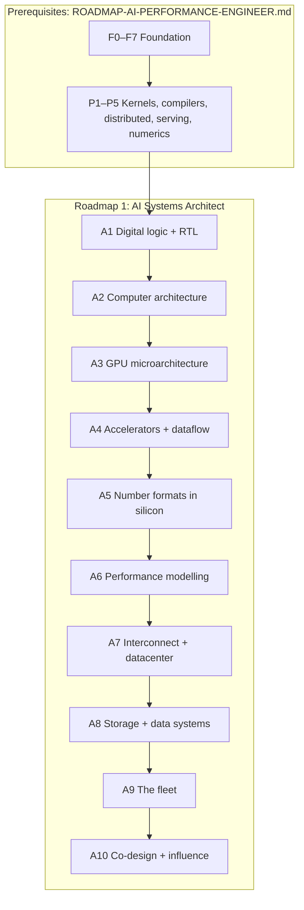

# Roadmap #1 — AI Systems Architect (Hardware/Software Co-Design)

**From logic gates to a hardware proposal that a chip team would fund. This is the role that changes
the hardware to fit the model, and this document is the path to it.**

This is the more senior of the two role roadmaps. It trains the role that **changes the hardware to
fit the model**. That role decides what the next accelerator, node and cluster should be, using
evidence about the workloads that will exist when the silicon ships. The sibling roadmap,
[`ROADMAP-AI-PERFORMANCE-ENGINEER.md`](ROADMAP-AI-PERFORMANCE-ENGINEER.md), trains the role that
**changes the software to fit the hardware**. Its F0–F7 and P1–P5 stages are this roadmap's
prerequisites. An architect who cannot measure and optimise today's workload has no evidence for
tomorrow's hardware.

Every stage covers both ends of the product line: the datacenter part in its main body, and the
edge part (the NPU and integrated GPU of a laptop or phone) in an **Edge side** block (§3E).

Related documents in this repo:

- [`../AI-ML-DL-COMPLETE-ROADMAP.md`](../AI-ML-DL-COMPLETE-ROADMAP.md) is the programme. §10.14 lists
  the career tracks, and §10.17 is the model-to-hardware track.
- [`AMD-GPU-PATH.md`](AMD-GPU-PATH.md) shows what today's AMD GPU does with a kernel. It is the
  baseline for A3.
- [`AMD-AI-STACK.md`](AMD-AI-STACK.md) covers the CDNA, RDNA and XDNA hardware, and the software that
  must be able to exploit any change you propose.
- [`QUALCOMM-AI-STACK.md`](QUALCOMM-AI-STACK.md) describes a contrasting NPU design (Hexagon) and a
  different strategy.

> **How to read this.** The rules are the same as in roadmap #2:
>
> - Stages are **gated, not scheduled**. Each one ends with a **Done when** test.
> - Every stage has the parts that roadmap #2 §3 describes, in the same order: Why, Learn, Study
>   path, Build, Check yourself, Done when, Traps and References. Each Check yourself answer is in
>   the stage's Learn list or references, and the numeric ones follow from formulas given there.
> - A1–A9 also have an **Edge side** block before their References: the same domain for an edge
>   part, with its own build and **Done when** (§3E).
> - The depth tags **[BUILD]**, **[KNOW]** and **[AWARE]** follow
>   [`../AI-ML-DL-COMPLETE-ROADMAP.md`](../AI-ML-DL-COMPLETE-ROADMAP.md) §0.2.
> - No durations are given.
>
> §3 lists the prerequisites as exit tests only. Their full content lives in roadmap #2, so the two
> documents cannot drift apart. §3B sets up your lab, and §3C shows how every stage's work builds
> one project that ends in the A10 proposal. §3E maps every domain across the datacenter and the
> edge.

---

## Contents

| § | Section | What you learn |
| --- | --- | --- |
| 1 | The role: what "done" looks like | Real postings, and what they ask for |
| 2 | The whole path in one picture | Prerequisites, A1–A10, and what each stage consumes |
| 3 | Prerequisites: prove them, don't re-read them | The F0–F7 and P1–P5 exit tests |
| 3B | **Start here: method and your lab** | How to study, and the tools, machines and data each stage needs |
| 3C | **The whole story: from measurements to a proposal** | How every stage's work builds one repository that ends in A10 |
| 3D | **The complete hardware syllabus: every subject, basic to expert** | 20 subjects from logic and RTL to memory systems, edge NPUs, interconnect, packaging, fleets and hardware security |
| 3E | **Datacenter and edge in every architecture domain** | For each domain, what the datacenter part and the edge part decide, what stays the same, and where each side is gated |
| 4 | **A1: Digital logic and RTL** | What a feature costs in gates, timing and power |
| 5 | **A2: Computer architecture** | Pipelines, caches, coherence, DRAM, on-chip networks |
| 6 | **A3: GPU microarchitecture** | Predicting today's GPU from counters, not marketing |
| 7 | **A4: Accelerators and dataflow** | Stationarity, reuse, mapping, energy |
| 8 | **A5: Number formats in silicon** | Area, energy and accuracy of every format |
| 9 | **A6: Performance modelling** | Validated models that rank hardware levers |
| 10 | **A7: Interconnect and the datacenter** | Fabrics, topologies, failures, power, TCO |
| 11 | **A8: Storage and data systems for AI** | Capacity tiers, checkpoint bursts, ingestion, the KV cache as storage |
| 12 | **A9: The fleet** | Scheduling, sharing, RAS and silent errors, roots of trust, power and carbon |
| 13 | **A10: Co-design and influence (capstone)** | A funded hardware decision |
| 14 | What each role owns, layer by layer | How roadmap #1 differs from roadmap #2 |
| 15 | Progress tracker | One checklist for the whole path |
| 16 | Verification status | What is sourced and what is not |
| — | Primary sources | Links fetched for this document |

---

## 1. The role: what "done" looks like

An **AI Systems Architect** decides what the hardware should be, covering:

- compute cores and the memory hierarchy;
- number formats;
- scale-up and scale-out networks;
- racks.

Every decision is backed by a validated model of how real workloads will run on that hardware. The
bet is placed years ahead. *How to Scale Your Model* describes the co-design problem as betting on
what algorithms will look like when the chips become available, "often 2 to 3 years down the road".

### Postings this roadmap targets

Fetched on 2026-09-23. The base ranges are shown as posted and will drift.

| Posting | Base range (as posted) | What it asks for |
| --- | --- | --- |
| OpenAI: HW/SW CoDesign Engineer | $381K–$485K | See the breakdown below |
| OpenAI: Performance Modeling Lead | $347K–$445K | Performance modelling "from silicon through full-scale deployments" |
| OpenAI: 3P Systems Architect | $342K–$555K | Title and range recorded here; read the posting for the full list |
| NVIDIA: Deep Learning Performance Architect | Not recorded | Seen in a search excerpt only |
| AMD: AI Systems Architect – GPU Software/Hardware Co-Design | Not recorded | Seen in a search excerpt only |

The HW/SW CoDesign Engineer posting asks for the following.

**Responsibilities:**

- Co-design future vendor hardware.
- Deliver kernels and compiler support.
- Drive decisions about compute cores and the memory hierarchy.
- Model scale-up, scale-out and front-end networking.
- Cover datacenter networks, racks and buildings.

**Qualifications:**

- 4+ years of experience.
- CUDA or Triton.
- Low-precision accuracy.
- System performance modelling for deployment.
- C, C++ and Python.
- Chip microarchitecture.
- LLM training and inference.
- A PhD in architecture or compilers is preferred.

**Three scales, one currency.** Read together, the postings describe a role that works at three
scales (this synthesis is mine, not the postings' wording):

- the **chip**: compute cores, memory hierarchy and number formats;
- the **system**: scale-up and scale-out fabrics;
- the **facility**: racks, power and buildings, plus the storage and the shared, failing fleet that
  run inside them (A8, A9).

The role's currency is a **validated model** that predicts how a workload will run on hardware that
does not exist yet. Roadmap #2 optimises within fixed hardware, while this role changes the
hardware. Without roadmap #2's skills, an architect produces proposals that nobody can validate.
That is why roadmap #2 comes first.

---

## 2. The whole path in one picture



The table shows what each A-stage consumes from the prerequisites. Each A-stage is validated against
something you built in roadmap #2, so the prerequisites are load-bearing.

| A-stage | Consumes | Why |
| --- | --- | --- |
| A1 | F0 | Gates, adders and binary arithmetic |
| A2 | F0, F2, F6 | Cache behaviour, validated against hardware counters |
| A3 | F5, P1 | The model must predict your own GEMM ladder |
| A4 | F4, P1 | LLM operator shapes, written as loop nests |
| A5 | F1, P5 | Numerics, and measured accuracy per format |
| A6 | F4, F6, P3, P4 | Calibration and validation data |
| A7 | F7, P3 | Queueing and failure fundamentals; collectives on real topologies |
| A8 | F7, P3, P4 | Your fio study, checkpoint behaviour and KV-cache pressure |
| A9 | F7, P3, P4 | Failure handling, scheduling behaviour and serving load |
| A10 | Everything | The evidence behind the proposal |

Each A-stage's **Edge side** also consumes the edge sides of roadmap #2's P1, P4 and P5 (§3E).

---

## 3. Prerequisites: prove them, don't re-read them

Pass each exit test cold. If you fail one, do that stage in roadmap #2 (its § number is in the last
column), then return.

| Stage | Scope | Exit test | In roadmap #2 |
| --- | --- | --- | --- |
| F0 | Integers, IEEE-754, logic, CPU, OS | Trace `c = a + b` to the ALU; explain why summation order changes a float sum | [§4](ROADMAP-AI-PERFORMANCE-ENGINEER.md) |
| F1 | Linear algebra, calculus, statistics, numerics | Derive MLP backprop by hand; state a GEMM's FLOPs, bytes and intensity unaided | [§5](ROADMAP-AI-PERFORMANCE-ENGINEER.md) |
| F2 | C, C++, Python, data structures, sanitizers, concurrency | Build a C shell and allocator and a sanitizer-clean C++ library with bindings; explain acquire/release | [§6](ROADMAP-AI-PERFORMANCE-ENGINEER.md) |
| F3 | From autograd to transformers | Build a GPT from scratch; state every tensor shape from memory | [§7](ROADMAP-AI-PERFORMANCE-ENGINEER.md) |
| F4 | LLM accounting | Your calculator matches a real checkpoint's parameter count exactly | [§8](ROADMAP-AI-PERFORMANCE-ENGINEER.md) |
| F5 | SIMT, memory hierarchy, roofline | Predict the bound before profiling, then confirm it with counters | [§9](ROADMAP-AI-PERFORMANCE-ENGINEER.md) |
| F6 | Measurement | Your harness catches a planted regression and ignores an unchanged build | [§10](ROADMAP-AI-PERFORMANCE-ENGINEER.md) |
| F7 | Operating systems, networks, storage, distributed systems | Your xv6 labs pass; Little's law predicts your server's knee; your Raft passes the lab tests repeatedly | [§11](ROADMAP-AI-PERFORMANCE-ENGINEER.md) |
| P1 | GPU kernels | A counter explains every rung of your GEMM ladder; your FlashAttention forward is validated | [§12](ROADMAP-AI-PERFORMANCE-ENGINEER.md) |
| P2 | Frameworks and compilers | Your custom op passes `opcheck` with zero graph breaks | [§13](ROADMAP-AI-PERFORMANCE-ENGINEER.md) |
| P3 | Distributed training | You predict step time within a stated error | [§14](ROADMAP-AI-PERFORMANCE-ENGINEER.md) |
| P4 | Inference and serving | You predict maximum throughput at an SLO | [§15](ROADMAP-AI-PERFORMANCE-ENGINEER.md) |
| P5 | Quantisation and numerics | Every speed number has an accuracy number beside it | [§16](ROADMAP-AI-PERFORMANCE-ENGINEER.md) |

P6–P11 are not prerequisites, but they repay the time. P6–P9 are the fastest way into A8 and A9:
an architect who has run a data pipeline, a Kubernetes GPU deployment and an incident review sizes
storage and fleets from experience rather than from datasheets. P11's cross-stack debugging is the
fastest way to learn which hardware features actually matter, and it supplies evidence for A10.

The **Edge side** blocks of A1–A9 (§3E) also build on the edge sides of P1, P4 and P5 in
roadmap #2: the device kernels and interference study, the device runtime study and the NPU
formats. Pass those before you start them.

---

## 3B. Start here: method and your lab

### Where to start

- **If you have not done roadmap #2**, start at its §3B. This roadmap assumes its lab, its study
  method and its project repository.
- **Otherwise**, pass every exit test in §3 cold, then start at A1. Tick each stage in §15 when its
  **Done when** test passes.
- **To see the whole field at once**, read §3D for the hardware side and roadmap #2 §3D for the
  software, systems and ML side.
- **If you are starting from class 10**, begin with roadmap #2 §3E. Roadmap #2 §3G shows the whole
  career ladder, from AI systems engineer to systems architect, and where this roadmap sits on it.
  [`PLAN-15-MONTHS.md`](PLAN-15-MONTHS.md) is the calendar for both: roadmap #2 in days 1–450,
  then this roadmap, every stage and both sides, in days 451–660.

### How to study a stage

Use the method in roadmap #2 §3B: read **Why** and **Done when** first, work through the **Study
path**, build as you learn, answer **Check yourself** from memory, then run the exit test and write
a one-page stage report. Three habits matter even more here:

1. **Predict before you run.** Before every synthesis run, simulation or model evaluation, write
   down the number you expect and the error you would accept. A model that you never tried to
   falsify has not been validated.
2. **Keep an assumptions register.** From A6 onwards, tag every number as measured (with the commit
   and the machine), sourced (with the reference) or assumed (with the reason). The **Done when**
   tests of A7, A8 and A10 check this.
3. **Write for a hostile reviewer.** End each stage report with the result that would prove it
   wrong.

Make formula cards for this roadmap too: Amdahl's law; execution time = instructions × CPI × cycle
time; dynamic power ∝ C·V²·f; cost per good die and the Poisson yield model; Little's law for
latency hiding; systolic-array scaling (N² MACs against about 2N edge operands per cycle); bits per
element, including the block scale; the α–β model; Young's checkpoint interval; and TCO per token.

### Your lab, stage by stage

| Stages | Hardware | Software and data |
| --- | --- | --- |
| A1, and A5's multipliers | Any 64-bit computer running Linux (native, a VM or WSL2) | The OSS CAD Suite (Yosys, Verilator, GTKWave, Surfer and cocotb), Python and NumPy |
| A2 | A Linux machine on which `perf stat` reads real hardware counters | `perf`, gcc or clang, and Python; gem5 is optional |
| A3 | The AMD GPU on which you built your P1 GEMM ladder | ROCm, HIP, the ROCm profilers and Python, set up as in roadmap #2 §3B |
| A4 | Any computer that runs Docker (for Timeloop) or Python (for SCALE-Sim) | Timeloop and Accelergy, or SCALE-Sim |
| A5's emulation | A CPU is enough; a GPU is faster | PyTorch, and the weights of an open-weight LLM |
| A6–A7 | Any computer | Python and your P3 and P4 measurements; ASTRA-sim is optional |
| A8 | Any Linux machine | DuckDB, fio, and your P3 and P4 traces |
| A9 | Any computer with room for the trace (the Philly trace unpacks to 6.6 GB) | Python with DuckDB or pandas, Git LFS, and a public cluster trace |
| Edge sides of A1–A9 | The device from roadmap #2 P10 | Its runtime, a power reading, and your measurements from the edge sides of roadmap #2's P1, P4 and P5 |
| A10 | Whatever the proposal's evidence needs | Everything above |

A3's matrix benchmarks depend on the GPU. Instinct (CDNA) GPUs have MFMA instructions, and Radeon
(RDNA) GPUs have WMMA instead (AMD-AI-STACK §5B), so measure the family that your P1 ladder used.

### Setting up the tools

These steps follow each project's own instructions, read on 2026-09-24. Check the current pages,
listed under Primary sources, before you install.

1. **RTL tools (A1, A5).** Download the OSS CAD Suite archive for your platform from its releases
   page and extract it. Then put its `bin` directory on your `PATH`, or source the `environment`
   script inside it. It is one binary distribution of Yosys, Verilator, GTKWave, Surfer, Icarus
   Verilog and cocotb, with its own Python 3. On Windows, its README recommends WSL with the
   `linux-x64` package.
2. **Hardware counters (A2).** Run `perf stat` on a short loop, and check that it reports real
   counts for cycles, instructions and cache misses. Virtual machines often hide the counters; if
   yours does, run A2's validation on a bare-metal Linux machine.
3. **Dataflow tools (A4).** For Timeloop and Accelergy, use Docker, which the Timeloop site
   recommends for new users: follow "Using Docker" in its tutorial-exercises repository. SCALE-Sim
   v3 is written in Python. Clone it, install it with `pip3 install <path-to-scale-sim>`, and run
   `python3 -m scalesim.scale -c <config> -t <topology> -p <output-dir>`. The `-i gemm` switch lets
   the topology file describe each layer as an M, N, K GEMM, which suits LLM operators.
4. **Your GPU (A3).** Reuse the setup from roadmap #2 §3B. If you rent an Instinct GPU for the MFMA
   benchmarks, set a budget alert first (roadmap #2 P7).
5. **Cluster traces (A9).** The Philly trace is one archive in its repository, stored with Git LFS,
   so install Git LFS before you clone it; without it, you get a small pointer file instead of the
   data. The archive is 0.98 GB and unpacks to five files totalling 6.6 GB, and the repository
   includes a notebook that shows how to parse them. For the Alibaba traces, follow the README of
   the trace you choose in the `clusterdata` repository.
6. **Record the versions.** Tool versions and the cell library go into every stage report, just as
   the hardware and software versions do in roadmap #2.

---

## 3C. The whole story: from measurements to a proposal

This roadmap continues the repository that you built in roadmap #2 (its §3C). Its measurements are
the evidence. Every A-stage is calibrated or validated against something in it, and every A-stage
adds a directory. The story ends in one decision, the A10 proposal, and a reviewer can rebuild its
key figure from the repository.

### The repository, continued

```text
llm-from-zero/
├── ...             # F0–P11 from roadmap #2: the measurements that everything below rests on
├── assumptions.md  # the register: every number, tagged measured, sourced or assumed
├── a1-rtl/         # systolic array, testbench, Yosys scripts, scaling table
├── a2-arch/        # cache simulator and its perf validation; die-cost model
├── a3-gpu-model/   # microbenchmark suite; analytical model of your P1 ladder
├── a4-dataflow/    # Timeloop or SCALE-Sim models of three LLM operators
├── a5-formats/     # FP8 and MXFP4 emulator; multiplier RTL and its area table
├── a6-perf-model/  # calibrated model, held-out validation, sensitivity charts
├── a7-cluster/     # the 1,024-accelerator design
├── a8-storage/     # storage and data-path design; the Parquet and DuckDB workload dataset
├── a9-fleet/       # trace study and simulation; fleet-health plan
└── a10-proposal/   # the proposal, a one-page summary, and the script for its key figure
```

Each of `a1-rtl/` to `a9-fleet/` also holds an `edge/` subdirectory for the stage's edge side
(§3E).

### How the stages feed each other

§2 lists what each A-stage consumes from roadmap #2. This table shows what each stage adds, and
which later stages reuse it.

| Stage | Adds | Reused by |
| --- | --- | --- |
| A1 | RTL, synthesis scripts and a scaling table | A4 (the array, modelled as a dataflow), A5 (the same synthesis flow), A10 (area cost) |
| A2 | A validated cache simulator and a die-cost model | A3 and A6 (the memory-hierarchy method), A10 (die cost) |
| A3 | Measured GPU parameters and a model of your P1 ladder | A6 (per-level bandwidth and latency, and matrix throughput), A10 (the baseline) |
| A4 | Utilisation, DRAM traffic and energy per operator | A6 (per-operator efficiency), A10 (a dataflow alternative) |
| A5 | Accuracy per format and block size, and relative area | A10 (both sides of a format decision) |
| A6 | A validated end-to-end model and its sensitivities | A7 (step time), A10 (the modelled benefit) |
| A7 | A cluster design | A8 (its storage), A9 (its fleet plan) |
| A8 | A storage and data-path design, and a workload dataset | A10 (storage effects) |
| A9 | A trace study and a fleet-health plan | A10 (scheduling, reliability, power and carbon effects) |
| A10 | The proposal | Your portfolio |

### What you have at the end

- A hardware proposal with a stated falsifier, whose key figure rebuilds from the repository with
  one command.
- A performance model validated on held-out runs, with its error distribution.
- RTL and synthesis results that price a proposed feature against a baseline.
- Cluster, storage and fleet designs in which every number traces to a measurement, a source or a
  stated assumption.
- A datacenter decision and an edge decision in every domain, each with its evidence (§3E).

---

## 3D. The complete hardware syllabus: every subject, basic to expert

Roadmap #2 §3D maps every software, systems and ML subject. This section does the same for the
hardware side of the role, in the same format: where each subject is gated, four levels from Basic
to Expert, the tools, the projects and what to study from. The gating stage sets how deep you must
go. Expert material beyond that is for when you specialise, for example in RTL, verification,
memory systems or interconnect.

| Part | Subjects | Gated in |
| --- | --- | --- |
| I. Silicon | Digital logic and circuits; RTL design; verification; synthesis, timing and physical design; FPGAs and emulation | A1 |
| II. Architecture | Processors; memory systems and coherence; GPUs; accelerators and dataflow; edge SoCs and NPUs; computer arithmetic and number formats | A2–A5 |
| III. Systems | Performance modelling; interconnects; packaging, power and thermal; storage at scale; datacenters and fleets; hardware security | A2, A3, A6–A9 |
| IV. Co-design | The software a feature must pass through; workloads and trends; technical influence | P1, P2, A6, A10 |

### Part I: Silicon

#### Digital logic and circuits

**Gated in:** A1, building on F0.

- **Basic.** Boolean algebra, gates and truth tables; combinational circuits (multiplexers,
  decoders and adders); flip-flops, registers and the clock.
- **Intermediate.** Finite-state machines; timing (setup, hold, clock-to-Q and the critical path);
  CMOS transistors as switches; dynamic and static power.
- **Advanced.** Adder and multiplier architectures (carry-lookahead, Booth encoding and Wallace
  trees); SRAM cells; clock distribution; metastability and clock-domain crossing.
- **Expert.** Energy per operation at the circuit level; process variation; low-power and
  near-threshold design.
- **Tools.** Logisim-evolution or Digital for gate-level experiments, then the RTL tools below.
- **Projects.** Nand2Tetris (F0); A1's datapath blocks.
- **Study from.** Harris & Harris, *Digital Design and Computer Architecture*; Weste & Harris, *CMOS
  VLSI Design*; Rabaey, Chandrakasan & Nikolić, *Digital Integrated Circuits*.

#### RTL design

**Gated in:** A1.

- **Basic.** Verilog modules and ports, `assign` and `always` blocks, blocking vs non-blocking
  assignment, and simulating a counter.
- **Intermediate.** SystemVerilog types, interfaces and packages; synthesisable style; FSM coding;
  parameterised modules; latch inference and how to avoid it; resets.
- **Advanced.** Pipelined datapaths with valid/ready handshakes; FIFOs; synchronisers for
  clock-domain crossing; arbiters; memory macros.
- **Expert.** Micro-architecting a block for area, timing and power together; high-level synthesis
  and Chisel as alternatives to hand-written RTL; a systolic array or matrix engine (A1, A4).
- **Tools.** Verilator, Icarus Verilog, GTKWave or Surfer, and Verible for linting and formatting.
- **Projects.** A1's systolic array; a UART, or a small RISC-V core.
- **Study from.** Harris & Harris; Sutherland, Davidmann & Flake, *SystemVerilog for Design*;
  Cummings's conference papers on non-blocking assignments and clock-domain crossing.

#### Verification

**Gated in:** A1.

- **Basic.** Testbenches, directed tests, waveforms and self-checking tests.
- **Intermediate.** Constrained-random stimulus; scoreboards and reference models; functional and
  code coverage; cocotb tests written in Python.
- **Advanced.** UVM; SystemVerilog assertions; formal property checking; equivalence checking.
- **Expert.** A verification plan for a full IP block; formal proofs of protocol properties;
  emulation that runs full workloads on the design.
- **Tools.** cocotb, Verilator and SymbiYosys for formal checks; **[AWARE]** the commercial
  simulators (VCS, Xcelium and Questa).
- **Projects.** A1's verification of the systolic array against a reference model.
- **Study from.** Spear & Tumbush, *SystemVerilog for Verification*; Seligman, Schubert & Kumar,
  *Formal Verification*; the cocotb documentation.

#### Synthesis, timing and physical design

**Gated in:** A1.

- **Basic.** What synthesis does; standard cells; area and gate count.
- **Intermediate.** Static timing analysis (constraints, slack and the critical path); reading
  synthesis reports; how pipelining changes frequency and area.
- **Advanced.** Floorplanning, placement, clock-tree synthesis and routing; power analysis; design
  rule checks; process design kits (PDKs).
- **Expert.** Timing closure on a large block; power, performance and area trade-offs at a process
  node; design-technology co-optimisation.
- **Tools.** Yosys, OpenSTA, OpenROAD and OpenLane with an open PDK (SkyWater SKY130, or ASAP7);
  **[AWARE]** the commercial flows (Design Compiler, Genus, Innovus and PrimeTime).
- **Projects.** A1's synthesis at two sizes, carried on through place-and-route with OpenROAD.
- **Study from.** Kahng, Lienig, Markov & Hu, *VLSI Physical Design*; Bhasker & Chadha, *Static
  Timing Analysis for Nanometer Designs*; the OpenROAD documentation.

#### FPGAs and emulation

**Gated in:** no stage. It is the fastest way to run A1's designs at speed.

- **Basic.** LUTs, flip-flops and block RAM; the FPGA flow (synthesis, place and route, bitstream).
- **Intermediate.** DSP blocks; timing constraints; on-chip logic analysers.
- **Advanced.** High-bandwidth memory on FPGAs; partial reconfiguration; high-level synthesis.
- **Expert.** Emulating a full accelerator to run real workloads before tape-out.
- **Tools.** AMD Vivado and Vitis HLS; Yosys with nextpnr for open FPGA flows.
- **Projects.** A1's systolic array on an FPGA board, measured.
- **Study from.** The vendor user guides; the FPGA material in Harris & Harris.

### Part II: Architecture

#### Processor architecture

**Gated in:** A2.

- **Basic.** Instruction sets, with RISC-V as the teaching ISA; single-cycle and multi-cycle
  datapaths.
- **Intermediate.** Pipelining, hazards and forwarding; branch prediction; caches; the performance
  equation (instructions, CPI and clock rate).
- **Advanced.** Out-of-order execution (register renaming and the reorder buffer); superscalar
  issue; SIMD and vector ISAs; multithreading; prefetching.
- **Expert.** A core's microarchitecture designed against a workload; top-down analysis with
  performance counters; microarchitectural side channels such as Spectre.
- **Tools.** gem5, ChampSim, the Spike RISC-V simulator and `perf`.
- **Projects.** A2's cache simulator, validated against `perf`; optionally, a pipelined RISC-V core
  in RTL.
- **Study from.** Patterson & Hennessy, *Computer Organization and Design* (RISC-V edition);
  Hennessy & Patterson, *Computer Architecture: A Quantitative Approach* (6th ed.); Shen & Lipasti,
  *Modern Processor Design*; Onur Mutlu's lectures at ETH Zürich and CMU.

#### Memory systems and coherence

**Gated in:** A2, and at system scale in A8.

- **Basic.** The memory hierarchy; hits and misses; locality.
- **Intermediate.** Associativity, replacement and write policies; DRAM organisation (channels,
  ranks, banks and rows); bandwidth vs latency.
- **Advanced.** Cache coherence (MESI and directories); memory consistency models; HBM stacks and
  their interfaces; memory controllers and request scheduling; NUMA.
- **Expert.** A memory hierarchy designed for an accelerator; processing in memory; CXL-attached
  memory tiers; memory RAS (ECC, poison and page retirement).
- **Tools.** DRAMSim3 or Ramulator 2; CACTI for cache area and energy; gem5's memory models.
- **Projects.** A2's cache simulator; a DRAM bandwidth microbenchmark compared with the datasheet.
- **Study from.** Nagarajan, Sorin, Hill & Wood, *A Primer on Memory Consistency and Cache
  Coherence* (2nd ed.); Jacob, Ng & Wang, *Memory Systems: Cache, DRAM, Disk*.

#### GPU architecture

**Gated in:** A3.

- **Basic.** SIMT; compute units and wavefronts; registers, the LDS, L1, L2 and HBM.
- **Intermediate.** Occupancy and latency hiding; the command processor and dispatch; matrix cores.
- **Advanced.** Chiplets (XCDs and IODs); the cache hierarchy and Infinity Cache; register-file and
  LDS trade-offs; partitioning modes.
- **Expert.** Predicting a new GPU's performance from microbenchmarks; proposing a change to one
  (A10).
- **Tools.** Accel-Sim, microbenchmarks you write, `rocprofv3` and ROCm Compute Profiler.
- **Projects.** A3's model, built from microbenchmarks, that predicts your P1 GEMM ladder.
- **Study from.** AMD-GPU-PATH, and AMD-AI-STACK §5; AMD's CDNA white papers and ISA reference
  guides; Jia et al.'s microbenchmarking papers.

#### Accelerators and dataflow

**Gated in:** A4.

- **Basic.** Why specialised hardware wins (reuse, parallelism and less overhead); systolic arrays.
- **Intermediate.** Dataflows (weight-, output- and row-stationary); loop nests and tiling;
  arithmetic intensity at each level of the hierarchy.
- **Advanced.** Searching the mapping space; sparsity support; on-chip buffers and networks; energy
  per access.
- **Expert.** An accelerator designed for LLM prefill vs decode; hardware for attention and
  mixture-of-experts.
- **Tools.** Timeloop and Accelergy, SCALE-Sim, and **[AWARE]** MAESTRO.
- **Projects.** A4's dataflow comparison for prefill vs decode.
- **Study from.** Sze, Chen, Yang & Emer, *Efficient Processing of Deep Neural Networks*; MIT
  6.5930; Stanford CS217; the TPU papers.

#### Edge SoCs and NPUs

**Gated in:** A4 and A5, and the edge sides of A1–A9 (§3E), with roadmap #2 P10 as the software
half.

- **Basic.** What a system-on-chip holds: CPU cores, a GPU, an NPU, memory controllers and media
  engines on one die, and why a phone or a laptop cannot simply carry a datacenter GPU.
- **Intermediate.** Power and thermal budgets measured in watts rather than hundreds of watts;
  memory shared by every engine on the chip; why on-device LLM decode is bound by memory bandwidth
  (F4); the trade-offs between the NPU, the GPU and the CPU.
- **Advanced.** NPU microarchitecture: AMD XDNA's array of AI Engine compute tiles, memory tiles and
  shim tiles, with software-managed memory (AMD-AI-STACK §6), and Qualcomm Hexagon's HVX vector and
  HMX matrix units, fed from VTCM by DMA (QUALCOMM-AI-STACK §6). Operator coverage as an
  architecture decision; scheduling across engines (AMD-AI-STACK §13B; QUALCOMM-AI-STACK §6B).
- **Expert.** An NPU designed for on-device LLMs within a power budget; the memory system and
  formats that on-device decode needs; the compiler support that each NPU feature requires.
- **Tools.** The vendor NPU toolchains (roadmap #2 P10); ONNX Runtime; your A6 model, extended to a
  device.
- **Projects.** Read roadmap #2's P10 fallback report as architecture evidence: which missing
  operator or format cost the most? Then model what 2× memory bandwidth would do to on-device
  decode.
- **Study from.** AMD-AI-STACK §6, §13 and §13B; QUALCOMM-AI-STACK §6 and §6B; MIT 6.5940; Sze et
  al., *Efficient Processing of Deep Neural Networks*.

#### Computer arithmetic and number formats

**Gated in:** A5.

- **Basic.** Integer and fixed-point arithmetic; IEEE-754.
- **Intermediate.** Adders and multipliers in hardware; FP16, BF16 and TF32; rounding modes;
  accumulation.
- **Advanced.** FP8 variants; block-scaled (MX) formats; stochastic rounding; how a multiplier's
  area and energy grow with significand width.
- **Expert.** Choosing the formats of a future accelerator from accuracy, area and energy together
  (A5, A10).
- **Tools.** Your own format emulator (roadmap #2 P5); a synthesis flow to price a multiplier (A1).
- **Projects.** A5's recommendation of formats and block sizes.
- **Study from.** Muller et al., *Handbook of Floating-Point Arithmetic*; Ercegovac & Lang, *Digital
  Arithmetic*; the OCP MX specification.

### Part III: Systems

#### Performance modelling and simulation

**Gated in:** A6.

- **Basic.** The roofline model; Amdahl's law; Little's law.
- **Intermediate.** Analytical models of training and inference; the α–β communication model;
  calibration against measurements.
- **Advanced.** Trace-driven and cycle-level simulation; validation on held-out data; sensitivity
  analysis.
- **Expert.** Models that choose between hardware designs years before the silicon exists.
- **Tools.** Python, ASTRA-sim, gem5, Accel-Sim, Timeloop, and MLCommons Chakra traces.
- **Projects.** A6's validated end-to-end model.
- **Study from.** *How to Scale Your Model*; Harchol-Balter; the ASTRA-sim papers.

#### Interconnects and networks

**Gated in:** A7.

- **Basic.** Bandwidth, latency and topology; buses vs networks.
- **Intermediate.** PCIe; scale-up links (Infinity Fabric and NVLink); scale-out networks
  (InfiniBand and RoCE); on-chip network basics.
- **Advanced.** Topologies (fat-tree, torus and dragonfly); routing and congestion control;
  collective algorithms mapped to a topology; **[AWARE]** chiplet interconnects such as UCIe.
- **Expert.** A scale-up domain and a cluster network designed for a model (A7); collectives and
  hardware co-designed.
- **Tools.** ASTRA-sim, BookSim 2, gem5's Garnet network model and `rccl-tests`.
- **Projects.** A7's 1,024-accelerator cluster design.
- **Study from.** Dally & Towles, *Principles and Practices of Interconnection Networks*; Jerger,
  Krishna & Peh, *On-Chip Networks*; the Meta and Alibaba network papers cited in A7.

#### Packaging, power and thermal

**Gated in:** A2 (silicon economics), A3 (chiplets) and A7 (the facility).

- **Basic.** Dies, wafers and yield; dynamic and static power; heat must leave the chip.
- **Intermediate.** Cost per good die; chiplets vs monolithic dies; 2.5-D packaging on interposers;
  HBM integration; thermal design power.
- **Advanced.** 3-D stacking and hybrid bonding; power delivery; DVFS; liquid cooling; power
  capping.
- **Expert.** Package-level co-design of compute, memory and I/O; power and cooling budgets for a
  rack.
- **Tools.** McPAT and CACTI for power estimates; **[AWARE]** vendor thermal models.
- **Projects.** A2's silicon-cost arithmetic; A7's rack power and cooling plan.
- **Study from.** Hennessy & Patterson on cost and power; Barroso, Hölzle & Ranganathan, *The
  Datacenter as a Computer*.

#### Storage and memory at system scale

**Gated in:** A8.

- **Basic.** The capacity hierarchy from HBM to object storage.
- **Intermediate.** Checkpoint sizes and write bandwidth; input pipelines; NVMe and parallel file
  systems.
- **Advanced.** The KV cache as a storage tier; CXL memory pooling; embedding tables in
  recommendation models.
- **Expert.** The storage and memory tiers of a whole AI cluster.
- **Tools.** fio, DuckDB over traces, and your A6 model.
- **Projects.** A8's storage and data-path design.
- **Study from.** The Llama 3 infrastructure section; the Mooncake and DLRM papers.

#### Datacenters and fleets

**Gated in:** A7 and A9.

- **Basic.** Racks, power, cooling and networks; total cost of ownership.
- **Intermediate.** Failure rates and checkpoint intervals; cluster scheduling; utilisation.
- **Advanced.** Fleet traces; fragmentation; RAS and silent data corruption; power
  oversubscription; carbon accounting.
- **Expert.** A fleet's hardware roadmap: generations, SKUs and partitioning.
- **Tools.** Public cluster traces (Philly and Alibaba) and their simulators; a spreadsheet for TCO.
- **Projects.** A9's trace study and fleet-health plan.
- **Study from.** *The Datacenter as a Computer*; the Borg paper; "Silent Data Corruptions at
  Scale".

#### Hardware security

**Gated in:** A9.

- **Basic.** Why hardware must be trusted; secure boot.
- **Intermediate.** Roots of trust; measured boot and attestation; signed firmware.
- **Advanced.** Trusted execution environments and confidential VMs; isolation on shared GPUs; side
  channels and fault attacks.
- **Expert.** The security architecture of an accelerator: a root of trust such as Caliptra, secure
  firmware update and isolation between tenants.
- **Tools.** The Caliptra repository and its specifications.
- **Projects.** A threat model for an accelerator in a multi-tenant cloud.
- **Study from.** Bhunia & Tehranipoor, *Hardware Security*; the Caliptra specification; Anderson,
  *Security Engineering*.

### Part IV: Co-design

#### The software a feature must pass through

**Gated in:** the prerequisites P1 and P2, and A10.

- **Basic.** How a model becomes kernels: framework, compiler, library, runtime and driver.
- **Intermediate.** Which layer must change for a new instruction, format or memory feature.
- **Advanced.** The cost of exploiting a feature: compiler support, kernels, libraries and tests.
- **Expert.** Planning the software for hardware that does not exist yet.
- **Tools.** Everything in roadmap #2's P1 and P2.
- **Projects.** The software-cost section of A10's proposal.
- **Study from.** AMD-GPU-PATH; the GPU programming and compiler subjects in roadmap #2 §3D.

#### Workloads and trends

**Gated in:** A6 and A10.

- **Basic.** What the major model families compute: dense transformers, mixture-of-experts,
  diffusion and recommendation.
- **Intermediate.** Operator mixes and arithmetic intensity; training vs inference.
- **Advanced.** Long context, low precision, speculative decoding and RL-trained reasoning, and
  what each one needs from hardware.
- **Expert.** Forecasting the workloads of the next two to three years.
- **Tools.** Profilers, published MLPerf results, and your workload dataset (A8).
- **Projects.** A6's workload characterisation; the trend analysis in A10.
- **Study from.** "Insights into DeepSeek-V3"; *How to Scale Your Model*; MLPerf results.

#### Technical influence

**Gated in:** A10.

- **Basic.** Clear writing; presenting data honestly.
- **Intermediate.** Design documents and reviews; disagreeing with data.
- **Advanced.** Architecture proposals with alternatives, costs and a falsifier; executive
  summaries.
- **Expert.** Changing a product roadmap across organisations.
- **Tools.** A document, a spreadsheet and a figure that anyone can regenerate.
- **Projects.** A10's proposal.
- **Study from.** Hooker, "The Hardware Lottery"; the proposal structure in A10.

---

## 3E. Datacenter and edge in every architecture domain

Roadmap #2 §3H makes the performance engineer work both sides of every software domain. This
section is the architect's version. The principles are shared: data movement sets the energy, and
a validated model beats a datasheet. The binding limits are not. A datacenter part is judged on
cost per token at an SLO, and an edge part on power, heat, memory and operator coverage
(roadmap #2 §3F).

Every stage from A1 to A9 decides for a datacenter part in its main body and for an edge part in an
**Edge side** block, with its own build and **Done when**. A stage is finished only when both sides
pass, and A10's proposal must state what it does to the other side.

### Every domain, both sides

| Domain | Datacenter | Edge | The same on both sides | Stage |
| --- | --- | --- | --- | --- |
| Logic and RTL | Area, timing and power for a package that draws hundreds of watts | Energy per useful operation within a budget of watts; clock and power gating for logic that is often idle | PPA, verification and synthesis | A1 |
| Memory systems | HBM stacks, large caches and chiplets | LPDDR shared by the CPU, GPU and NPU: no copies, but interference | The three Cs, row-buffer locality, and bandwidth against capacity | A2 |
| GPUs | CDNA: MFMA, wave64 and HBM | RDNA: WMMA, wave32 typical and a graphics pipeline, sharing memory inside an APU | Latency hiding, occupancy and matrix engines | A3 |
| Accelerators | Systolic and dataflow arrays at datacenter scale | NPUs: XDNA's compute, memory and shim tiles; Hexagon's HVX, HMX and VTCM | Stationarity, reuse and software-managed memory | A4 |
| Number formats | FP8 and MX formats, with higher-precision accumulation | int8, int16, bf16 and block-FP16; weights of 4–8 bits with 16-bit activations | Accuracy against area and energy, counting the scale bits | A5 |
| Performance modelling | Step time and cost per token across a cluster | Latency, energy per token and sustained throughput on one SoC | Calibrate, validate on held-out runs, and rank the levers | A6 |
| Interconnect and facility | Scale-up fabrics, scale-out networks, racks and cooling | The SoC's on-chip paths to memory, the case's thermal envelope, and the battery | Bandwidth, latency and contention | A7 |
| Storage and capacity | Checkpoint bursts, parallel file systems, and the KV cache as a tier | Flash, the model download and load time, and the device's memory budget | Size for the peak, not the average | A8 |
| The fleet | Scheduling, RAS, silent data corruption and power | Millions of devices across chips and versions, updated in stages | What a feature does to the whole population, and carbon that is mostly manufacturing and infrastructure | A9 |
| Security | Roots of trust such as Caliptra, confidential VMs and tenant isolation | Secure boot, secure enclaves and TEEs; an attacker who holds the device | Roots of trust, attestation and least privilege | A9 |
| Co-design | A funded datacenter feature | A funded edge feature | Evidence, cost and a falsifier | A10 |

### The same IP, scaled both ways

- **Qualcomm** reuses its Hexagon NPU and Oryon CPU technology in its datacenter parts, and states
  its design thesis as optimising for memory bandwidth, capacity and data-movement energy rather
  than peak FLOPS. Cloud AI 100 Ultra carries 128 GB of LPDDR4X at 548 GB/s per card
  (QUALCOMM-AI-STACK §10): low-power memory, scaled up.
- **AMD** builds separate architectures for the two sides, CDNA for Instinct and RDNA and XDNA for
  clients, with separate software stacks (AMD-AI-STACK §4). The bandwidth gap is the headline. An
  MI355X's 8.0 TB/s of HBM against the roughly 256 GB/s of LPDDR5X that Strix Halo's CPU, iGPU and
  NPU share is a factor of about 31 (AMD-AI-STACK §5B, §13B; derived).
- **The question is the same on both sides**: how many bytes must move per operation, and what does
  moving them cost? Only the budget changes.

### Your lab for the edge side

Use the device from roadmap #2 P10 and your measurements from the edge sides of its P1, P4 and P5
(§3B).

---

## 4. A1: Digital logic and RTL

**Why.** Every hardware proposal ends up as area, power and timing. Before you ask for a feature,
you need to know what it costs in gates.

**Learn:**

- **[BUILD] Combinational logic.**
  - Boolean algebra.
  - Muxes, decoders and comparators.
  - Adders: ripple-carry, and **[KNOW]** carry-lookahead and prefix adders.
  - Multipliers: the array multiplier, and **[KNOW]** Booth encoding and Wallace/Dadda trees.
- **[BUILD] Sequential logic.** Latches vs flip-flops, registers, FSMs (Moore and Mealy), counters and
  FIFOs.
- **[KNOW] Timing.**
  - Clock period, setup and hold, and the critical path.
  - Pipelining to raise frequency, and what it costs in latency, area and power.
  - **[AWARE]** Retiming.
- **[BUILD] SystemVerilog for design.**
  - `always_ff` vs `always_comb`.
  - Non-blocking vs blocking assignment.
  - Avoiding inferred latches.
  - Parameterised modules.
  - The synthesizable subset.
- **[KNOW] Clock-domain crossing.** Metastability, two-flop synchronisers, and asynchronous FIFOs with
  Gray-coded pointers.
- **[BUILD] Verification.** Self-checking testbenches against a reference model written in Python or
  C++. **[KNOW]** SystemVerilog assertions, functional coverage, constrained-random stimulus, and
  cocotb for Python testbenches.
- **[KNOW] Implementation.**
  - Synthesis and technology mapping, place-and-route, and static timing analysis.
  - PPA (power, performance, area).
  - SRAM macros vs flip-flop arrays.
  - Dynamic vs leakage power, and clock gating.
- **[KNOW] FPGAs.** LUTs, DSP slices and block RAM, and how they are used to prototype accelerators.
- **[BUILD] Open tools.** Verilator for linting and fast simulation, Yosys for synthesis, and a
  waveform viewer (GTKWave or Surfer).

**Study path:**

1. **Foundation.** Harris & Harris, from combinational and sequential logic through hardware
   description languages and digital building blocks. Write each example in SystemVerilog and lint
   it with Verilator as you go. Mutlu's Digital Design lectures cover the same ground.
2. **Core.** Weste & Harris on timing, power and datapath circuits, especially adders and
   multipliers; Spear & Tumbush on self-checking testbenches; then the Yosys `synth` flow, run on
   your own modules.
3. **Advanced.** Clock-domain crossing and asynchronous FIFOs; SystemVerilog assertions and cocotb;
   then read the SCALE-Sim systolic-array RTL example line by line before you compare it with your
   own design.

**Build:**

- A parameterised N×N output-stationary systolic array of MAC processing elements, with INT8 operands
  and INT32 accumulators:
  1. Write a self-checking testbench against a NumPy GEMM, including non-square and tail shapes.
  2. Make it lint-clean under `verilator --lint-only`.
  3. Synthesise it with Yosys at two sizes, for example 4×4 and 8×8. Run `synth -top …`, then map to
     the example CMOS cell library in the Yosys sources, and compare the two cell counts.
  4. For each size, record the peak MACs per cycle, the operand elements needed per cycle at the
     array edges, and the fill and drain latency.
- Compare your design with the systolic-array RTL example in the SCALE-Sim repository.

**Check yourself:**

1. Why does an N-bit ripple-carry adder's delay grow linearly with N, and how do carry-lookahead
   and prefix adders shorten the critical path?
2. What are setup and hold time, and which of the two violations can a slower clock fix?
3. Why does sequential logic use non-blocking assignments, and what does an `always_comb` block
   that misses a branch infer?
4. Why does a two-flop synchroniser reduce metastability without eliminating it, and why do
   asynchronous FIFO pointers use Gray code?
5. In an N×N output-stationary array where each PE owns one output element, what fraction of the
   PEs hold a useful output for a GEMM with M = 1, before counting fill and drain?
6. Why is a generic cell count only a relative proxy for area, and what must be held fixed for an
   area comparison to be fair?

**Done when:**

- From your own RTL and synthesis numbers, you can show how three quantities scale with N:
  MACs/cycle (N²), edge operand bandwidth (about 2N elements per cycle) and cell count.
- For a decode-shaped GEMM with a small M, you can predict what fraction of a larger array sits idle,
  including fill and drain.

**Traps:**

- Yosys's `read_verilog` does not check syntax. Its README says to lint with Verilator first.
- Blocking assignments in sequential logic make simulation and synthesis disagree.
- Comparing area without a timing constraint. A design may "win" only because it runs at a lower
  clock.
- Treating generic cell counts as silicon area. They are only a relative proxy.

**Edge side:**

- **What changes.** An NPU in a laptop or phone has a power budget of watts, not hundreds of
  watts, and spends much of its life idle or lightly loaded. Energy per useful operation, and what
  idle logic costs, matter as much as peak throughput.
- **Learn.** Logic for a power budget:
  - **[KNOW] Clock gating and power gating.** Stopping the clock to idle logic saves dynamic power;
    cutting its supply saves leakage too, at the cost of lost state and a wake-up delay.
  - **[KNOW] Voltage and frequency.** Dynamic power ∝ C·V²·f (A2), so a wider array at a lower
    clock and voltage can do the same work for less energy.
  - **[KNOW] Switching activity.** Dynamic energy follows how often signals toggle, which depends
    on the data. Toggle counts from simulation are a relative proxy for it.
  - **[AWARE]** Always-on low-power islands, and several voltage domains on one SoC.
- **Build.** Dump a waveform from your testbench for a decode-shaped GEMM (M = 1) and a
  prefill-shaped one. Count toggles per useful MAC as a relative measure of activity, and estimate
  how much clock-gating the idle PEs at M = 1 would save.
- **Done when.** You can state the relative energy per useful MAC at M = 1, with and without clock
  gating, and name what a toggle count leaves out.
- **Traps.** Treating toggle counts as joules; forgetting that the gating logic has its own area and
  timing cost.

**References:**

- Harris & Harris, *Digital Design and Computer Architecture, RISC-V Edition*.
- Weste & Harris, *CMOS VLSI Design* (4th ed.).
- Mutlu, *Digital Design and Computer Architecture* lectures (ETH Zürich).
- Spear & Tumbush, *SystemVerilog for Verification* (3rd ed.).
- **In this repo:** roadmap #2 F0, for gates and binary arithmetic; §3B, for the tool setup.
- Verilator: <https://www.veripool.org/verilator/>
- Yosys: <https://github.com/YosysHQ/yosys>
- The OSS CAD Suite, a binary distribution of these tools:
  <https://github.com/YosysHQ/oss-cad-suite-build>
- SCALE-Sim, which includes a systolic-array RTL example: <https://github.com/scalesim-project/SCALE-Sim>

---

## 5. A2: Computer architecture

**Why.** GPUs and accelerators reuse the same principles as CPUs: pipelining, caching, coherence and
memory scheduling. They make different trade-offs, and the architect must reason about those
trade-offs quantitatively.

**Learn:**

- **[BUILD] Quantitative principles.** Execution time = instructions × CPI × cycle time, and Amdahl's
  law applied to hardware. **[KNOW]** Dynamic power ∝ C·V²·f, the end of Dennard scaling, and dark
  silicon.
- **[KNOW] ISA design.** RISC vs CISC, instruction encoding and predication. **[AWARE]** Vector ISAs
  such as RISC-V V.
- **[BUILD] Pipelining.** Structural, data and control hazards; forwarding and stalls; branch
  prediction (bimodal and gshare, and **[AWARE]** TAGE).
- **[KNOW] Out-of-order execution.** Register renaming, the reorder buffer, issue queues, load/store
  queues, memory disambiguation, and the limits of ILP.
- **[BUILD] Caches.**
  - Sets, ways and lines.
  - Replacement policies: LRU and pseudo-LRU.
  - Write-back vs write-through.
  - The three Cs: compulsory, capacity and conflict misses.
  - **[KNOW]** Inclusion policies, MSHRs and non-blocking caches, and stride and stream prefetchers.
- **[KNOW] Virtual-memory hardware.** TLBs, page walks and large pages, and why they matter on GPUs
  too.
- **[KNOW] Coherence and consistency.**
  - MSI, MESI and MOESI protocols.
  - Snooping vs directories.
  - False sharing.
  - Sequential consistency, TSO and relaxed models, and fences.
  - **[AWARE]** Scoped memory models on GPUs.
- **[KNOW] DRAM and HBM.**
  - Channels, ranks, banks and rows.
  - Row-buffer hits and misses, and refresh.
  - **[AWARE]** Timing parameters and controller scheduling policies; HBM stacks and pseudo-channels.
- **[KNOW] On-chip networks.** Crossbars, rings and meshes; bisection bandwidth; routing and flow
  control.
- **[KNOW] Multicore, chiplets and packaging.** Shared last-level caches, NUMA and die-to-die links.
  **[AWARE]** 2.5-D interposers and 3-D stacking.
- **[KNOW] Silicon economics.**
  - Cost per good die = wafer cost ÷ (dies per wafer × die yield). A larger die fits fewer times on
    a wafer and is more likely to contain a defect, so its cost grows faster than its area.
  - The simplest yield model is Poisson: die yield ≈ e^(−D·A) for defect density D and die area A.
    Hennessy & Patterson chapter 1 uses a refinement with a process-complexity factor, and a
    dies-per-wafer formula that counts the partial dies lost at the wafer's edge.
  - One lithography exposure field, about 26 mm × 33 mm, caps the size of a single die: the
    reticle limit.
  - Chiplets split a design into smaller dies with higher yield, and let each die use the process
    that suits it. They pay in die-to-die links, packaging and test. MI300X and MI350X build their
    compute dies (XCDs) on a newer process than their I/O dies, and MI350X stacks its XCDs on top
    of the I/O dies (AMD-AI-STACK §5).
- **[KNOW] Energy.** Compare the energy per operation with the energy per byte moved at each level.
  That comparison is what makes data movement the central design problem.

**Study path:**

1. **Foundation.** Harris & Harris on architecture, microarchitecture and memory systems; then
   Hennessy & Patterson chapter 1, for the quantitative principles and the cost of a die, and its
   appendices on pipelining and the memory hierarchy.
2. **Core.** Hennessy & Patterson chapters 2 and 3 (memory-hierarchy design and instruction-level
   parallelism); Mutlu's Computer Architecture lectures on caches, prefetching, DRAM and on-chip
   networks; Jacob, Ng & Wang for DRAM in depth.
3. **Advanced.** The Nagarajan et al. primer on consistency and coherence; Hennessy & Patterson
   chapters 5 and 7 (thread-level parallelism and domain-specific architectures); "A New Golden Age
   for Computer Architecture"; gem5 for your cross-check.

**Build:**

- A trace-driven cache simulator in Python or C++. Make the size, associativity, line size and
  replacement policy configurable, and support two or more levels.
  1. Drive it with the address streams of a CPU matmul at several tile sizes.
  2. Validate its miss counts against hardware counters from `perf stat` on the same loop.
  3. Optionally, cross-check one configuration against gem5.
- A die-cost model in Python. Compare one large die with four chiplets of a quarter of its area
  each, using the Poisson yield model, a stated wafer cost and a stated cost for packaging and
  die-to-die links. Sweep the defect density, and find where the chiplet design becomes cheaper.

**Check yourself:**

1. A program spends 80% of its time in code that you make 4× faster. What is the overall speed-up?
2. By dynamic power ∝ C·V²·f, roughly how much dynamic power do you save by lowering both the
   voltage and the frequency by 10%?
3. A 32 KB, 8-way set-associative cache has 64-byte lines. How many sets does it have, and how
   many address bits select the set and the byte within the line?
4. Name the three Cs, and a change to the cache that reduces each one.
5. What is false sharing, and why does padding fix it?
6. Why is a DRAM row-buffer hit cheaper than a miss, and what access pattern produces hits?
7. With a defect density of 0.1 per cm² and the Poisson yield model, what is the yield of an 8 cm²
   die, and of each 2 cm² chiplet?

**Done when:**

- Before each run, you predict the direction and rough size of the miss-rate change for a new tile
  size or cache geometry.
- The simulator agrees with the measured counters within an error that you state.
- Your die-cost model finds the crossover defect density, and you can explain how the packaging
  cost moves it.

**Traps:**

- Reporting a single "miss rate" when the cost depends on which level misses.
- Validating against hardware without accounting for prefetchers.

**Edge side:**

- **What changes.** In an SoC, the CPU, the integrated GPU and the NPU share one memory system:
  LPDDR rather than HBM, no PCIe copy between engines, and one pool of bandwidth that every engine
  draws on (AMD-AI-STACK §13B).
- **Learn.** The memory system of a device:
  - **[KNOW] Unified memory.** Handing a tensor or a KV cache from one engine to another is cheap,
    because nothing is copied. The shared bandwidth is also the ceiling for all of them.
  - **[KNOW] Interference.** In one community measurement on Strix Halo, a second model on the NPU
    added 3.3% to the latency of a main iGPU workload, and the same model on the iGPU added 69%.
    The explanation given is that on the NPU the small model uses a few percent of the memory bus,
    while on the iGPU it competes with the main workload for compute and bandwidth
    (AMD-AI-STACK §13B).
  - **[KNOW] Effective against theoretical bandwidth.** Strix Halo's LPDDR5X is roughly 256 GB/s in
    theory, and community measurements land nearer 158–170 GB/s (AMD-AI-STACK §13B).
  - **[AWARE]** Performance and efficiency CPU cores on one chip, and caches shared by all the
    engines.
- **Build.** On your laptop, measure the throughput of a bandwidth-bound loop alone, then while a
  second engine (the iGPU, or a second group of CPU cores) streams memory. Before each run, predict
  the slowdown from each side's share of the measured bandwidth.
- **Done when.** The measured slowdown matches your prediction within an error you stated, and you
  can say what an SoC architect could change to reduce it.
- **Traps.** Budgeting with theoretical bandwidth; measuring a laptop that is throttling, or on
  battery, without recording it.

**References:**

- Hennessy & Patterson, *Computer Architecture: A Quantitative Approach* (6th ed.).
- Nagarajan, Sorin, Hill & Wood, *A Primer on Memory Consistency and Cache Coherence* (2nd ed.).
- Shen & Lipasti, *Modern Processor Design*.
- Jacob, Ng & Wang, *Memory Systems: Cache, DRAM, Disk*.
- Mutlu, *Computer Architecture* lectures (ETH Zürich).
- Hennessy & Patterson, "A New Golden Age for Computer Architecture", *CACM*, 2019.
- gem5: <https://www.gem5.org/>
- **In this repo:** [`AMD-AI-STACK.md`](AMD-AI-STACK.md) §5, for the MI300X and MI350X chiplets.

---

## 6. A3: GPU microarchitecture

**Why.** Before you can propose the next GPU feature, you must be able to predict how today's kernels
use today's GPU. That prediction comes from counters, not from marketing.

**Learn:**

- **[KNOW]→[BUILD] The compute unit.** SIMD units and wavefront schedulers; instruction issue and
  arbitration; scalar vs vector units (SGPRs and VGPRs). **[KNOW]** Register-file organisation and
  banking.
- **[BUILD] Latency hiding.** How many waves, and how much ILP, it takes to cover a given memory
  latency (Little's law, F5). Volkov's result on occupancy vs ILP.
- **[KNOW] The memory system.**
  - LDS banking.
  - The L1 path and coalescing.
  - L2 slices and the fabric between them.
  - The package-wide Infinity Cache (AMD-AI-STACK §5).
  - Memory controllers, HBM stacks, and address interleaving across channels.
- **[BUILD] Matrix engines.**
  - MFMA shapes, data types and cycle counts. The CDNA 3 table in AMD-GPU-PATH §7 was extracted from
    the source of AMD's own Matrix Instruction Calculator.
  - The `v_smfmac_*` sparse instruction family.
  - How shape and data type set the FLOPs per cycle.
- **[KNOW] Chiplets.** MI300 and later parts are multi-die: several XCDs, each with its own L2, sit
  over shared IODs. Memory access cost is therefore not uniform across the package. Partitioning
  modes (per-XCD and per-IOD) exist to exploit this (AMD-GPU-PATH §6; AMD-AI-STACK §5).
- **[KNOW] The front end.** The command processor, AQL packets, hardware queues and dispatch
  (AMD-GPU-PATH §4).
- **[KNOW] Power management.** Clocks and power caps, and how sustained vs boost clocks change the
  FLOP/s you can actually achieve.
- **[KNOW] Simulation.** Accel-Sim is trace-driven, validated against NVIDIA hardware, and runs on
  GPGPU-Sim. **[AWARE]** Its AccelWattch power model. For AMD targets, the practical tool is an
  analytical model calibrated with counters.
- **[KNOW] Competitive literacy.** Know NVIDIA Hopper and Blackwell features alongside AMD CDNA and
  Google TPU (A4), including:
  - the Tensor Memory Accelerator;
  - asynchronous warp-group MMA;
  - thread-block clusters with distributed shared memory.

**Study path:**

1. **Foundation.** AMD-GPU-PATH §4–§7, for today's AMD GPU from dispatch to MFMA; Aamodt, Fung &
   Rogers, for the general model of a GPU core and its memory system; *How to Scale Your Model*
   chapter 12.
2. **Core.** AMD's CDNA 3 whitepaper and ISA guide; Jia et al.'s Volta paper, as the method that
   your microbenchmark suite copies; Volkov's thesis on latency hiding (roadmap #2 P1).
3. **Advanced.** NVIDIA's Hopper and Blackwell whitepapers; the Accel-Sim paper; GPU MODE lecture
   37.

**Build:**

1. A microbenchmark suite for your AMD GPU that measures:
   - pointer-chase latency per memory level;
   - bandwidth per level;
   - the LDS bank-conflict penalty vs stride;
   - MFMA throughput per instruction and data type;
   - kernel-launch overhead.
2. An analytical model in Python that uses those measured parameters to predict every rung of your
   P1 GEMM ladder and your P1 softmax.

**Check yourself:**

1. A memory level has a latency of 500 cycles. How many independent requests must be in flight to
   sustain one request per cycle, and how does ILP change the number of waves you need?
2. Why does a regular-stride latency benchmark under-report latency, and what do you use instead?
3. What sets an MFMA instruction's FLOPs per cycle, and why must you not reuse the CDNA 3 table for
   CDNA 4?
4. Why is memory access cost not uniform across an MI300X package, and what do the partitioning
   modes let you do about it?
5. Why do sustained clocks, rather than boost clocks, belong in your model?
6. What does the Tensor Memory Accelerator do for a Hopper kernel?

**Done when:**

- The model predicts each P1 rung within an error that you stated in advance.
- For each miss, you can name the mechanism that the model leaves out.

**Traps:**

- Latency benchmarks with a regular stride, which prefetchers hide. Use a randomised pointer chase.
- Using datasheet peaks instead of measured sustained numbers.
- Extrapolating the CDNA 3 instruction table to CDNA 4. AMD-GPU-PATH §15 explicitly warns against
  this.

**Edge side:**

- **What changes.** Client GPUs are built for graphics, with AI added. RDNA uses WMMA rather than
  MFMA, wave32 is typical, the graphics pipeline stays, and memory is GDDR6 on a card or LPDDR
  shared with the CPU in an APU (AMD-AI-STACK §5B).
- **Learn.** The client GPU, seen by an architect:
  - **[KNOW] CDNA against RDNA.** Two design goals and two matrix instruction families. Kernels
    tuned for one may run badly, or not at all, on the other (AMD-AI-STACK §5B).
  - **[KNOW] What RDNA 4 changed.** Double the FP16 and BF16 and four times the INT8 matrix
    throughput per CU of RDNA 3, FP8 and BF8, 4:2 structured sparsity, and a register layout that no
    longer needs lane shuffles between chained WMMA operations (AMD-AI-STACK §5B).
  - **[KNOW] Bandwidth is the gap.** A Radeon card's 640 GB/s against an MI355X's 8.0 TB/s is more
    than 12×, and for memory-bound decode that gap is the performance difference
    (AMD-AI-STACK §5B). An APU's iGPU also shares its memory with the CPU and the NPU (A2).
  - **[AWARE]** Qualcomm's Adreno GPU, and the matrix cores that Qualcomm has announced for
    AI-enhanced rendering (QUALCOMM-AI-STACK §6B).
- **Build.** Run the bandwidth, matrix-throughput and launch-overhead parts of your microbenchmark
  suite on an RDNA GPU that ROCm supports, discrete or integrated (roadmap #2 §3B), and recalibrate
  your model with the results.
- **Done when.** The recalibrated model predicts one of your portable, pre-MFMA GEMM rungs on the
  client GPU within an error you stated, and every parameter that differs from your CDNA numbers is
  explained by the design goal behind it.
- **Traps.** Running MFMA-tuned code on RDNA and blaming the hardware; reusing RDNA 3 WMMA
  intrinsics on RDNA 4, where the register layout changed (AMD-AI-STACK §5B).

**References:**

- Aamodt, Fung & Rogers, *General-Purpose Graphics Processor Architectures*.
- AMD's CDNA 3 architecture whitepaper and CDNA 3 ISA reference guide.
- NVIDIA's Hopper and Blackwell architecture whitepapers.
- Jia et al., "Dissecting the NVIDIA Volta GPU Architecture via Microbenchmarking" (2018):
  <https://arxiv.org/abs/1804.06826>
- Khairy et al., "Accel-Sim" (ISCA 2020): <https://accel-sim.github.io/>
- *How to Scale Your Model*, chapter 12, "How to Think About GPUs":
  <https://jax-ml.github.io/scaling-book/>
- **In this repo:** [`AMD-GPU-PATH.md`](AMD-GPU-PATH.md) §4–§7, §9 and §14–§15;
  [`AMD-AI-STACK.md`](AMD-AI-STACK.md) §5.
- GPU MODE lecture 37 (SASS and GPU microarchitecture): <https://github.com/gpu-mode/lectures>

---

## 7. A4: Accelerators and dataflow

**Why.** Dataflow decides which operand stays in place while the others move. It is the central
decision in every AI accelerator, and it sets energy far more than the MAC units do.

**Learn:**

- **[BUILD] Loop nests.** Write GEMM, convolution and attention as loop nests. Learn tiling, loop
  order, and temporal vs spatial reuse.
- **[BUILD] Dataflows.** Weight-stationary, output-stationary and input-stationary. **[KNOW]**
  Row-stationary (Eyeriss). Systolic arrays (TPU) vs spatial arrays connected by a network-on-chip.
- **[KNOW] Buffer hierarchies.** Register files, local buffers, a global buffer and DRAM, and the
  energy cost of an access at each level (Horowitz, ISSCC 2014).
- **[KNOW] Mapping and mapspace search.** Timeloop's mapper, MAESTRO's data-centric model, SCALE-Sim
  for systolic arrays, and Accelergy for energy.
- **[KNOW] Sparsity.**
  - Structured (N:M) vs unstructured sparsity.
  - Compressed formats.
  - When sparsity pays off in hardware.
  - RDNA 4's 4:2 structured sparsity (AMD-AI-STACK §5B).
- **[KNOW] Case studies.** TPU v1 and TPU v4; Eyeriss; AMD XDNA (AMD-AI-STACK §6); Qualcomm Hexagon
  (QUALCOMM-AI-STACK §6). **[AWARE]** Wafer-scale and dataflow start-ups.
- **[AWARE] Processing-in-memory and near-memory compute.**

**Study path:**

1. **Foundation.** Sze et al., on the kernel computation of DNN layers and on accelerator
   dataflows; the MIT 6.5930 lectures on loop nests and dataflow; Horowitz's energy table.
2. **Core.** The Eyeriss and TPU v1 papers; the Timeloop and Accelergy papers, then Timeloop's
   tutorial exercises; SCALE-Sim for a systolic baseline.
3. **Advanced.** Sze et al. on sparsity and reduced precision; MAESTRO; the TPU v4 paper; Stanford
   CS217; this repository's XDNA and Hexagon sections (AMD-AI-STACK §6; QUALCOMM-AI-STACK §6).

**Build:**

- Model three LLM operators in Timeloop + Accelergy, or in SCALE-Sim for a systolic design:
  - the QKV projection;
  - attention (QKᵀ and PV);
  - the MLP up and down projections.

  Model each at prefill and decode shapes, on two dataflows. Report utilisation, DRAM traffic and
  energy per operator.

**Check yourself:**

1. Write a GEMM as a loop nest, and mark which operand is reused across each loop.
2. In a weight-stationary array, what stays in each PE, and what moves through it?
3. For decode, y = Wx with W of size d × d at batch size 1, how many times is each weight element
   used, and what does that imply for every dataflow?
4. Why does a DRAM access cost far more energy than a MAC, and what does that make the design goal?
5. Why does hardware favour structured (N:M) sparsity over unstructured sparsity?
6. What must be true of a mapper's best mapping before you trust it?

**Done when:**

- Using your model's numbers, you can justify which dataflow and buffer sizes you would choose for
  prefill and for decode, and what each choice costs the other phase.

**Traps:**

- Optimising MAC utilisation while DRAM traffic dominates the energy.
- Accepting the mapper's best mapping without checking that a compiler could actually produce it.

**Edge side:**

- **What changes.** An NPU is a dataflow accelerator inside a laptop or phone SoC. Its on-chip
  memory is small and managed by software, so every large operator is tiled and streamed, and
  operator coverage becomes an architecture decision: whatever the NPU cannot run leaves it.
- **Learn.** Two edge dataflow designs:
  - **[KNOW] XDNA 2.** An array of 32 AI Engine compute tiles, 8 columns by 4 rows, each with 64 KB
    of L1; one 512 KB memory tile per column; and shim tiles to host memory, all managed by
    software. The compiler decides tile placement, DMA timing and fusion (AMD-AI-STACK §6), and
    that section warns that tile-level details are approximate.
  - **[KNOW] Hexagon.** HVX and HMX fed by DMA from about 8 MB of VTCM. A 4096 × 4096 FP16 weight is
    32 MB, so the compiler must tile it, and without overlap roughly half the performance is lost
    (QUALCOMM-AI-STACK §6).
  - **[KNOW] Coverage is architecture.** Every unsupported operator is a partition boundary and a
    round trip, and the partition count usually matters more than kernel quality
    (AMD-AI-STACK §17; QUALCOMM-AI-STACK §5).
- **Build.** Model an XDNA-like array, with the parameters above, in Timeloop or SCALE-Sim for the
  prefill and decode GEMMs of a small on-device LLM. Report utilisation and DRAM traffic beside your
  datacenter results.
- **Done when.** Using the model's numbers, you can say which buffer level limits on-device decode,
  and what doubling the memory tile would change.
- **Traps.** Modelling an NPU's memories as caches; ignoring the operators that would fall back to
  the CPU.

**References:**

- Sze, Chen, Yang & Emer, *Efficient Processing of Deep Neural Networks*.
- MIT 6.5930/1, *Hardware Architecture for Deep Learning*: <https://csg.csail.mit.edu/6.5930/info.html>
- Stanford CS217, *Hardware Accelerators for Machine Learning*: <https://cs217.stanford.edu/>
- Krishna et al., *Data Orchestration in Deep Learning Accelerators*.
- Jouppi et al., "In-Datacenter Performance Analysis of a Tensor Processing Unit" (ISCA 2017); Jouppi
  et al., "TPU v4" (ISCA 2023).
- Chen, Emer & Sze, "Eyeriss" (ISCA 2016).
- Parashar et al., "Timeloop" (ISPASS 2019), and Wu, Emer & Sze, "Accelergy" (ICCAD 2019):
  <https://timeloop.csail.mit.edu/>
- Kwon et al., "MAESTRO" (MICRO 2019).
- SCALE-Sim: <https://github.com/scalesim-project/SCALE-Sim>
- Horowitz, "Computing's Energy Problem (and what we can do about it)" (ISSCC 2014).
- **In this repo:** [`AMD-AI-STACK.md`](AMD-AI-STACK.md) §5B and §6;
  [`QUALCOMM-AI-STACK.md`](QUALCOMM-AI-STACK.md) §6.

---

## 8. A5: Number formats in silicon

**Why.** A format choice sets multiplier area, energy, memory footprint and bandwidth all at once. It
is also the lever most tightly coupled to model accuracy.

**Learn:**

- **[KNOW] Arithmetic hardware.**
  - An array multiplier's area grows roughly with the square of the significand width.
  - A floating-point multiply is a significand multiply, plus an exponent add, plus normalise and
    round.
  - A floating-point add needs alignment shifting and normalisation.

  At low precision the multiplier shrinks quickly, but the wider accumulator and the alignment logic
  do not, so they start to dominate.
- **[BUILD] The format zoo.**
  - Significand widths, including the implicit bit: FP32 24, TF32 11, FP16 11, BF16 8, FP8 E4M3 4,
    FP8 E5M2 3 and FP4 E2M1 2.
  - Exponent bits buy range; significand bits buy precision.
  - FP8 comes in OCP and FNUZ variants (AMD-AI-STACK §5).
  - MI350 moved TF32 from hardware to software emulation via BF16. This is an example of a format
    losing its silicon (AMD-AI-STACK §5).
- **[BUILD] Block scaling.**
  - A block of elements shares one scale, and the scale has its own format.
  - Block size is a trade-off between scale overhead and outlier isolation.
  - Scale granularity: per-tensor, per-channel or per-block.
  - CDNA 4 implements MXFP8, MXFP6 and MXFP4 in hardware through scaled-MFMA, with an E8M0 scale over
    32-element blocks (AMD-AI-STACK §5).
- **[BUILD] Accumulation.** Accumulator width vs K, error growth, and why hardware promotes partial
  sums to higher precision. DeepSeek-V3 reported limited FP8 accumulation precision as a real
  training constraint. Its ISCA '25 follow-up asks hardware vendors for more precise low-precision
  units.
- **[KNOW] Rounding.** Round-to-nearest-even; stochastic rounding, and why it helps low-precision
  training; saturation vs overflow to infinity in FP8.
- **[KNOW] Subnormals.** What it costs to support them, and flush-to-zero.
- **[KNOW] Conversion hardware.** Quantise and dequantise units, scale computation (amax), and where
  they sit in the pipeline.
- **[KNOW] Low-precision training stability.** What goes wrong at FP8 and FP4, and what fixes it.

**Study path:**

1. **Foundation.** Roadmap #2 P5 and AMD-AI-STACK §5, for the formats in use today; the OCP MX v1.0
   specification; Micikevicius et al. on FP8.
2. **Core.** Muller et al. on floating-point multipliers, adders and rounding in hardware; Rouhani
   et al. on microscaling; Higham on error growth in summation.
3. **Advanced.** The DeepSeek-V3 technical report on FP8 training, then its ISCA '25 follow-up; GPU
   MODE lectures 69 and 84.

**Build:**

1. Emulate FP8 GEMMs (both E4M3 and E5M2) and MXFP4 GEMMs in PyTorch:
   1. Quantise, dequantise and multiply in FP32.
   2. Compare the result with an FP32 reference.
   3. Plot the error against K, block size and scaling granularity.

   Use **real** LLM weight and activation tensors, not Gaussians.
2. Parameterised multipliers in SystemVerilog: INT8, INT4, and an FP8 significand multiplier with an
   exponent adder.
   1. Synthesise them with Yosys and compare relative cell counts.
   2. Add an FP32 accumulator and measure its share of the total.

**Check yourself:**

1. By the square-of-width rule, roughly how much smaller is an FP8 E4M3 significand multiplier than
   a BF16 one, and than an FP32 one?
2. Why does the accumulator start to dominate area at low precision?
3. How many bits per element does MXFP4 cost once its E8M0 scale over 32 elements is included?
4. What do E4M3 and E5M2 trade against each other, and which one is usually used for gradients?
5. Why does stochastic rounding help low-precision training?
6. Why do Gaussian test tensors give misleadingly good error figures?

**Done when:**

- For a named tensor class (weights, activations, KV cache or gradients), you recommend a format and
  block size, with accuracy from Build 1 and relative area from Build 2 side by side.

**Traps:**

- Gaussian test tensors hide the outliers that break real models.
- Leaving the scale factors out of the "bits per element" figure.
- Comparing multiplier area alone when the accumulator dominates.

**Edge side:**

- **What changes.** Edge engines are integer-first. XDNA supports int8, int16, bf16 and block-FP16
  (AMD-AI-STACK §6), HMX multiplies INT4, INT8, INT16 and FP16 (QUALCOMM-AI-STACK §6), and
  on-device LLMs keep weights at 4 to 8 bits with activations at 16 (QUALCOMM-AI-STACK §9). A
  format that the matrix unit lacks is a cliff, not a slope.
- **Learn.** Formats for an NPU:
  - **[KNOW] Weight-only against full quantisation.** 4-bit weights with 16-bit activations cut the
    bytes that bind decode, but need a wider multiplier than INT4 × INT4.
  - **[KNOW] Block size on a device.** Smaller blocks mean more scales, higher accuracy and lower
    throughput (QUALCOMM-AI-STACK §9). Count the scale bits in every bits-per-element figure.
  - **[KNOW] The cliff.** A matrix multiply whose types HMX does not support falls back to HVX,
    which community reports put at roughly 300× slower (QUALCOMM-AI-STACK §6).
- **Build.** Extend your emulator to 8-bit weights with 16-bit activations, and to 4-bit weights
  with block sizes of 32 and 128, on the real weights of a small on-device LLM. Then synthesise
  INT8 × INT16 and INT4 × INT16 multipliers beside your INT8 and INT4 ones.
- **Done when.** You recommend weight and activation formats for an NPU that serves a named
  on-device LLM, with accuracy, bits per element and relative multiplier area side by side.
- **Traps.** Recommending a format that the target's matrix unit lacks; quoting bits per weight
  without the scales.

**References:**

- Muller et al., *Handbook of Floating-Point Arithmetic* (2nd ed.).
- Higham, *Accuracy and Stability of Numerical Algorithms*.
- OCP MX v1.0:
  <https://www.opencompute.org/documents/ocp-microscaling-formats-mx-v1-0-spec-final-pdf>
- Rouhani et al., "Microscaling Data Formats for Deep Learning": <https://arxiv.org/abs/2310.10537>
- Micikevicius et al., "FP8 Formats for Deep Learning" (2022).
- DeepSeek-AI, *DeepSeek-V3 Technical Report*.
- "Insights into DeepSeek-V3: Scaling Challenges and Reflections on Hardware for AI Architectures"
  (ISCA '25): <https://arxiv.org/abs/2505.09343>
- GPU MODE lectures 69 (Quartet: 4-bit training) and 84 (Numerics and AI).
- **In this repo:** [`AMD-AI-STACK.md`](AMD-AI-STACK.md) §5 and §14; [`AMD-GPU-PATH.md`](AMD-GPU-PATH.md)
  §7; roadmap #2, P5.

---

## 9. A6: Performance modelling

**Why.** This is the architect's main instrument. A proposal is only as good as the model that
predicts its benefit, and the model is only as good as its validation.

**Learn:**

- **[KNOW] Model types.** Analytical models (roofline and hierarchical roofline), queueing models,
  trace-driven simulation and cycle-level simulation, and their trade-offs in accuracy, speed and
  effort.
- **[BUILD] Hierarchical roofline.** One roof per memory level plus roofs for the interconnects, with
  each operator placed at each level.
- **[BUILD] Communication models.** The α–β model. **[KNOW]** LogP and LogGP, and the cost of each
  collective algorithm on a given topology (ring, tree or hierarchical).
- **[KNOW] Queueing.** Little's law, and why latency rises sharply as utilisation approaches one.
  This is the tail-latency behaviour you measured in P4.
- **[BUILD] End-to-end LLM models.**
  - A training step is compute (per-operator FLOPs at the achieved efficiency), plus exposed
    communication (per parallelism dimension), plus pipeline bubbles.
  - Inference is prefill plus decode, with KV-cache growth, batch dynamics and SLOs.
- **[BUILD] Workload characterisation.**
  - The operator mix, the shapes, and the distribution of arithmetic intensity across dense, MoE and
    long-context models. Look beyond LLMs too: recommendation models dominated by embedding lookups
    (A8), and diffusion models.
  - The three operator classes from "Data Movement Is All You Need": tensor contractions,
    statistical normalisations and element-wise operators.
  - Extrapolating the trends two to three years out.
- **[KNOW] Simulators.** ASTRA-sim for distributed training (it takes MLCommons Chakra execution
  traces), Timeloop and Accelergy (A4), Accel-Sim (A3), and SCALE-Sim.
- **[BUILD] Validation.** Calibrate against measured runs, then validate on held-out configurations
  that you did not calibrate on. Report the error distribution, not a single number.
- **[BUILD] Sensitivity analysis.** The partial derivative of step time and of cost per token with
  respect to each hardware parameter; tornado charts; Pareto frontiers.

**Study path:**

1. **Foundation.** The Roofline paper; *How to Scale Your Model* chapter 1 (rooflines) and chapter
   4 (transformer maths), working its problems yourself.
2. **Core.** Chapters 5 and 7 of the same book, as models to copy for training and for inference;
   the LogP and LogGP papers; "Data Movement Is All You Need".
3. **Advanced.** The ASTRA-sim papers and Chakra traces; the rest of *How to Scale Your Model*; the
   OpenAI Performance Modeling Lead posting, read as a checklist of what your model must cover.

**Build:**

- A Python model that covers TP, PP, DP and EP, with these hardware parameters:
  - FLOP/s per format;
  - HBM capacity and bandwidth;
  - scale-up and scale-out bandwidth and latency.

  Calibrate it on your P3 and P4 measurements, and validate it on held-out configurations. Then
  compare three changes (2× HBM bandwidth, 2× matrix FLOP/s and 2× scale-up bandwidth) across three
  workloads: dense training, MoE training and long-context decode.

**Check yourself:**

1. A layer does 2 × 10¹² FLOPs and moves 10¹¹ bytes, on a device with 10¹⁵ FLOP/s and
   5 × 10¹² bytes/s. What is its roofline time, and which bound applies?
2. Under the α–β model, how long does a ring all-reduce of N bytes over p ranks take, and which
   term dominates for small messages?
3. Why must you validate on configurations that you did not calibrate on?
4. Why report an error distribution rather than one average error?
5. What does a tornado chart show, and how does it rank hardware levers?
6. How does a model that assumes perfect overlap of compute and communication fail, and how would a
   trace show it?

**Done when:**

- The model is validated within a stated error on held-out runs.
- You can present the hardware levers ranked for each workload, together with the sensitivities that
  justify the ranking.

**Traps:**

- Validating on the same runs you calibrated on.
- Assuming that compute and communication overlap perfectly.
- Forgetting that achievable efficiency depends on shape, especially for small-M decode GEMMs.

**Edge side:**

- **What changes.** A device model predicts latency, energy and sustained throughput for one user on
  one SoC, where the engines share memory and the clocks fall as the device warms up.
- **Learn.** Modelling a device:
  - **[BUILD] Terms per phase and per engine.** Prefill and decode on the NPU, the iGPU or the CPU,
    each with its own measured efficiency, over one shared bandwidth (A2).
  - **[KNOW] Thermal limits.** Model sustained clocks, not burst clocks. The NPU's most reliable win
    is often energy and temperature rather than latency (QUALCOMM-AI-STACK §6B).
  - **[KNOW] Energy per token.** Power × time ÷ tokens, measured on mains and on battery.
- **Build.** Extend your model to your device. Calibrate it on the measurements from roadmap #2's
  P4 edge side, validate it on a held-out prompt length, and rank three device levers (2× memory
  bandwidth, 2× NPU throughput and 2× on-chip memory) for prefill and for decode.
- **Done when.** The device model is validated within a stated error on held-out runs, and the
  levers are ranked per phase with the sensitivities behind the ranking.
- **Traps.** Calibrating on burst numbers and predicting sustained ones; adding the engines'
  bandwidths together as if they did not share one pool.

**References:**

- *How to Scale Your Model* (all chapters): <https://jax-ml.github.io/scaling-book/>
- Williams, Waterman & Patterson, "Roofline" (*CACM*, 2009).
- Culler et al., "LogP" (PPoPP 1993); Alexandrov et al., "LogGP" (SPAA 1995).
- Rashidi et al., "ASTRA-SIM" (ISPASS 2020), and Won et al., "ASTRA-sim2.0" (ISPASS 2023):
  <https://astra-sim.github.io/>
- Ivanov et al., "Data Movement Is All You Need": <https://arxiv.org/abs/2007.00072>
- OpenAI's Performance Modeling Lead posting (§1), read as a checklist.
- **In this repo:** roadmap #2 F4 (`llm_calc.py`), and P3 and P4 (your calibration data).

---

## 10. A7: Interconnect and the datacenter

**Why.** At frontier scale, the network, power and cooling are part of the computer. The co-design
posting in §1 explicitly extends to datacenter networks, racks and buildings.

**Learn:**

- **[KNOW] Scale-up fabrics.**
  - NVLink and NVSwitch.
  - AMD Infinity Fabric (link rates are in AMD-AI-STACK §5).
  - Load/store semantics, bandwidth per GPU and domain size.
  - **[AWARE]** UALink. AMD-AI-STACK §20 classifies AMD's UALink plans as reported, not shipped.
- **[KNOW] Scale-out networks.** InfiniBand and RoCE v2 (**[AWARE]** Ultra Ethernet); NICs, RDMA and
  GPU peer-to-peer transfers.
- **[KNOW] Topologies.** Fat-tree (Clos), rail-optimised, torus (TPU) and dragonfly; bisection
  bandwidth, oversubscription and diameter.
- **[KNOW] Congestion and load balancing.**
  - ECMP and flow collisions.
  - PFC and its failure modes: head-of-line blocking and deadlock.
  - **[AWARE]** DCQCN and packet spraying.
  - Multi-plane networks (DeepSeek-V3).
- **[BUILD] Mapping collectives to topology.** Hierarchical all-reduce; all-to-all on fat-trees vs
  tori; placing the TP, PP, DP and EP groups on the physical hierarchy.
- **[KNOW] Host and memory interconnect.** PCIe generations; storage and checkpoint bandwidth, which
  A8 sizes. **[AWARE]** CXL.
- **[KNOW] The facility.**
  - Rack power density, liquid cooling and power delivery.
  - Failure rates and MTBF.
  - The checkpoint interval. Young's approximation gives interval ≈ √(2 × checkpoint cost × MTBF).
- **[BUILD] Total cost of ownership.** Capital cost (accelerators, network, facility) plus operating
  cost (power, cooling, staff), with $/token and performance per watt as the decision metrics.

**Study path:**

1. **Foundation.** Dally & Towles on topologies, routing and flow control; Barroso, Hölzle &
   Ranganathan, *The Datacenter as a Computer*; kipply's note on bandwidth directions.
2. **Core.** The two RDMA papers (Guo et al.; Gangidi et al.); Alibaba HPN; the Llama 3
   infrastructure sections; the TPU v4 paper, for its optically reconfigurable network.
3. **Advanced.** The DeepSeek-V3 ISCA '25 paper on multi-plane networks and scale-up/scale-out
   convergence; the UALink and Ultra Ethernet specifications; Young's and Daly's checkpoint papers;
   ASTRA-sim for network what-if studies.

**Build:**

- A paper design of a 1,024-accelerator training cluster for a named model. It must cover:
  - the scale-up domain size;
  - the scale-out topology and oversubscription;
  - NICs per accelerator;
  - where each parallelism group is placed;
  - the predicted step time, from your A6 model;
  - the failure and checkpoint policy;
  - rack power and cooling;
  - TCO per training run.

**Check yourself:**

1. In a two-tier fat-tree, each leaf switch has 64 ports, and 48 of them face servers. What is the
   oversubscription ratio?
2. With a checkpoint cost of 60 s and a job MTBF of 3 hours, what interval does Young's
   approximation give?
3. Why do ECMP flow collisions hurt AI training traffic more than typical datacenter traffic?
4. Which failure modes does PFC introduce?
5. An accelerator's datasheet quotes 600 GB/s of link bandwidth. What must you ask before you use
   that number?
6. Which parallelism group belongs inside the scale-up domain, and why?
7. Write the TCO per token in terms of capital cost, lifetime, operating cost per hour and tokens
   per hour.

**Done when:**

- Every number traces to a source or to a stated assumption.
- The design survives one changed assumption (for example, MoE instead of dense), with the impact
  quantified.

**Traps:**

- Mixing unidirectional and bidirectional bandwidth figures. kipply's post shows that an A100's
  advertised "600 GB/s" is 300 GB/s in each direction.
- Ignoring failure rates. At scale, the time lost to interruptions is a first-order term.
- Assuming the network is non-blocking when it is actually oversubscribed.

**Edge side:**

- **What changes.** A device has no datacenter around it. Its fabric is the SoC's on-chip network
  and memory controllers, its facility is a case that must stay cool enough to hold, and its power
  comes from a battery. The cost question becomes energy per token on the device against energy
  and cost per token in the cloud.
- **Learn.** The device as a system:
  - **[KNOW] The on-chip path.** XDNA's shim tiles connect its array to host memory
    (AMD-AI-STACK §6). On Snapdragon, the CPU reaches the NPU by a remote procedure call into a
    separate DSP subsystem with its own firmware (QUALCOMM-AI-STACK §3B).
  - **[KNOW] The thermal envelope.** Sustained power, surface temperature and throttling set a
    device's real throughput (A6).
  - **[BUILD] Cloud against device.** Energy per token on the device, from roadmap #2's P4 edge
    side, against energy per token in the cloud, from your cluster's power and throughput; and the
    cloud capacity that a cascade needs (roadmap #2 P10).
- **Build.** Compare the energy and the cost per token of serving one workload three ways:
  cloud-only, device-only and cascaded. Use your measured device numbers and your cluster design,
  and state what each side's figure includes, such as cooling, the network, idle time and the
  device's purchase price.
- **Done when.** The comparison states every inclusion and exclusion, and names the assumption that
  would reverse its conclusion.
- **Traps.** Comparing a device's marginal energy with the cloud's fully loaded cost; leaving out
  the network and the cloud capacity that cascaded requests consume.

**References:**

- Dally & Towles, *Principles and Practices of Interconnection Networks*.
- Barroso, Hölzle & Ranganathan, *The Datacenter as a Computer* (3rd ed.).
- Guo et al., "RDMA over Commodity Ethernet at Scale" (SIGCOMM 2016).
- Gangidi et al., "RDMA over Ethernet for Distributed Training at Meta Scale" (SIGCOMM 2024).
- Qian et al., "Alibaba HPN: A Data Center Network for Large Language Model Training" (SIGCOMM 2024).
- Jouppi et al., "TPU v4" (ISCA 2023), for its optically reconfigurable interconnect.
- Llama Team, "The Llama 3 Herd of Models" (2024), for infrastructure and interruption data.
- "Insights into DeepSeek-V3" (ISCA '25), on the multi-plane network and on scale-up/scale-out
  convergence: <https://arxiv.org/abs/2505.09343>
- The UALink and Ultra Ethernet Consortium specifications.
- Young, "A first order approximation to the optimum checkpoint interval" (*CACM*, 1974); Daly (2006)
  gives the higher-order refinement.
- ASTRA-sim, for network what-if studies: <https://astra-sim.github.io/>
- OpenAI's 3P Systems Architect posting (§1).
- **In this repo:** [`AMD-AI-STACK.md`](AMD-AI-STACK.md) §5 (Infinity Fabric link rates) and §20
  (the status of UALink).

---

## 11. A8: Storage and data systems for AI

**Why.** Accelerators are only as fast as the data that reaches them. Checkpoints arrive as bursts
that can saturate a storage fabric, input pipelines need CPU cores and host memory that somebody
has to buy, and the KV cache is turning inference into a storage problem. An architect who sizes
only FLOP/s and HBM leaves all three to chance.

**Learn:**

- **[KNOW] The capacity hierarchy.** HBM, host DRAM, local NVMe, a parallel file system and an
  object store: the capacity, bandwidth, latency and cost per byte of each, and which state lives
  where. **[AWARE]** CXL-attached memory as a tier between DRAM and NVMe.
- **[BUILD] Checkpoint sizing.**
  - A resumable checkpoint holds the weights and the optimiser state: about 12–14 bytes per
    parameter for mixed-precision AdamW. For 70B parameters that is roughly 0.84–0.98 TB, and
    writing it in 60 seconds needs about 14–16 GB/s of sustained write bandwidth (derived).
  - Llama 3 shows the real shape. Meta's Tectonic file system gave the job 240 PB on 7,500
    SSD-equipped servers, with 2 TB/s sustained and 7 TB/s peak throughput. Checkpoint writes were
    "highly bursty" and saturated the storage fabric for short periods, and each GPU saved between
    1 MB and 4 GB of state.
  - Size for the burst, not the average. The write time feeds Young's checkpoint interval (A7), and
    asynchronous, multi-tier checkpointing moves the burst off the critical path (DCP's
    `async_save` stages to host memory first).
- **[BUILD] Ingestion as a hardware requirement.** Preprocessing runs on host CPUs, so the
  CPU-to-accelerator ratio and host memory are design parameters. Meta's study of recommendation
  training found that the data storage and ingestion (DSI) pipeline "is becoming the dominating
  factor that constrains the overall training performance and capacity", because preprocessing needs
  intense network, memory and compute resources. Text is the easy case: a million tokens per second
  at 4 bytes per token ID is 4 MB/s (derived). Images, video and recommendation features are not.
- **[KNOW] Data paths.** Direct storage-to-GPU transfers vs bounce buffers in host memory; the
  front-end network (storage and user traffic) vs the back-end network (collectives), and why they
  are built separately. Azure's ND MI300X v5 lists 80,000 Mbps of virtual-network bandwidth against
  3.2 Tb/s of InfiniBand for its GPUs, a ratio of 40× (derived).
- **[KNOW] The KV cache as a storage tier.** At long context and high concurrency, the KV cache
  outgrows HBM.
  - Mooncake, the platform that serves Kimi, separates the prefill and decode clusters and pools the
    KV cache across the cluster's under-used CPU, DRAM and SSD. Its KV-cache-centric scheduler
    rejects requests early when it predicts overload. It reports up to 525% more throughput in
    simulated scenarios, and 75% more requests handled under real workloads.
  - **[AWARE]** LMCache, part of the vLLM production stack (roadmap #2 P7).
  - The architectural question is how much capacity and bandwidth each tier needs for a target hit
    rate and latency.
- **[KNOW] Recommendation and retrieval.** DLRM uses model parallelism on its embedding tables to
  get around memory limits, and data parallelism to scale out its fully connected layers. Gupta et
  al. found that inference latency varied by 60% across three generations of Intel servers, and that
  batching and co-location can greatly improve latency-bounded throughput. Vector search is another
  capacity problem: the index type trades recall against memory footprint and speed (Faiss).
- **[KNOW] Fleet profiling as evidence.** Continuous, fleet-wide profiling (Google-Wide Profiling)
  and warehouse-scale characterisation (Kanev et al.) show where cycles actually go across a fleet,
  rather than in one benchmark. Execution traces in the MLCommons Chakra format feed the simulators
  in A6.

**Study path:**

1. **Foundation.** Roadmap #2 F7, for the storage stack and your fio study, and P6, for data
   engineering; Llama 3 §3.3, for storage and checkpointing at scale.
2. **Core.** The Meta data-ingestion paper and tf.data; PyTorch Distributed Checkpoint and its
   `async_save`; Mooncake.
3. **Advanced.** DLRM and Gupta et al., for recommendation; the Faiss paper, for vector search;
   Google-Wide Profiling and Kanev et al., for fleet profiling.

**Build:**

- A storage and data-path design for your A7 cluster, covering:
  - checkpoint size, frequency and burst bandwidth, and the tier each checkpoint lands on first;
  - input-pipeline CPU cores and host memory per accelerator, for a text model and for one vision or
    recommendation model;
  - KV-cache capacity per tier for a stated serving load and hit rate.

  Validate every rate against something you measured: the F7 fio study, a P3 checkpoint and a P4
  serving sweep.
- A workload-characterisation dataset. Convert your P3 and P4 profiler traces to Parquet, and use
  SQL (DuckDB) to rank operators by time, bytes moved and arithmetic intensity.

**Check yourself:**

1. How large is a resumable checkpoint of a 405B-parameter model trained with mixed-precision
   AdamW, and what write bandwidth does it need to finish in 120 seconds?
2. Why must storage be sized for the checkpoint burst rather than the average bandwidth?
3. Why are host CPU cores and host memory design parameters of an AI node?
4. Why are the front-end and back-end networks built separately?
5. When does the KV cache become a storage problem, and what does Mooncake do about it?
6. Why does DLRM use model parallelism for its embedding tables but data parallelism for its MLPs?

**Done when:**

- Every number traces to a measurement, a source or a stated assumption.
- A 2× change in one input (model size, checkpoint interval, context length or hit rate) is carried
  through the design, and its impact is quantified.
- The dataset reproduces the operator ranking that you saw in the profiler.

**Traps:**

- Sizing storage for the average bandwidth when checkpoints arrive as bursts.
- "Text is cheap to feed, so storage is cheap." Checkpoints and multimodal data are not.
- Treating host CPUs and memory as free. Starve them and the accelerators wait.

**Edge side:**

- **What changes.** A device's capacity hierarchy is short: flash storage, then LPDDR shared with
  the operating system and every other application, then small on-chip memories. The model is also
  a download, paid for in storage, in data and in load time.
- **Learn.** Capacity on a device:
  - **[BUILD] The memory budget.** Weights plus KV cache (roadmap #2 F4) plus the runtime and
    activations, within what the operating system leaves free. Context limits follow from it: AMD's
    Token Fusion builds cap input plus output at 16K tokens, and a hybrid model's
    `genai_config.json` sets its own limit (AMD-AI-STACK §13B).
  - **[KNOW] Load time.** A cold start reads the model from flash and may compile it. A precompiled
    artefact, such as a QNN context binary, removes the compilation (QUALCOMM-AI-STACK §4).
  - **[KNOW] Download size.** Every byte of the model is shipped to every device at every update.
- **Build.** On your device, measure cold start with the model read from flash and from the page
  cache, and first-inference time with and without a cached compiled artefact. Then predict the
  longest context that fits your device's memory budget for a named model, and confirm it.
- **Done when.** The predicted maximum context matches the measured one within a stated error, and
  cold start is broken down into reading, compiling and warming up.
- **Traps.** Budgeting the device's whole RAM for the model; timing a "cold" start with the file
  already in the page cache.

**References:**

- **In this repo:** roadmap #2 F7, P3 and P6, and P7 for the Azure instance.
- Llama Team, "The Llama 3 Herd of Models" (2024), §3.3: <https://arxiv.org/abs/2407.21783>
- Zhao et al., "Understanding Data Storage and Ingestion for Large-Scale Deep Recommendation Model
  Training" (ISCA 2022): <https://arxiv.org/abs/2108.09373>
- Murray et al., "tf.data: A Machine Learning Data Processing Framework" (VLDB 2021):
  <https://arxiv.org/abs/2101.12127>
- Qin et al., "Mooncake: A KVCache-centric Disaggregated Architecture for LLM Serving" (2024):
  <https://arxiv.org/abs/2407.00079>
- Naumov et al., "Deep Learning Recommendation Model for Personalization and Recommendation Systems"
  (2019): <https://arxiv.org/abs/1906.00091>
- Gupta et al., "The Architectural Implications of Facebook's DNN-based Personalized Recommendation"
  (HPCA 2020): <https://arxiv.org/abs/1906.03109>
- Douze et al., "The Faiss library" (2024): <https://arxiv.org/abs/2401.08281>
- PyTorch Distributed Checkpoint: <https://docs.pytorch.org/docs/2.14/distributed.checkpoint.html>
- Ren et al., "Google-Wide Profiling" (*IEEE Micro*, 2010); Kanev et al., "Profiling a
  Warehouse-Scale Computer" (ISCA 2015).

---

## 12. A9: The fleet

**Why.** Hardware is bought as a fleet, shared by many jobs, broken a little every day, attacked,
and paid for in power and carbon. A feature that looks good on one device, such as partitioning, a
larger die or a higher power limit, changes how the fleet is scheduled, how often it fails and what
it costs to run. This stage makes the fleet a design input.

**Learn:**

- **[KNOW] Cluster scheduling.** Borg-style cluster management and its descendant, Kubernetes; gang
  scheduling for jobs that need every GPU at once; fragmentation, where free GPUs exist but not in a
  usable shape; queueing delay as the hidden cost of large jobs.
- **[BUILD] Reading real traces.**
  - Microsoft's Philly traces: 117,325 jobs from a multi-tenant GPU cluster between August and
    December 2017, with job outcomes, retry attempts and per-minute GPU, CPU and memory utilisation.
  - Alibaba's cluster data. `gpu-v2020` covers over 6,500 GPUs on about 1,800 machines for two
    months (NSDI '22, "MLaaS in the Wild"). `gpu-v2023` studies GPU sharing and fragmentation
    (ATC '23), with a Kubernetes scheduler simulator. `gpu-v2025` covers disaggregated DLRM serving
    (NSDI '25), and `gpu-v2026` covers up to 155,410 GPUs on 37,707 servers over six months
    (OSDI '26).
- **[KNOW] Sharing and partitioning.** MI300X compute and memory partitioning modes (A3;
  AMD-AI-STACK §5); MIG, time-slicing and SR-IOV. Sharing is not isolation: Slurm documents that
  its GPU sharding does not fence processes from each other (roadmap #2 P7, P9).
- **[KNOW] Reliability, availability and serviceability (RAS).** ECC, poison and page retirement;
  health checks and burn-in; failure domains.
  - Silent data corruption. Meta reports that SDCs are "not captured by error reporting mechanisms
    within a CPU", found hundreds of affected CPUs across hundreds of thousands of machines, and
    concludes that the fix needs fault-tolerant software as well as hardware.
  - Llama 3's 54-day snapshot on 16K GPUs had 466 job interruptions: 47 planned and 419
    unexpected. About 78% of the unexpected ones were attributed to confirmed or suspected hardware
    issues, with GPU issues the largest category at 58.7%, and silent data corruption appears as
    its own category (6 interruptions). Effective training time still stayed above 90%.
- **[KNOW] Security architecture.** Roots of trust, measured boot and attestation. Caliptra is open
  "IP and firmware for an integrated Root of Trust block" for datacenter SoCs, including CPUs, GPUs,
  DPUs and TPUs. It provides identity, measured boot and attestation, began in the Open Compute
  Project, and is developed under CHIPS Alliance. **[AWARE]** Confidential VMs (AMD SEV-SNP, for
  example) and GPU trusted execution environments.
- **[KNOW] Power at fleet scale.** Power capping and oversubscription (Fan et al.). Llama 3 reports
  that power draw across the datacenter can swing by tens of megawatts at once, when every GPU waits
  on a checkpoint or a collective, stretching the limits of the power grid. It also reports a 1–2%
  diurnal throughput variation, caused by mid-day temperatures affecting GPU dynamic voltage and
  frequency scaling.
- **[KNOW] Carbon.** "Chasing Carbon" finds that most emissions from modern mobile and datacenter
  equipment come from hardware manufacturing and infrastructure. Patterson et al. estimate that the
  choice of model, datacenter and processor can reduce a training run's carbon footprint by up to
  about 100–1000×, that sparsely activated models can use under a tenth of the energy of dense ones
  without losing accuracy, and that the carbon-free share of energy varies about 5–10× by location.
- **[KNOW] Heterogeneous fleets.** Mixing accelerator generations and memory sizes; splitting
  prefill and decode across different hardware (Splitwise; roadmap #2 P4); and reading a cloud
  instance's ratios as a statement of its designer's assumptions (roadmap #2 P7).

**Study path:**

1. **Foundation.** The Borg paper and "Borg, Omega, and Kubernetes"; roadmap #2 P7, for GPU
   scheduling on Kubernetes; the Philly trace README and its ATC '19 paper.
2. **Core.** The Alibaba trace papers (NSDI '22 and ATC '23); Llama 3 §3.3, on interruptions;
   "Silent Data Corruptions at Scale" and "Cores that don't count".
3. **Advanced.** Caliptra; Fan et al. on power provisioning; "Chasing Carbon" and Patterson et al.;
   Splitwise.

**Build:**

- A trace study. Load a public trace (Philly, or Alibaba `gpu-v2020` or `gpu-v2023`), and reproduce
  one statistic from the paper that published it. Then go beyond it: simulate one change, such as a
  packing policy or GPU partitioning, and write a one-page recommendation with its expected effect
  on queueing delay and utilisation.
- A fleet-health plan for your A7 cluster: burn-in, periodic health checks, a strategy for screening
  silent data corruption, the expected interruption rate and the goodput it costs, and one hardware
  feature that would reduce that cost.

**Check yourself:**

1. Llama 3's 54-day snapshot had 419 unexpected interruptions. On average, how often did one
   occur?
2. What is fragmentation in a GPU cluster, and why can large jobs queue even when many GPUs are
   free?
3. Why is a trace's "utilisation" not the same as useful throughput?
4. How does silent data corruption differ from an error that ECC catches, and why does it need
   software defences as well as hardware ones?
5. What does a root of trust provide, and what does attestation let a tenant check?
6. Why can a fleet's power draw swing by tens of megawatts at once?
7. According to "Chasing Carbon", where do most of the emissions of modern computing equipment come
   from?

**Done when:**

- The trace study reproduces a published statistic, and its recommendation is backed by the
  simulation.
- The plan's goodput loss is derived from sourced failure rates, and the hardware feature is named
  with the size of the reduction it would bring.

**Traps:**

- Reading a trace's "utilisation" as useful throughput. A GPU that is allocated, or even busy, is
  not necessarily productive.
- Assuming that partitioning is free. Each partition gets a share of the device, and partitions
  that no job fits strand capacity.
- Ignoring silent data corruption because the rate per device is tiny. At fleet scale it is not.
- Treating tenants on a shared GPU as isolated.

**Edge side:**

- **What changes.** A device fleet is millions of machines that you do not own, spread across chips,
  drivers and application versions, which update in stages and report back only aggregates.
  Reliability there means crash rates, fallbacks and rollbacks rather than ECC and page retirement.
- **Learn.** The device fleet:
  - **[KNOW] The support matrix.** Which SoCs, runtimes and versions you support, and which engine
    runs the model on each. Devices without a usable NPU need a fallback or the cloud: AMD's OGA
    flow, for example, supports Strix and Krackan Point but not Phoenix or Hawk Point
    (AMD-AI-STACK §13B).
  - **[KNOW] Staged rollouts and halt criteria**, per device class and driven by fleet telemetry
    (roadmap #2 P8).
  - **[KNOW] Security across the fleet.** Device roots of trust, attestation and signed updates
    (roadmap #2 P9; §3D).
  - **[KNOW] Carbon.** "Chasing Carbon" finds that manufacturing and infrastructure dominate the
    emissions of mobile and datacenter equipment alike, so keeping a device useful for longer can
    save more carbon than saving energy per inference.
- **Build.** A fleet plan for roadmap #2's P10 application across a mixed device population: the
  support matrix, each class's engine and fallback, the rollout stages and their halt criteria, and
  the cloud capacity that the classes without an NPU will need.
- **Done when.** Every device class has an engine, a fallback and a halt criterion, and the cloud
  capacity is derived from measured fallback and cascade rates.
- **Traps.** Planning for the newest device only; assuming that every device updates at once.

**References:**

- **In this repo:** [`AMD-AI-STACK.md`](AMD-AI-STACK.md) §5 (partitioning modes); roadmap #2 P7–P9.
- Dixit et al., "Silent Data Corruptions at Scale" (2021): <https://arxiv.org/abs/2102.11245>
- Hochschild et al., "Cores that don't count" (HotOS 2021).
- The Philly traces: <https://github.com/msr-fiddle/philly-traces>, from Jeon et al., "Analysis of
  Large-Scale Multi-Tenant GPU Clusters for DNN Training Workloads" (USENIX ATC 2019).
- Alibaba cluster traces: <https://github.com/alibaba/clusterdata>
- Caliptra: <https://github.com/chipsalliance/Caliptra>
- Gupta et al., "Chasing Carbon: The Elusive Environmental Footprint of Computing" (HPCA 2021):
  <https://arxiv.org/abs/2011.02839>
- Patterson et al., "Carbon Emissions and Large Neural Network Training" (2021):
  <https://arxiv.org/abs/2104.10350>
- Llama Team, "The Llama 3 Herd of Models" (2024), §3.3: <https://arxiv.org/abs/2407.21783>
- Verma et al., "Large-scale cluster management at Google with Borg" (EuroSys 2015); Burns et al.,
  "Borg, Omega, and Kubernetes" (*ACM Queue*, 2016).
- Fan, Weber & Barroso, "Power Provisioning for a Warehouse-sized Computer" (ISCA 2007).
- Patel et al., "Splitwise" (ISCA 2024).

---

## 13. A10: Co-design and influence (capstone)

**Why.** The deliverable of this role is a decision: a hardware change that a chip or systems team
funds, backed by evidence that survives adversarial review.

**Learn:**

- **[BUILD] From trend to requirement.**
  - The trends: MoE, long context, low precision, attention variants such as MLA, speculative
    decoding and RL post-training.
  - The requirements they become: FLOP/s per format, bytes/s, capacity, scale-up domain size and
    latency.
- **[BUILD] The two-to-three-year bet.** Design for the workloads that will exist when the silicon
  ships, and hedge with programmability. *How to Scale Your Model* frames this problem directly. It
  cites the TPU's systolic bet on matrix multiplication as a success that would have been costly if
  neural networks had changed.
- **[KNOW] Case studies.**
  - **TPU:** a specialised systolic bet on matmul.
  - **FlashAttention:** an algorithm reshaped to fit the memory hierarchy.
  - **MoE:** all-to-all traffic turning into a network requirement.
  - **DeepSeek-V3:** MLA, FP8 training and a multi-plane network. Its ISCA '25 paper asks for more
    precise low-precision units, convergence of scale-up and scale-out, and low-latency fabrics.
  - **CDNA 4** (AMD-AI-STACK §5, "What actually changed in CDNA 4"). The changes were:
    - fewer CUs, but doubled per-CU matrix throughput for ≤16-bit types;
    - native MX formats;
    - LDS grown from 64 KB to 160 KB per CU;
    - fewer IODs, with better connections between them;
    - TF32 moved to software emulation.

    Treat each change as a bet, and name the workload evidence that would justify it.
- **[KNOW] The hardware lottery.** Research ideas win partly because they suit the hardware that
  already exists (Hooker).
- **[KNOW] Benchmark design.** Representative workloads, avoiding overfitting to the benchmark, and
  MLPerf's rules as a model of fairness and reproducibility.
- **[KNOW] Vendor evaluation.** Datasheet numbers vs sustained numbers; acceptance tests; the
  questions that matter (sustained vs peak, precision and software maturity).
- **[KNOW] Fleet impact.** A feature is judged by what it does to the fleet, not only to one device:
  scheduling and fragmentation, failure rates and serviceability, storage, power and carbon
  (A7–A9).
- **[BUILD] Communication.**
  - Write an architecture proposal: the problem, the evidence, the proposal, alternatives, cost,
    risks, and the result that would prove it wrong.
  - Write a one-page executive summary.
  - Disagree with data.

**Study path:**

1. **Foundation.** The introduction of *How to Scale Your Model* and its co-design footnote;
   Hooker, "The Hardware Lottery"; the TPU v1 paper, as a hardware bet that shipped.
2. **Core.** The DeepSeek-V3 ISCA '25 paper, read as a list of hardware requests with evidence;
   AMD-AI-STACK §5, "What actually changed in CDNA 4"; the FlashAttention papers (roadmap #2 P1).
3. **Advanced.** MLPerf's rules, as a model of fair benchmarking; the §1 postings, read as the
   reviewer's checklist; AMD-AI-STACK §18B, on strategy.

**Build (capstone):**

- A 10-page hardware proposal. Possible topics include native MXFP4 with higher-precision
  accumulation, a larger LDS, or a larger scale-up domain. It must contain:
  1. workload evidence from your own P-stage measurements;
  2. the proposed change;
  3. its benefit, modelled in A6, with sensitivity;
  4. its area and power cost, estimated with the methods from A1 and A5;
  5. its fleet-level effects on storage, scheduling, reliability, power and carbon (A8, A9);
  6. the software work it requires (compiler support from P2 and kernels from P1);
  7. the alternatives you considered;
  8. the risks, and the measurement that would prove the proposal wrong;
  9. its effect on the other side of the product line (§3E). A datacenter feature says whether the
     edge part should share it, and an edge feature says what it changes in the cloud, such as
     training, the build farm and the capacity behind a cascade.

**Check yourself:**

1. Pick one CDNA 4 change. Which workload trend justifies it, and what evidence would have argued
   against it?
2. What is the hardware lottery, and how should it change the way you read a benchmark result?
3. What makes a falsifier useful? Write one for a proposal to enlarge the LDS.
4. Why must a proposal budget the compiler and kernel work, and what happens to a feature when
   nobody does that work?
5. How does a datasheet number differ from an acceptance-test number?
6. Why design for workloads two to three years out, and how does programmability hedge the bet?

**Done when:**

- Every claimed benefit traces to a measurement or to a validated model.
- The cost side states its method.
- A reviewer can reproduce your key figure.
- The proposal states its effect on the other side of the product line.

**Traps:**

- Designing for today's benchmark instead of the workload two to three years out.
- A proposal with no falsifier.
- Counting the hardware cost but not the compiler, kernel and software cost of exploiting it.

**References:**

- "Insights into DeepSeek-V3: Scaling Challenges and Reflections on Hardware for AI Architectures"
  (ISCA '25 industry track): <https://arxiv.org/abs/2505.09343>
- Hooker, "The Hardware Lottery" (2020).
- The TPU papers (A4) and the FlashAttention papers (roadmap #2, P1).
- *How to Scale Your Model*, the introduction and its co-design footnote:
  <https://jax-ml.github.io/scaling-book/>
- **In this repo:** [`AMD-AI-STACK.md`](AMD-AI-STACK.md) §5, and §18B (AMD's strategy compared with
  Qualcomm's).
- OpenAI's HW/SW CoDesign posting (§1), and AMD's AI Systems Architect posting (search excerpt only).

---

## 14. What each role owns, layer by layer

| Layer | Roadmap #2 (Performance Engineer) optimises within it | Roadmap #1 (Systems Architect) decides it |
| --- | --- | --- |
| Model and algorithm | Picks fusions, attention variants and batching for a given model | Predicts which model trends the next hardware must serve |
| Framework and compiler | Fixes graph breaks, adds custom ops, tunes code generation | Specifies what the compiler must do to exploit a new feature, and budgets that work |
| Kernels | Writes them and tunes them against the roofline | Uses them as evidence, and as the adoption cost of a feature |
| ISA and microarchitecture | Reads it and works around its limits | Proposes changes to it |
| Numerics | Chooses formats and proves parity | Decides which formats get silicon, and at what accumulator width |
| Node and scale-up | Tunes collectives and placement | Sizes the scale-up domain and its bandwidth |
| Cluster network | Overlaps communication and handles stragglers | Chooses the topology, oversubscription and NICs per accelerator |
| Datacenter | Reports cost per token | Sets power, cooling and TCO targets |
| Edge devices | Works every domain on the device too: kernels, builds, runtimes, formats, updates and fleet gates (P10 and the edge sides of P1–P9) | Decides NPU features, formats, memory and power for on-device AI (the edge sides of A1–A9) |
| Data and storage | Builds the pipelines and keeps accelerators fed (P6) | Sizes storage tiers, ingestion hardware and KV-cache capacity (A8) |
| Cloud platform and fleet | Deploys, scales and operates the service (P7, P8) | Sets partitioning, scheduling support, RAS features and instance ratios (A9) |
| Security | Secures the supply chain, secrets and LLM interfaces (P9) | Specifies roots of trust, attestation and isolation (A9) |

---

## 15. Progress tracker

- [ ] **Prerequisites**: every exit test in §3 passed cold
- [ ] **Lab**: the OSS CAD Suite tools run, `perf stat` reads real counters, and your roadmap #2
  repository holds the P1, P3 and P4 measurements (§3B, §3C)
- [ ] **A1**: systolic array is lint-clean, verified and synthesised at two sizes; scaling explained
- [ ] **A1 edge**: relative energy per useful MAC at M = 1, with and without clock gating
- [ ] **A2**: cache simulator agrees with `perf` counters; each trend predicted first; die-cost
  crossover found
- [ ] **A2 edge**: interference between engines predicted, then measured
- [ ] **A3**: model built from microbenchmarks predicts your P1 ladder
- [ ] **A3 edge**: recalibrated model predicts a portable GEMM rung on a client GPU
- [ ] **A4**: dataflow choice for prefill vs decode justified with Timeloop or SCALE-Sim numbers
- [ ] **A4 edge**: the buffer level that limits on-device decode, found with an XDNA-like model
- [ ] **A5**: format and block-size recommendation, with accuracy and area side by side
- [ ] **A5 edge**: NPU formats recommended for an on-device LLM, with accuracy and area
- [ ] **A6**: model validated on held-out runs; hardware levers ranked per workload
- [ ] **A6 edge**: device model validated; device levers ranked per phase
- [ ] **A7**: 1,024-accelerator cluster design, with every number sourced
- [ ] **A7 edge**: cloud, device and cascade compared on energy and cost per token
- [ ] **A8**: storage and data-path design checked against your measurements; 2× change quantified
- [ ] **A8 edge**: maximum on-device context predicted and confirmed; cold start broken down
- [ ] **A9**: trace study reproduces a published statistic; fleet-health plan names a hardware fix
- [ ] **A9 edge**: device-fleet plan with an engine, a fallback and a halt criterion for every class
- [ ] **A10**: 10-page proposal with a falsifier and its effect on the other side; its key figure is
  reproducible

---

## 16. Verification status

This section follows the same approach as the other reference documents.

### Fetched and read for this document (2026-09-23)

- **The three OpenAI postings.** Titles and base ranges as displayed. For the HW/SW CoDesign posting,
  the responsibilities and qualifications summarised in §1. For the Performance Modeling Lead
  posting, the phrase "from silicon through full-scale deployments".
- ***How to Scale Your Model*.** The chapter list, and the co-design footnote in the introduction (the
  2–3-year horizon and the TPU's systolic bet).
- **The abstract of "Insights into DeepSeek-V3" (arXiv 2505.09343).** It covers MLA, MoE, FP8
  training and the multi-plane network. Its future directions include precise low-precision units,
  scale-up/scale-out convergence and low-latency fabrics.
- **Tool pages:**
  - Verilator: linting, compilation to C++/SystemC, and cocotb, GTKWave and Surfer as related tools.
  - Yosys: the `synth` flow, the example CMOS cell library, and the README's advice to lint with
    Verilator because `read_verilog` does not check syntax.
  - gem5.
  - Accel-Sim: trace-driven, validated against NVIDIA hardware, with the AccelWattch power model.
  - ASTRA-sim: Chakra traces, and its ISPASS 2020 and 2023 papers.
  - SCALE-Sim: version 3, and its systolic-array RTL example.
  - Timeloop.
- **Course pages:** MIT 6.5930 and Stanford CS217.
- **kipply's post:** the note that the A100's advertised NVLink figure adds both directions.
- **Storage, data and the fleet (A8, A9).**
  - Llama 3 §3.3: the Tectonic storage figures, the checkpoint burst behaviour, the interruption
    statistics, the power swings and the diurnal throughput variation.
  - The abstracts of "Silent Data Corruptions at Scale", Mooncake, DLRM, Gupta et al. on
    recommendation inference, "Chasing Carbon", Patterson et al., the Meta data-ingestion study,
    tf.data and Faiss.
  - The Philly and Alibaba trace READMEs, and the Caliptra README.
  - The Azure ND MI300X v5 bandwidth figures, and DCP's `async_save`.

### Fetched and read for this document (2026-09-24)

- **Lab setup (§3B).**
  - The OSS CAD Suite README: the tools it bundles (Yosys, Verilator, GTKWave, Surfer, Icarus
    Verilog and cocotb), its own Python 3, the `PATH` and `environment` setup, and its advice to use
    WSL with the `linux-x64` package on Windows.
  - The SCALE-Sim README: written in Python, installed with `pip3 install`, run with
    `python3 -m scalesim.scale`, and the `-i gemm` switch for M, N, K topologies.
  - The Timeloop installation page: Docker is the recommended method for new users, through the
    tutorial-exercises repository.
  - The Philly README and its `.gitattributes`: 0.98 GB compressed and 6.6 GB unpacked in five
    files, a parsing notebook, and the archive stored with Git LFS.
- ***How to Scale Your Model*.** The chapter numbers that the study paths use: chapter 1
  (rooflines), 4 (transformer maths), 5 (training), 7 (inference) and 12 (GPUs), and the worked
  problems throughout.

### From this repository

- The CDNA 3 and CDNA 4 facts carry the verification status of [`AMD-AI-STACK.md`](AMD-AI-STACK.md)
  §20 and [`AMD-GPU-PATH.md`](AMD-GPU-PATH.md) §15. They are:
  - the XCD/IOD organisation, per-XCD L2 and the Infinity Cache;
  - the CDNA 4 change list: CU count, per-CU matrix throughput, MX formats with E8M0 scales over
    32-element blocks, LDS size, IOD count and TF32 emulation;
  - OCP vs FNUZ FP8;
  - Infinity Fabric link rates;
  - RDNA 4's 4:2 sparsity;
  - UALink's forward-looking status.
- A2 and A3 use two more facts from AMD-AI-STACK: the process nodes of the MI300X and MI350X
  compute and I/O dies, with MI350X's compute dies stacked on its I/O dies (§5), and the split
  between MFMA on CDNA and WMMA on RDNA (§5B).
- Every "§N" cross-reference, including those into roadmap #2, was checked against the headings on
  2026-09-23, and again on 2026-09-24 after §3B–§3E, the study paths and the edge sides were
  added.
- §3E and the edge sides of A1–A9 rely on AMD-AI-STACK §4–§6, §13B and §17 and on
  QUALCOMM-AI-STACK §3B, §4, §5, §6, §6B, §9 and §10, and keep the verification status given
  there. They take from those sections XDNA's array and data types; RDNA's design goals, RDNA 4's
  matrix changes and the Radeon and MI355X bandwidths; Strix Halo's shared memory, bandwidth and
  interference figures; the OGA flow's supported processors and context limits; QNN's context
  binaries and its RPC path to the NPU; Hexagon's units, VTCM, overlap and the community-reported
  HMX cliff; the preprint on thermals; Genie's formats; and the Cloud AI 100 branch.

### From memory: standard, but not re-fetched here

- Book titles, authors and editions; paper titles, venues and years where no link is given; course
  names without links (the ETH Zürich lectures).
- Format bit layouts and significand widths. Check IEEE-754 and the OCP MX specification before you
  rely on them.
- Young's checkpoint-interval approximation, Horowitz's ISSCC 2014 energy table, and the M/M/1
  intuition.
- DeepSeek-V3's report of limited FP8 accumulation precision. The technical report itself was not
  re-read here.
- Borg (EuroSys 2015), "Borg, Omega, and Kubernetes" (2016), "Cores that don't count" (HotOS 2021),
  Fan et al. (ISCA 2007), Google-Wide Profiling (2010), Kanev et al. (ISCA 2015) and Splitwise
  (ISCA 2024).
- The venues of the Meta ingestion study (ISCA 2022) and of Gupta et al. on recommendation
  (HPCA 2020), the authors of the Philly paper, and first-author surnames on other linked papers.
- The chapter numbers and topics of Hennessy & Patterson (6th ed.) named in the study paths, and
  the topics of the other books and lectures named there.
- The silicon-economics relations in A2: cost per good die, the Poisson yield model and Hennessy &
  Patterson's refinement of it, and the exposure field of about 26 mm × 33 mm.
- That virtual machines often hide hardware counters from `perf`, and that a clone made without
  Git LFS holds a small pointer file instead of the data.
- The answers to Check yourself questions that come from the books rather than from this document,
  such as what the Tensor Memory Accelerator does and why E5M2 is usually used for gradients.
- The §3D syllabus: every tool, simulator, PDK, book and course it names without a link, and each
  one-line description. Check each project's current documentation before relying on it.
- The edge sides: clock gating, power gating, voltage domains and always-on islands; toggle counts
  as a proxy for switching activity; performance and efficiency CPU cores; surface temperature as
  a limit on devices; secure enclaves and TEEs on devices; and the power scales of watts on a
  device against hundreds of watts in a datacenter package.

### Derived here from first principles, not quoted from a source

- The systolic-array scaling arithmetic: N² MACs vs about 2N edge operands per cycle.
- The argument about how multiplier area scales with significand width.
- A8's checkpoint arithmetic: 12–14 bytes per parameter (FP32 master weights and two AdamW moments,
  plus BF16 weights if saved), so 0.84–0.98 TB for 70B parameters and 14–16 GB/s to write it in
  60 seconds.
- The 4 MB/s token-feed rate, and the 40× ratio between the ND MI300X v5's InfiniBand and
  virtual-network bandwidth.
- The numeric answers to the Check yourself questions, each from a formula or a sourced figure in
  its stage:
  - A1: 1/N of the PEs.
  - A2: a 2.5× speed-up; 0.9³ ≈ 0.73, so about 27% less dynamic power; 64 sets, with 6 set bits and
    6 offset bits; yields of e^(−0.8) ≈ 0.45 for the 8 cm² die and e^(−0.2) ≈ 0.82 per chiplet.
  - A3: 500 requests in flight, so 500/k waves if each keeps k requests in flight.
  - A4: each weight is used once per token at batch size 1.
  - A5: about 4× smaller than BF16 and 36× smaller than FP32; 4 + 8/32 = 4.25 bits per element.
  - A6: 20 ms, memory-bound (the compute takes 2 ms); about 2(p − 1)α + 2(p − 1)N/(pB).
  - A7: 3:1; √(2 × 60 × 10,800) ≈ 1,138 s, about 19 minutes; (capital cost ÷ lifetime in hours +
    operating cost per hour) ÷ tokens per hour.
  - A8: 12–14 bytes × 405 × 10⁹ ≈ 4.9–5.7 TB, which needs about 41–47 GB/s.
  - A9: 54 × 24 ÷ 419 ≈ one every 3.1 hours.
- The study-path order and the Check yourself questions are teaching judgement, not quoted from a
  source.
- The factor of about 31 between an MI355X's 8.0 TB/s and Strix Halo's roughly 256 GB/s.
- §3E's matrix and the builds and gates of the edge sides are this document's synthesis, and so is
  the carbon argument in A9's edge side, which extends the finding of "Chasing Carbon".

### Search excerpt only: not fetched

- The NVIDIA "Deep Learning Performance Architect" and AMD "AI Systems Architect – GPU
  Software/Hardware Co-Design" postings. The titles came from search results, and this document
  claims nothing about their responsibilities or pay.

---

## Primary sources

**Role postings:**

- OpenAI, HW/SW CoDesign Engineer —
  <https://jobs.ashbyhq.com/openai/bdbb2292-ecb3-42dc-ba89-65edf397d8f8>
- OpenAI, Performance Modeling Lead —
  <https://jobs.ashbyhq.com/openai/f2293c9f-d036-4198-a268-3dad738c8d19>
- OpenAI, 3P Systems Architect —
  <https://jobs.ashbyhq.com/openai/e2afdede-a222-4825-b2fc-fec439a7c893>
- NVIDIA, Deep Learning Performance Architect (search excerpt only; not fetched) —
  <https://jobs.nvidia.com/careers/job/893397115694>

**Courses and books with free online material:**

- MIT 6.5930/1, *Hardware Architecture for Deep Learning* — <https://csg.csail.mit.edu/6.5930/info.html>
- Stanford CS217, *Hardware Accelerators for Machine Learning* — <https://cs217.stanford.edu/>
- *How to Scale Your Model* — <https://jax-ml.github.io/scaling-book/>
- GPU MODE lectures — <https://github.com/gpu-mode/lectures>

**Tools and simulators:**

- Verilator — <https://www.veripool.org/verilator/>
- Yosys — <https://github.com/YosysHQ/yosys>
- OSS CAD Suite — <https://github.com/YosysHQ/oss-cad-suite-build>
- gem5 — <https://www.gem5.org/>
- Accel-Sim — <https://accel-sim.github.io/>
- ASTRA-sim — <https://astra-sim.github.io/>
- SCALE-Sim — <https://github.com/scalesim-project/SCALE-Sim>
- Timeloop and Accelergy — <https://timeloop.csail.mit.edu/>
- Timeloop and Accelergy installation — <https://timeloop.csail.mit.edu/installation>

**Specifications and papers:**

- "Insights into DeepSeek-V3: Scaling Challenges and Reflections on Hardware for AI Architectures" —
  <https://arxiv.org/abs/2505.09343>
- OCP Microscaling Formats (MX) v1.0 —
  <https://www.opencompute.org/documents/ocp-microscaling-formats-mx-v1-0-spec-final-pdf>
- Rouhani et al., "Microscaling Data Formats for Deep Learning" — <https://arxiv.org/abs/2310.10537>
- Jia et al., "Dissecting the NVIDIA Volta GPU Architecture via Microbenchmarking" —
  <https://arxiv.org/abs/1804.06826>
- Ivanov et al., "Data Movement Is All You Need" — <https://arxiv.org/abs/2007.00072>
- kipply, "Transformer Inference Arithmetic" (for the bandwidth-direction convention) —
  <https://kipp.ly/transformer-inference-arithmetic/>

**Storage, data and the fleet:**

- Llama Team, "The Llama 3 Herd of Models" — <https://arxiv.org/abs/2407.21783>
- "Understanding Data Storage and Ingestion for Large-Scale Deep Recommendation Model Training" —
  <https://arxiv.org/abs/2108.09373>
- "tf.data: A Machine Learning Data Processing Framework" — <https://arxiv.org/abs/2101.12127>
- "Mooncake" — <https://arxiv.org/abs/2407.00079>
- "Deep Learning Recommendation Model for Personalization and Recommendation Systems" —
  <https://arxiv.org/abs/1906.00091>
- "The Architectural Implications of Facebook's DNN-based Personalized Recommendation" —
  <https://arxiv.org/abs/1906.03109>
- "The Faiss library" — <https://arxiv.org/abs/2401.08281>
- PyTorch Distributed Checkpoint — <https://docs.pytorch.org/docs/2.14/distributed.checkpoint.html>
- "Silent Data Corruptions at Scale" — <https://arxiv.org/abs/2102.11245>
- Philly traces — <https://github.com/msr-fiddle/philly-traces>
- Alibaba cluster traces — <https://github.com/alibaba/clusterdata>
- Caliptra — <https://github.com/chipsalliance/Caliptra>
- "Chasing Carbon" — <https://arxiv.org/abs/2011.02839>
- "Carbon Emissions and Large Neural Network Training" — <https://arxiv.org/abs/2104.10350>
- Azure ND MI300X v5 series —
  <https://learn.microsoft.com/en-us/azure/virtual-machines/sizes/gpu-accelerated/ndmi300xv5-series>
