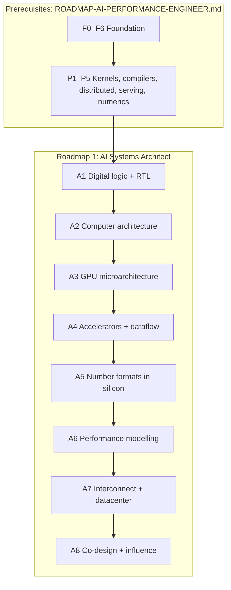

# Roadmap #1 — AI Systems Architect (Hardware/Software Co-Design)

**From logic gates to a hardware proposal that a chip team would fund. This is the role that changes
the hardware to fit the model, and this document is the path to it.**

This is the more senior of the two role roadmaps. It trains the role that **changes the hardware to
fit the model**. That role decides what the next accelerator, node and cluster should be, using
evidence about the workloads that will exist when the silicon ships. The sibling roadmap,
[`ROADMAP-AI-PERFORMANCE-ENGINEER.md`](ROADMAP-AI-PERFORMANCE-ENGINEER.md), trains the role that
**changes the software to fit the hardware**. Its F0–F6 and P1–P5 stages are this roadmap's
prerequisites. An architect who cannot measure and optimise today's workload has no evidence for
tomorrow's hardware.

Related documents in this repo:

- [`../AI-ML-DL-COMPLETE-ROADMAP.md`](../AI-ML-DL-COMPLETE-ROADMAP.md) is the programme. §10.14 lists
  the career tracks, and §10.17 is the model-to-hardware track.
- [`AMD-GPU-PATH.md`](AMD-GPU-PATH.md) shows what today's AMD GPU does with a kernel. It is the
  baseline for A3.
- [`AMD-AI-STACK.md`](AMD-AI-STACK.md) covers the CDNA, RDNA and XDNA hardware, and the software that
  must be able to exploit any change you propose.
- [`QUALCOMM-AI-STACK.md`](QUALCOMM-AI-STACK.md) describes a contrasting NPU design (Hexagon) and a
  different strategy.

> **How to read this.** The rules are the same as in roadmap #2:
>
> - Stages are **gated, not scheduled**. Each one ends with a **Done when** test.
> - The depth tags **[BUILD]**, **[KNOW]** and **[AWARE]** follow
>   [`../AI-ML-DL-COMPLETE-ROADMAP.md`](../AI-ML-DL-COMPLETE-ROADMAP.md) §0.2.
> - No durations are given.
>
> §3 lists the prerequisites as exit tests only. Their full content lives in roadmap #2, so the two
> documents cannot drift apart.

---

## Contents

| § | Section | What you learn |
| --- | --- | --- |
| 1 | The role: what "done" looks like | Real postings, and what they ask for |
| 2 | The whole path in one picture | Prerequisites, A1–A8, and what each stage consumes |
| 3 | Prerequisites: prove them, don't re-read them | The F0–F6 and P1–P5 exit tests |
| 4 | **A1: Digital logic and RTL** | What a feature costs in gates, timing and power |
| 5 | **A2: Computer architecture** | Pipelines, caches, coherence, DRAM, on-chip networks |
| 6 | **A3: GPU microarchitecture** | Predicting today's GPU from counters, not marketing |
| 7 | **A4: Accelerators and dataflow** | Stationarity, reuse, mapping, energy |
| 8 | **A5: Number formats in silicon** | Area, energy and accuracy of every format |
| 9 | **A6: Performance modelling** | Validated models that rank hardware levers |
| 10 | **A7: Interconnect and the datacenter** | Fabrics, topologies, failures, power, TCO |
| 11 | **A8: Co-design and influence (capstone)** | A funded hardware decision |
| 12 | What each role owns, layer by layer | How roadmap #1 differs from roadmap #2 |
| 13 | Progress tracker | One checklist for the whole path |
| 14 | Verification status | What is sourced and what is not |
| — | Primary sources | Links fetched for this document |

---

## 1. The role: what "done" looks like

An **AI Systems Architect** decides what the hardware should be, covering:

- compute cores and the memory hierarchy;
- number formats;
- scale-up and scale-out networks;
- racks.

Every decision is backed by a validated model of how real workloads will run on that hardware. The
bet is placed years ahead. *How to Scale Your Model* describes the co-design problem as betting on
what algorithms will look like when the chips become available, "often 2 to 3 years down the road".

### Postings this roadmap targets

Fetched on 2026-09-23. The base ranges are shown as posted and will drift.

| Posting | Base range (as posted) | What it asks for |
| --- | --- | --- |
| OpenAI: HW/SW CoDesign Engineer | $381K–$485K | See the breakdown below |
| OpenAI: Performance Modeling Lead | $347K–$445K | Performance modelling "from silicon through full-scale deployments" |
| OpenAI: 3P Systems Architect | $342K–$555K | Title and range recorded here; read the posting for the full list |
| NVIDIA: Deep Learning Performance Architect | Not recorded | Seen in a search excerpt only |
| AMD: AI Systems Architect – GPU Software/Hardware Co-Design | Not recorded | Seen in a search excerpt only |

The HW/SW CoDesign Engineer posting asks for the following.

**Responsibilities:**

- Co-design future vendor hardware.
- Deliver kernels and compiler support.
- Drive decisions about compute cores and the memory hierarchy.
- Model scale-up, scale-out and front-end networking.
- Cover datacenter networks, racks and buildings.

**Qualifications:**

- 4+ years of experience.
- CUDA or Triton.
- Low-precision accuracy.
- System performance modelling for deployment.
- C, C++ and Python.
- Chip microarchitecture.
- LLM training and inference.
- A PhD in architecture or compilers is preferred.

**Three scales, one currency.** Read together, the postings describe a role that works at three
scales (this synthesis is mine, not the postings' wording):

- the **chip**: compute cores, memory hierarchy and number formats;
- the **system**: scale-up and scale-out fabrics;
- the **facility**: racks, power and buildings.

The role's currency is a **validated model** that predicts how a workload will run on hardware that
does not exist yet. Roadmap #2 optimises within fixed hardware, while this role changes the
hardware. Without roadmap #2's skills, an architect produces proposals that nobody can validate.
That is why roadmap #2 comes first.

---

## 2. The whole path in one picture

The table shows what each A-stage consumes from the prerequisites. Each A-stage is validated against
something you built in roadmap #2, so the prerequisites are load-bearing.

| A-stage | Consumes | Why |
| --- | --- | --- |
| A1 | F0 | Gates, adders and binary arithmetic |
| A2 | F0, F2, F6 | Cache behaviour, validated against hardware counters |
| A3 | F5, P1 | The model must predict your own GEMM ladder |
| A4 | F4, P1 | LLM operator shapes, written as loop nests |
| A5 | F1, P5 | Numerics, and measured accuracy per format |
| A6 | F4, F6, P3, P4 | Calibration and validation data |
| A7 | P3 | Collectives on real topologies |
| A8 | Everything | The evidence behind the proposal |

---

## 3. Prerequisites: prove them, don't re-read them

Pass each exit test cold. If you fail one, do that stage in roadmap #2 (its § number is in the last
column), then return.

| Stage | Scope | Exit test | In roadmap #2 |
| --- | --- | --- | --- |
| F0 | Integers, IEEE-754, logic, CPU, OS | Trace `c = a + b` to the ALU; explain why summation order changes a float sum | [§4](ROADMAP-AI-PERFORMANCE-ENGINEER.md) |
| F1 | Linear algebra, calculus, statistics, numerics | Derive MLP backprop by hand; state a GEMM's FLOPs, bytes and intensity unaided | [§5](ROADMAP-AI-PERFORMANCE-ENGINEER.md) |
| F2 | Python, C++, sanitizers, concurrency | Build a sanitizer-clean C++ library with bindings; explain acquire/release | [§6](ROADMAP-AI-PERFORMANCE-ENGINEER.md) |
| F3 | From autograd to transformers | Build a GPT from scratch; state every tensor shape from memory | [§7](ROADMAP-AI-PERFORMANCE-ENGINEER.md) |
| F4 | LLM accounting | Your calculator matches a real checkpoint's parameter count exactly | [§8](ROADMAP-AI-PERFORMANCE-ENGINEER.md) |
| F5 | SIMT, memory hierarchy, roofline | Predict the bound before profiling, then confirm it with counters | [§9](ROADMAP-AI-PERFORMANCE-ENGINEER.md) |
| F6 | Measurement | Your harness catches a planted regression and ignores an unchanged build | [§10](ROADMAP-AI-PERFORMANCE-ENGINEER.md) |
| P1 | GPU kernels | A counter explains every rung of your GEMM ladder; your FlashAttention forward is validated | [§11](ROADMAP-AI-PERFORMANCE-ENGINEER.md) |
| P2 | Frameworks and compilers | Your custom op passes `opcheck` with zero graph breaks | [§12](ROADMAP-AI-PERFORMANCE-ENGINEER.md) |
| P3 | Distributed training | You predict step time within a stated error | [§13](ROADMAP-AI-PERFORMANCE-ENGINEER.md) |
| P4 | Inference and serving | You predict maximum throughput at an SLO | [§14](ROADMAP-AI-PERFORMANCE-ENGINEER.md) |
| P5 | Quantisation and numerics | Every speed number has an accuracy number beside it | [§15](ROADMAP-AI-PERFORMANCE-ENGINEER.md) |

P6–P8 are not prerequisites. Even so, P8's cross-stack debugging is the fastest way to learn which
hardware features actually matter, and it supplies evidence for A8.

---

## 4. A1: Digital logic and RTL

**Why.** Every hardware proposal ends up as area, power and timing. Before you ask for a feature,
you need to know what it costs in gates.

**Learn:**

- **[BUILD] Combinational logic.**
  - Boolean algebra.
  - Muxes, decoders and comparators.
  - Adders: ripple-carry, and **[KNOW]** carry-lookahead and prefix adders.
  - Multipliers: the array multiplier, and **[KNOW]** Booth encoding and Wallace/Dadda trees.
- **[BUILD] Sequential logic.** Latches vs flip-flops, registers, FSMs (Moore and Mealy), counters and
  FIFOs.
- **[KNOW] Timing.**
  - Clock period, setup and hold, and the critical path.
  - Pipelining to raise frequency, and what it costs in latency, area and power.
  - **[AWARE]** Retiming.
- **[BUILD] SystemVerilog for design.**
  - `always_ff` vs `always_comb`.
  - Non-blocking vs blocking assignment.
  - Avoiding inferred latches.
  - Parameterised modules.
  - The synthesizable subset.
- **[KNOW] Clock-domain crossing.** Metastability, two-flop synchronisers, and asynchronous FIFOs with
  Gray-coded pointers.
- **[BUILD] Verification.** Self-checking testbenches against a reference model written in Python or
  C++. **[KNOW]** SystemVerilog assertions, functional coverage, constrained-random stimulus, and
  cocotb for Python testbenches.
- **[KNOW] Implementation.**
  - Synthesis and technology mapping, place-and-route, and static timing analysis.
  - PPA (power, performance, area).
  - SRAM macros vs flip-flop arrays.
  - Dynamic vs leakage power, and clock gating.
- **[KNOW] FPGAs.** LUTs, DSP slices and block RAM, and how they are used to prototype accelerators.
- **[BUILD] Open tools.** Verilator for linting and fast simulation, Yosys for synthesis, and a
  waveform viewer (GTKWave or Surfer).

**Build:**

- A parameterised N×N output-stationary systolic array of MAC processing elements, with INT8 operands
  and INT32 accumulators:
  1. Write a self-checking testbench against a NumPy GEMM, including non-square and tail shapes.
  2. Make it lint-clean under `verilator --lint-only`.
  3. Synthesise it with Yosys at two sizes, for example 4×4 and 8×8. Run `synth -top …`, then map to
     the example CMOS cell library in the Yosys sources, and compare the two cell counts.
  4. For each size, record the peak MACs per cycle, the operand elements needed per cycle at the
     array edges, and the fill and drain latency.
- Compare your design with the systolic-array RTL example in the SCALE-Sim repository.

**Done when:**

- From your own RTL and synthesis numbers, you can show how three quantities scale with N:
  MACs/cycle (N²), edge operand bandwidth (about 2N elements per cycle) and cell count.
- For a decode-shaped GEMM with a small M, you can predict what fraction of a larger array sits idle,
  including fill and drain.

**Traps:**

- Yosys's `read_verilog` does not check syntax. Its README says to lint with Verilator first.
- Blocking assignments in sequential logic make simulation and synthesis disagree.
- Comparing area without a timing constraint. A design may "win" only because it runs at a lower
  clock.
- Treating generic cell counts as silicon area. They are only a relative proxy.

**References:**

- Harris & Harris, *Digital Design and Computer Architecture, RISC-V Edition*.
- Weste & Harris, *CMOS VLSI Design* (4th ed.).
- Mutlu, *Digital Design and Computer Architecture* lectures (ETH Zürich).
- Spear & Tumbush, *SystemVerilog for Verification* (3rd ed.).
- Verilator: <https://www.veripool.org/verilator/>
- Yosys: <https://github.com/YosysHQ/yosys>
- SCALE-Sim, which includes a systolic-array RTL example: <https://github.com/scalesim-project/SCALE-Sim>

---

## 5. A2: Computer architecture

**Why.** GPUs and accelerators reuse the same principles as CPUs: pipelining, caching, coherence and
memory scheduling. They make different trade-offs, and the architect must reason about those
trade-offs quantitatively.

**Learn:**

- **[BUILD] Quantitative principles.** Execution time = instructions × CPI × cycle time, and Amdahl's
  law applied to hardware. **[KNOW]** Dynamic power ∝ C·V²·f, the end of Dennard scaling, and dark
  silicon.
- **[KNOW] ISA design.** RISC vs CISC, instruction encoding and predication. **[AWARE]** Vector ISAs
  such as RISC-V V.
- **[BUILD] Pipelining.** Structural, data and control hazards; forwarding and stalls; branch
  prediction (bimodal and gshare, and **[AWARE]** TAGE).
- **[KNOW] Out-of-order execution.** Register renaming, the reorder buffer, issue queues, load/store
  queues, memory disambiguation, and the limits of ILP.
- **[BUILD] Caches.**
  - Sets, ways and lines.
  - Replacement policies: LRU and pseudo-LRU.
  - Write-back vs write-through.
  - The three Cs: compulsory, capacity and conflict misses.
  - **[KNOW]** Inclusion policies, MSHRs and non-blocking caches, and stride and stream prefetchers.
- **[KNOW] Virtual-memory hardware.** TLBs, page walks and large pages, and why they matter on GPUs
  too.
- **[KNOW] Coherence and consistency.**
  - MSI, MESI and MOESI protocols.
  - Snooping vs directories.
  - False sharing.
  - Sequential consistency, TSO and relaxed models, and fences.
  - **[AWARE]** Scoped memory models on GPUs.
- **[KNOW] DRAM and HBM.**
  - Channels, ranks, banks and rows.
  - Row-buffer hits and misses, and refresh.
  - **[AWARE]** Timing parameters and controller scheduling policies; HBM stacks and pseudo-channels.
- **[KNOW] On-chip networks.** Crossbars, rings and meshes; bisection bandwidth; routing and flow
  control.
- **[KNOW] Multicore, chiplets and packaging.** Shared last-level caches, NUMA and die-to-die links.
  **[AWARE]** 2.5-D interposers and 3-D stacking.
- **[KNOW] Energy.** Compare the energy per operation with the energy per byte moved at each level.
  That comparison is what makes data movement the central design problem.

**Build:**

- A trace-driven cache simulator in Python or C++. Make the size, associativity, line size and
  replacement policy configurable, and support two or more levels.
  1. Drive it with the address streams of a CPU matmul at several tile sizes.
  2. Validate its miss counts against hardware counters from `perf stat` on the same loop.
  3. Optionally, cross-check one configuration against gem5.

**Done when:**

- Before each run, you predict the direction and rough size of the miss-rate change for a new tile
  size or cache geometry.
- The simulator agrees with the measured counters within an error that you state.

**Traps:**

- Reporting a single "miss rate" when the cost depends on which level misses.
- Validating against hardware without accounting for prefetchers.

**References:**

- Hennessy & Patterson, *Computer Architecture: A Quantitative Approach* (6th ed.).
- Nagarajan, Sorin, Hill & Wood, *A Primer on Memory Consistency and Cache Coherence* (2nd ed.).
- Shen & Lipasti, *Modern Processor Design*.
- Jacob, Ng & Wang, *Memory Systems: Cache, DRAM, Disk*.
- Mutlu, *Computer Architecture* lectures (ETH Zürich).
- Hennessy & Patterson, "A New Golden Age for Computer Architecture", *CACM*, 2019.
- gem5: <https://www.gem5.org/>

---

## 6. A3: GPU microarchitecture

**Why.** Before you can propose the next GPU feature, you must be able to predict how today's kernels
use today's GPU. That prediction comes from counters, not from marketing.

**Learn:**

- **[KNOW]→[BUILD] The compute unit.** SIMD units and wavefront schedulers; instruction issue and
  arbitration; scalar vs vector units (SGPRs and VGPRs). **[KNOW]** Register-file organisation and
  banking.
- **[BUILD] Latency hiding.** How many waves, and how much ILP, it takes to cover a given memory
  latency (Little's law, F5). Volkov's result on occupancy vs ILP.
- **[KNOW] The memory system.**
  - LDS banking.
  - The L1 path and coalescing.
  - L2 slices and the fabric between them.
  - The package-wide Infinity Cache (AMD-AI-STACK §5).
  - Memory controllers, HBM stacks, and address interleaving across channels.
- **[BUILD] Matrix engines.**
  - MFMA shapes, data types and cycle counts. The CDNA 3 table in AMD-GPU-PATH §7 was extracted from
    the source of AMD's own Matrix Instruction Calculator.
  - The `v_smfmac_*` sparse instruction family.
  - How shape and data type set the FLOPs per cycle.
- **[KNOW] Chiplets.** MI300 and later parts are multi-die: several XCDs, each with its own L2, sit
  over shared IODs. Memory access cost is therefore not uniform across the package. Partitioning
  modes (per-XCD and per-IOD) exist to exploit this (AMD-GPU-PATH §6; AMD-AI-STACK §5).
- **[KNOW] The front end.** The command processor, AQL packets, hardware queues and dispatch
  (AMD-GPU-PATH §4).
- **[KNOW] Power management.** Clocks and power caps, and how sustained vs boost clocks change the
  FLOP/s you can actually achieve.
- **[KNOW] Simulation.** Accel-Sim is trace-driven, validated against NVIDIA hardware, and runs on
  GPGPU-Sim. **[AWARE]** Its AccelWattch power model. For AMD targets, the practical tool is an
  analytical model calibrated with counters.
- **[KNOW] Competitive literacy.** Know NVIDIA Hopper and Blackwell features alongside AMD CDNA and
  Google TPU (A4), including:
  - the Tensor Memory Accelerator;
  - asynchronous warp-group MMA;
  - thread-block clusters with distributed shared memory.

**Build:**

1. A microbenchmark suite for your AMD GPU that measures:
   - pointer-chase latency per memory level;
   - bandwidth per level;
   - the LDS bank-conflict penalty vs stride;
   - MFMA throughput per instruction and data type;
   - kernel-launch overhead.
2. An analytical model in Python that uses those measured parameters to predict every rung of your
   P1 GEMM ladder and your P1 softmax.

**Done when:**

- The model predicts each P1 rung within an error that you stated in advance.
- For each miss, you can name the mechanism that the model leaves out.

**Traps:**

- Latency benchmarks with a regular stride, which prefetchers hide. Use a randomised pointer chase.
- Using datasheet peaks instead of measured sustained numbers.
- Extrapolating the CDNA 3 instruction table to CDNA 4. AMD-GPU-PATH §15 explicitly warns against
  this.

**References:**

- Aamodt, Fung & Rogers, *General-Purpose Graphics Processor Architectures*.
- AMD's CDNA 3 architecture whitepaper and CDNA 3 ISA reference guide.
- NVIDIA's Hopper and Blackwell architecture whitepapers.
- Jia et al., "Dissecting the NVIDIA Volta GPU Architecture via Microbenchmarking" (2018):
  <https://arxiv.org/abs/1804.06826>
- Khairy et al., "Accel-Sim" (ISCA 2020): <https://accel-sim.github.io/>
- *How to Scale Your Model*, chapter 12, "How to Think About GPUs":
  <https://jax-ml.github.io/scaling-book/>
- **In this repo:** [`AMD-GPU-PATH.md`](AMD-GPU-PATH.md) §4–§7, §9 and §14–§15;
  [`AMD-AI-STACK.md`](AMD-AI-STACK.md) §5.
- GPU MODE lecture 37 (SASS and GPU microarchitecture): <https://github.com/gpu-mode/lectures>

---

## 7. A4: Accelerators and dataflow

**Why.** Dataflow decides which operand stays in place while the others move. It is the central
decision in every AI accelerator, and it sets energy far more than the MAC units do.

**Learn:**

- **[BUILD] Loop nests.** Write GEMM, convolution and attention as loop nests. Learn tiling, loop
  order, and temporal vs spatial reuse.
- **[BUILD] Dataflows.** Weight-stationary, output-stationary and input-stationary. **[KNOW]**
  Row-stationary (Eyeriss). Systolic arrays (TPU) vs spatial arrays connected by a network-on-chip.
- **[KNOW] Buffer hierarchies.** Register files, local buffers, a global buffer and DRAM, and the
  energy cost of an access at each level (Horowitz, ISSCC 2014).
- **[KNOW] Mapping and mapspace search.** Timeloop's mapper, MAESTRO's data-centric model, SCALE-Sim
  for systolic arrays, and Accelergy for energy.
- **[KNOW] Sparsity.**
  - Structured (N:M) vs unstructured sparsity.
  - Compressed formats.
  - When sparsity pays off in hardware.
  - RDNA 4's 4:2 structured sparsity (AMD-AI-STACK §5B).
- **[KNOW] Case studies.** TPU v1 and TPU v4; Eyeriss; AMD XDNA (AMD-AI-STACK §6); Qualcomm Hexagon
  (QUALCOMM-AI-STACK §6). **[AWARE]** Wafer-scale and dataflow start-ups.
- **[AWARE] Processing-in-memory and near-memory compute.**

**Build:**

- Model three LLM operators in Timeloop + Accelergy, or in SCALE-Sim for a systolic design:
  - the QKV projection;
  - attention (QKᵀ and PV);
  - the MLP up and down projections.

  Model each at prefill and decode shapes, on two dataflows. Report utilisation, DRAM traffic and
  energy per operator.

**Done when:**

- Using your model's numbers, you can justify which dataflow and buffer sizes you would choose for
  prefill and for decode, and what each choice costs the other phase.

**Traps:**

- Optimising MAC utilisation while DRAM traffic dominates the energy.
- Accepting the mapper's best mapping without checking that a compiler could actually produce it.

**References:**

- Sze, Chen, Yang & Emer, *Efficient Processing of Deep Neural Networks*.
- MIT 6.5930/1, *Hardware Architecture for Deep Learning*: <https://csg.csail.mit.edu/6.5930/info.html>
- Stanford CS217, *Hardware Accelerators for Machine Learning*: <https://cs217.stanford.edu/>
- Krishna et al., *Data Orchestration in Deep Learning Accelerators*.
- Jouppi et al., "In-Datacenter Performance Analysis of a Tensor Processing Unit" (ISCA 2017); Jouppi
  et al., "TPU v4" (ISCA 2023).
- Chen, Emer & Sze, "Eyeriss" (ISCA 2016).
- Parashar et al., "Timeloop" (ISPASS 2019), and Wu, Emer & Sze, "Accelergy" (ICCAD 2019):
  <https://timeloop.csail.mit.edu/>
- Kwon et al., "MAESTRO" (MICRO 2019).
- SCALE-Sim: <https://github.com/scalesim-project/SCALE-Sim>
- Horowitz, "Computing's Energy Problem (and what we can do about it)" (ISSCC 2014).
- **In this repo:** [`AMD-AI-STACK.md`](AMD-AI-STACK.md) §5B and §6;
  [`QUALCOMM-AI-STACK.md`](QUALCOMM-AI-STACK.md) §6.

---

## 8. A5: Number formats in silicon

**Why.** A format choice sets multiplier area, energy, memory footprint and bandwidth all at once. It
is also the lever most tightly coupled to model accuracy.

**Learn:**

- **[KNOW] Arithmetic hardware.**
  - An array multiplier's area grows roughly with the square of the significand width.
  - A floating-point multiply is a significand multiply, plus an exponent add, plus normalise and
    round.
  - A floating-point add needs alignment shifting and normalisation.

  At low precision the multiplier shrinks quickly, but the wider accumulator and the alignment logic
  do not, so they start to dominate.
- **[BUILD] The format zoo.**
  - Significand widths, including the implicit bit: FP32 24, TF32 11, FP16 11, BF16 8, FP8 E4M3 4,
    FP8 E5M2 3 and FP4 E2M1 2.
  - Exponent bits buy range; significand bits buy precision.
  - FP8 comes in OCP and FNUZ variants (AMD-AI-STACK §5).
  - MI350 moved TF32 from hardware to software emulation via BF16. This is an example of a format
    losing its silicon (AMD-AI-STACK §5).
- **[BUILD] Block scaling.**
  - A block of elements shares one scale, and the scale has its own format.
  - Block size is a trade-off between scale overhead and outlier isolation.
  - Scale granularity: per-tensor, per-channel or per-block.
  - CDNA 4 implements MXFP8, MXFP6 and MXFP4 in hardware through scaled-MFMA, with an E8M0 scale over
    32-element blocks (AMD-AI-STACK §5).
- **[BUILD] Accumulation.** Accumulator width vs K, error growth, and why hardware promotes partial
  sums to higher precision. DeepSeek-V3 reported limited FP8 accumulation precision as a real
  training constraint. Its ISCA '25 follow-up asks hardware vendors for more precise low-precision
  units.
- **[KNOW] Rounding.** Round-to-nearest-even; stochastic rounding, and why it helps low-precision
  training; saturation vs overflow to infinity in FP8.
- **[KNOW] Subnormals.** What it costs to support them, and flush-to-zero.
- **[KNOW] Conversion hardware.** Quantise and dequantise units, scale computation (amax), and where
  they sit in the pipeline.
- **[KNOW] Low-precision training stability.** What goes wrong at FP8 and FP4, and what fixes it.

**Build:**

1. Emulate FP8 GEMMs (both E4M3 and E5M2) and MXFP4 GEMMs in PyTorch:
   1. Quantise, dequantise and multiply in FP32.
   2. Compare the result with an FP32 reference.
   3. Plot the error against K, block size and scaling granularity.

   Use **real** LLM weight and activation tensors, not Gaussians.
2. Parameterised multipliers in SystemVerilog: INT8, INT4, and an FP8 significand multiplier with an
   exponent adder.
   1. Synthesise them with Yosys and compare relative cell counts.
   2. Add an FP32 accumulator and measure its share of the total.

**Done when:**

- For a named tensor class (weights, activations, KV cache or gradients), you recommend a format and
  block size, with accuracy from Build 1 and relative area from Build 2 side by side.

**Traps:**

- Gaussian test tensors hide the outliers that break real models.
- Leaving the scale factors out of the "bits per element" figure.
- Comparing multiplier area alone when the accumulator dominates.

**References:**

- Muller et al., *Handbook of Floating-Point Arithmetic* (2nd ed.).
- Higham, *Accuracy and Stability of Numerical Algorithms*.
- OCP MX v1.0:
  <https://www.opencompute.org/documents/ocp-microscaling-formats-mx-v1-0-spec-final-pdf>
- Rouhani et al., "Microscaling Data Formats for Deep Learning": <https://arxiv.org/abs/2310.10537>
- Micikevicius et al., "FP8 Formats for Deep Learning" (2022).
- DeepSeek-AI, *DeepSeek-V3 Technical Report*.
- "Insights into DeepSeek-V3: Scaling Challenges and Reflections on Hardware for AI Architectures"
  (ISCA '25): <https://arxiv.org/abs/2505.09343>
- GPU MODE lectures 69 (Quartet: 4-bit training) and 84 (Numerics and AI).
- **In this repo:** [`AMD-AI-STACK.md`](AMD-AI-STACK.md) §5 and §14; [`AMD-GPU-PATH.md`](AMD-GPU-PATH.md)
  §7; roadmap #2, P5.

---

## 9. A6: Performance modelling

**Why.** This is the architect's main instrument. A proposal is only as good as the model that
predicts its benefit, and the model is only as good as its validation.

**Learn:**

- **[KNOW] Model types.** Analytical models (roofline and hierarchical roofline), queueing models,
  trace-driven simulation and cycle-level simulation, and their trade-offs in accuracy, speed and
  effort.
- **[BUILD] Hierarchical roofline.** One roof per memory level plus roofs for the interconnects, with
  each operator placed at each level.
- **[BUILD] Communication models.** The α–β model. **[KNOW]** LogP and LogGP, and the cost of each
  collective algorithm on a given topology (ring, tree or hierarchical).
- **[KNOW] Queueing.** Little's law, and why latency rises sharply as utilisation approaches one.
  This is the tail-latency behaviour you measured in P4.
- **[BUILD] End-to-end LLM models.**
  - A training step is compute (per-operator FLOPs at the achieved efficiency), plus exposed
    communication (per parallelism dimension), plus pipeline bubbles.
  - Inference is prefill plus decode, with KV-cache growth, batch dynamics and SLOs.
- **[BUILD] Workload characterisation.**
  - The operator mix, the shapes, and the distribution of arithmetic intensity across dense, MoE and
    long-context models.
  - The three operator classes from "Data Movement Is All You Need": tensor contractions,
    statistical normalisations and element-wise operators.
  - Extrapolating the trends two to three years out.
- **[KNOW] Simulators.** ASTRA-sim for distributed training (it takes MLCommons Chakra execution
  traces), Timeloop and Accelergy (A4), Accel-Sim (A3), and SCALE-Sim.
- **[BUILD] Validation.** Calibrate against measured runs, then validate on held-out configurations
  that you did not calibrate on. Report the error distribution, not a single number.
- **[BUILD] Sensitivity analysis.** The partial derivative of step time and of cost per token with
  respect to each hardware parameter; tornado charts; Pareto frontiers.

**Build:**

- A Python model that covers TP, PP, DP and EP, with these hardware parameters:
  - FLOP/s per format;
  - HBM capacity and bandwidth;
  - scale-up and scale-out bandwidth and latency.

  Calibrate it on your P3 and P4 measurements, and validate it on held-out configurations. Then
  compare three changes (2× HBM bandwidth, 2× matrix FLOP/s and 2× scale-up bandwidth) across three
  workloads: dense training, MoE training and long-context decode.

**Done when:**

- The model is validated within a stated error on held-out runs.
- You can present the hardware levers ranked for each workload, together with the sensitivities that
  justify the ranking.

**Traps:**

- Validating on the same runs you calibrated on.
- Assuming that compute and communication overlap perfectly.
- Forgetting that achievable efficiency depends on shape, especially for small-M decode GEMMs.

**References:**

- *How to Scale Your Model* (all chapters): <https://jax-ml.github.io/scaling-book/>
- Williams, Waterman & Patterson, "Roofline" (*CACM*, 2009).
- Culler et al., "LogP" (PPoPP 1993); Alexandrov et al., "LogGP" (SPAA 1995).
- Rashidi et al., "ASTRA-SIM" (ISPASS 2020), and Won et al., "ASTRA-sim2.0" (ISPASS 2023):
  <https://astra-sim.github.io/>
- Ivanov et al., "Data Movement Is All You Need": <https://arxiv.org/abs/2007.00072>
- OpenAI's Performance Modeling Lead posting (§1), read as a checklist.

---

## 10. A7: Interconnect and the datacenter

**Why.** At frontier scale, the network, power and cooling are part of the computer. The co-design
posting in §1 explicitly extends to datacenter networks, racks and buildings.

**Learn:**

- **[KNOW] Scale-up fabrics.**
  - NVLink and NVSwitch.
  - AMD Infinity Fabric (link rates are in AMD-AI-STACK §5).
  - Load/store semantics, bandwidth per GPU and domain size.
  - **[AWARE]** UALink. AMD-AI-STACK §20 classifies AMD's UALink plans as reported, not shipped.
- **[KNOW] Scale-out networks.** InfiniBand and RoCE v2 (**[AWARE]** Ultra Ethernet); NICs, RDMA and
  GPU peer-to-peer transfers.
- **[KNOW] Topologies.** Fat-tree (Clos), rail-optimised, torus (TPU) and dragonfly; bisection
  bandwidth, oversubscription and diameter.
- **[KNOW] Congestion and load balancing.**
  - ECMP and flow collisions.
  - PFC and its failure modes: head-of-line blocking and deadlock.
  - **[AWARE]** DCQCN and packet spraying.
  - Multi-plane networks (DeepSeek-V3).
- **[BUILD] Mapping collectives to topology.** Hierarchical all-reduce; all-to-all on fat-trees vs
  tori; placing the TP, PP, DP and EP groups on the physical hierarchy.
- **[KNOW] Host and memory interconnect.** PCIe generations; storage and checkpoint bandwidth.
  **[AWARE]** CXL.
- **[KNOW] The facility.**
  - Rack power density, liquid cooling and power delivery.
  - Failure rates and MTBF.
  - The checkpoint interval. Young's approximation gives interval ≈ √(2 × checkpoint cost × MTBF).
- **[BUILD] Total cost of ownership.** Capital cost (accelerators, network, facility) plus operating
  cost (power, cooling, staff), with $/token and performance per watt as the decision metrics.

**Build:**

- A paper design of a 1,024-accelerator training cluster for a named model. It must cover:
  - the scale-up domain size;
  - the scale-out topology and oversubscription;
  - NICs per accelerator;
  - where each parallelism group is placed;
  - the predicted step time, from your A6 model;
  - the failure and checkpoint policy;
  - rack power and cooling;
  - TCO per training run.

**Done when:**

- Every number traces to a source or to a stated assumption.
- The design survives one changed assumption (for example, MoE instead of dense), with the impact
  quantified.

**Traps:**

- Mixing unidirectional and bidirectional bandwidth figures. kipply's post shows that an A100's
  advertised "600 GB/s" is 300 GB/s in each direction.
- Ignoring failure rates. At scale, the time lost to interruptions is a first-order term.
- Assuming the network is non-blocking when it is actually oversubscribed.

**References:**

- Dally & Towles, *Principles and Practices of Interconnection Networks*.
- Barroso, Hölzle & Ranganathan, *The Datacenter as a Computer* (3rd ed.).
- Guo et al., "RDMA over Commodity Ethernet at Scale" (SIGCOMM 2016).
- Gangidi et al., "RDMA over Ethernet for Distributed Training at Meta Scale" (SIGCOMM 2024).
- Qian et al., "Alibaba HPN: A Data Center Network for Large Language Model Training" (SIGCOMM 2024).
- Jouppi et al., "TPU v4" (ISCA 2023), for its optically reconfigurable interconnect.
- Llama Team, "The Llama 3 Herd of Models" (2024), for infrastructure and interruption data.
- "Insights into DeepSeek-V3" (ISCA '25), on the multi-plane network and on scale-up/scale-out
  convergence: <https://arxiv.org/abs/2505.09343>
- The UALink and Ultra Ethernet Consortium specifications.
- Young, "A first order approximation to the optimum checkpoint interval" (*CACM*, 1974); Daly (2006)
  gives the higher-order refinement.
- ASTRA-sim, for network what-if studies: <https://astra-sim.github.io/>
- OpenAI's 3P Systems Architect posting (§1).

---

## 11. A8: Co-design and influence (capstone)

**Why.** The deliverable of this role is a decision: a hardware change that a chip or systems team
funds, backed by evidence that survives adversarial review.

**Learn:**

- **[BUILD] From trend to requirement.**
  - The trends: MoE, long context, low precision, attention variants such as MLA, speculative
    decoding and RL post-training.
  - The requirements they become: FLOP/s per format, bytes/s, capacity, scale-up domain size and
    latency.
- **[BUILD] The two-to-three-year bet.** Design for the workloads that will exist when the silicon
  ships, and hedge with programmability. *How to Scale Your Model* frames this problem directly. It
  cites the TPU's systolic bet on matrix multiplication as a success that would have been costly if
  neural networks had changed.
- **[KNOW] Case studies.**
  - **TPU:** a specialised systolic bet on matmul.
  - **FlashAttention:** an algorithm reshaped to fit the memory hierarchy.
  - **MoE:** all-to-all traffic turning into a network requirement.
  - **DeepSeek-V3:** MLA, FP8 training and a multi-plane network. Its ISCA '25 paper asks for more
    precise low-precision units, convergence of scale-up and scale-out, and low-latency fabrics.
  - **CDNA 4** (AMD-AI-STACK §5, "What actually changed in CDNA 4"). The changes were:
    - fewer CUs, but doubled per-CU matrix throughput for ≤16-bit types;
    - native MX formats;
    - LDS grown from 64 KB to 160 KB per CU;
    - fewer IODs, with better connections between them;
    - TF32 moved to software emulation.

    Treat each change as a bet, and name the workload evidence that would justify it.
- **[KNOW] The hardware lottery.** Research ideas win partly because they suit the hardware that
  already exists (Hooker).
- **[KNOW] Benchmark design.** Representative workloads, avoiding overfitting to the benchmark, and
  MLPerf's rules as a model of fairness and reproducibility.
- **[KNOW] Vendor evaluation.** Datasheet numbers vs sustained numbers; acceptance tests; the
  questions that matter (sustained vs peak, precision and software maturity).
- **[BUILD] Communication.**
  - Write an architecture proposal: the problem, the evidence, the proposal, alternatives, cost,
    risks, and the result that would prove it wrong.
  - Write a one-page executive summary.
  - Disagree with data.

**Build (capstone):**

- A 10-page hardware proposal. Possible topics include native MXFP4 with higher-precision
  accumulation, a larger LDS, or a larger scale-up domain. It must contain:
  1. workload evidence from your own P-stage measurements;
  2. the proposed change;
  3. its benefit, modelled in A6, with sensitivity;
  4. its area and power cost, estimated with the methods from A1 and A5;
  5. the software work it requires (compiler support from P2 and kernels from P1);
  6. the alternatives you considered;
  7. the risks, and the measurement that would prove the proposal wrong.

**Done when:**

- Every claimed benefit traces to a measurement or to a validated model.
- The cost side states its method.
- A reviewer can reproduce your key figure.

**Traps:**

- Designing for today's benchmark instead of the workload two to three years out.
- A proposal with no falsifier.
- Counting the hardware cost but not the compiler, kernel and software cost of exploiting it.

**References:**

- "Insights into DeepSeek-V3: Scaling Challenges and Reflections on Hardware for AI Architectures"
  (ISCA '25 industry track): <https://arxiv.org/abs/2505.09343>
- Hooker, "The Hardware Lottery" (2020).
- The TPU papers (A4) and the FlashAttention papers (roadmap #2, P1).
- *How to Scale Your Model*, the introduction and its co-design footnote:
  <https://jax-ml.github.io/scaling-book/>
- **In this repo:** [`AMD-AI-STACK.md`](AMD-AI-STACK.md) §5, and §18B (AMD's strategy compared with
  Qualcomm's).
- OpenAI's HW/SW CoDesign posting (§1), and AMD's AI Systems Architect posting (search excerpt only).

---

## 12. What each role owns, layer by layer

| Layer | Roadmap #2 (Performance Engineer) optimises within it | Roadmap #1 (Systems Architect) decides it |
| --- | --- | --- |
| Model and algorithm | Picks fusions, attention variants and batching for a given model | Predicts which model trends the next hardware must serve |
| Framework and compiler | Fixes graph breaks, adds custom ops, tunes code generation | Specifies what the compiler must do to exploit a new feature, and budgets that work |
| Kernels | Writes them and tunes them against the roofline | Uses them as evidence, and as the adoption cost of a feature |
| ISA and microarchitecture | Reads it and works around its limits | Proposes changes to it |
| Numerics | Chooses formats and proves parity | Decides which formats get silicon, and at what accumulator width |
| Node and scale-up | Tunes collectives and placement | Sizes the scale-up domain and its bandwidth |
| Cluster network | Overlaps communication and handles stragglers | Chooses the topology, oversubscription and NICs per accelerator |
| Datacenter | Reports cost per token | Sets power, cooling and TCO targets |

---

## 13. Progress tracker

- [ ] **Prerequisites**: every exit test in §3 passed cold
- [ ] **A1**: systolic array is lint-clean, verified and synthesised at two sizes; scaling explained
- [ ] **A2**: cache simulator agrees with `perf` counters; each trend predicted first
- [ ] **A3**: model built from microbenchmarks predicts your P1 ladder
- [ ] **A4**: dataflow choice for prefill vs decode justified with Timeloop or SCALE-Sim numbers
- [ ] **A5**: format and block-size recommendation, with accuracy and area side by side
- [ ] **A6**: model validated on held-out runs; hardware levers ranked per workload
- [ ] **A7**: 1,024-accelerator cluster design, with every number sourced
- [ ] **A8**: 10-page proposal with a falsifier; its key figure is reproducible

---

## 14. Verification status

This section follows the same approach as the other reference documents.

### Fetched and read for this document (2026-09-23)

- **The three OpenAI postings.** Titles and base ranges as displayed. For the HW/SW CoDesign posting,
  the responsibilities and qualifications summarised in §1. For the Performance Modeling Lead
  posting, the phrase "from silicon through full-scale deployments".
- ***How to Scale Your Model*.** The chapter list, and the co-design footnote in the introduction (the
  2–3-year horizon and the TPU's systolic bet).
- **The abstract of "Insights into DeepSeek-V3" (arXiv 2505.09343).** It covers MLA, MoE, FP8
  training and the multi-plane network. Its future directions include precise low-precision units,
  scale-up/scale-out convergence and low-latency fabrics.
- **Tool pages:**
  - Verilator: linting, compilation to C++/SystemC, and cocotb, GTKWave and Surfer as related tools.
  - Yosys: the `synth` flow, the example CMOS cell library, and the README's advice to lint with
    Verilator because `read_verilog` does not check syntax.
  - gem5.
  - Accel-Sim: trace-driven, validated against NVIDIA hardware, with the AccelWattch power model.
  - ASTRA-sim: Chakra traces, and its ISPASS 2020 and 2023 papers.
  - SCALE-Sim: version 3, and its systolic-array RTL example.
  - Timeloop.
- **Course pages:** MIT 6.5930 and Stanford CS217.
- **kipply's post:** the note that the A100's advertised NVLink figure adds both directions.

### From this repository

- The CDNA 3 and CDNA 4 facts carry the verification status of [`AMD-AI-STACK.md`](AMD-AI-STACK.md)
  §20 and [`AMD-GPU-PATH.md`](AMD-GPU-PATH.md) §15. They are:
  - the XCD/IOD organisation, per-XCD L2 and the Infinity Cache;
  - the CDNA 4 change list: CU count, per-CU matrix throughput, MX formats with E8M0 scales over
    32-element blocks, LDS size, IOD count and TF32 emulation;
  - OCP vs FNUZ FP8;
  - Infinity Fabric link rates;
  - RDNA 4's 4:2 sparsity;
  - UALink's forward-looking status.
- Every "§N" cross-reference, including those into roadmap #2, was checked against the headings on
  2026-09-23.

### From memory: standard, but not re-fetched here

- Book titles, authors and editions; paper titles, venues and years where no link is given; course
  names without links (the ETH Zürich lectures).
- Format bit layouts and significand widths. Check IEEE-754 and the OCP MX specification before you
  rely on them.
- Young's checkpoint-interval approximation, Horowitz's ISSCC 2014 energy table, and the M/M/1
  intuition.
- DeepSeek-V3's report of limited FP8 accumulation precision. The technical report itself was not
  re-read here.

### Derived here from first principles, not quoted from a source

- The systolic-array scaling arithmetic: N² MACs vs about 2N edge operands per cycle.
- The argument about how multiplier area scales with significand width.

### Search excerpt only: not fetched

- The NVIDIA "Deep Learning Performance Architect" and AMD "AI Systems Architect – GPU
  Software/Hardware Co-Design" postings. The titles came from search results, and this document
  claims nothing about their responsibilities or pay.

---

## Primary sources

**Role postings:**

- OpenAI, HW/SW CoDesign Engineer —
  <https://jobs.ashbyhq.com/openai/bdbb2292-ecb3-42dc-ba89-65edf397d8f8>
- OpenAI, Performance Modeling Lead —
  <https://jobs.ashbyhq.com/openai/f2293c9f-d036-4198-a268-3dad738c8d19>
- OpenAI, 3P Systems Architect —
  <https://jobs.ashbyhq.com/openai/e2afdede-a222-4825-b2fc-fec439a7c893>
- NVIDIA, Deep Learning Performance Architect (search excerpt only; not fetched) —
  <https://jobs.nvidia.com/careers/job/893397115694>

**Courses and books with free online material:**

- MIT 6.5930/1, *Hardware Architecture for Deep Learning* — <https://csg.csail.mit.edu/6.5930/info.html>
- Stanford CS217, *Hardware Accelerators for Machine Learning* — <https://cs217.stanford.edu/>
- *How to Scale Your Model* — <https://jax-ml.github.io/scaling-book/>
- GPU MODE lectures — <https://github.com/gpu-mode/lectures>

**Tools and simulators:**

- Verilator — <https://www.veripool.org/verilator/>
- Yosys — <https://github.com/YosysHQ/yosys>
- gem5 — <https://www.gem5.org/>
- Accel-Sim — <https://accel-sim.github.io/>
- ASTRA-sim — <https://astra-sim.github.io/>
- SCALE-Sim — <https://github.com/scalesim-project/SCALE-Sim>
- Timeloop and Accelergy — <https://timeloop.csail.mit.edu/>

**Specifications and papers:**

- "Insights into DeepSeek-V3: Scaling Challenges and Reflections on Hardware for AI Architectures" —
  <https://arxiv.org/abs/2505.09343>
- OCP Microscaling Formats (MX) v1.0 —
  <https://www.opencompute.org/documents/ocp-microscaling-formats-mx-v1-0-spec-final-pdf>
- Rouhani et al., "Microscaling Data Formats for Deep Learning" — <https://arxiv.org/abs/2310.10537>
- Jia et al., "Dissecting the NVIDIA Volta GPU Architecture via Microbenchmarking" —
  <https://arxiv.org/abs/1804.06826>
- Ivanov et al., "Data Movement Is All You Need" — <https://arxiv.org/abs/2007.00072>
- kipply, "Transformer Inference Arithmetic" (for the bandwidth-direction convention) —
  <https://kipp.ly/transformer-inference-arithmetic/>
